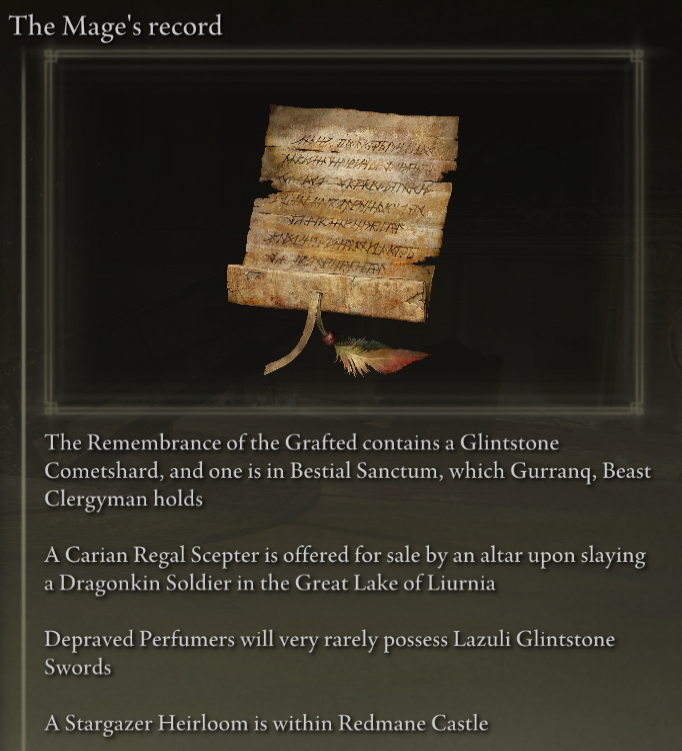
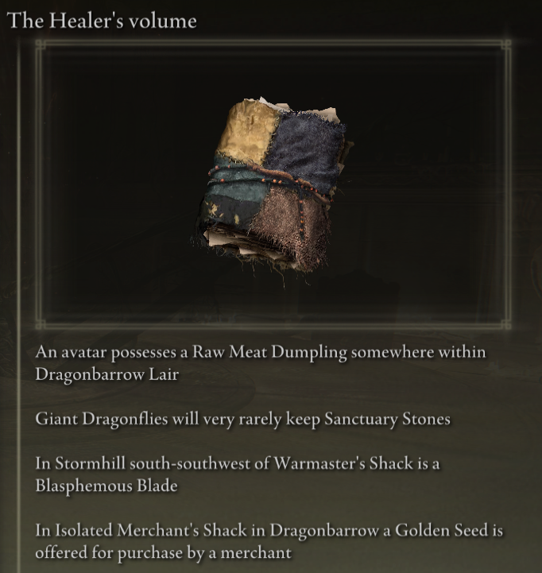
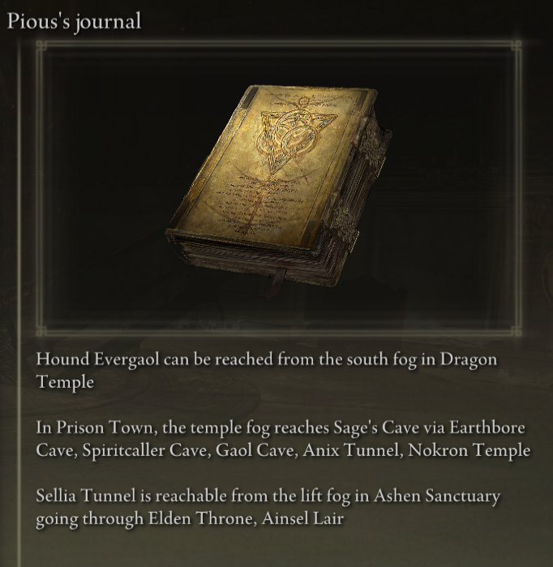

# Elden Ring Randomizer Hints

## Description

Elden Ring Randomizer Hints is a mod for Elden Ring to be used with [thefifthmatt's](https://www.nexusmods.com/eldenring/users/58426171) [Elden Ring Item and Enemy Randomizer](https://www.nexusmods.com/eldenring/mods/428) and/or [Elden Ring Fog Gate Randomizer](https://www.nexusmods.com/eldenring/mods/3295). It generates in-game hint objects that give the player information about the location of items and/or the routes that randomized fog gates follow. This allows for more goal directed play while still enjoying the newness of a randomized world.

I've thoroughly enjoyed the Souls randomizers, but with Elden Ring, the world is so large and open that I really wanted a way to find items useful for my character builds without scouring every area I entered, while still enjoying that feeling of exploring the unknown. This mod is the result.

## Documentation

Detailed information on how to use this mod can be found in the [docs](docs) folder.  
Detaillierte Informationen zur Verwendung dieses Mods finden Sie im Ordner [docs](docs).  
Des informations détaillées sur la façon d'utiliser ce mod peuvent être trouvées dans le dossier [docs](docs).  
Informazioni dettagliate su come utilizzare questa mod possono essere trovate nella cartella [docs](docs).  
この MOD の使用方法の詳細は、[docs](docs) フォルダーにあります。  
해당 모드의 자세한 사용법은 [docs](docs) 폴더에서 확인하실 수 있습니다.  
Szczegółowe informacje na temat korzystania z tego moda znajdziesz w folderze [docs](docs).  
Informações detalhadas sobre como usar este mod podem ser encontradas na pasta [docs](docs).  
Подробную информацию о том, как использовать этот мод, можно найти в папке [docs](docs).  
Puede encontrar información detallada sobre cómo utilizar este mod en la carpeta [docs](docs).  
ข้อมูลโดยละเอียดเกี่ยวกับวิธีใช้ม็อดนี้สามารถพบได้ในโฟลเดอร์ [docs](docs)  
有关如何使用此 mod 的详细信息可以在 [docs](docs) 文件夹中找到。  
有關如何使用此 mod 的詳細資訊可以在 [docs](docs) 資料夾中找到。

## How it works

#### With Elden Ring Item and Enemy Randomizer:

Hint objects can contain between 1 and 4 hints that give directions, enemy drop info, or ownership info about an item.  
  


The player can define categories of items, and hints may be generated with items in those categories that point to the locations of other items in the same categories. This provides something of a trail of breadcrumbs for the player to follow.

Hints may be placed for NPC quest items. Where and how the player gets them will depend on the item and the stage of each quest.

Random category hints and/or specific item hints may be placed on the Finger Maiden corpse at the beginning of the game to provide a starting point.

#### With Elden Ring Fog Gate Randomizer:

Hint objects can contain between 1 and 3 hints that describe the path a fog gate or warp takes to connect to an area with more than one exit.  


**Note:** Elden Ring Randomizer Hints is only intended for use with Elden Ring Fog Gate Randomizer's World Shuffle mode. Using it with other modes may have unexpected results.

#### With either or both randomizers:

Hints for fog gates and/or items needed to pass through gates may be randomly placed near their gates.

Random item hints from specified categories and random fog gate hints may be placed in a percentage of chests and/or boss drops.

Desired starting items may also be placed on the Finger Maiden corpse and/or in the Twin Maiden Husks initial inventory in Roundtable Hold.

## Getting started

Elden Ring Randomizer Hints is a Python application for Windows that uses Python's built-in Tkinter library for the user interface. It can be run from the provided PyInstaller created EXE, or directly from source.

The source folder or the folder the EXE is within will be the mod folder that Mod Engine 2's configuration will need to point to. This is similar to how the randomizers work. See Mod Engine 2's documentation.

#### Requirements

[Python 3.10](https://www.python.org)  or higher (if not using the standalone EXE)
 
An installed copy of [Elden Ring](https://store.steampowered.com/app/1245620/ELDEN_RING/)
 
[Mod Engine 2](https://github.com/soulsmods/ModEngine2) (if not using the built-in launcher in the randomizer(s))

[Elden Ring Item and Enemy Randomizer v0.9](https://www.nexusmods.com/eldenring/mods/428)  and/or [Elden Ring Fog Gate Randomizer v0.1.7b](https://www.nexusmods.com/eldenring/mods/3295)

[Yabber](https://github.com/JKAnderson/Yabber) or WitchyBND[(Nexus Mods)](https://www.nexusmods.com/eldenring/mods/3862)[(Github)](https://github.com/ividyon/WitchyBND) to unpack and repack game files

mountlover's [DSMSPortable](https://github.com/mountlover/DSMSPortable) to modify game files
 
Make sure these are installed according to each of their instructions, and that you've already run the randomizer(s) before running this program and generating hints.

#### Standalone EXE

>Download the ZIP file from the [Releases page](https://github.com/TheOldManAndTheC/randomizerHints/releases) and extract it into the desired folder.
>
>Run randomizerHints.exe to start the program.

#### Python source

<blockquote>
In a command shell, change the working directory to the directory you wish the mod folder to be in, then clone the repository:

```
 git clone --recursive https://github.com/TheOldManAndTheC/randomizerHints
 
 cd randomizerHints
```

Then run the program with Python:

```
python randomizerHints.py
```

Or if you have [PyInstaller](https://pyinstaller.org/en/stable/) installed, you can build your own EXE with the provided batch file:
```
buildExe.bat
```

</blockquote>

See the [docs](docs) folder for details on how to configure and use the mod.

#### Configuring Mod Engine 2

After generating hints, you'll need to configure Mod Engine 2 to include Randomizer Hints as a mod. The program generates a "config_randomizerhints.toml" file that looks something like this:

	# Generated by Elden Ring Randomizer Hints
	
	[modengine]
	debug = false
	external_dlls = []
	[extension.mod_loader]
	enabled = true
	loose_params = false
	mods = [
	    { enabled = true, name = "randomizerhints", path = "C:\\Games\\Utilities\\randomizerHints" },
	    { enabled = true, name = "fog", path = "C:\\Games\\Utilities\\fog\\" },
	    { enabled = true, name = "randomizer", path = "C:\\Games\\Utilities\\randomizer\\" },
	]
	[extension.scylla_hide]
	enabled = false

Which mod paths appear and how you use this file will depend on your setup.

If you plan to use the built-in Mod Engine 2 feature in Item and Enemy Randomizer or Fog Gate Randomizer, you'll need to either copy this toml file to the randomizer folder and rename it to replace the toml file that is already there, or edit the randomizer's toml file to add the above "randomizerhints" mod line.

If you are using a manual installation of Mod Engine 2, either replace the "config_eldenring.toml" file in the Mod Engine 2 folder, or edit it and add the above "randomizerhints" mod line.

Merging with other mods is outside the scope of these instructions, but in the toml file, "randomizerhints" must come before "fog", which must come before "randomizer". Any mods with a regulation.bin file that come before these lines will override the randomizer data and cause it to not work. Check the [Mod Engine 2](https://github.com/soulsmods/ModEngine2#get-started-guide) documentation for details.

## Support

Elden Ring Randomizer Hints is free open source software, but if you enjoy the mod and you'd like to support me, you can send me a donation on [itch.io](https://the-old-man-and-the-c.itch.io/elden-ring-randomizer-hints), [NexusMods](https://www.nexusmods.com/eldenring/mods/4096), or [Ko-fi](https://ko-fi.com/theoldmanandthec).

## Credits

This mod is possible only because of the tireless efforts of the Souls modding community, and the developers of [Mod Engine 2](https://github.com/soulsmods/ModEngine2), [Yabber](https://github.com/JKAnderson/Yabber), [WitchyBND](https://github.com/ividyon/WitchyBND), and [UXM Selective Unpacker](https://github.com/Nordgaren/UXM-Selective-Unpack) in particular.  
Special thanks go to:  
[thefifthmatt](https://www.nexusmods.com/eldenring/users/58426171) for his brilliant randomizers that have given me hundreds if not thousands of hours of extra playtime on various Souls games.  
[mountlover](https://github.com/mountlover) for his game-changing DSMSPortable tool, which makes scripted Souls-modding so much easier. This mod would not exist without it.

Thank you all for your work.

## License

Elden Ring Randomizer Hints copyright (c) 2023 The Old Man and the C

Elden Ring Randomizer Hints is free software: you can redistribute it and/or modify it under the terms of the GNU Affero General Public License as published by the Free Software Foundation, either version 3 of the License, or (at your option) any later version.

Elden Ring Randomizer Hints is distributed in the hope that it will be useful,  but WITHOUT ANY WARRANTY; without even the implied warranty of MERCHANTABILITY or FITNESS FOR A PARTICULAR PURPOSE. See the GNU Affero General Public License  for more details.

You should have received a copy of the GNU Affero General Public License along with Elden Ring Randomizer Hints. If not, see <https://www.gnu.org/licenses/>.

***

mvcTkinter copyright (c) 2023 The Old Man and the C

mvcTkinter is free software: you can redistribute it and/or modify it under the terms of the GNU Affero General Public License as published by the Free Software Foundation, either version 3 of the License, or (at your option) any later version.

mvcTkinter is distributed in the hope that it will be useful,  but WITHOUT ANY WARRANTY; without even the implied warranty of MERCHANTABILITY or FITNESS FOR A PARTICULAR PURPOSE. See the GNU Affero General Public License  for more details.

You should have received a copy of the GNU Affero General Public License along with mvcTkinter. If not, see <https://www.gnu.org/licenses/>.

***

scroll-paper.ico (c) by  Rafiico Creative

Source: <https://iconscout.com/free-icon/scroll-paper-13>

scroll-paper.ico is licensed under a Creative Commons Attribution 4.0 International License.

You should have received a copy of the license along with this work. If not, see <http://creativecommons.org/licenses/by/4.0/>.