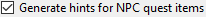
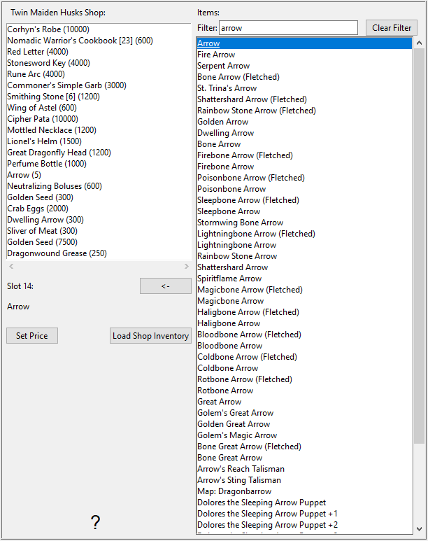

# Elden Ring Randomizer Hints

## Table of Contents

[Main Options tab](#main-options-tab)  

>[Hint Options](#hint-options)  
>> [Item and Enemy Randomizer Options](#item-and-enemy-randomizer-options)  
>> [Fog Gate Randomizer Options](#fog-gate-randomizer-options)

[Missable Items tab](#missable-items-tab)  
[Starting Items tab](#starting-items-tab)  

>[Finger Maiden Items](#finger-maiden-items)  
>[Twin Maiden Husks Shop](#twin-maiden-husks-shop)  

[Category Selections tab](#category-selections-tab)  
[Edit Categories tab](#edit-categories-tab)  
[Save and Load Settings](#save-and-load-settings)  

> [Provided Settings](#provided-settings)  

[Configuring Mod Engine 2](#configuring-mod-engine-2)  
[Hint Objects](#hint-objects)  
[Available Languages](#available-languages)  
[Strategies and spoilers](#strategies-and-spoilers)

## Main Options tab

After starting the program, you'll see the main options screen:  

If you want to switch the program language, you can select it from the  menu. Changing the language requires a restart of the program.  
Note that this will change the interface language, but hints will still be generated for all [available languages](#available-languages).

The first thing you'll need to do is select the executables in the top section. You'll need valid executables for [Elden Ring](https://store.steampowered.com/app/1245620/ELDEN_RING/), [DSMSPortable](https://github.com/mountlover/DSMSPortable), either [Yabber](https://github.com/JKAnderson/Yabber) or WitchyBND[(Nexus Mods)](https://www.nexusmods.com/eldenring/mods/3862)[(Github)](https://github.com/ividyon/WitchyBND), and either or both of [Elden Ring Item and Enemy Randomizer](https://www.nexusmods.com/eldenring/mods/428) or [Elden Ring Fog Gate Randomizer](https://www.nexusmods.com/eldenring/mods/3295).  

 

After you've selected the executables, you may see activity in the  pane:
  
This is the program reading in the data from the randomizer(s) and exporting the regulation data it has generated. This happens whenever the executables are valid and change or the enabled randomizer options change.

Speaking of which, there are two options on the left to enable or disable each randomizer:  
  
  
To generate hints, at least one of these must be enabled and the executable path for it must be valid.

Under each of those options are more options you can use to customize your playthrough.

### Hint Options

  

#### Item and Enemy Randomizer Options

: By default, Randomizer Hints will use the random seeds from the randomizer spoiler files, but you have the option to set your own custom seeds for each.  
: Enable this option to create hints for items important to NPC quests. How you get the hints will depend on the NPC and the quest stage.  
: This option will place hints in item locations when the items placed there belong to [selected categories](#category-selections-tab). The hints will direct you to other locations of items within the same categories.  
: Select this option to make it more likely that category hints will point to items in the same or neighboring regions. Note that this option does nothing if Fog Gate Randomizer is used.  
: This option will place hints to random items from [selected categories](#category-selections-tab) into chests throughout the world. You can select the percentage of chests that will recieve hints.  
: This option will place hints to random items from [selected categories](#category-selections-tab) into boss drops throughout the world. You can select the percentage of bosses that will recieve hints.  
: Select this option to place hints for key items needed to pass through gates, lifts, and other barriers into item locations near those gates. An exception is the Drawing-Room Key, for which a hint can be given by Tanith with the  option.  
: Normally, directional hints that provide distance and compass direction estimates will only appear for items in large areas. Hints for items in smaller named areas will only show that the items are in those areas. Enable this option to always provide distance and compass direction. Not recommended.  

#### Fog Gate Randomizer Options

: By default, Randomizer Hints will use the random seeds from the randomizer spoiler files, but you have the option to set your own custom seeds for each.  
: Select this option to place gate hints into item locations near those gates.  
: This option will place hints to random fog gates into chests throughout the world. You can select the percentage of chests that will recieve hints.  
: This option will place hints to random fog gates into boss drops throughout the world. You can select the percentage of bosses that will recieve hints.  

Finally there are two options that are not dependent on either randomizer, but are used along with the settings in the [Starting Items tab](#starting-items-tab):

: This option is used to place items and hints on the Finger Maiden corpse at the start of the game.  
: Enable this option to use an edited initial shop inventory for the Twin Maiden Husks shop.

After the file paths have been validated and your desired options have been set, you can click the  button to create hints in the game according to your preferences. The hint generation process takes a little while, and the  pane will display the progress. After generating hints you'll need to configure [Mod Engine 2](#configuring-mod-engine-2) to use the mod.

But before you do that, you may want to look at the other tabs.

## Missable Items tab

  
This tab is quite simple. A list of randomized items are displayed in the left side pane. These are items that are very easy to miss or impossible to get. Selecting an item from the list will reveal spoilers about its location and how it can be missed in the right side pane. If there are items that are important to your playthough here, you can see if it is likely that you may miss them, in which case you can go back and re-run the Item and Enemy Randomizer for a better outcome.

You will see a filter box above the left side pane. Typing text into this box will filter the items displayed that match the text. This filter appears in similar panes in other tabs, and all of these filters work the same way.

## Starting Items tab

  
In this tab you can set the items and hints to be placed on the Finger Maiden's corpse at the start of the game, and edit the Twin Maiden Husks initial shop inventory.

### Finger Maiden Items

On the left half of the tab is the Finger Maiden Items selector:  
  
The large pane to the left is the list of items and hints to be placed on the corpse, and the three smaller panes to the right are lists of all items, all item hints, and all hint categories.

To add items, item hints, or category hints to the left side pane, select them from one of the right side panes and click the  button. Conversely, you can select items in the left side pane, then click the  button to remove them. Multiple selections are allowed.

The quantity of items and hints to be placed can be changed. Select them in the left side pane, then click the  button to set the quantity that should be placed.

The "drop only" property of individual item hints can also be set by selecting item hints in the left side pane and clicking the  button. Hints that have this property will only point to enemy drops of the item. For example, in the images here I'm setting up an archer build, and so I have "drop only" hints for Thin Beast Bones and Flight Pinions, which will give me hints to enemies that will drop the resources I need to craft Bone Arrows.

Finally at the bottom you can see a counter that lets you know how much space is left in the corpse location.  
  
There is only room for 8 objects, but items with quantities still only take up 1 object space, and since item hint objects can hold up to 4 hints, hints will be packed together. In the above example I have 1 item with a quantity of 50 that takes up 1 object space, then 2 item hints, a category hint with a quantity of 2, and 2 more different category hints, making a total of 6 hints. These hints will be packed into 2 hint objects, one with the maximum 4 hints, and the other with only 2 hints, leaving space for 2 more before using another object space. So in total, only 3 object spaces are used.

If the  option is enabled and  is not, hints will try to point to items in Limgrave and surrounding areas if available.

### Twin Maiden Husks Shop

On the right half of the tab is the Twin Maiden Husks Shop editor:  
  
The left side pane displays the shop inventory, and the right side pane shows all the items in the game. Selecting an item in the shop inventory will cause its slot to appear below. After selecting a slot, you can select a replacement item in the items pane, then click the  button to replace the shop inventory item with the new item. In the above image, I have replaced slot 14 in the shop inventory with Arrow and set its price to 5 runes.

With a slot selected, you can click the  button to set the shop inventory item's price.

You can also click the  button to erase your changes and reload the default shop inventory.

### Important Note about Starting Items

Because of how the game handles events, some items must be obtained from their location in the game world in order for their effects to work. This includes crafting recipe books, paintings, and various quest items. If you place a copy of one of these items at the start or in the shop, it will not work until you obtain the original item from its location in the game world. For these items it is better to place a hint at the start.

## Category Selections tab

  
This tab allows you to select which categories will be used for category hints, chest hints, and boss drop hints. There is a pair of panes for each of these, with the left side pane displaying the selected categories, and the right side pane displaying all available categories. Selecting categories in the right side pane and clicking  will add them to the left side pane, and selecting items in the left side pane and clicking  will remove them from the left side pane. Multiple selections are allowed.

You can reload the default set of category selections by clicking the  button. Please note that if you have deleted or renamed some default categories or added new categories in the [Edit Categories tab](#edit-categories-tab), they will not appear in the selections.

## Edit Categories tab

  
In this final tab, you can edit and delete the item categories, and create your own. The left side pane displays all of the categories, the center pane displays items within the selected category, and the right side pane displays all the items in the game.

Click the  button to create a new category in the left side pane. You can also select a category in the left side pane and click  to make a new copy of it,  to rename it, or  to delete it.

When a category in the left side pane is selected, items within the category will be displayed in the center pane. You can add items to the category by selecting items in the right side pane and clicking . Items can be removed from the category by selecting items in the center pane and clicking . Multiple selections are allowed.

As in [Finger Maiden Items](#finger-maiden-items), the "drop only" property of item hints within the category can also be set by selecting them in the center pane and clicking the  button. Hints that have this property will only point to enemy drops of the item.

You can reload the default set of categories by clicking the  button. Please note that this will completely erase any changes or new categories you have created.

## Save and Load Settings

At the bottom of the [Main Options tab](#main-options-tab) are buttons that can be used to Save, Load, Import, and Export settings:  
  
The difference between Load/Save and Import/Export is which settings the buttons apply to. Load/Save applies to all options throughout the program. Import/Export applies to all options *except* the executable paths and the Twin Maiden Husks shop.

Load/Save option files have the extension ".rhs" and can be used as your personal settings configurations and backups.

Import/Export option files have the extension ".rhe" and are meant to be more portable, so that players can exchange settings configurations without having the problem of overwriting their executable paths with someone else's.

The Twin Maiden Husks shop is not included in Exported settings because the shop inventory is dependent on the randomizer output, which will vary from player to player. Even though that also applies to your own different randomized seeds, the shop inventory is still Saved so you can keep a settings file to go along with a known seed.

By default all these settings files are saved in the "settings" folder in the program folder.

### Provided Settings

In the "settings" folder are a few different .rhe files you can import and try out.

Sorcerer.rhe: For a sorcery build. If you think having both Carian Slicer and Glintstone Pebble at the start is too much, you can remove either or both, and maybe add hints to them instead.

Archer.rhe: For a stealthy archer build that uses bows and daggers. Recommend also adding Arrows to the shop for a cheap price.

Priest.rhe: For a faith build that relies on incantations.

Bonk.rhe: For a hammer build. Hit things hard.

## Configuring Mod Engine 2

After generating hints, you'll need to configure Mod Engine 2 to include Randomizer Hints as a mod. The program generates a "config_randomizerhints.toml" file that looks something like this:

	# Generated by Elden Ring Randomizer Hints
	
	[modengine]
	debug = false
	external_dlls = []
	[extension.mod_loader]
	enabled = true
	loose_params = false
	mods = [
	    { enabled = true, name = "randomizerhints", path = "C:\\Games\\Utilities\\randomizerHints" },
	    { enabled = true, name = "fog", path = "C:\\Games\\Utilities\\fog\\" },
	    { enabled = true, name = "randomizer", path = "C:\\Games\\Utilities\\randomizer\\" },
	]
	[extension.scylla_hide]
	enabled = false

Which mod paths appear and how you use this file will depend on your setup.

If you plan to use the built-in Mod Engine 2 feature in Item and Enemy Randomizer or Fog Gate Randomizer, you'll need to either copy this toml file to the randomizer folder and rename it to replace the toml file that is already there, or edit the randomizer's toml file to add the above "randomizerhints" mod line.

If you are using a manual installation of Mod Engine 2, either replace the "config_eldenring.toml" file in the Mod Engine 2 folder, or edit it and add the above "randomizerhints" mod line.

Merging with other mods is outside the scope of these instructions, but in the toml file, "randomizerhints" must come before "fog", which must come before "randomizer". Any mods with a regulation.bin file that come before these lines will override the randomizer data and cause it to not work. Check the [Mod Engine 2](https://github.com/soulsmods/ModEngine2#get-started-guide) documentation for details.

As for the specific and params and files affected by Randomizer Hints:

#### Params:  

> ItemLotParam_map: Adds entries following ID 10010000 (Finger Maiden corpse), adds entries in various item lots all over the world.
>EquipParamGoods: Adds entries from ID 300000 upwards.
>ShopLineupParam:  Adds entries to various NPC shops, changes entries in Twin Maiden Husks shop.

#### Files:

> item.msgbnd.dcx (all languages)

## Hint Objects

Item hint objects can contain up to four hints, and fog gate hint objects can contain up to three hints. They appear in the Info category of your Inventory. To keep things organized, fog gate hint objects appear in a group at the top, followed by item hint objects in the next group, and then the normal game info item groups below that.

With the default settings, Randomizer Hints generates a *lot* of hint objects, and your Info item inventory can get very large. For this reason, this program also mods the game to allow you to place Info items into your inventory chest, or discard them altogether. Be careful, because this means you can also discard paintings and manor requests.

## Available Languages

Elden Ring Randomizer Hints has (poorly) localized data for the languages supported in Elden Ring other than English, and can generate hints in all of them. *However*, this is dependent upon the modded game files provided by the randomizers. Item and Enemy Randomizer has these files for all languages, but Fog Gate Randomizer only has them for English. If you are using both randomizers, this will still work fine, but if you are *only* using Fog Gate Randomizer, the program will only get the English files and only generate English hints.

To solve this, you can extract the needed game files yourself using Nordgaren's UXM Selective Unpacker[(Nexus)](https://www.nexusmods.com/eldenring/mods/1651)[(Github)](https://github.com/Nordgaren/UXM-Selective-Unpack):

  
First make sure the path to your Elden Ring install is correct, then click the  button.  
  
The only thing you need to select here is the "msg" folder. Click OK, then check the  checkbox, then click the  button. After a while, the unpacking will complete, and you'll be able to find the unpacked "msg" folder inside your Elden Ring Game folder. Move this folder inside the "locale" folder in your Randomizer Hints folder, and the program will be able to find all the localized files even when only using Fog Gate Randomizer.

## Strategies and spoilers

If there are a variety of items you want for your character build, create categories with those items and enable them in the [general categories](#category-selections-tab). That will allow you to follow the chain of hints to obtain them all. Place a hint to the category in [Finger Maiden Items](#finger-maiden-items) to get yourself started.

If you're looking for a particular item and you get a hint to an unwanted item in the same category, don't disregard it. Obtaining that item will also provide hints to other items in the category, one of which could be the item you're looking for.

If you want to do as much of the NPC quests as possible, avoid going blindly through a randomized gate without searching the area nearby for a hint to where it leads. If you end up in the Wailing Dunes or Altus Plateau early on you could miss out on the early items from Alexander and Blaidd's quests.

If you're using the Fog Gate Randomizer, the chapel side door starts off closed. However, if you use the Bell of Return before going anywhere, it opens! If you have  enabled, a hint to where the fog gate goes will be in the loot inside.

If you're looking for hints, the appearance of the item can be a clue. Hint objects won't be found in plain white item locations, but only in purple or gold ones.

If the amount of hint objects you get becomes overwhelming and annoying to deal with, go ahead and play with the categories and settings to reduce the amount you get. I like getting lots of hints and then figuring out the best route to take to complete all quests and get my build completed as efficiently as possible, but everyone's playstyle is different. You might be able to come up with your own settings that make for a less cluttered but still very goal directed experience.

If you greatly reduce the number of categories/items available for generating hints, you might also want to reduce the percentage of chests and boss drops they can appear in, to avoid getting too many redundant hints.
