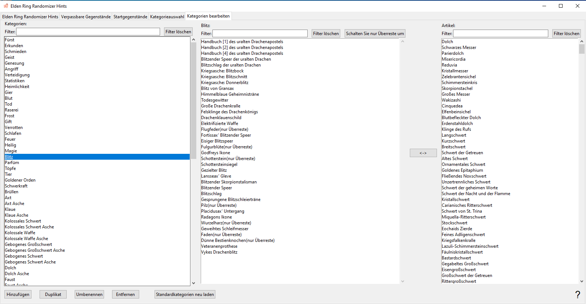

# Elden Ring Randomizer Hints  
  
## Registerkarte „Hauptoptionen".  
  
Nach dem Start des Programms sehen Sie den Hauptbildschirm mit den Optionen:  
  
  
Wenn Sie die Programmsprache ändern möchten, können Sie diese im Menü  auswählen. Das Ändern der Sprache erfordert einen Neustart des Programms.  
Beachten Sie, dass sich dadurch die Sprache der Benutzeroberfläche ändert, es werden jedoch weiterhin Hinweise für alle verfügbaren Sprachen generiert.  
  
Als Erstes müssen Sie die ausführbaren Dateien im oberen Abschnitt auswählen. Sie benötigen gültige ausführbare Dateien für [Elden Ring](https://store.steampowered.com/app/1245620/ELDEN_RING/), [DSMSPortable](https://github.com/mountlover/DSMSPortable), entweder [Yabber](https://github.com/JKAnderson/Yabber) oder WitchyBND[(Nexus Mods)](https://www.nexusmods.com/eldenring/mods/3862)[(Github)](https://github.com/ividyon/WitchyBND) und einer oder beide von [Elden Ring Item and Enemy Randomizer](https://www.nexusmods.com/eldenring/mods/428) oder [Elden Ring Fog Gate Randomizer](https://www.nexusmods.com/eldenring/mods/3295).  
  
  
  
  
Nachdem Sie die ausführbaren Dateien ausgewählt haben, sehen Sie möglicherweise Aktivitäten im Bereich :  
  
Hierbei handelt es sich um das Programm, das die Daten des/der Randomisierer einliest und die von ihm generierten Regulierungsdaten exportiert. Dies geschieht immer dann, wenn die ausführbaren Dateien gültig sind und sich ändern oder sich die aktivierten Randomizer-Optionen ändern.  
  
Apropos: Auf der linken Seite gibt es zwei Optionen, um jeden Randomizer zu aktivieren oder zu deaktivieren:  
  
  
Um Hinweise zu generieren, muss mindestens einer davon aktiviert sein und der ausführbare Pfad dafür muss gültig sein.  
  
Unter jeder dieser Optionen finden Sie weitere Optionen, mit denen Sie Ihr Spielerlebnis anpassen können.  
  
### Hinweisoptionen  
  
  
  
#### Item and Enemy Randomizer Optionen  
  
: Standardmäßig verwendet Randomizer Hints die zufälligen Seeds aus den Randomizer-Spoilerdateien, Sie haben jedoch die Möglichkeit, für jede Ihre eigenen benutzerdefinierten Seeds festzulegen.  
: Aktivieren Sie diese Option, um Hinweise für Gegenstände zu erstellen, die für NPC-Quests wichtig sind. Wie Sie die Hinweise erhalten, hängt vom NPC und der Queststufe ab.  
: Diese Option platziert Hinweise an Artikelpositionen, wenn die dort platzierten Artikel zu ausgewählten Kategorien gehören. Die Hinweise führen Sie zu anderen Standorten von Artikeln innerhalb derselben Kategorien.  
: Wählen Sie diese Option aus, um die Wahrscheinlichkeit zu erhöhen, dass Kategoriehinweise auf Elemente in derselben oder benachbarten Regionen verweisen. Beachten Sie, dass diese Option nichts bewirkt, wenn Fog Gate Randomizer verwendet wird.  
: Mit dieser Option werden Hinweise auf zufällige Gegenstände aus ausgewählten Kategorien in Truhen auf der ganzen Welt platziert. Sie können den Prozentsatz der Truhen auswählen, die Hinweise erhalten.  
: Diese Option platziert Hinweise auf zufällige Gegenstände aus ausgewählten Kategorien in Boss-Drops auf der ganzen Welt. Sie können den Prozentsatz der Bosse auswählen, die Hinweise erhalten.  
: Wählen Sie diese Option aus, um Hinweise für wichtige Gegenstände, die zum Passieren von Toren, Aufzügen und anderen Barrieren benötigt werden, an Gegenstandsstandorten in der Nähe dieser Tore zu platzieren. Eine Ausnahme bildet Schlüssel zum Gesellschaftszimmer, für das von Tanith mit der Option  ein Hinweis gegeben werden kann.  
: Normalerweise werden Richtungshinweise, die Entfernungs- und Kompassrichtungsschätzungen liefern, nur für Objekte in großen Gebieten angezeigt. Hinweise zu Gegenständen in kleineren benannten Bereichen zeigen nur, dass sich die Gegenstände in diesen Bereichen befinden. Aktivieren Sie diese Option, um immer Entfernung und Kompassrichtung anzugeben. Nicht empfohlen.  
  
#### Fog Gate Randomizer Optionen  
  
: Standardmäßig verwendet Randomizer Hints die zufälligen Seeds aus den Randomizer-Spoilerdateien, Sie haben jedoch die Möglichkeit, für jede Ihre eigenen benutzerdefinierten Seeds festzulegen.  
: Wählen Sie diese Option aus, um Torhinweise an Gegenstandsstandorten in der Nähe dieser Tore zu platzieren.  
: Diese Option platziert Hinweise auf zufällige Nebeltore in Truhen auf der ganzen Welt. Sie können den Prozentsatz der Truhen auswählen, die Hinweise erhalten.  
: Diese Option platziert Hinweise auf zufällige Nebeltore in Boss-Drops auf der ganzen Welt. Sie können den Prozentsatz der Bosse auswählen, die Hinweise erhalten.  
  
Schließlich gibt es zwei Optionen, die nicht von einem der Randomizer abhängig sind, sondern zusammen mit den Einstellungen auf der Registerkarte Startgegenstände verwendet werden:  
  
: Diese Option wird verwendet, um zu Beginn des Spiels Gegenstände und Hinweise auf der Leiche von Fingerjungfer zu platzieren.  
: Aktivieren Sie diese Option, um einen bearbeiteten anfänglichen Shop-Inventar für den Shop Zwillingsjungferhüllen zu verwenden.  
  
Nachdem die Dateipfade validiert und die gewünschten Optionen festgelegt wurden, können Sie auf die Schaltfläche  klicken, um Hinweise im Spiel nach Ihren Wünschen zu erstellen. Der Prozess der Hinweisgenerierung dauert eine Weile und im Bereich  wird der Fortschritt angezeigt. Nachdem Sie Hinweise generiert haben, müssen Sie Mod Engine 2 für die Verwendung des Mods konfigurieren.  
  
Aber bevor Sie das tun, möchten Sie vielleicht einen Blick auf die anderen Registerkarten werfen.  
  
## Verpassbare Gegenstände Registerkarte  
  
  
Diese Registerkarte ist recht einfach. Im linken Seitenbereich wird eine Liste zufällig ausgewählter Elemente angezeigt. Dabei handelt es sich um Gegenstände, die sehr leicht zu übersehen oder gar nicht zu bekommen sind. Wenn Sie ein Element aus der Liste auswählen, werden im rechten Seitenbereich Spoiler zu seiner Position angezeigt und darüber, wie es übersehen werden kann. Wenn es hier Elemente gibt, die für Ihr Spiel wichtig sind, können Sie sehen, ob es wahrscheinlich ist, dass Sie sie übersehen. In diesem Fall können Sie zurückgehen und Item and Enemy Randomizer erneut ausführen, um ein besseres Ergebnis zu erzielen.  
  
Über dem linken Seitenbereich sehen Sie ein Filterfeld. Wenn Sie Text in dieses Feld eingeben, werden die angezeigten Elemente gefiltert, die mit dem Text übereinstimmen. Dieser Filter wird in ähnlichen Bereichen auf anderen Registerkarten angezeigt und alle diese Filter funktionieren auf die gleiche Weise.  
  
## Startgegenstände Registerkarte  
  
  
Auf dieser Registerkarte können Sie die Gegenstände und Hinweise festlegen, die zu Beginn des Spiels auf der Leiche von Fingerjungfer platziert werden sollen, und das anfängliche Shop-Inventar von Zwillingsjungferhüllen bearbeiten.  
  
### Fingerjungfer Artikel  
  
Auf der linken Hälfte der Registerkarte befindet sich die Elementauswahl Fingerjungfer:  
  
Der große Bereich auf der linken Seite ist die Liste der Gegenstände und Hinweise, die auf die Leiche gelegt werden sollen, und die drei kleineren Bereiche auf der rechten Seite sind Listen aller Gegenstände, aller Gegenstandshinweise und aller Hinweiskategorien.  
  
Um Elemente, Elementhinweise oder Kategoriehinweise zum linken Seitenbereich hinzuzufügen, wählen Sie sie in einem der rechten Seitenbereiche aus und klicken Sie auf die Schaltfläche . Umgekehrt können Sie Elemente im linken Seitenbereich auswählen und dann auf die Schaltfläche  klicken, um sie zu entfernen. Mehrfachauswahl ist zulässig.  
  
Die Menge der zu platzierenden Elemente und Hinweise kann geändert werden. Wählen Sie sie im linken Seitenbereich aus und klicken Sie dann auf die Schaltfläche , um die Menge festzulegen, die platziert werden soll.  
  
Die „nur Überreste“-Eigenschaft einzelner Elementhinweise kann auch festgelegt werden, indem Sie Elementhinweise im linken Seitenbereich auswählen und auf die Schaltfläche  klicken. Hinweise mit dieser Eigenschaft deuten nur auf gegnerische Drops des Gegenstands hin. In den Bildern hier baue ich beispielsweise einen Bogenschützen-Build auf und habe daher „nur Überreste“ Hinweise für Dünne Bestienknochen und Flugfeder, die mir Hinweise auf Feinde geben, die die Ressourcen fallen lassen, die ich zum Herstellen von benötige Knochenpfeil.  
  
Schließlich sehen Sie unten einen Zähler, der Sie darüber informiert, wie viel Platz am Leichenort noch vorhanden ist.  
  
Es gibt nur Platz für 8 Objekte, aber Gegenstände mit Mengen nehmen immer noch nur 1 Objektplatz ein, und da Gegenstandshinweisobjekte bis zu 4 Hinweise enthalten können, werden Hinweise zusammengepackt. Im obigen Beispiel habe ich 1 Artikel mit einer Menge von 50, der 1 Objektplatz einnimmt, dann 2 Artikelhinweise, einen Kategoriehinweis mit einer Menge von 2 und 2 weitere unterschiedliche Kategoriehinweise, also insgesamt 6 Hinweise. Diese Hinweise werden in 2 Hinweisobjekte gepackt, eines mit maximal 4 Hinweisen und das andere mit nur 2 Hinweisen, sodass Platz für zwei weitere bleibt, bevor ein anderer Objektraum verwendet wird. Insgesamt werden also nur 3 Objekträume genutzt.  
  
Wenn die Option  aktiviert ist und  nicht, versuchen Hinweise, auf Elemente in Limgrave und Umgebung zu verweisen, sofern verfügbar.  
  
### Zwillingsjungferhüllen Shop  
  
Auf der rechten Hälfte der Registerkarte befindet sich der Zwillingsjungferhüllen Shop-Editor:  
  
Im linken Bereich wird das Shop-Inventar angezeigt und im rechten Bereich werden alle Gegenstände im Spiel angezeigt. Wenn Sie einen Artikel im Shop-Inventar auswählen, wird dessen Platz unten angezeigt. Nachdem Sie einen Platz ausgewählt haben, können Sie im Artikelbereich einen Ersatzartikel auswählen und dann auf die Schaltfläche  klicken, um den Shop-Inventarartikel durch den neuen Artikel zu ersetzen. Im obigen Bild habe ich Platz 14 im Shop-Inventar durch Pfeil ersetzt und den Preis auf 5 Runen festgelegt.  
  
Wenn ein Slot ausgewählt ist, können Sie auf die Schaltfläche  klicken, um den Preis des Shop-Inventarartikels festzulegen.  
  
Sie können auch auf die Schaltfläche  klicken, um Ihre Änderungen zu löschen und den Standard-Shop-Bestand neu zu laden.  
  
### Wichtiger Hinweis zu Startelementen
  
Aufgrund der Art und Weise, wie das Spiel mit Ereignissen umgeht, müssen einige Gegenstände an ihrem Standort in der Spielwelt erworben werden, damit ihre Effekte wirken. Dazu gehört die Herstellung von Rezeptbüchern, Gemälden und verschiedenen Questgegenständen. Wenn Sie eine Kopie eines dieser Gegenstände zu Beginn oder im Shop platzieren, funktioniert es erst, wenn Sie den Originalgegenstand von seinem Standort in der Spielwelt erhalten. Für diese Punkte ist es besser, am Anfang einen Hinweis zu platzieren.  
  
## Kategorieauswahl Tab  
  
  
Auf dieser Registerkarte können Sie auswählen, welche Kategorien für Kategoriehinweise, Truhenhinweise und Boss-Drop-Hinweise verwendet werden. Für jede dieser Kategorien gibt es zwei Bereiche, wobei im linken Bereich die ausgewählten Kategorien und im rechten Bereich alle verfügbaren Kategorien angezeigt werden. Wenn Sie Kategorien im rechten Seitenbereich auswählen und auf  klicken, werden sie dem linken Seitenbereich hinzugefügt. Wenn Sie Elemente im linken Seitenbereich auswählen und auf  klicken, werden sie aus dem linken Seitenbereich entfernt. Mehrfachauswahl ist zulässig.  
  
Sie können den Standardsatz der Kategorieauswahl neu laden, indem Sie auf die Schaltfläche  klicken. Bitte beachten Sie, dass einige Standardkategorien, die Sie auf der Registerkarte Kategorien bearbeiten gelöscht oder umbenannt oder neue Kategorien hinzugefügt haben, nicht in der Auswahl angezeigt werden.  
  
## Kategorien bearbeiten Tab  
  
  
Auf dieser letzten Registerkarte können Sie die Artikelkategorien bearbeiten und löschen sowie eigene erstellen. Im linken Bereich werden alle Kategorien angezeigt, im mittleren Bereich werden Gegenstände innerhalb der ausgewählten Kategorie angezeigt und im rechten Bereich werden alle Gegenstände im Spiel angezeigt.  
  
Klicken Sie auf die Schaltfläche , um im linken Seitenbereich eine neue Kategorie zu erstellen. Sie können auch eine Kategorie im linken Seitenbereich auswählen und auf  klicken, um eine neue Kopie davon zu erstellen, auf , um sie umzubenennen, oder auf , um sie zu löschen.  
  
Wenn eine Kategorie im linken Seitenbereich ausgewählt wird, werden Elemente innerhalb der Kategorie im mittleren Bereich angezeigt. Sie können der Kategorie Elemente hinzufügen, indem Sie Elemente im rechten Seitenbereich auswählen und auf  klicken. Elemente können aus der Kategorie entfernt werden, indem Sie Elemente im mittleren Bereich auswählen und auf  klicken. Mehrfachauswahl ist zulässig.  
  
Wie bei Fingerjungfer-Elementen kann auch die „nur Überreste“-Eigenschaft von Elementhinweisen innerhalb der Kategorie festgelegt werden, indem Sie sie im mittleren Bereich auswählen und auf die Schaltfläche  klicken. Hinweise mit dieser Eigenschaft deuten nur auf gegnerische Drops des Gegenstands hin.  
  
Sie können den Standardsatz an Kategorien neu laden, indem Sie auf die Schaltfläche  klicken. Bitte beachten Sie, dass dadurch alle von Ihnen erstellten Änderungen oder neuen Kategorien vollständig gelöscht werden.  
  
## Einstellungen speichern und laden  
  
Unten auf der Registerkarte „Hauptoptionen" befinden sich Schaltflächen, die zum Speichern, Laden, Importieren und Exportieren von Einstellungen verwendet werden können:  
  
Der Unterschied zwischen Laden/Speichern und Importieren/Exportieren besteht darin, auf welche Einstellungen sich die Schaltflächen beziehen. Laden/Speichern gilt für alle Optionen im gesamten Programm. Import/Export gilt für alle Optionen *außer* die ausführbaren Pfade und den Zwillingsjungferhüllen-Shop.  
  
Optionsdateien zum Laden/Speichern haben die Erweiterung „.rhs“ und können als Ihre persönlichen Einstellungskonfigurationen und Sicherungen verwendet werden.  
  
Import/Export-Optionsdateien haben die Erweiterung „.rhe“ und sollen portabler sein, sodass Spieler Einstellungskonfigurationen austauschen können, ohne das Problem zu haben, ihre ausführbaren Pfade mit denen anderer zu überschreiben.  
  
Der Zwillingsjungferhüllen-Shop ist nicht in den Export-Einstellungen enthalten, da der Shop-Bestand von der Zufallsgeneratorausgabe abhängt, die von Spieler zu Spieler unterschiedlich sein kann. Auch wenn dies auch für Ihre eigenen verschiedenen zufälligen Samen gilt, wird der Shop-Bestand dennoch gespeichert, sodass Sie eine Einstellungsdatei für einen bekannten Samen behalten können.  
  
Standardmäßig werden alle diese Einstellungsdateien im Ordner „settings“ im Programmordner gespeichert.  

### Bereitgestellte Einstellungen

Im Ordner „settings“ befinden sich einige verschiedene .rhe-Dateien, die Sie importieren und ausprobieren können.

Sorcerer.rhe: Für einen Zauberei-Build. Wenn Sie der Meinung sind, dass es zu viel ist, sowohl den Carianischer Schlitzer als auch den Schimmersteinkiesel am Anfang zu haben, können Sie einen oder beide entfernen und stattdessen vielleicht Hinweise hinzufügen.

Archer.rhe: Für einen heimlichen Bogenschützen-Build, der Bögen und Dolche verwendet. Empfehlen Sie auch, Pfeil zu einem günstigen Preis zum Shop hinzuzufügen.

Priest.rhe: Für einen Glaubensaufbau, der auf Beschwörungen beruht.

Bonk.rhe: Für einen Hammer-Build. Schlagen Sie hart zu.

## Konfigurieren von Mod Engine 2  
  
Nachdem Sie Hinweise generiert haben, müssen Sie Mod Engine 2 so konfigurieren, dass Randomizer Hints als Mod enthalten ist. Das Programm generiert eine „config_randomizerhints.toml"-Datei, die etwa so aussieht:  
  
	# Generated by Elden Ring Randomizer Hints  
	  
	[modengine]  
	debug = false  
	external_dlls = []  
	[extension.mod_loader]  
	enabled = true  
	loose_params = false  
	mods = [  
	    { enabled = true, name = "randomizerhints", path = "C:\\Games\\Utilities\\randomizerHints" },  
	    { enabled = true, name = "fog", path = "C:\\Games\\Utilities\\fog\\" },  
	    { enabled = true, name = "randomizer", path = "C:\\Games\\Utilities\\randomizer\\" },  
	]  
	[extension.scylla_hide]  
	enabled = false  
  
Welche Mod-Pfade angezeigt werden und wie Sie diese Datei verwenden, hängt von Ihrem Setup ab.  
  
Wenn Sie die integrierte Mod Engine 2-Funktion in Item and Enemy Randomizer oder Fog Gate Randomizer verwenden möchten, müssen Sie diese toml-Datei entweder in den Randomizer-Ordner kopieren und sie umbenennen, um die toml-Datei zu ersetzen bereits vorhanden, oder bearbeiten Sie die Datei toml des Randomizers, um die obige Mod-Zeile "randomizerhints" hinzuzufügen.  
  
Wenn Sie eine manuelle Installation von Mod Engine 2 verwenden, ersetzen Sie entweder die Datei „config_eldenring.toml" im Ordner Mod Engine 2 oder bearbeiten Sie sie und fügen Sie die obige Mod-Zeile "randomizerhints" hinzu.  
  
Das Zusammenführen mit anderen Mods liegt außerhalb des Rahmens dieser Anleitung, aber in der toml-Datei muss "randomizerhints" vor "fog" stehen, das wiederum vor "randomizer" stehen muss. Alle Mods mit einer regulation.bin-Datei, die vor diesen Zeilen stehen, überschreiben die Randomizer-Daten und führen dazu, dass sie nicht funktionieren. Weitere Informationen finden Sie in der Dokumentation [Mod Engine 2](https://github.com/soulsmods/ModEngine2#get-started-guide).  
  
Was die spezifischen Parameter und Dateien betrifft, die von Randomizer Hints betroffen sind:  
  
#### Parameter:  
  
> ItemLotParam_map: Fügt Einträge nach der ID 10010000 (Fingerjungfer corpse) hinzu, fügt Einträge in verschiedenen Artikellosen auf der ganzen Welt hinzu.  
>EquipParamGoods: Fügt Einträge ab ID 300000 aufwärts hinzu.  
>ShopLineupParam: Fügt Einträge zu verschiedenen NPC-Shops hinzu, ändert Einträge im Zwillingsjungferhüllen Shop.  
  
#### Dateien:  
  
> item.msgbnd.dcx (alle Sprachen)  
  
## Hinweisobjekte  
  
Objekthinweisobjekte können bis zu vier Hinweise enthalten, und Nebeltorhinweisobjekte können bis zu drei Hinweise enthalten. Sie erscheinen in der Info-Kategorie Ihres Inventars. Um die Übersicht zu behalten, werden Nebeltor-Hinweisobjekte in einer Gruppe oben angezeigt, gefolgt von Gegenstandshinweisobjekten in der nächsten Gruppe und darunter die normalen Spielinfo-Gegenstandsgruppen.  
  
Mit den Standardeinstellungen generiert Randomizer Hints eine *Menge* an Hinweisobjekten und Ihr Info-Artikelbestand kann sehr groß werden. Aus diesem Grund modifiziert dieses Programm das Spiel auch so, dass Sie Info-Gegenstände in Ihre Inventartruhe legen oder sie ganz wegwerfen können. Seien Sie vorsichtig, denn dadurch können Sie auch Gemälde und Gutswünsche verwerfen.  
  
## Verfügbare Sprachen  
  
Elden Ring Randomizer Hints verfügt über (schlecht) lokalisierte Daten für die in Elden Ring unterstützten Sprachen außer Englisch und kann in allen Sprachen Hinweise generieren. *Allerdings* hängt dies von den modifizierten Spieldateien ab, die von den Zufallsgeneratoren bereitgestellt werden. Item and Enemy Randomizer hat diese Dateien für alle Sprachen, aber Fog Gate Randomizer hat sie nur für Englisch. Wenn Sie beide Randomizer verwenden, funktioniert dies immer noch gut, aber wenn Sie *nur* Fog Gate Randomizer verwenden, ruft das Programm nur die englischen Dateien ab und generiert nur englische Hinweise.  
  
Um dieses Problem zu lösen, können Sie die benötigten Spieldateien selbst extrahieren, indem Sie Nordgaren's UXM Selective Unpacker[(Nexus)](https://www.nexusmods.com/eldenring/mods/1651)[(Github)](https://github.com/Nordgaren/UXM-Selective-Unpack) verwenden:  
  
  
Stellen Sie zunächst sicher, dass der Pfad zu Ihrer Elden Ring-Installation korrekt ist, und klicken Sie dann auf die Schaltfläche .  
  
Das Einzige, was Sie hier auswählen müssen, ist der Ordner „msg“. Klicken Sie auf OK, aktivieren Sie dann das Kontrollkästchen  und klicken Sie dann auf die Schaltfläche . Nach einer Weile ist das Entpacken abgeschlossen und Sie finden den entpackten „msg“-Ordner in Ihrem Elden Ring-Spielordner. Verschieben Sie diesen Ordner in den Ordner „locale“ in Ihrem Ordner Randomizer Hints, und das Programm kann alle lokalisierten Dateien finden, auch wenn nur Fog Gate Randomizer verwendet wird.  
  
## Strategien und Spoiler  
  
Wenn Sie verschiedene Gegenstände für die Charakterbildung benötigen, erstellen Sie Kategorien mit diesen Gegenständen und aktivieren Sie sie in den allgemeinen Kategorien. Auf diese Weise können Sie der Kette der Hinweise folgen, um sie alle zu erhalten. Platzieren Sie einen Hinweis auf die Kategorie in Fingerjungfer Items, um loszulegen.  
  
Wenn Sie nach einem bestimmten Artikel suchen und einen Hinweis auf einen unerwünschten Artikel in derselben Kategorie erhalten, ignorieren Sie ihn nicht. Wenn Sie diesen Artikel erhalten, erhalten Sie auch Hinweise auf andere Artikel in der Kategorie, von denen einer der gesuchte Artikel sein könnte.  
  
Wenn Sie so viele NPC-Quests wie möglich erledigen möchten, vermeiden Sie es, blind durch ein zufälliges Tor zu gehen, ohne die Umgebung nach einem Hinweis darauf abzusuchen, wohin es führt. Wenn Sie früh im Klagedünen oder Altus-Plateau landen, verpassen Sie möglicherweise die frühen Gegenstände aus den Quests von Alexander und Blaidd.  
  
Wenn Sie Fog Gate Randomizer verwenden, ist die Seitentür der Kapelle zunächst geschlossen. Wenn Sie jedoch Glocke der Rückkehr verwenden, bevor Sie irgendwohin gehen, wird es geöffnet! Wenn Sie  aktiviert haben, finden Sie in der Beute im Inneren einen Hinweis darauf, wohin das Nebeltor führt.  
  
Wenn Sie nach Hinweisen suchen, kann das Aussehen des Gegenstands ein Hinweis sein. Hinweisobjekte werden nicht an einfach weißen Gegenstandsstandorten gefunden, sondern nur an violetten oder goldenen.  
  
Wenn die Menge an Hinweisobjekten, die Sie erhalten, überwältigend und nervig wird, experimentieren Sie mit den Kategorien und Einstellungen, um die Menge, die Sie erhalten, zu reduzieren. Ich mag es, viele Hinweise zu bekommen und dann herauszufinden, welchen Weg ich am besten nehme, um alle Quests abzuschließen und meinen Build so effizient wie möglich fertigzustellen, aber jeder Spielstil ist anders. Möglicherweise können Sie Ihre eigenen Einstellungen festlegen, die für ein weniger überladenes, aber dennoch sehr zielgerichtetes Erlebnis sorgen.  
  
Wenn Sie die Anzahl der zur Generierung von Hinweisen verfügbaren Kategorien/Gegenstände stark reduzieren, möchten Sie möglicherweise auch den Prozentsatz der Truhen und Boss-Drops reduzieren, in denen sie erscheinen können, um zu vermeiden, dass Sie zu viele überflüssige Hinweise erhalten.  

