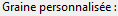
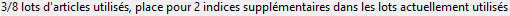
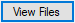

# Elden Ring Randomizer Hints  
  
## Onglet Options principales  
  
Après avoir démarré le programme, vous verrez l'écran principal des options :  
  
  
Si vous souhaitez changer la langue du programme, vous pouvez la sélectionner dans le menu . Changer la langue nécessite un redémarrage du programme.  
Notez que cela changera la langue de l'interface, mais des astuces seront toujours générées pour toutes les langues disponibles.  
  
La première chose que vous devrez faire est de sélectionner les exécutables dans la section supérieure. Vous aurez besoin d'exécutables valides pour [Elden Ring](https://store.steampowered.com/app/1245620/ELDEN_RING/), [DSMSPortable](https://github.com/mountlover/DSMSPortable), soit [Yabber](https://github.com/JKAnderson/Yabber) ou WitchyBND[(Nexus Mods)](https://www.nexusmods.com/eldenring/mods/3862)[(Github)](https://github.com/ividyon/WitchyBND), et l'un ou les deux de [Elden Ring Item and Enemy Randomizer](https://www.nexusmods.com/eldenring/mods/428) ou [Elden Ring Fog Gate Randomizer](https://www.nexusmods.com/eldenring/mods/3295).  
  
  
  
  
Après avoir sélectionné les exécutables, vous pouvez voir une activité dans le volet  :  
  
Il s'agit du programme qui lit les données du ou des randomiseurs et exporte les données de régulation qu'il a générées. Cela se produit chaque fois que les exécutables sont valides et changent ou que les options du randomiseur activées changent.  
  
En parlant de cela, il y a deux options sur la gauche pour activer ou désactiver chaque randomiseur :  
  
  
Pour générer des astuces, au moins l'une d'entre elles doit être activée et le chemin exécutable correspondant doit être valide.  
  
Sous chacune de ces options se trouvent d'autres options que vous pouvez utiliser pour personnaliser votre partie.  
  
### Options d'indice  
  
  
  
#### Item and Enemy Randomizer Options  
  
 : Par défaut, Randomizer Hints utilisera les graines aléatoires des fichiers spoiler du randomiseur, mais vous avez la possibilité de définir vos propres graines personnalisées pour chacune.  
 : Activez cette option pour créer des indices pour les éléments importants pour les quêtes des PNJ. La façon dont vous obtiendrez les indices dépendra du PNJ et de l'étape de la quête.  
 : Cette option placera des indices dans les emplacements des éléments lorsque les éléments qui y sont placés appartiennent aux catégories sélectionnées. Les astuces vous dirigeront vers d'autres emplacements d'éléments dans les mêmes catégories.  
 : sélectionnez cette option pour augmenter la probabilité que les indices de catégorie pointent vers des éléments dans la même région ou dans des régions voisines. Notez que cette option ne fait rien si Fog Gate Randomizer est utilisé.  
 : Cette option placera des indices sur des objets aléatoires des catégories sélectionnées dans des coffres à travers le monde. Vous pouvez sélectionner le pourcentage de coffres qui recevront des indices.  
 : Cette option placera des indices sur des objets aléatoires des catégories sélectionnées dans les boss à travers le monde. Vous pouvez sélectionner le pourcentage de boss qui recevront des indices.  
 : Sélectionnez cette option pour placer des indices sur les éléments clés nécessaires pour passer les portes, les ascenseurs et autres barrières dans les emplacements d'éléments à proximité de ces portes. Une exception est le Clé du salon, pour lequel un indice peut être donné par Tanith avec l'option .  
 : Normalement, les conseils directionnels qui fournissent des estimations de distance et de direction de la boussole n'apparaîtront que pour les éléments situés dans de grandes zones. Les indices pour les éléments situés dans des zones nommées plus petites montreront uniquement que les éléments se trouvent dans ces zones. Activez cette option pour toujours fournir la distance et la direction de la boussole. Non recommandé.  
  
#### Fog Gate Randomizer Options  
  
 : Par défaut, Randomizer Hints utilisera les graines aléatoires des fichiers spoiler du randomiseur, mais vous avez la possibilité de définir vos propres graines personnalisées pour chacune.  
 : Sélectionnez cette option pour placer des indices de porte dans des emplacements d'objets à proximité de ces portes.  
 : Cette option placera des indices sur des portes de brouillard aléatoires dans les coffres du monde entier. Vous pouvez sélectionner le pourcentage de coffres qui recevront des indices.  
 : Cette option placera des indices sur des portes de brouillard aléatoires dans les boss à travers le monde. Vous pouvez sélectionner le pourcentage de boss qui recevront des indices.  
  
Enfin, il existe deux options qui ne dépendent d'aucun des randomiseurs, mais qui sont utilisées avec les paramètres de l'onglet Éléments de départ :  
  
 : Cette option est utilisée pour placer des objets et des indices sur le cadavre Servante de l'Augure des Doigts au début de la partie.  
 : activez cette option pour utiliser un inventaire initial modifié pour la boutique Carcasses des Servantes jumelles.  
  
Une fois les chemins de fichiers validés et les options souhaitées définies, vous pouvez cliquer sur le bouton  pour créer des indices dans le jeu selon vos préférences. Le processus de génération d'indices prend un peu de temps et le volet  affichera la progression. Après avoir généré des astuces, vous devrez configurer Mod Engine 2 pour utiliser le mod.  
  
Mais avant de faire cela, vous souhaiterez peut-être consulter les autres onglets.  
  
## Éléments manquants onglet  
  
  
Cet onglet est assez simple. Une liste d'éléments aléatoires s'affiche dans le volet de gauche. Ce sont des objets très faciles à manquer ou impossibles à obtenir. La sélection d'un élément dans la liste révélera des informations sur son emplacement et sur la manière dont il peut être manqué dans le volet de droite. S'il y a des éléments qui sont importants pour votre jeu ici, vous pouvez voir s'il est probable que vous les manquiez, auquel cas vous pouvez revenir en arrière et réexécuter le Item and Enemy Randomizer pour un meilleur résultat.  
  
Vous verrez une zone de filtre au-dessus du volet latéral gauche. Taper du texte dans cette zone filtrera les éléments affichés qui correspondent au texte. Ce filtre apparaît dans des volets similaires dans d'autres onglets, et tous ces filtres fonctionnent de la même manière.  
  
## Éléments de départ onglet  
  
  
Dans cet onglet, vous pouvez définir les objets et les indices à placer sur le cadavre de Servante de l'Augure des Doigts au début du jeu, et modifier l'inventaire initial de la boutique Carcasses des Servantes jumelles.  
  
### Servante de l'Augure des Doigts Articles  
  
Dans la moitié gauche de l'onglet se trouve le sélecteur d'éléments Servante de l'Augure des Doigts :  
  
Le grand volet de gauche est la liste des objets et des indices à placer sur le cadavre, et les trois petits volets de droite sont des listes de tous les objets, de tous les indices d'objets et de toutes les catégories d'indices.  
  
Pour ajouter des éléments, des indices d'éléments ou des indices de catégorie au volet latéral gauche, sélectionnez-les dans l'un des volets latéraux droits et cliquez sur le bouton . Inversement, vous pouvez sélectionner des éléments dans le volet de gauche, puis cliquer sur le bouton  pour les supprimer. Plusieurs sélections sont autorisées.  
  
La quantité d'objets et d'indices à placer peut être modifiée. Sélectionnez-les dans le volet de gauche, puis cliquez sur le bouton  pour définir la quantité à placer.  
  
La propriété "restes uniquement" des indices d'éléments individuels peut également être définie en sélectionnant les indices d'éléments dans le volet de gauche et en cliquant sur le bouton . Les indices qui ont cette propriété pointeront uniquement vers les chutes ennemies de l'objet. Par exemple, dans les images ici, je configure une version d'archer, et j'ai donc "restes uniquement" des indices pour Os fins de bête et Rémige, qui me donneront des indices sur les ennemis qui lâcheront les ressources dont j'ai besoin pour fabriquer Flèche en os.  
  
Enfin en bas, vous pouvez voir un compteur qui vous permet de savoir combien d'espace reste à l'emplacement du cadavre.  
  
Il n'y a de place que pour 8 objets, mais les objets avec des quantités n'occupent toujours qu'un seul espace objet, et comme les objets d'indice d'objet peuvent contenir jusqu'à 4 indices, les indices seront regroupés. Dans l'exemple ci-dessus, j'ai 1 élément avec une quantité de 50 qui occupe 1 espace objet, puis 2 indices d'objet, un indice de catégorie avec une quantité de 2 et 2 autres indices de catégorie différents, soit un total de 6 indices. Ces indices seront regroupés dans 2 objets indices, l'un avec un maximum de 4 indices et l'autre avec seulement 2 indices, laissant de la place pour 2 autres objets avant d'utiliser un autre espace objet. Donc au total, seuls 3 espaces objets sont utilisés.  
  
Si l'option  est activée et que  ne l'est pas, les indices tenteront de pointer vers les éléments de Nécrolimbe et des zones environnantes si disponibles.  
  
### Carcasses des Servantes jumelles Boutique  
  
Dans la moitié droite de l'onglet se trouve l'éditeur de boutique Carcasses des Servantes jumelles :  
  
Le volet de gauche affiche l'inventaire du magasin et le volet de droite affiche tous les objets du jeu. La sélection d'un objet dans l'inventaire du magasin fera apparaître son emplacement en dessous. Après avoir sélectionné un emplacement, vous pouvez sélectionner un article de remplacement dans le volet des articles, puis cliquer sur le bouton  pour remplacer l'article de l'inventaire de la boutique par le nouvel article. Dans l'image ci-dessus, j'ai remplacé l'emplacement 14 dans l'inventaire du magasin par Flèche et fixé son prix à 5 runes.  
  
Avec un emplacement sélectionné, vous pouvez cliquer sur le bouton  pour définir le prix de l'article de l'inventaire de la boutique.  
  
Vous pouvez également cliquer sur le bouton  pour effacer vos modifications et recharger l'inventaire par défaut de la boutique.  
  
### Remarque importante concernant les éléments de départ

En raison de la façon dont le jeu gère les événements, certains objets doivent être obtenus depuis leur emplacement dans le monde du jeu pour que leurs effets fonctionnent. Cela inclut la création de livres de recettes, de peintures et de divers objets de quête. Si vous placez une copie de l'un de ces objets au départ ou dans la boutique, cela ne fonctionnera pas tant que vous n'aurez pas obtenu l'objet original depuis son emplacement dans le monde du jeu. Pour ces éléments, il est préférable de placer un indice dès le début.  
  
## Sélections de catégories onglet  
  
  
Cet onglet vous permet de sélectionner les catégories qui seront utilisées pour les indices de catégorie, les indices de coffre et les indices de chute de boss. Il existe une paire de volets pour chacun d'eux, le volet latéral gauche affichant les catégories sélectionnées et le volet latéral droit affichant toutes les catégories disponibles. Sélectionner des catégories dans le volet latéral droit et cliquer sur  les ajoutera au volet latéral gauche, et sélectionner des éléments dans le volet latéral gauche et cliquer sur  les supprimera du volet latéral gauche. Plusieurs sélections sont autorisées.  
  
Vous pouvez recharger l'ensemble par défaut de sélections de catégories en cliquant sur le bouton . Veuillez noter que si vous avez supprimé ou renommé certaines catégories par défaut ou ajouté de nouvelles catégories dans l'onglet Modifier les catégories, elles n'apparaîtront pas dans les sélections.  
  
## Modifier les catégories onglet  
  
  
Dans ce dernier onglet, vous pouvez modifier et supprimer les catégories d'articles, et créer les vôtres. Le volet latéral gauche affiche toutes les catégories, le volet central affiche les éléments de la catégorie sélectionnée et le volet latéral droit affiche tous les éléments du jeu.  
  
Cliquez sur le bouton  pour créer une nouvelle catégorie dans le volet de gauche. Vous pouvez également sélectionner une catégorie dans le volet de gauche et cliquer sur  pour en faire une nouvelle copie,  pour la renommer, ou  pour la supprimer.  
  
Lorsqu'une catégorie dans le volet latéral gauche est sélectionnée, les éléments de la catégorie seront affichés dans le volet central. Vous pouvez ajouter des éléments à la catégorie en sélectionnant des éléments dans le volet de droite et en cliquant sur . Les éléments peuvent être supprimés de la catégorie en les sélectionnant dans le volet central et en cliquant sur . Plusieurs sélections sont autorisées.  
  
Comme dans Servante de l'Augure des Doigts Items, la propriété "restes uniquement" des indices d'éléments au sein de la catégorie peut également être définie en les sélectionnant dans le volet central et en cliquant sur le bouton . Les indices qui ont cette propriété pointeront uniquement vers les chutes ennemies de l'objet.  
  
Vous pouvez recharger l'ensemble de catégories par défaut en cliquant sur le bouton . Veuillez noter que cela effacera complètement toutes les modifications ou nouvelles catégories que vous avez créées.  
  
## Enregistrer et charger les paramètres  
  
Au bas de l'onglet Options principales se trouvent des boutons qui peuvent être utilisés pour enregistrer, charger, importer et exporter les paramètres :  
  
La différence entre Charger/Enregistrer et Importer/Exporter réside dans les paramètres auxquels les boutons s'appliquent. Charger/Enregistrer s'applique à toutes les options du programme. L'import/export s'applique à toutes les options *sauf* les chemins exécutables et la boutique Carcasses des Servantes jumelles.  
  
Les fichiers d'options Charger/Enregistrer ont l'extension ".rhs" et peuvent être utilisés comme configurations et sauvegardes de paramètres personnels.  
  
Les fichiers d'options d'importation/exportation ont l'extension ".rhe" et sont censés être plus portables, afin que les joueurs puissent échanger des configurations de paramètres sans avoir le problème d'écraser leurs chemins d'exécutables avec ceux de quelqu'un d'autre.  
  
La boutique Carcasses des Servantes jumelles n'est pas incluse dans les paramètres d'exportation car l'inventaire de la boutique dépend du résultat du randomiseur, qui varie d'un joueur à l'autre. Même si cela s'applique également à vos propres graines aléatoires, l'inventaire du magasin est toujours enregistré afin que vous puissiez conserver un fichier de paramètres pour accompagner une graine connue.  
  
Par défaut, tous ces fichiers de paramètres sont enregistrés dans le dossier "settings" du dossier du programme.  

### Paramètres fournis

Dans le dossier « settings » se trouvent quelques fichiers .rhe différents que vous pouvez importer et essayer.

Sorcerer.rhe : Pour une construction de sorcellerie. Si vous pensez qu'avoir à la fois Trancheuse de Caria et Flèche de pierre d'éclat au début est trop, vous pouvez supprimer l'un ou les deux, et peut-être leur ajouter des indices à la place.

Archer.rhe : Pour un archer furtif qui utilise des arcs et des poignards. Je recommande également d'ajouter des flèches à la boutique pour un prix bon marché.

Priest.rhe : Pour une construction de foi qui s'appuie sur des incantations.

Bonk.rhe : Pour une construction au marteau. Frappez fort les choses.

## Configuration Mod Engine 2  
  
Après avoir généré des indices, vous devrez configurer Mod Engine 2 pour inclure Randomizer Hints en tant que mod. Le programme génère un fichier "config_randomizerhints.toml" qui ressemble à ceci :  
  
	# Generated by Elden Ring Randomizer Hints  
	  
	[modengine]  
	debug = false  
	external_dlls = []  
	[extension.mod_loader]  
	enabled = true  
	loose_params = false  
	mods = [  
	    { enabled = true, name = "randomizerhints", path = "C:\\Games\\Utilities\\randomizerHints" },  
	    { enabled = true, name = "fog", path = "C:\\Games\\Utilities\\fog\\" },  
	    { enabled = true, name = "randomizer", path = "C:\\Games\\Utilities\\randomizer\\" },  
	]  
	[extension.scylla_hide]  
	enabled = false  
  
Les chemins de mod qui apparaissent et la manière dont vous utilisez ce fichier dépendront de votre configuration.  
  
Si vous envisagez d'utiliser la fonctionnalité intégrée Mod Engine 2 dans Item and Enemy Randomizer ou Fog Gate Randomizer, vous devrez soit copier ce fichier toml dans le dossier du randomiseur et le renommer pour remplacer le fichier toml qui est déjà là, ou modifiez le fichier toml du randomiseur pour ajouter la ligne de mod "randomizerhints" ci-dessus.  
  
Si vous utilisez une installation manuelle de Mod Engine 2, remplacez le fichier "config_eldenring.toml" dans le dossier Mod Engine 2, ou modifiez-le et ajoutez la ligne de mod "randomizerhints" ci-dessus.  
  
La fusion avec d'autres mods sort du cadre de ces instructions, mais dans le fichier toml, "randomizerhints" doit précéder "fog", qui doit précéder "randomizer". Tous les mods avec un fichier regulation.bin précédant ces lignes remplaceront les données du randomiseur et l'empêcheront de fonctionner. Consultez la documentation [Mod Engine 2](https://github.com/soulsmods/ModEngine2#get-started-guide) pour plus de détails.  
  
Quant aux paramètres et fichiers spécifiques affectés par Randomizer Hints :  
  
#### Paramètres :  
  
> ItemLotParam_map : ajoute des entrées suivant l'ID 10010000 (Servante de l'Augure des Doigts cadavre), ajoute des entrées dans divers lots d'articles partout dans le monde.  
>EquipParamGoods : ajoute des entrées à partir de l'ID 300 000.  
>ShopLineupParam : ajoute des entrées dans diverses boutiques de PNJ, modifie les entrées dans la boutique Carcasses des Servantes jumelles.  
  
#### Des dossiers:  
  
> item.msgbnd.dcx (toutes langues)  
  
## Objets d'indice  
  
Les objets indices d'objet peuvent contenir jusqu'à quatre indices, et les objets indices de porte de brouillard peuvent contenir jusqu'à trois indices. Ils apparaissent dans la catégorie Info de votre inventaire. Pour garder les choses organisées, les objets d'indices de porte de brouillard apparaissent dans un groupe en haut, suivis par les objets d'indices d'objets dans le groupe suivant, puis les groupes d'éléments d'informations de jeu normaux en dessous.  
  
Avec les paramètres par défaut, Randomizer Hints génère *beaucoup* d'objets d'indice et votre inventaire d'éléments d'information peut devenir très volumineux. Pour cette raison, ce programme modifie également le jeu pour vous permettre de placer des éléments d'information dans votre coffre d'inventaire, ou de les jeter complètement. Soyez prudent, car cela signifie que vous pouvez également supprimer des peintures et des demandes de manoir.  
  
## Langues disponibles  
  
Elden Ring Randomizer Hints possède des données (mal) localisées pour les langues prises en charge dans Elden Ring autres que l'anglais, et peut générer des astuces dans chacune d'entre elles. *Cependant*, cela dépend des fichiers de jeu modifiés fournis par les randomiseurs. Item and Enemy Randomizer a ces fichiers pour toutes les langues, mais Fog Gate Randomizer ne les a que pour l'anglais. Si vous utilisez les deux randomiseurs, cela fonctionnera toujours correctement, mais si vous utilisez *uniquement* Fog Gate Randomizer, le programme obtiendra uniquement les fichiers en anglais et générera uniquement des astuces en anglais.  
  
Pour résoudre ce problème, vous pouvez extraire vous-même les fichiers de jeu nécessaires en utilisant Nordgaren's UXM Selective Unpacker[(Nexus)](https://www.nexusmods.com/eldenring/mods/1651)[(Github)](https://github.com/Nordgaren/UXM-Selective-Unpack) :  
  
  
Assurez-vous d'abord que le chemin d'accès à votre installation Elden Ring est correct, puis cliquez sur le bouton .  
  
La seule chose que vous devez sélectionner ici est le dossier "msg". Cliquez sur OK, puis cochez la case , puis cliquez sur le bouton . Après un certain temps, le déballage sera terminé et vous pourrez trouver le dossier "msg" décompressé dans votre dossier Elden Ring Game. Déplacez ce dossier dans le dossier "locale" de votre dossier Randomizer Hints, et le programme pourra trouver tous les fichiers localisés même en utilisant uniquement Fog Gate Randomizer.  
  
## Stratégies et spoilers  
  
Si vous souhaitez une variété d'éléments pour la construction de votre personnage, créez des catégories avec ces éléments et activez-les dans les catégories générales. Cela vous permettra de suivre la chaîne d'indices pour tous les obtenir. Placez un indice sur la catégorie dans Servante de l'Augure des Doigts Items pour commencer.  
  
Si vous recherchez un article particulier et que vous obtenez un indice concernant un article indésirable dans la même catégorie, ne l'ignorez pas. L'obtention de cet objet fournira également des indices sur d'autres objets de la catégorie, dont l'un pourrait être l'objet que vous recherchez.  
  
Si vous souhaitez effectuer autant de quêtes de PNJ que possible, évitez de franchir aveuglément une porte aléatoire sans chercher dans la zone à proximité un indice sur l'endroit où elle mène. Si vous vous retrouvez tôt dans Dunes gémissantes ou Plateau Altus, vous risquez de manquer les premiers objets des quêtes de Alexander et Blaidd.  
  
Si vous utilisez le Fog Gate Randomizer, la porte latérale de la chapelle commence fermée. Cependant, si vous utilisez le Cloche du retour avant de vous déplacer, il s'ouvre ! Si vous avez activé , un indice sur l'endroit où va la porte antibrouillard sera dans le butin à l'intérieur.  
  
Si vous recherchez des indices, l'apparence de l'objet peut être un indice. Les objets d'indice ne seront pas trouvés dans les emplacements d'objets blancs, mais uniquement dans les emplacements violets ou dorés.  
  
Si la quantité d'objets indices que vous obtenez devient écrasante et ennuyeuse à gérer, continuez et jouez avec les catégories et les paramètres pour réduire la quantité que vous obtenez. J'aime recevoir beaucoup d'indices, puis déterminer le meilleur itinéraire à suivre pour terminer toutes les quêtes et terminer ma construction aussi efficacement que possible, mais le style de jeu de chacun est différent. Vous pourrez peut-être créer vos propres paramètres qui permettront une expérience moins encombrée mais toujours très axée sur les objectifs.  
  
Si vous réduisez considérablement le nombre de catégories/objets disponibles pour générer des indices, vous souhaiterez peut-être également réduire le pourcentage de coffres et de boss dans lesquels ils peuvent apparaître, pour éviter d'obtenir trop d'indices redondants.  

