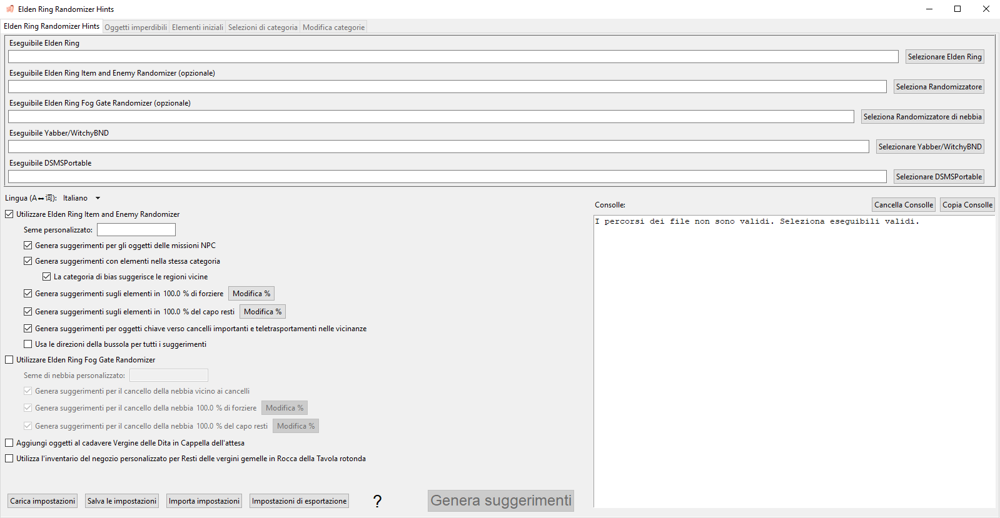
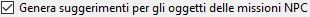
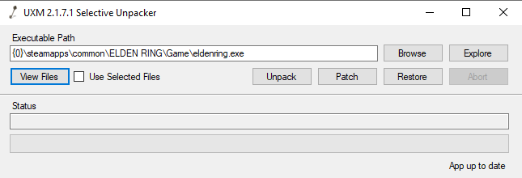

#Elden Ring Randomizer Hints  
  
## Scheda Opzioni principali  
  
Dopo aver avviato il programma, vedrai la schermata delle opzioni principali:  
  
  
Se desideri cambiare la lingua del programma, puoi selezionarla dal menu . La modifica della lingua richiede il riavvio del programma.  
Tieni presente che ciò cambierà la lingua dell'interfaccia, ma i suggerimenti verranno comunque generati per tutte le lingue disponibili.  
  
La prima cosa che devi fare è selezionare gli eseguibili nella sezione superiore. Avrai bisogno di eseguibili validi per [Elden Ring](https://store.steampowered.com/app/1245620/ELDEN_RING/), [DSMSPortable](https://github.com/mountlover/DSMSPortable), [Yabber](https://github.com/JKAnderson/Yabber) o WitchyBND[(Nexus Mods)](https://www.nexusmods.com/eldenring/mods/3862)[(Github)](https://github.com/ividyon/WitchyBND) e uno o entrambi tra [Elden Ring Item and Enemy Randomizer](https://www.nexusmods.com/eldenring/mods/428) o [Elden Ring Fog Gate Randomizer](https://www.nexusmods.com/eldenring/mods/3295).  
  
  
  
  
Dopo aver selezionato gli eseguibili, potresti vedere attività nel riquadro :  
  
Questo è il programma che legge i dati dai randomizzatori ed esporta i dati di regolazione che ha generato. Ciò accade ogni volta che gli eseguibili sono validi e cambiano o cambiano le opzioni del randomizzatore abilitato.  
  
A proposito, ci sono due opzioni sulla sinistra per abilitare o disabilitare ciascun randomizzatore:  
  
  
Per generare suggerimenti, almeno uno di questi deve essere abilitato e il relativo percorso eseguibile deve essere valido.  
  
Sotto ciascuna di queste opzioni ci sono più opzioni che puoi utilizzare per personalizzare il tuo gioco.  
  
### Opzioni suggerimento  
  
  
  
#### Item and Enemy Randomizer Opzioni  
  
: Per impostazione predefinita, Randomizer Hints utilizzerà i semi casuali dai file spoiler del randomizzatore, ma hai la possibilità di impostare i tuoi semi personalizzati per ciascuno.  
: abilita questa opzione per creare suggerimenti per oggetti importanti per le missioni NPC. Il modo in cui ottieni i suggerimenti dipenderà dall'NPC e dalla fase della missione.  
: questa opzione inserirà suggerimenti nelle posizioni degli oggetti quando gli oggetti posizionati lì appartengono alle categorie selezionate. I suggerimenti ti indirizzeranno ad altre posizioni di articoli all'interno delle stesse categorie.  
: seleziona questa opzione per aumentare la probabilità che i suggerimenti di categoria puntino a elementi nella stessa regione o in regioni vicine. Tieni presente che questa opzione non fa nulla se viene utilizzato Fog Gate Randomizer.  
: questa opzione inserirà suggerimenti per oggetti casuali delle categorie selezionate nei forzieri di tutto il mondo. Puoi selezionare la percentuale di forzieri che riceveranno suggerimenti.  
: questa opzione inserirà suggerimenti per oggetti casuali delle categorie selezionate nei boss rilasciati in tutto il mondo. Puoi selezionare la percentuale di boss che riceveranno suggerimenti.  
: seleziona questa opzione per inserire suggerimenti per gli oggetti chiave necessari per passare attraverso cancelli, ascensori e altre barriere nelle posizioni degli oggetti vicino a tali cancelli. Un'eccezione è Chiave della sala, per la quale un suggerimento può essere fornito da Tanith con l'opzione .  
: Normalmente, i suggerimenti direzionali che forniscono stime di distanza e direzione della bussola verranno visualizzati solo per elementi in aree estese. I suggerimenti per gli elementi in aree con nome più piccole mostreranno solo che gli elementi si trovano in quelle aree. Abilita questa opzione per fornire sempre la distanza e la direzione della bussola. Non consigliato.  
  
#### Fog Gate Randomizer Opzioni  
  
: Per impostazione predefinita, Randomizer Hints utilizzerà i semi casuali dai file spoiler del randomizzatore, ma hai la possibilità di impostare i tuoi semi personalizzati per ciascuno.  
: seleziona questa opzione per posizionare i suggerimenti sui cancelli nelle posizioni degli oggetti vicino a quei cancelli.  
: questa opzione inserirà suggerimenti per portali di nebbia casuali nei forzieri di tutto il mondo. Puoi selezionare la percentuale di forzieri che riceveranno suggerimenti.  
: questa opzione inserirà suggerimenti per portali di nebbia casuali nei boss rilasciati in tutto il mondo. Puoi selezionare la percentuale di boss che riceveranno suggerimenti.  
  
Infine ci sono due opzioni che non dipendono da nessuno dei randomizzatori, ma vengono utilizzate insieme alle impostazioni nella scheda Elementi iniziali:  
  
: questa opzione viene utilizzata per posizionare oggetti e suggerimenti sul cadavere di Vergine delle Dita all'inizio del gioco.  
: Abilita questa opzione per utilizzare un inventario iniziale del negozio modificato per il negozio Resti delle vergini gemelle.  
  
Dopo che i percorsi dei file sono stati convalidati e le opzioni desiderate sono state impostate, puoi fare clic sul pulsante  per creare suggerimenti nel gioco in base alle tue preferenze. Il processo di generazione dei suggerimenti richiede un po' di tempo e il riquadro  ne visualizzerà l'avanzamento. Dopo aver generato i suggerimenti dovrai configurare Mod Engine 2 per utilizzare il mod.  
  
Ma prima di farlo, potresti voler guardare le altre schede.  
  
## Oggetti imperdibili scheda  
  
  
Questa scheda è abbastanza semplice. Un elenco di elementi casuali viene visualizzato nel riquadro laterale sinistro. Questi sono oggetti che è molto facile perdere o impossibili da ottenere. Selezionando un elemento dall'elenco verranno rivelati spoiler sulla sua posizione e su come potrebbe non essere visibile nel riquadro di destra. Se ci sono elementi importanti per il tuo gioco qui, puoi vedere se è probabile che potresti perderli, nel qual caso puoi tornare indietro ed eseguire nuovamente Item and Enemy Randomizer per un risultato migliore.  
  
Vedrai una casella di filtro sopra il riquadro laterale sinistro. Digitando il testo in questa casella verranno filtrati gli elementi visualizzati che corrispondono al testo. Questo filtro viene visualizzato in riquadri simili in altre schede e tutti questi filtri funzionano allo stesso modo.  
  
## Elementi iniziali scheda  
  
  
In questa scheda puoi impostare gli oggetti e i suggerimenti da posizionare sul cadavere di Vergine delle Dita all'inizio del gioco e modificare l'inventario iniziale del negozio di Resti delle vergini gemelle.  
  
### Vergine delle Dita Elementi  
  
Nella metà sinistra della scheda c'è il selettore degli elementi Vergine delle Dita:  
  
Il riquadro grande a sinistra è l'elenco degli oggetti e dei suggerimenti da posizionare sul cadavere, mentre i tre riquadri più piccoli a destra sono gli elenchi di tutti gli oggetti, tutti i suggerimenti sugli oggetti e tutte le categorie di suggerimenti.  
  
Per aggiungere elementi, suggerimenti sugli elementi o suggerimenti sulle categorie al riquadro di sinistra, selezionarli da uno dei riquadri di destra e fare clic sul pulsante . Al contrario, puoi selezionare gli elementi nel riquadro laterale sinistro, quindi fare clic sul pulsante  per rimuoverli. Sono consentite selezioni multiple.  
  
La quantità di oggetti e suggerimenti da posizionare può essere modificata. Selezionali nel riquadro laterale sinistro, quindi fai clic sul pulsante  per impostare la quantità da posizionare.  
  
La proprietà "solo resti" dei singoli suggerimenti sugli elementi può essere impostata anche selezionando i suggerimenti sugli elementi nel riquadro a sinistra e facendo clic sul pulsante . I suggerimenti che hanno questa proprietà indicheranno solo il rilascio dell'oggetto da parte dei nemici. Ad esempio, nelle immagini qui sto configurando una build da arciere, quindi ho "solo resti" suggerimenti per Ossa sottili di animale e Penna remigante, che mi daranno suggerimenti sui nemici che lasceranno cadere le risorse di cui ho bisogno per creare Freccia d'osso.  
  
Infine in basso puoi vedere un contatore che ti consente di sapere quanto spazio è rimasto nella posizione del cadavere.  
  
C'è spazio solo per 8 oggetti, ma gli oggetti con quantità occupano comunque solo 1 spazio oggetto e poiché gli oggetti suggerimento oggetto possono contenere fino a 4 suggerimenti, i suggerimenti verranno raggruppati insieme. Nell'esempio sopra ho 1 articolo con una quantità di 50 che occupa 1 spazio oggetto, quindi 2 suggerimenti di articolo, un suggerimento di categoria con una quantità di 2 e altri 2 suggerimenti di categoria diversi, per un totale di 6 suggerimenti. Questi suggerimenti verranno raggruppati in 2 oggetti suggerimento, uno con un massimo di 4 suggerimenti e l'altro con solo 2 suggerimenti, lasciando spazio per altri 2 prima di utilizzare un altro spazio oggetto. Quindi in totale vengono utilizzati solo 3 spazi oggetto.  
  
Se l'opzione  è abilitata e  non lo è, i suggerimenti proveranno a puntare agli elementi in Sepolcride e alle aree circostanti, se disponibili.  
  
### Resti delle vergini gemelle Negozio  
  
Nella metà destra della scheda c'è l'editor del negozio Resti delle vergini gemelle:  
  
Il riquadro laterale sinistro mostra l'inventario del negozio e il riquadro laterale destro mostra tutti gli oggetti del gioco. Selezionando un oggetto nell'inventario del negozio, il suo slot verrà visualizzato sotto. Dopo aver selezionato uno slot, puoi selezionare un articolo sostitutivo nel riquadro degli articoli, quindi fare clic sul pulsante  per sostituire l'articolo dell'inventario del negozio con il nuovo articolo. Nell'immagine sopra, ho sostituito lo slot 14 nell'inventario del negozio con Freccia e ho impostato il suo prezzo su 5 rune.  
  
Con uno slot selezionato, puoi fare clic sul pulsante  per impostare il prezzo dell'articolo dell'inventario del negozio.  
  
Puoi anche fare clic sul pulsante  per cancellare le modifiche e ricaricare l'inventario predefinito del negozio.  
  
### Nota importante sugli elementi iniziali

A causa del modo in cui il gioco gestisce gli eventi, alcuni oggetti devono essere ottenuti dalla loro posizione nel mondo di gioco affinché i loro effetti funzionino. Ciò include la creazione di libri di ricette, dipinti e vari oggetti di missione. Se posizioni una copia di uno di questi oggetti all'inizio o nel negozio, non funzionerà finché non otterrai l'oggetto originale dalla sua posizione nel mondo di gioco. Per questi articoli è meglio inserire un suggerimento all'inizio.  
  
## Selezioni di categoria scheda  
  
  
Questa scheda ti consente di selezionare quali categorie verranno utilizzate per i suggerimenti di categoria, i suggerimenti per il forziere e i suggerimenti per la caduta del boss. C'è una coppia di riquadri per ognuno di questi, con il riquadro di sinistra che mostra le categorie selezionate e il riquadro di destra che mostra tutte le categorie disponibili. Selezionando le categorie nel riquadro di destra e facendo clic su  le aggiungerai al riquadro di sinistra, mentre selezionando gli elementi nel riquadro di sinistra e facendo clic su  le rimuoverai dal riquadro di sinistra. Sono consentite selezioni multiple.  
  
Puoi ricaricare il set predefinito di selezioni di categoria facendo clic sul pulsante . Tieni presente che se hai eliminato o rinominato alcune categorie predefinite o aggiunto nuove categorie nella scheda Modifica categorie, queste non verranno visualizzate nelle selezioni.  
  
## Modifica categorie scheda  
  
  
In questa scheda finale puoi modificare ed eliminare le categorie di articoli e crearne di tue. Il riquadro laterale sinistro mostra tutte le categorie, il riquadro centrale mostra gli elementi all'interno della categoria selezionata e il riquadro laterale destro mostra tutti gli elementi del gioco.  
  
Fare clic sul pulsante  per creare una nuova categoria nel riquadro laterale sinistro. Puoi anche selezionare una categoria nel riquadro laterale sinistro e fare clic su  per crearne una nuova copia,  per rinominarla o  per eliminarla.  
  
Quando viene selezionata una categoria nel riquadro laterale sinistro, gli elementi all'interno della categoria verranno visualizzati nel riquadro centrale. Puoi aggiungere elementi alla categoria selezionando gli elementi nel riquadro di destra e facendo clic su . Gli elementi possono essere rimossi dalla categoria selezionando gli elementi nel riquadro centrale e facendo clic su . Sono consentite selezioni multiple.  
  
Come in Vergine delle Dita Elementi, la proprietà "solo resti" dei suggerimenti sugli elementi all'interno della categoria può essere impostata anche selezionandoli nel riquadro centrale e facendo clic sul pulsante . I suggerimenti che hanno questa proprietà indicheranno solo il rilascio dell'oggetto da parte dei nemici.  
  
È possibile ricaricare il set predefinito di categorie facendo clic sul pulsante . Tieni presente che ciò cancellerà completamente eventuali modifiche o nuove categorie che hai creato.  
  
## Salva e carica le impostazioni  
  
Nella parte inferiore della scheda Opzioni principali sono presenti i pulsanti che possono essere utilizzati per salvare, caricare, importare ed esportare le impostazioni:  
  
La differenza tra Carica/Salva e Importa/Esporta riguarda le impostazioni a cui si applicano i pulsanti. Carica/Salva si applica a tutte le opzioni del programma. L'importazione/esportazione si applica a tutte le opzioni *tranne* i percorsi eseguibili e il negozio Resti delle vergini gemelle.  
  
I file delle opzioni Carica/Salva hanno l'estensione ".rhs" e possono essere utilizzati come configurazioni e backup delle impostazioni personali.  
  
I file delle opzioni di importazione/esportazione hanno l'estensione ".rhe" e sono pensati per essere più portabili, in modo che i giocatori possano scambiare le configurazioni delle impostazioni senza avere il problema di sovrascrivere i propri percorsi eseguibili con quelli di qualcun altro.  
  
Il negozio Resti delle vergini gemelle non è incluso nelle impostazioni esportate perché l'inventario del negozio dipende dall'output del randomizzatore, che varierà da giocatore a giocatore. Anche se ciò vale anche per i tuoi diversi semi randomizzati, l'inventario del negozio viene comunque salvato in modo da poter conservare un file di impostazioni da abbinare a un seme noto.  
  
Per impostazione predefinita tutti questi file di impostazioni vengono salvati nella cartella "settings" nella cartella del programma.  

### Impostazioni fornite

Nella cartella "settings" ci sono alcuni file .rhe diversi che puoi importare e provare.

Sorcerer.rhe: Per una build di stregoneria. Se ritieni che avere sia Incisore cariano che Ciottolo di scintipietra all'inizio sia troppo, puoi rimuoverne uno o entrambi e magari aggiungere loro dei suggerimenti.

Archer.rhe: per una build da arciere furtivo che utilizza archi e pugnali. Consiglia anche di aggiungere Freccia al negozio a un prezzo conveniente.

Priest.rhe: Per costruire una fede che si basi sugli incantesimi.

Bonk.rhe: Per una costruzione a martello. Colpisci forte le cose.

## Configurazione di Mod Engine 2  
  
Dopo aver generato i suggerimenti, dovrai configurare Mod Engine 2 per includere Randomizer Hints come mod. Il programma genera un file "config_randomizerhints.toml" simile a questo:  
  
	# Generated by Elden Ring Randomizer Hints  
	  
	[modengine]  
	debug = false  
	external_dlls = []  
	[extension.mod_loader]  
	enabled = true  
	loose_params = false  
	mods = [  
	    { enabled = true, name = "randomizerhints", path = "C:\\Games\\Utilities\\randomizerHints" },  
	    { enabled = true, name = "fog", path = "C:\\Games\\Utilities\\fog\\" },  
	    { enabled = true, name = "randomizer", path = "C:\\Games\\Utilities\\randomizer\\" },  
	]  
	[extension.scylla_hide]  
	enabled = false  
  
I percorsi mod visualizzati e il modo in cui utilizzi questo file dipenderanno dalla tua configurazione.  
  
Se prevedi di utilizzare la funzione integrata Mod Engine 2 in Item and Enemy Randomizer o Fog Gate Randomizer, dovrai copiare questo file toml nella cartella randomizer e rinominarlo per sostituire il file toml che è già lì, oppure modifica il file toml del randomizzatore per aggiungere la riga mod "randomizerhints" sopra.  
  
Se stai utilizzando un'installazione manuale di Mod Engine 2, sostituisci il file "config_eldenring.toml" nella cartella Mod Engine 2 oppure modificalo e aggiungi la riga mod "randomizerhints" sopra.  
  
L'unione con altri mod non rientra nell'ambito di queste istruzioni, ma nel file toml, "randomizerhints" deve precedere "fog", che deve precedere "randomizer". Qualsiasi mod con un file regulation.bin che precede queste righe sovrascriverà i dati del randomizzatore e ne impedirà il funzionamento. Controlla la documentazione di [Mod Engine 2](https://github.com/soulsmods/ModEngine2#get-started-guide) per i dettagli.  
  
Per quanto riguarda i parametri specifici e i file interessati da Randomizer Hints:  
  
#### Parametri:  
  
> ItemLotParam_map: aggiunge voci seguenti all'ID 10010000 (Vergine delle Dita corpse), aggiunge voci in vari lotti di articoli in tutto il mondo.  
>EquipParamGoods: aggiunge voci dall'ID 300000 in su.  
>ShopLineupParam: Aggiunge voci a vari negozi NPC, modifica voci nel negozio Resti delle vergini gemelle.  
  
#### File:  
  
> item.msgbnd.dcx (tutte le lingue)  
  
## Oggetti suggerimento  
  
Gli oggetti suggerimento oggetto possono contenere fino a quattro suggerimenti e gli oggetti suggerimento Portanebbia possono contenere fino a tre suggerimenti. Appaiono nella categoria Informazioni del tuo Inventario. Per mantenere le cose organizzate, gli oggetti suggerimento del cancello della nebbia appaiono in un gruppo in alto, seguiti dagli oggetti suggerimento degli oggetti nel gruppo successivo, e poi i normali gruppi di oggetti delle informazioni di gioco sotto di esso.  
  
Con le impostazioni predefinite, Randomizer Hints genera *molti* oggetti suggerimento e il tuo inventario di elementi informativi può diventare molto grande. Per questo motivo, questo programma modifica anche il gioco per permetterti di inserire oggetti informativi nel tuo forziere dell'inventario o di scartarli del tutto. Fai attenzione, perché questo significa che puoi anche scartare dipinti e richieste di manieri.  
  
## Lingue disponibili  
  
Elden Ring Randomizer Hints ha dati (scarsamente) localizzati per le lingue supportate in Elden Ring diverse dall'inglese e può generare suggerimenti in tutte. *Tuttavia*, ciò dipende dai file di gioco modificati forniti dai randomizzatori. Item and Enemy Randomizer ha questi file per tutte le lingue, ma Fog Gate Randomizer li ha solo per l'inglese. Se stai usando entrambi i randomizzatori, funzionerà comunque bene, ma se stai usando *solo* Fog Gate Randomizer, il programma otterrà solo i file inglesi e genererà solo suggerimenti in inglese.  
  
Per risolvere questo problema, puoi estrarre tu stesso i file di gioco necessari utilizzando Nordgaren's UXM Selective Unpacker[(Nexus)](https://www.nexusmods.com/eldenring/mods/1651)[(Github)](https://github.com/Nordgaren/UXM-Selective-Unpack):  
  
  
Per prima cosa assicurati che il percorso di installazione di Elden Ring sia corretto, quindi fai clic sul pulsante .  
  
L'unica cosa che devi selezionare qui è la cartella "msg". Fare clic su OK, quindi selezionare la casella di controllo , quindi fare clic sul pulsante . Dopo un po', la decompressione sarà completata e sarai in grado di trovare la cartella "msg" decompressa all'interno della cartella del gioco Elden Ring. Sposta questa cartella all'interno della cartella "locale" nella tua cartella Randomizer Hints e il programma sarà in grado di trovare tutti i file localizzati anche utilizzando solo Fog Gate Randomizer.  
  
## Strategie e spoiler  
  
Se ci sono diversi oggetti che desideri per la creazione del tuo personaggio, crea categorie con quegli oggetti e abilitali nelle categorie generali. Ciò ti consentirà di seguire la catena di suggerimenti per ottenerli tutti. Inserisci un suggerimento per la categoria in Vergine delle Dita Elementi per iniziare.  
  
Se stai cercando un oggetto particolare e ricevi un suggerimento su un oggetto indesiderato nella stessa categoria, non ignorarlo. Ottenere quell'oggetto fornirà anche suggerimenti per altri oggetti nella categoria, uno dei quali potrebbe essere l'oggetto che stai cercando.  
  
Se vuoi svolgere quante più missioni NPC possibile, evita di attraversare alla cieca un cancello casuale senza cercare nell'area vicina un suggerimento su dove conduce. Se finisci presto in Dune sibilanti o Altopiano di Altus potresti perdere i primi oggetti delle missioni di Alexander e Blaidd.  
  
Se stai utilizzando Fog Gate Randomizer, la porta laterale della cappella inizia chiusa. Tuttavia, se usi Campana del Ritorno prima di andare ovunque, si apre! Se hai abilitato , un suggerimento su dove va il cancello della nebbia sarà nel bottino all'interno.  
  
Se stai cercando suggerimenti, l'aspetto dell'oggetto può essere un indizio. Gli oggetti suggerimento non verranno trovati nelle semplici posizioni degli oggetti bianchi, ma solo in quelli viola o dorati.  
  
Se la quantità di oggetti suggerimento che ottieni diventa travolgente e fastidiosa da gestire, vai avanti e gioca con le categorie e le impostazioni per ridurre la quantità che ottieni. Mi piace ricevere molti suggerimenti e poi capire il percorso migliore da intraprendere per completare tutte le missioni e portare a termine la mia build nel modo più efficiente possibile, ma lo stile di gioco di ognuno è diverso. Potresti essere in grado di creare le tue impostazioni che rendono l'esperienza meno disordinata ma comunque molto diretta agli obiettivi.  
  
Se riduci notevolmente il numero di categorie/oggetti disponibili per generare suggerimenti, potresti anche voler ridurre la percentuale di forzieri e oggetti in cui possono apparire, per evitare di ricevere troppi suggerimenti ridondanti.  

