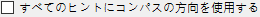
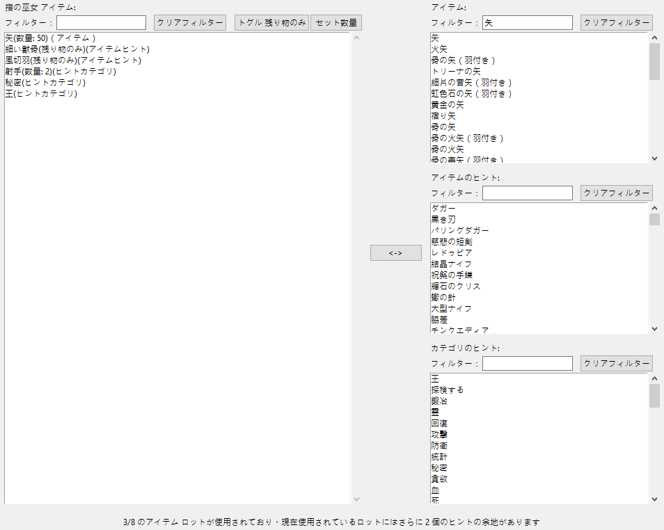
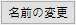
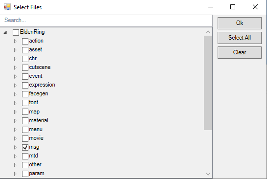

#Elden Ring Randomizer Hints  
  
## 「メインオプション」タブ  
  
プログラムを開始すると、メイン オプション画面が表示されます。  
  
  
プログラム言語を切り替えたい場合は、 メニューから選択できます。言語を変更するには、プログラムを再起動する必要があります。  
これによりインターフェイス言語が変更されますが、利用可能なすべての言語に対してヒントが生成されることに注意してください。  
  
最初に行う必要があるのは、上部のセクションで実行可能ファイルを選択することです。の有効な実行可能ファイルが必要です。 [Elden Ring](https://store.steampowered.com/app/1245620/ELDEN_RING/)、[DSMSPortable](https://github.com/mountlover/DSMSPortable)、[Yabber](https://github.com/JKAnderson/Yabber) または WitchyBND[(Nexus Mods)](https://www.nexusmods.com/eldenring/mods/3862)[(Github)](https://github.com/ividyon/WitchyBND)、および [Elden Ring Item and Enemy Randomizer](https://www.nexusmods.com/eldenring/mods/428) または [Elden Ring Fog Gate Randomizer](https://www.nexusmods.com/eldenring/mods/3295) のいずれかまたは両方。  
  
  
  
  
実行可能ファイルを選択すると、 ペインにアクティビティが表示される場合があります。  
  
これは、ランダマイザーからデータを読み取り、生成した規制データをエクスポートするプログラムです。これは、実行可能ファイルが有効で変更されるか、有効なランダマイザー オプションが変更されるたびに発生します。  
  
そういえば、左側には各ランダマイザーを有効または無効にする 2 つのオプションがあります。  
  
  
ヒントを生成するには、これらの少なくとも 1 つが有効になっており、その実行可能パスが有効である必要があります。  
  
これらの各オプションの下には、プレイスルーをカスタマイズするために使用できるその他のオプションがあります。  
  
### ヒントのオプション  
  
  
  
#### Item and Enemy Randomizer オプション  
  
: デフォルトでは、Randomizer Hints はランダマイザー スポイラー ファイルからのランダム シードを使用しますが、それぞれに独自のカスタム シードを設定するオプションもあります。  
: NPC クエストにとって重要なアイテムのヒントを作成するには、このオプションを有効にします。ヒントの入手方法はNPCやクエストのステージによって異なります。  
: このオプションは、そこに配置されたアイテムが選択したカテゴリに属している場合、アイテムの場所にヒントを配置します。ヒントは、同じカテゴリ内のアイテムの他の場所を示します。  
: カテゴリ ヒントが同じ領域または隣接する領域内のアイテムを指す可能性を高めるには、このオプションを選択します。 Fog Gate Randomizer が使用されている場合、このオプションは何も行わないことに注意してください。  
: このオプションは、選択したカテゴリからランダムなアイテムへのヒントを世界中の宝箱に配置します。ヒントを受け取るチェストの割合を選択できます。  
: このオプションは、選択したカテゴリからランダムなアイテムへのヒントを世界中のボス ドロップに配置します。ヒントを受け取るボスの割合を選択できます。  
: ゲート、エレベーター、その他の障壁を通過するために必要な重要なアイテムのヒントを、それらのゲート近くのアイテムの場所に配置するには、このオプションを選択します。例外は 客間の鍵 で、これについては タニス が  オプションを使用してヒントを提供できます。  
: 通常、距離とコンパスの方向の推定値を提供する方向のヒントは、広いエリアにあるアイテムに対してのみ表示されます。小さな名前付きエリア内のアイテムに関するヒントでは、アイテムがそのエリア内にあることのみが表示されます。このオプションを有効にすると、距離とコンパスの方向が常に表示されます。お勧めしません。  
  
#### Fog Gate Randomizer オプション  
  
: デフォルトでは、Randomizer Hints はランダマイザー スポイラー ファイルからのランダム シードを使用しますが、それぞれに独自のカスタム シードを設定するオプションもあります。  
: ゲートの近くのアイテムの場所にゲートのヒントを配置するには、このオプションを選択します。  
: このオプションは、ランダムな霧のゲートへのヒントを世界中の宝箱に配置します。ヒントを受け取るチェストの割合を選択できます。  
: このオプションは、世界中のボス ドロップにランダムなフォグ ゲートへのヒントを配置します。ヒントを受け取るボスの割合を選択できます。  
  
最後に、どちらのランダマイザーにも依存しない 2 つのオプションがありますが、スターティングアイテム タブの設定とともに使用されます。  
  
: このオプションは、ゲーム開始時に 指の巫女 の死体にアイテムとヒントを配置するために使用されます。  
: 双子の老婆 ショップの編集済み初期ショップ在庫を使用するには、このオプションを有効にします。  
  
ファイル パスが検証され、必要なオプションが設定されたら、 ボタンをクリックして、好みに応じてゲーム内にヒントを作成できます。ヒントの生成プロセスには少し時間がかかり、 ペインに進行状況が表示されます。ヒントを生成した後、MOD を使用するように Mod Engine 2 を設定する必要があります。  
  
ただし、その前に、他のタブを確認することもできます。  
  
## 見逃せないアイテム タブ  
  
  
このタブは非常にシンプルです。ランダム化されたアイテムのリストが左側のペインに表示されます。これらは非常に見逃しやすい、または入手不可能なアイテムです。リストから項目を選択すると、その場所とその項目がどのように見逃されるかについてのネタバレが右側のペインに表示されます。ただし、プレイにとって重要なアイテムがある場合は、それらを見逃す可能性があるかどうかを確認できます。その場合は、戻って Item and Enemy Randomizer を再実行すると、より良い結果が得られます。  
  
左側のペインの上にフィルター ボックスが表示されます。このボックスにテキストを入力すると、テキストに一致する項目が表示されます。このフィルターは他のタブの同様のペインに表示され、これらのフィルターはすべて同じように機能します。  
  
## スターティングアイテム タブ  
  
  
このタブでは、ゲーム開始時に 指の巫女 の死体に配置されるアイテムとヒントを設定し、双子の老婆 のショップの初期在庫を編集できます。  
  
### 指の巫女 アイテム  
  
タブの左半分には 指の巫女 項目セレクターがあります。  
  
左側の大きなペインは、死体に配置されるアイテムとヒントのリストで、右側の 3 つの小さなペインは、すべてのアイテム、すべてのアイテムのヒント、およびすべてのヒント カテゴリのリストです。  
  
項目、項目ヒント、またはカテゴリ ヒントを左側のペインに追加するには、右側のペインの 1 つからそれらを選択し、 ボタンをクリックします。逆に、左側のペインで項目を選択し、 ボタンをクリックして削除することもできます。複数の選択が可能です。  
  
配置するアイテムやヒントの数は変更可能です。左側のペインでそれらを選択し、 ボタンをクリックして、配置する数量を設定します。  
  
個々のアイテム ヒントの 「残り物のみ」 プロパティは、左側のペインでアイテム ヒントを選択し、 ボタンをクリックして設定することもできます。このプロパティを持つヒントは、敵がアイテムをドロップすることのみを指します。たとえば、ここの画像では射手ビルドをセットアップしているため、細い獣骨 と 風切羽 に対する 「残り物のみ」 のヒントがあり、骨の矢の作成に必要なリソースをドロップする敵へのヒントが得られます。  
  
最後に、下部には死体の場所にどれだけのスペースが残っているかを示すカウンターが表示されます。  
  
オブジェクトのスペースは 8 つだけですが、数量のあるアイテムは依然として 1 つのオブジェクト スペースしか占有せず、アイテム ヒント オブジェクトは最大 4 つのヒントを保持できるため、ヒントはまとめて詰め込まれます。上の例では、1 つのオブジェクト スペースを占める数量 50 のアイテムが 1 つあり、次にアイテム ヒントが 2 つ、数量が 2 のカテゴリ ヒントが 1 つ、さらに 2 つの異なるカテゴリ ヒントがあり、合計 6 つのヒントになります。これらのヒントは 2 つのヒント オブジェクトにパックされます。1 つは最大 4 つのヒントを含み、もう 1 つは 2 つのヒントのみを含み、別のオブジェクト スペースを使用する前にさらに 2 つのヒントのためのスペースを残します。したがって、合計で 3 つのオブジェクト スペースのみが使用されます。  
  
 オプションが有効で、 が有効ではない場合、ヒントは リムグレイブ とその周囲の領域 (可能な場合) のアイテムを参照しようとします。  
  
### 双子の老婆 ショップ  
  
タブの右半分には 双子の老婆 ショップエディターがあります。  
  
左側のペインにはショップの在庫が表示され、右側のペインにはゲーム内のすべてのアイテムが表示されます。ショップの在庫でアイテムを選択すると、そのスロットが下に表示されます。スロットを選択した後、アイテム ペインで置換アイテムを選択し、 ボタンをクリックしてショップ在庫アイテムを新しいアイテムと置き換えることができます。上の画像では、ショップ在庫のスロット 14 を 矢 に置き換え、価格を 5 ルーンに設定しました。  
  
スロットを選択した状態で、 ボタンをクリックして、ショップ在庫アイテムの価格を設定できます。  
  
また、 ボタンをクリックして変更を消去し、デフォルトのショップ在庫を再ロードすることもできます。  
  
### 開始アイテムに関する重要な注意事項

ゲームがイベントを処理する方法により、一部のアイテムはその効果を発揮するためにゲーム世界内の位置から取得する必要があります。 これには、レシピ本、絵画、さまざまなクエストアイテムの作成が含まれます。 これらのアイテムのいずれかのコピーを開始時またはショップに配置した場合、ゲーム世界内のその場所からオリジナルのアイテムを入手するまで機能しません。 これらの項目については、先頭にヒントを配置することをお勧めします。  
  
## カテゴリの選択 タブ  
  
  
このタブでは、カテゴリヒント、チェストヒント、ボスドロップヒントに使用するカテゴリを選択できます。それぞれに 2 つのペインがあり、左側のペインには選択したカテゴリが表示され、右側のペインには使用可能なすべてのカテゴリが表示されます。右側のペインでカテゴリを選択して  をクリックすると左側のペインに追加され、左側のペインで項目を選択して  をクリックすると左側のペインから削除されます。複数の選択が可能です。  
  
 ボタンをクリックすると、デフォルトのカテゴリ選択セットを再ロードできます。 カテゴリの編集 タブで一部のデフォルト カテゴリを削除または名前変更した場合、または新しいカテゴリを追加した場合、それらは選択項目に表示されないことに注意してください。  
  
## カテゴリの編集 タブ  
  
  
この最後のタブでは、アイテム カテゴリを編集および削除したり、独自のカテゴリを作成したりできます。左側のペインにはすべてのカテゴリが表示され、中央のペインには選択したカテゴリ内のアイテムが表示され、右側のペインにはゲーム内のすべてのアイテムが表示されます。  
  
 ボタンをクリックして、左側のペインに新しいカテゴリを作成します。左側のペインでカテゴリを選択し、 をクリックして新しいコピーを作成したり、 をクリックして名前を変更したり、 をクリックして削除したりすることもできます。  
  
左側のペインでカテゴリを選択すると、そのカテゴリ内のアイテムが中央のペインに表示されます。右側のペインでアイテムを選択し、 をクリックすると、カテゴリにアイテムを追加できます。中央ペインで項目を選択し、 をクリックすると、カテゴリから項目を削除できます。複数の選択が可能です。  
  
指の巫女 アイテムと同様に、カテゴリ内のアイテム ヒントの 「残り物のみ」 プロパティも、中央ペインでアイテム ヒントを選択し、 ボタンをクリックすることで設定できます。このプロパティを持つヒントは、敵がアイテムをドロップすることのみを指します。  
  
 ボタンをクリックすると、デフォルトのカテゴリ セットを再ロードできます。これにより、作成した変更や新しいカテゴリが完全に消去されることに注意してください。  
  
## 設定の保存と読み込み  
  
[メイン オプション] タブの下部には、設定の保存、読み込み、インポート、およびエクスポートに使用できるボタンがあります。  
  
ロード/保存とインポート/エクスポートの違いは、ボタンがどの設定に適用されるかです。ロード/保存はプログラム全体のすべてのオプションに適用されます。インポート/エクスポートは、実行可能パスと 双子の老婆 ショップを除くすべてのオプションに適用されます。  
  
ロード/保存オプション ファイルには拡張子 「.rhs」 が付いており、個人設定の構成およびバックアップとして使用できます。  
  
インポート/エクスポート オプション ファイルには拡張子 「.rhe」 が付いており、移植性を高めることを目的としているため、プレイヤーは実行可能パスを他の人の実行可能パスに上書きするという問題を抱えずに設定構成を交換できます。  
  
双子の老婆 ショップは、ショップの在庫がランダマイザーの出力に依存しており、プレーヤーごとに異なるため、エクスポート設定には含まれません。これは独自の異なるランダム化シードにも当てはまりますが、ショップの在庫は引き続き保存されるため、既知のシードと一緒に設定ファイルを保存しておくことができます。  
  
デフォルトでは、これらの設定ファイルはすべてプログラム フォルダー内の 「settings」 フォルダーに保存されます。  

### 提供された設定

「settings」フォルダーには、インポートして試すことができるいくつかの異なる .rhe ファイルがあります。

Sorcerer.rhe: ソーサリー ビルド用。 最初に カーリアの速剣 と 輝石のつぶて の両方を持っているのが多すぎると思われる場合は、どちらかまたは両方を削除し、代わりにヒントを追加することもできます。

Archer.rhe: 弓と短剣を使用するステルスな射手のビルド用。 安い価格で矢をショップに追加することもお勧めします。

Priest.rhe: 呪文に頼った信仰の構築のために。

Bonk.rhe: ハンマービルド用。 物を強く打ちます。

## Mod Engine 2 を設定しています  
  
ヒントを生成した後、Randomizer Hints を MOD として含めるように Mod Engine 2 を設定する必要があります。プログラムは次のような「config_randomizerhints.toml」ファイルを生成します。  
  
	# Generated by Elden Ring Randomizer Hints  
	  
	[modengine]  
	debug = false  
	external_dlls = []  
	[extension.mod_loader]  
	enabled = true  
	loose_params = false  
	mods = [  
	    { enabled = true, name = "randomizerhints", path = "C:\\Games\\Utilities\\randomizerHints" },  
	    { enabled = true, name = "fog", path = "C:\\Games\\Utilities\\fog\\" },  
	    { enabled = true, name = "randomizer", path = "C:\\Games\\Utilities\\randomizer\\" },  
	]  
	[extension.scylla_hide]  
	enabled = false  
  
どの MOD パスが表示されるか、このファイルをどのように使用するかは、設定によって異なります。  
  
Item and Enemy Randomizer または Fog Gate Randomizer の組み込み Mod Engine 2 機能を使用する場合は、この toml ファイルをランダマイザー フォルダーにコピーし、名前を変更して toml ファイルを置き換える必要があります。すでに存在するか、ランダマイザーの toml ファイルを編集して上記の "randomizerhints" mod 行を追加します。  
  
Mod Engine 2 の手動インストールを使用している場合は、Mod Engine 2 フォルダー内の「config_eldenring.toml」ファイルを置き換えるか、ファイルを編集して上記の "randomizerhints" mod 行を追加します。  
  
他の MOD とのマージはこれらの手順の範囲外ですが、toml ファイルでは、"randomizerhints" は "fog" より前に配置する必要があり、"fog" は "randomizer" より前に配置する必要があります。これらの行の前に regulation.bin ファイルがある MOD はランダマイザー データをオーバーライドし、機能しなくなります。詳細については、[Mod Engine 2](https://github.com/soulsmods/ModEngine2#get-started-guide) のドキュメントを確認してください。  
  
Randomizer Hints によって影響を受ける特定のパラメーターとファイルについては、次のとおりです。  
  
#### パラメータ:  
  
> ItemLotParam_map: ID 10010000 (指の巫女 死体) に続くエントリを追加し、世界中のさまざまなアイテム ロットにエントリを追加します。  
>EquipParamGoods: ID 300000 以降のエントリを追加します。  
>ShopLineupParam: さまざまな NPC ショップにエントリを追加し、双子の老婆 ショップのエントリを変更します。  
  
#### ファイル:  
  
> item.msgbnd.dcx (すべての言語)  
  
## ヒント オブジェクト  
  
アイテム ヒント オブジェクトには最大 4 つのヒントを含めることができ、フォグ ゲート ヒント オブジェクトには最大 3 つのヒントを含めることができます。これらはインベントリの情報カテゴリに表示されます。物事を整理するために、フォグ ゲートのヒント オブジェクトが上部のグループに表示され、続いて次のグループにアイテム ヒント オブジェクトが表示され、その下に通常のゲーム情報アイテム グループが表示されます。  
  
デフォルト設定では、Randomizer Hints が「大量」のヒント オブジェクトを生成するため、情報アイテムのインベントリが非常に大きくなる可能性があります。このため、このプログラムはゲームを改造して、情報アイテムをインベントリチェストに配置したり、完全に破棄したりできるようにします。絵画や荘園の依頼も破棄できるので注意してください。  
  
## 利用可能な言語  
  
Elden Ring Randomizer Hints には、英語以外の Elden Ring でサポートされている言語の（不十分に）ローカライズされたデータがあり、すべての言語でヒントを生成できます。 *ただし*、これはランダマイザーによって提供される改造されたゲーム ファイルに依存します。 Item and Enemy Randomizer にはすべての言語用のファイルがありますが、Fog Gate Randomizer には英語用のみがあります。両方のランダマイザーを使用している場合でも、これは問題なく動作しますが、Fog Gate Randomizer のみを使用している場合、プログラムは英語のファイルのみを取得し、英語のヒントのみを生成します。  
  
これを解決するには、Nordgaren's UXM Selective Unpacker[(Nexus)](https://www.nexusmods.com/eldenring/mods/1651)[(Github)](https://github.com/Nordgaren/UXM-Selective-Unpack) を使用して、必要なゲーム ファイルを自分で抽出できます。  
  
  
まず、Elden Ring インストールへのパスが正しいことを確認してから、 ボタンをクリックします。  
  
ここで選択する必要があるのは、「msg」 フォルダーだけです。 [OK] をクリックし、 チェックボックスをオンにして、 ボタンをクリックします。しばらくすると解凍が完了し、Elden Ring Game フォルダー内に解凍された 「msg」 フォルダーが見つかるようになります。このフォルダーを Randomizer Hints フォルダー内の 「locale」 フォルダー内に移動すると、Fog Gate Randomizer のみを使用している場合でも、プログラムはすべてのローカライズされたファイルを検索できるようになります。  
  
## 戦略とネタバレ  
  
キャラクタービルドにさまざまなアイテムが必要な場合は、それらのアイテムを含むカテゴリを作成し、一般カテゴリで有効にします。これにより、ヒントの連鎖をたどってすべてを取得できるようになります。カテゴリへのヒントを 指の巫女 の項目に配置して、開始してください。  
  
特定のアイテムを探しているときに、同じカテゴリの不必要なアイテムのヒントが得られた場合は、それを無視しないでください。そのアイテムを入手すると、そのカテゴリ内の他のアイテムへのヒントも提供され、そのうちの 1 つがあなたが探しているアイテムである可能性があります。  
  
NPC のクエストをできるだけ多くこなしたい場合は、近くのエリアを検索してどこにつながるのかを調べずに、ランダム化されたゲートを盲目的に通過することは避けてください。早い段階で 慟哭砂丘 または アルター高原 に到達した場合、アレキサンダー と ブライヴ のクエストからの初期のアイテムを逃す可能性があります。  
  
Fog Gate Randomizer を使用している場合、チャペル側のドアは最初は閉じています。ただし、どこに行く前にも 帰還の鐘 を使用すると開きます。  を有効にしている場合は、霧のゲートがどこに行くのかのヒントが内部の戦利品にあります。  
  
ヒントを探している場合は、アイテムの外観がヒントになる可能性があります。ヒント オブジェクトは無地の白いアイテムの場所では見つかりませんが、紫または金色のアイテムの場所でのみ見つかります。  
  
取得するヒント オブジェクトの量が多すぎて処理するのが面倒な場合は、カテゴリや設定を変更して取得量を減らしてください。私はたくさんのヒントを得て、すべてのクエストを完了し、ビルドをできるだけ効率的に完了するために取るべき最適なルートを見つけ出すのが好きですが、プレイスタイルは人それぞれ異なります。乱雑さを減らしながらも、目的に沿ったエクスペリエンスを実現する独自の設定を考え出すことができるかもしれません。  
  
ヒントの生成に使用できるカテゴリ/アイテムの数を大幅に減らす場合は、冗長なヒントが多すぎるのを避けるために、それらが表示されるチェストやボスのドロップの割合も減らすこともできます。  

