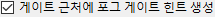

# Elden Ring Randomizer Hints  
  
## 기본 옵션 탭  
  
프로그램을 시작하면 기본 옵션 화면이 표시됩니다.  
  
  
프로그램 언어를 전환하고 싶다면  메뉴에서 선택하세요. 언어를 변경하려면 프로그램을 다시 시작해야 합니다.  
이렇게 하면 인터페이스 언어가 변경되지만 힌트는 사용 가능한 모든 언어에 대해 계속 생성됩니다.  
  
가장 먼저 해야 할 일은 상단 섹션에서 실행 파일을 선택하는 것입니다. 에 대한 유효한 실행 파일이 필요합니다 [Elden Ring](https://store.steampowered.com/app/1245620/ELDEN_RING/), [DSMSPortable](https://github.com/mountlover/DSMSPortable), [Yabber](https://github.com/JKAnderson/Yabber) 또는 WitchyBND[(Nexus Mods)](https://www.nexusmods.com/eldenring/mods/3862)[(Github)](https://github.com/ividyon/WitchyBND) 및 [Elden Ring Item and Enemy Randomizer](https://www.nexusmods.com/eldenring/mods/428) 또는 [Elden Ring Fog Gate Randomizer](https://www.nexusmods.com/eldenring/mods/3295) 중 하나 또는 둘 다.  
  
  
  
  
실행 파일을 선택한 후  창에서 활동을 볼 수 있습니다.  
  
이는 랜더마이저에서 데이터를 읽고 생성된 규제 데이터를 내보내는 프로그램입니다. 이는 실행 파일이 유효하고 변경되거나 활성화된 무작위 옵션이 변경될 때마다 발생합니다.  
  
말하자면, 왼쪽에는 각 랜더마이저를 활성화하거나 비활성화하는 두 가지 옵션이 있습니다.  
  
  
힌트를 생성하려면 이들 중 하나 이상이 활성화되어야 하며 해당 실행 경로가 유효해야 합니다.  
  
각 옵션 아래에는 플레이를 맞춤화하는 데 사용할 수 있는 더 많은 옵션이 있습니다.  
  
### 힌트 옵션  
  
  
  
#### Item and Enemy Randomizer 옵션  
  
: 기본적으로 Randomizer Hints은 Randomizer 스포일러 파일의 무작위 시드를 사용하지만 각각에 대해 고유한 사용자 정의 시드를 설정할 수 있는 옵션이 있습니다.  
: NPC 퀘스트에 중요한 항목에 대한 힌트를 생성하려면 이 옵션을 활성화합니다. 힌트를 얻는 방법은 NPC와 퀘스트 단계에 따라 다릅니다.  
: 이 옵션은 항목이 선택한 카테고리에 속할 때 항목 위치에 힌트를 표시합니다. 힌트는 동일한 카테고리 내 항목의 다른 위치로 안내합니다.  
: 카테고리 힌트가 동일하거나 인접한 지역의 항목을 가리킬 가능성을 높이려면 이 옵션을 선택하세요. Fog Gate Randomizer를 사용하는 경우 이 옵션은 아무 작업도 수행하지 않습니다.  
: 이 옵션은 선택한 카테고리의 무작위 항목에 대한 힌트를 전 세계의 상자에 배치합니다. 힌트를 받을 상자의 비율을 선택할 수 있습니다.  
: 이 옵션은 선택한 카테고리의 무작위 아이템에 대한 힌트를 전 세계의 보스 드롭에 배치합니다. 힌트를 받을 보스의 비율을 선택할 수 있습니다.  
: 게이트, 리프트 및 기타 장벽을 통과하는 데 필요한 주요 항목에 대한 힌트를 해당 게이트 근처의 항목 위치에 배치하려면 이 옵션을 선택합니다. 객실 열쇠은 예외이며, 타니스에서  옵션을 사용하여 힌트를 제공할 수 있습니다.  
: 일반적으로 거리 및 나침반 방향 추정치를 제공하는 방향 힌트는 넓은 영역의 항목에만 나타납니다. 더 작은 이름의 영역에 있는 항목에 대한 힌트는 항목이 해당 영역에 있다는 것만 표시합니다. 거리와 나침반 방향을 항상 제공하려면 이 옵션을 활성화합니다. 권장되지 않습니다.  
  
#### Fog Gate Randomizer 옵션  
  
: 기본적으로 Randomizer Hints은 랜더마이저 스포일러 파일의 무작위 시드를 사용하지만 각각에 대해 사용자 정의 시드를 설정할 수 있는 옵션이 있습니다.  
: 해당 게이트 근처의 아이템 위치에 게이트 힌트를 배치하려면 이 옵션을 선택하세요.  
: 이 옵션은 전 세계의 상자에 무작위 포그 게이트에 대한 힌트를 배치합니다. 힌트를 받을 상자의 비율을 선택할 수 있습니다.  
: 이 옵션은 전 세계의 보스 드롭에 무작위 포그 게이트에 대한 힌트를 배치합니다. 힌트를 받을 보스의 비율을 선택할 수 있습니다.  
  
마지막으로 어느 랜더마이저에도 종속되지 않지만 시작 아이템 탭의 설정과 함께 사용되는 두 가지 옵션이 있습니다.  
  
: 이 옵션은 게임 시작 시 손가락 무녀 시체에 아이템과 힌트를 배치하는 데 사용됩니다.  
: 쌍둥이 노파 상점에 대해 편집된 초기 상점 인벤토리를 사용하려면 이 옵션을 활성화합니다.  
  
파일 경로를 확인하고 원하는 옵션을 설정한 후  버튼을 클릭하여 원하는 대로 게임 내 힌트를 생성할 수 있습니다. 힌트 생성 프로세스는 약간의 시간이 걸리며  창에 진행 상황이 표시됩니다. 힌트를 생성한 후 모드를 사용하려면 Mod Engine 2를 구성해야 합니다.  
  
하지만 그렇게 하기 전에 다른 탭을 살펴보는 것이 좋습니다.  
  
## 놓칠 수 없는 품목 탭  
  
  
이 탭은 매우 간단합니다. 무작위 항목 목록이 왼쪽 창에 표시됩니다. 놓치기 쉽거나 구하기 힘든 아이템들입니다. 목록에서 항목을 선택하면 해당 위치에 대한 스포일러와 해당 항목을 놓칠 수 있는 방법이 오른쪽 창에 표시됩니다. 여기에 플레이에 중요한 항목이 있는 경우 해당 항목을 놓칠 가능성이 있는지 확인할 수 있으며, 이 경우 돌아가서 Item and Enemy Randomizer을 다시 실행하여 더 나은 결과를 얻을 수 있습니다.  
  
왼쪽 창 위에 필터 상자가 표시됩니다. 이 상자에 텍스트를 입력하면 해당 텍스트와 일치하는 표시 항목이 필터링됩니다. 이 필터는 다른 탭의 유사한 창에 표시되며 모든 필터는 동일한 방식으로 작동합니다.  
  
## 시작 아이템 탭  
  
  
이 탭에서는 게임 시작 시 손가락 무녀의 시체에 배치될 아이템과 힌트를 설정하고, 쌍둥이 노파 초기 상점 인벤토리를 편집할 수 있습니다.  
  
### 손가락 무녀 항목  
  
탭의 왼쪽에는 손가락 무녀 항목 선택기가 있습니다.  
  
왼쪽의 큰 창은 시체에 놓을 아이템과 힌트의 목록이고, 오른쪽의 작은 세 개의 창은 모든 아이템, 모든 아이템 힌트, 모든 힌트 카테고리의 목록입니다.  
  
왼쪽 창에 항목, 항목 힌트 또는 범주 힌트를 추가하려면 오른쪽 창 중 하나에서 항목을 선택하고  버튼을 클릭하세요. 반대로 왼쪽 창에서 항목을 선택한 다음  버튼을 클릭하여 제거할 수 있습니다. 다중 선택이 허용됩니다.  
  
배치할 아이템 및 힌트의 수량은 변경될 수 있습니다. 왼쪽 창에서 선택한 다음  버튼을 클릭하여 배치할 수량을 설정하세요.  
  
개별 항목 힌트의 "남은 것만 해당" 속성은 왼쪽 창에서 항목 힌트를 선택하고  버튼을 클릭하여 설정할 수도 있습니다. 이 속성이 있는 힌트는 적의 아이템 드롭만 가리킵니다. 예를 들어, 여기 이미지에는 궁수 빌드를 설정하고 있으므로 가는 짐승 뼈 및 날개깃에 대한 "남은 것만 해당" 힌트가 있습니다. 이는 내가 제작하는 데 필요한 리소스를 떨어뜨릴 적에게 힌트를 줄 것입니다 뼈 화살.  
  
마지막으로 하단에는 시체 위치에 남은 공간이 얼마나 되는지 알려주는 카운터가 표시됩니다.  
  
개체 수는 8개뿐이지만 수량이 있는 항목은 여전히 개체 공간 1개만 차지하며, 항목 힌트 개체는 최대 4개의 힌트를 담을 수 있으므로 힌트가 함께 포장됩니다. 위의 예에서는 개체 공간 1개를 차지하는 수량 50개의 항목 1개, 항목 힌트 2개, 수량 2개의 범주 힌트, 추가 범주 힌트 2개로 총 6개의 힌트가 됩니다. 이 힌트는 2개의 힌트 개체로 압축됩니다. 하나는 최대 4개의 힌트가 있고 다른 하나는 힌트가 2개만 포함되어 다른 개체 공간을 사용하기 전에 2개를 더 위한 공간을 남겨 둡니다. 따라서 전체적으로 3개의 개체 공간만 사용됩니다.  
  
 옵션이 활성화되고 가 활성화되지 않은 경우 힌트는 림그레이브 및 주변 영역(사용 가능한 경우)의 항목을 가리키려고 시도합니다.  
  
### 쌍둥이 노파 쇼핑하기  
  
탭의 오른쪽에는 쌍둥이 노파 Shop 편집기가 있습니다.  
  
왼쪽 창에는 상점 인벤토리가 표시되고 오른쪽 창에는 게임의 모든 항목이 표시됩니다. 상점 인벤토리에서 아이템을 선택하면 해당 슬롯이 아래에 나타납니다. 슬롯을 선택한 후, 아이템 창에서 교체 아이템을 선택한 후,  버튼을 클릭하면 상점 인벤토리 아이템이 새로운 아이템으로 교체됩니다. 위 이미지에서는 상점 인벤토리의 슬롯 14를 화살로 교체하고 가격을 룬 5개로 설정했습니다.  
  
슬롯을 선택한 상태에서  버튼을 클릭하면 상점 인벤토리 아이템의 가격을 설정할 수 있습니다.  
  
 버튼을 클릭하여 변경 사항을 지우고 기본 상점 인벤토리를 다시 로드할 수도 있습니다.  
  
### 시작 아이템에 관한 중요 참고 사항

게임이 이벤트를 처리하는 방식으로 인해 일부 아이템의 효과가 작동하려면 게임 세계의 해당 위치에서 획득해야 합니다. 여기에는 레시피북, 그림, 다양한 퀘스트 아이템 제작이 포함됩니다. 시작이나 상점에 이러한 아이템 중 하나의 복사본을 놓으면 게임 세계의 해당 위치에서 원래 아이템을 얻을 때까지 작동하지 않습니다. 이러한 항목의 경우 시작 부분에 힌트를 배치하는 것이 좋습니다.  
  
## 카테고리 선택 탭  
  
  
이 탭에서는 카테고리 힌트, 상자 힌트, 보스 드롭 힌트에 사용할 카테고리를 선택할 수 있습니다. 각 항목에는 한 쌍의 창이 있으며 왼쪽 창에는 선택한 범주가 표시되고 오른쪽 창에는 사용 가능한 모든 범주가 표시됩니다. 오른쪽 창에서 카테고리를 선택하고 를 클릭하면 왼쪽 창에 항목이 추가되고, 왼쪽 창에서 항목을 선택하고 를 클릭하면 왼쪽 창에서 해당 항목이 제거됩니다. 다중 선택이 허용됩니다.  
  
 버튼을 클릭하여 기본 범주 선택 세트를 다시 로드할 수 있습니다. 일부 기본 카테고리를 삭제하거나 이름을 바꾸거나 카테고리 편집 탭에 새 카테고리를 추가한 경우 선택 항목에 표시되지 않습니다.  
  
## 카테고리 편집 탭  
  
  
이 마지막 탭에서는 항목 카테고리를 편집 및 삭제하고 나만의 카테고리를 만들 수 있습니다. 왼쪽 창에는 모든 카테고리가 표시되고, 가운데 창에는 선택한 카테고리 내의 항목이 표시되며, 오른쪽 창에는 게임의 모든 항목이 표시됩니다.  
  
 버튼을 클릭하면 왼쪽 창에 새 카테고리가 생성됩니다. 왼쪽 창에서 카테고리를 선택하고 을 클릭하여 새 복사본을 만들거나, 를 클릭하여 이름을 바꾸거나, 을 클릭하여 삭제할 수도 있습니다.  
  
왼쪽 창에서 카테고리를 선택하면 해당 카테고리 내의 항목이 가운데 창에 표시됩니다. 오른쪽 창에서 항목을 선택하고 를 클릭하여 카테고리에 항목을 추가할 수 있습니다. 가운데 창에서 항목을 선택하고 를 클릭하면 항목을 범주에서 제거할 수 있습니다. 다중 선택이 허용됩니다.  
  
손가락 무녀 항목과 마찬가지로 범주 내 항목 힌트의 "남은 것만 해당" 속성은 가운데 창에서 항목 힌트를 선택하고  버튼을 클릭하여 설정할 수도 있습니다. 이 속성이 있는 힌트는 적의 아이템 드롭만 가리킵니다.  
  
 버튼을 클릭하면 기본 카테고리 세트를 다시 로드할 수 있습니다. 이렇게 하면 귀하가 생성한 모든 변경 사항이나 새 카테고리가 완전히 삭제됩니다.  
  
## 설정 저장 및 로드  
  
기본 옵션 탭 하단에는 설정 저장, 로드, 가져오기 및 내보내기에 사용할 수 있는 버튼이 있습니다.  
  
로드/저장과 가져오기/내보내기의 차이점은 버튼이 적용되는 설정입니다. 로드/저장은 프로그램 전체의 모든 옵션에 적용됩니다. 가져오기/내보내기는 실행 파일 경로와 쌍둥이 노파 상점을 *제외* 모든 옵션에 적용됩니다.  
  
로드/저장 옵션 파일의 확장자는 ".rhs"이며 개인 설정 구성 및 백업으로 사용할 수 있습니다.  
  
가져오기/내보내기 옵션 파일의 확장자는 ".rhe"이며 이식성이 향상되어 플레이어가 자신의 실행 경로를 다른 사람의 실행 경로를 덮어쓰는 문제 없이 설정 구성을 교환할 수 있습니다.  
  
쌍둥이 노파 상점은 내보내기 설정에 포함되지 않습니다. 상점 인벤토리는 플레이어마다 달라지는 무작위 출력에 따라 달라지기 때문입니다. 이는 자신의 다른 무작위 시드에도 적용되지만 상점 인벤토리는 계속 저장되므로 알려진 시드와 함께 설정 파일을 유지할 수 있습니다.  
  
기본적으로 이러한 모든 설정 파일은 프로그램 폴더의 "settings" 폴더에 저장됩니다.  

### 제공 설정

"settings" 폴더에는 가져오고 시험해 볼 수 있는 몇 가지 다른 .rhe 파일이 있습니다.

Sorcerer.rhe: 마법 빌드용입니다. 처음에 카리아의 속검와 휘석 돌팔매을 모두 갖는 것이 너무 많다고 생각되면 둘 중 하나 또는 둘 다를 제거하고 대신 힌트를 추가할 수 있습니다.

Archer.rhe: 활과 단검을 사용하는 은밀한 궁수 빌드입니다. 저렴한 가격으로 상점에 화살를 추가하는 것이 좋습니다.

Priest.rhe: 주문에 의존하는 신앙 구축을 위해.

Bonk.rhe: 망치 제작용. 일을 세게 치십시오.

## Mod Engine 2 구성  
  
힌트를 생성한 후 Randomizer Hints을 모드로 포함하도록 Mod Engine 2를 구성해야 합니다. 프로그램은 다음과 같은 "config_randomizerhints.toml" 파일을 생성합니다.  
  
	# Generated by Elden Ring Randomizer Hints  
	  
	[modengine]  
	debug = false  
	external_dlls = []  
	[extension.mod_loader]  
	enabled = true  
	loose_params = false  
	mods = [  
	    { enabled = true, name = "randomizerhints", path = "C:\\Games\\Utilities\\randomizerHints" },  
	    { enabled = true, name = "fog", path = "C:\\Games\\Utilities\\fog\\" },  
	    { enabled = true, name = "randomizer", path = "C:\\Games\\Utilities\\randomizer\\" },  
	]  
	[extension.scylla_hide]  
	enabled = false  
  
표시되는 모드 경로와 이 파일을 사용하는 방법은 설정에 따라 다릅니다.  
  
Item and Enemy Randomizer 또는 Fog Gate Randomizer에 내장된 Mod Engine 2 기능을 사용하려는 경우 이 toml 파일을 Randomizer 폴더에 복사하고 이름을 바꿔서 toml 파일을 바꿔야 합니다. 이미 거기에 있거나 Randomizer의 toml 파일을 편집하여 위의 "randomizerhints" mod 행을 추가하세요.  
  
Mod Engine 2 수동 설치를 사용하는 경우 Mod Engine 2 폴더의 "config_eldenring.toml" 파일을 바꾸거나 편집하여 위의 "randomizerhints" mod 줄을 추가하세요.  
  
다른 모드와의 병합은 이 지침의 범위를 벗어나지만 toml 파일에서 "randomizerhints"은 "fog" 앞에 와야 하며 "randomizer" 앞에 와야 합니다. 이 줄 앞에 regulation.bin 파일이 있는 모드는 무작위 데이터를 무시하고 작동하지 않게 만듭니다. 자세한 내용은 [Mod Engine 2](https://github.com/soulsmods/ModEngine2#get-started-guide) 설명서를 확인하세요.  
  
Randomizer Hints의 영향을 받는 특정 매개변수 및 파일은 다음과 같습니다.  
  
#### 매개변수:  
  
> ItemLotParam_map: ID 10010000(손가락 무녀 시체) 다음에 항목을 추가하고 전 세계의 다양한 항목 로트에 항목을 추가합니다.  
>EquipParamGoods: ID 300000 이상의 항목을 추가합니다.  
>ShopLineupParam: 다양한 NPC 상점에 항목을 추가하고 쌍둥이 노파 상점의 항목을 변경합니다.  
  
#### 파일:  
  
> item.msgbnd.dcx (모든 언어)  
  
## 힌트 개체  
  
아이템 힌트 개체는 최대 4개의 힌트를 포함할 수 있으며 포그 게이트 힌트 개체는 최대 3개의 힌트를 포함할 수 있습니다. 이는 인벤토리의 정보 카테고리에 표시됩니다. 정리된 상태를 유지하기 위해 포그 게이트 힌트 개체가 상단 그룹에 나타나고, 다음 그룹에 항목 힌트 개체가 나타나고, 그 아래에는 일반 게임 정보 항목 그룹이 나타납니다.  
  
기본 설정을 사용하면 Randomizer Hints은 *많은* 힌트 개체를 생성하므로 정보 항목 인벤토리가 매우 커질 수 있습니다. 이러한 이유로 이 프로그램은 또한 정보 항목을 인벤토리 상자에 넣거나 완전히 버릴 수 있도록 게임을 수정합니다. 그림과 장원 요청도 폐기할 수 있으므로 주의하세요.  
  
## 사용 가능한 언어  
  
Elden Ring Randomizer Hints에는 영어 외에 Elden Ring에서 지원되는 언어에 대한 (잘못) 지역화된 데이터가 있으며 모든 언어에서 힌트를 생성할 수 있습니다. *그러나* 이는 랜더마이저가 제공하는 수정된 게임 파일에 따라 다릅니다. Item and Enemy Randomizer에는 모든 언어용 파일이 있지만 Fog Gate Randomizer에는 영어용 파일만 있습니다. 두 랜더마이저를 모두 사용하는 경우에는 여전히 잘 작동하지만 Fog Gate Randomizer만 *만* 사용하는 경우 프로그램은 영어 파일만 가져오고 영어 힌트만 생성합니다.  
  
이 문제를 해결하려면 Nordgaren's UXM Selective Unpacker[(Nexus)](https://www.nexusmods.com/eldenring/mods/1651)[(Github)](https://github.com/Nordgaren/UXM-Selective-Unpack)를 사용하여 필요한 게임 파일을 직접 추출할 수 있습니다.  
  
  
먼저 Elden Ring 설치 경로가 올바른지 확인한 다음  버튼을 클릭하세요.  
  
여기서 선택해야 할 것은 "msg" 폴더뿐입니다. 확인을 클릭한 다음  확인란을 선택한 다음  버튼을 클릭하세요. 잠시 후 압축 풀기가 완료되고 Elden Ring 게임 폴더 내에서 압축이 풀린 "msg" 폴더를 찾을 수 있습니다. 이 폴더를 Randomizer Hints 폴더의 "locale" 폴더 안으로 이동하면 프로그램은 Fog Gate Randomizer만 사용하는 경우에도 지역화된 파일을 모두 찾을 수 있습니다.  
  
## 전략 및 스포일러  
  
캐릭터 빌드에 원하는 다양한 아이템이 있는 경우 해당 아이템으로 카테고리를 생성하고 일반 카테고리에서 활성화하세요. 그러면 일련의 힌트를 따라가며 힌트를 모두 얻을 수 있습니다. 시작하려면 손가락 무녀 항목의 카테고리에 힌트를 추가하세요.  
  
특정 항목을 찾고 있는데 같은 카테고리에 있는 원하지 않는 항목에 대한 힌트를 얻은 경우 이를 무시하지 마십시오. 해당 항목을 얻으면 해당 카테고리의 다른 항목에 대한 힌트도 제공되며, 그 중 하나가 귀하가 찾고 있는 항목일 수 있습니다.  
  
가능한 한 많은 NPC 퀘스트를 수행하려면 근처 지역을 검색하지 않고 무작위 게이트를 통과하여 어디로 가는지 힌트를 얻지 마십시오. 통곡 사구 또는 알터 고원에 일찍 참여하게 되면 알렉산더 및 블라이드의 퀘스트에서 초기 항목을 놓칠 수 있습니다.  
  
Fog Gate Randomizer를 사용하는 경우 예배당 옆문이 닫혀 있는 상태로 시작됩니다. 하지만 어디든 가기 전에 귀환의 종 을 사용하면 열립니다! 를 활성화한 경우 포그 게이트가 어디로 가는지에 대한 힌트가 내부 전리품에 표시됩니다.  
  
힌트를 찾고 있다면 아이템의 외형이 단서가 될 수 있습니다. 힌트 개체는 일반 흰색 항목 위치에서는 찾을 수 없고 보라색이나 금색 항목 위치에서만 찾을 수 있습니다.  
  
얻는 힌트 개체의 양이 감당하기 힘들고 짜증나는 경우, 계속해서 범주와 설정을 조정하여 얻는 양을 줄이세요. 나는 많은 힌트를 얻은 다음 모든 퀘스트를 완료하고 빌드를 최대한 효율적으로 완료하기 위한 최선의 경로를 찾는 것을 좋아하지만 모든 사람의 플레이 스타일은 다릅니다. 덜 복잡하지만 여전히 목표 지향적인 경험을 제공하는 자신만의 설정을 생각해 낼 수 있습니다.  
  
힌트를 생성하는 데 사용할 수 있는 카테고리/아이템의 수를 크게 줄이면 너무 많은 중복 힌트를 얻지 않도록 나타날 수 있는 상자 및 보스 드롭의 비율을 줄이는 것이 좋습니다.  

