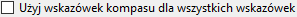

# Elden Ring Randomizer Hints  
  
## Karta Opcje główne  
  
Po uruchomieniu programu zobaczysz główny ekran opcji:  
  
  
Jeśli chcesz zmienić język programu, możesz go wybrać z menu . Zmiana języka wymaga ponownego uruchomienia programu.  
Pamiętaj, że spowoduje to zmianę języka interfejsu, ale wskazówki będą nadal generowane dla wszystkich dostępnych języków.  
  
Pierwszą rzeczą, którą musisz zrobić, to wybrać pliki wykonywalne w górnej sekcji. Będziesz potrzebować prawidłowych plików wykonywalnych dla [Elden Ring](https://store.steampowered.com/app/1245620/ELDEN_RING/), [DSMSPortable](https://github.com/mountlover/DSMSPortable), [Yabber](https://github.com/JKAnderson/Yabber) lub WitchyBND[(Nexus Mods)](https://www.nexusmods.com/eldenring/mods/3862)[(Github)](https://github.com/ividyon/WitchyBND) i jeden lub oba [Elden Ring Item and Enemy Randomizer](https://www.nexusmods.com/eldenring/mods/428) lub [Elden Ring Fog Gate Randomizer](https://www.nexusmods.com/eldenring/mods/3295).  
  
  
  
  
Po wybraniu plików wykonywalnych możesz zobaczyć aktywność w okienku :  
  
Jest to program wczytujący dane z randomizatorów i eksportujący wygenerowane przez siebie dane regulacyjne. Dzieje się tak za każdym razem, gdy pliki wykonywalne są prawidłowe i ulegają zmianie lub zmieniają się włączone opcje randomizera.  
  
A skoro już o tym mowa, po lewej stronie znajdują się dwie opcje umożliwiające włączenie lub wyłączenie każdego randomizera:  
  
  
Aby wygenerować wskazówki, co najmniej jedna z nich musi być włączona, a ścieżka wykonywalna dla niej musi być prawidłowa.  
  
Pod każdą z tych opcji znajduje się więcej opcji, których możesz użyć, aby dostosować swoją rozgrywkę.  
  
### Opcje podpowiedzi  
  
  
  
#### Item and Enemy Randomizer Opcje  
  
: Domyślnie Randomizer Hints użyje losowych nasion z plików spoilerów randomizera, ale masz możliwość ustawienia własnych, niestandardowych nasion dla każdego z nich.  
: Włącz tę opcję, aby utworzyć wskazówki dotyczące przedmiotów ważnych dla zadań NPC. Sposób zdobycia wskazówek będzie zależał od NPC i etapu zadania.  
: Ta opcja umieści wskazówki w lokalizacjach przedmiotów, jeśli umieszczone tam przedmioty będą należeć do wybranych kategorii. Podpowiedzi pokierują Cię do innych lokalizacji przedmiotów w tych samych kategoriach.  
: Wybierz tę opcję, aby zwiększyć prawdopodobieństwo, że wskazówki dotyczące kategorii będą wskazywały elementy w tym samym lub sąsiadujących regionach. Zauważ, że ta opcja nie robi nic, jeśli użyto Fog Gate Randomizer.  
: Ta opcja umieści wskazówki do losowych przedmiotów z wybranych kategorii w skrzyniach na całym świecie. Możesz wybrać procent skrzyń, które będą otrzymywać wskazówki.  
: Ta opcja umieści wskazówki do losowych przedmiotów z wybranych kategorii u bossów na całym świecie. Możesz wybrać procent bossów, którzy będą otrzymywać wskazówki.  
: Wybierz tę opcję, aby umieścić wskazówki dotyczące kluczowych przedmiotów potrzebnych do przejścia przez bramy, windy i inne bariery do lokalizacji przedmiotów w pobliżu tych bram. Wyjątkiem jest Klucz do pracowni, dla którego wskazówkę można podać za pomocą Tanith z opcją .  
: Zwykle wskazówki kierunkowe, które podają szacunkową odległość i kierunek kompasu, pojawiają się tylko w przypadku obiektów znajdujących się na dużych obszarach. Wskazówki dotyczące przedmiotów znajdujących się w mniejszych, nazwanych obszarach pokażą jedynie, że elementy znajdują się w tych obszarach. Włącz tę opcję, aby zawsze podawać odległość i kierunek kompasu. Niepolecane.  
  
#### Fog Gate Randomizer Opcje  
  
: Domyślnie Randomizer Hints użyje losowych nasion z plików spoilerów randomizera, ale masz możliwość ustawienia własnych, niestandardowych nasion dla każdego z nich.  
: Wybierz tę opcję, aby umieścić wskazówki dotyczące bram w lokalizacjach przedmiotów w pobliżu tych bram.  
: Ta opcja umieści wskazówki dotyczące losowych bram mgłowych w skrzyniach na całym świecie. Możesz wybrać procent skrzyń, które będą otrzymywać wskazówki.  
: Ta opcja umieści wskazówki dotyczące losowych bram mgłowych w miejscach zrzutów bossów na całym świecie. Możesz wybrać procent bossów, którzy będą otrzymywać wskazówki.  
  
Wreszcie istnieją dwie opcje, które nie są zależne od żadnego randomizera, ale są używane wraz z ustawieniami w zakładce Przedmioty początkowe:  
  
: Ta opcja służy do umieszczania przedmiotów i wskazówek na zwłokach Służka palców na początku gry.  
: Włącz tę opcję, aby użyć edytowanego początkowego asortymentu sklepu dla sklepu Cienie bliźniaczej służki.  
  
Po sprawdzeniu ścieżek plików i ustawieniu żądanych opcji możesz kliknąć przycisk , aby utworzyć podpowiedzi w grze zgodnie ze swoimi preferencjami. Proces generowania podpowiedzi zajmuje trochę czasu, a panel  wyświetli postęp. Po wygenerowaniu wskazówek będziesz musiał skonfigurować Mod Engine 2, aby móc korzystać z moda.  
  
Ale zanim to zrobisz, możesz zajrzeć do innych kart.  
  
## Przedmioty, które można pominąć zakładka  
  
  
Ta zakładka jest dość prosta. Lista losowych elementów jest wyświetlana w lewym panelu. Są to przedmioty, które bardzo łatwo przeoczyć lub które są niemożliwe do zdobycia. Wybranie elementu z listy spowoduje wyświetlenie spoilerów na temat jego lokalizacji i możliwości pominięcia go w prawym panelu. Jeśli są tutaj elementy ważne dla Twojej gry, możesz sprawdzić, czy jest prawdopodobne, że je pominiesz, w takim przypadku możesz wrócić i ponownie uruchomić Item and Enemy Randomizer, aby uzyskać lepszy wynik.  
  
Nad lewym panelem bocznym zobaczysz pole filtra. Wpisanie tekstu w tym polu spowoduje odfiltrowanie wyświetlanych elementów pasujących do tekstu. Filtr ten pojawia się w podobnych panelach na innych kartach i wszystkie te filtry działają w ten sam sposób.  
  
## Przedmioty początkowe zakładka  
  
  
W tej zakładce możesz ustawić przedmioty i wskazówki, które mają zostać umieszczone przy zwłokach Służka palców na początku gry oraz edytować początkowy ekwipunek sklepu Cienie bliźniaczej służki.  
  
### Służka palców Przedmioty  
  
W lewej połowie zakładki znajduje się selektor elementów Służka palców:  
  
Duży panel po lewej stronie to lista przedmiotów i wskazówek, które należy umieścić na zwłokach, a trzy mniejsze panele po prawej stronie to lista wszystkich przedmiotów, wszystkie wskazówki do przedmiotów i wszystkie kategorie podpowiedzi.  
  
Aby dodać elementy, wskazówki dotyczące przedmiotów lub wskazówki do kategorii do lewego panelu, wybierz je w jednym z prawych paneli i kliknij przycisk . I odwrotnie, możesz wybrać elementy w lewym panelu, a następnie kliknąć przycisk , aby je usunąć. Dopuszczalnych jest wielokrotny wybór.  
  
Ilość przedmiotów i podpowiedzi do umieszczenia można zmienić. Wybierz je w lewym panelu, a następnie kliknij przycisk , aby ustawić ilość, która ma zostać umieszczona.  
  
Właściwość „tylko pozostałości” podpowiedzi do poszczególnych pozycji można także ustawić, wybierając wskazówki do pozycji w lewym panelu i klikając przycisk . Wskazówki posiadające tę właściwość będą wskazywały jedynie na upuszczenie przedmiotu przez wroga. Na przykład na obrazkach tutaj konfiguruję kompilację łucznika, więc mam „tylko pozostałości” wskazówki dla Cienkie kości bestii i Lotka, które dadzą mi wskazówki dla wrogów, którzy upuszczą zasoby potrzebne do wytworzenia Kościana strzała.  
  
Wreszcie na dole widać licznik, który informuje, ile miejsca pozostało w lokalizacji zwłok.  
  
Jest miejsce tylko na 8 obiektów, ale przedmioty z określoną ilością nadal zajmują tylko 1 miejsce na obiekt, a ponieważ obiekty podpowiedzi do przedmiotów mogą pomieścić do 4 podpowiedzi, wskazówki zostaną spakowane razem. W powyższym przykładzie mam 1 przedmiot w ilości 50, który zajmuje 1 miejsce na obiekt, następnie 2 wskazówki dotyczące przedmiotów, wskazówkę dotyczącą kategorii w ilości 2 i jeszcze 2 kolejne wskazówki dotyczące różnych kategorii, co daje w sumie 6 wskazówek. Te wskazówki zostaną spakowane w 2 obiekty podpowiedzi, jeden z maksymalnie 4 wskazówkami, a drugi tylko z 2 wskazówkami, pozostawiając miejsce na 2 kolejne, zanim użyjesz innego pola obiektów. Zatem w sumie używane są tylko 3 przestrzenie obiektów.  
  
Jeśli opcja  jest włączona, a  nie jest, wskazówki będą próbowały wskazać elementy w Pogrobno i okolicach, jeśli są dostępne.  
  
### Cienie bliźniaczej służki Sklep  
  
W prawej połowie zakładki znajduje się edytor sklepu Cienie bliźniaczej służki:  
  
Lewy panel boczny wyświetla wyposażenie sklepu, a prawy panel boczny pokazuje wszystkie przedmioty w grze. Wybranie przedmiotu w ekwipunku sklepu spowoduje wyświetlenie jego miejsca poniżej. Po wybraniu miejsca możesz wybrać przedmiot zamienny w panelu przedmiotów, a następnie kliknąć przycisk , aby zastąpić przedmiot z wyposażenia sklepu nowym przedmiotem. Na powyższym obrazku zastąpiłem miejsce 14 w ekwipunku sklepu na Strzała i ustawiłem jego cenę na 5 run.  
  
Po wybraniu miejsca możesz kliknąć przycisk , aby ustawić cenę przedmiotu z magazynu sklepu.  
  
Możesz także kliknąć przycisk , aby usunąć zmiany i ponownie załadować domyślny asortyment sklepu.  
  
### Ważna uwaga dotycząca przedmiotów początkowych

Ze względu na sposób, w jaki gra obsługuje wydarzenia, niektóre przedmioty muszą zostać zdobyte z ich lokalizacji w świecie gry, aby ich efekty zadziałały. Obejmuje to tworzenie książek kucharskich, obrazów i różnych przedmiotów związanych z zadaniami. Jeśli umieścisz kopię jednego z tych przedmiotów na początku lub w sklepie, nie będzie on działać, dopóki nie zdobędziesz oryginalnego przedmiotu z jego lokalizacji w świecie gry. W przypadku tych przedmiotów lepiej jest umieścić podpowiedź na początku.  
  
## Wybór kategorii zakładka  
  
  
Ta zakładka pozwala wybrać, które kategorie będą używane dla wskazówek dotyczących kategorii, wskazówek dotyczących skrzyń i wskazówek dotyczących upuszczenia bossa. Dla każdego z nich dostępna jest para okienek, przy czym lewy panel wyświetla wybrane kategorie, a prawy panel wyświetla wszystkie dostępne kategorie. Wybranie kategorii w prawym panelu i kliknięcie  spowoduje dodanie ich do lewego panelu, a wybranie elementów w lewym panelu i kliknięcie  spowoduje usunięcie ich z lewego panelu. Dopuszczalnych jest wielokrotny wybór.  
  
Możesz ponownie załadować domyślny zestaw kategorii, klikając przycisk . Pamiętaj, że jeśli usunąłeś lub zmieniłeś nazwę niektórych domyślnych kategorii lub dodałeś nowe kategorie w zakładce Edytuj kategorie, nie pojawią się one w selekcjach.  
  
## Edytuj kategorie zakładka  
  
  
Na tej ostatniej karcie możesz edytować i usuwać kategorie przedmiotów oraz tworzyć własne. Panel po lewej stronie wyświetla wszystkie kategorie, panel środkowy wyświetla elementy z wybranej kategorii, a panel po prawej stronie wyświetla wszystkie elementy gry.  
  
Kliknij przycisk , aby utworzyć nową kategorię w lewym panelu. Możesz także wybrać kategorię w lewym panelu i kliknąć , aby utworzyć jej nową kopię, , aby zmienić jej nazwę, lub , aby ją usunąć.  
  
Po wybraniu kategorii w lewym panelu, elementy należące do tej kategorii zostaną wyświetlone w środkowym panelu. Możesz dodać elementy do kategorii, wybierając elementy w prawym panelu i klikając . Elementy można usunąć z kategorii, wybierając je w środkowym panelu i klikając . Dopuszczalnych jest wielokrotny wybór.  
  
Podobnie jak w przypadku elementów Służka palców, właściwość „tylko pozostałości” wskazówek dotyczących elementów w ramach kategorii można również ustawić, zaznaczając je w środkowym panelu i klikając przycisk . Wskazówki posiadające tę właściwość będą wskazywały jedynie na upuszczenie przedmiotu przez wroga.  
  
Możesz ponownie załadować domyślny zestaw kategorii, klikając przycisk . Pamiętaj, że spowoduje to całkowite usunięcie wszelkich zmian lub nowych kategorii, które utworzyłeś.  
  
## Zapisz i załaduj ustawienia  
  
Na dole karty Opcje główne znajdują się przyciski umożliwiające zapisywanie, ładowanie, importowanie i eksportowanie ustawień:  
  
Różnica między ładowaniem/zapisywaniem a importem/eksportem polega na tym, do jakich ustawień odnoszą się przyciski. Załaduj/Zapisz dotyczy wszystkich opcji w całym programie. Import/Eksport dotyczy wszystkich opcji *z wyjątkiem* ścieżek wykonywalnych i sklepu Cienie bliźniaczej służki.  
  
Pliki opcji ładowania/zapisywania mają rozszerzenie „.rhs” i mogą być używane jako konfiguracje ustawień osobistych i kopie zapasowe.  
  
Pliki opcji importu/eksportu mają rozszerzenie „.rhe” i mają być bardziej przenośne, aby gracze mogli wymieniać konfiguracje ustawień bez problemu z nadpisywaniem swoich ścieżek wykonywalnych ścieżkami wykonywalnymi innej osoby.  
  
Sklep Cienie bliźniaczej służki nie jest uwzględniony w wyeksportowanych ustawieniach, ponieważ wyposażenie sklepu zależy od wyników losowania, które będą się różnić w zależności od gracza. Chociaż dotyczy to również twoich własnych losowych nasion, wyposażenie sklepu jest nadal zapisane, więc możesz zachować plik ustawień pasujący do znanych nasion.  
  
Domyślnie wszystkie te pliki ustawień są zapisywane w folderze „settings” w folderze programu.  

### Dostarczone ustawienia

W folderze „settings” znajduje się kilka różnych plików .rhe, które możesz zaimportować i wypróbować.

Sorcerer.rhe: Dla wersji magicznej. Jeśli uważasz, że posiadanie na początku zarówno Karyjski siekacz, jak i Błyskamienny pocisk, to za dużo, możesz usunąć jedno lub oba i zamiast tego dodać do nich podpowiedzi.

Archer.rhe: Dla skrytego łucznika, który używa łuków i sztyletów. Polecam również dodanie Strzała do sklepu za niską cenę.

Priest.rhe: O budowanie wiary w oparciu o zaklęcia.

Bonk.rhe: Dla budowy młota. Uderz mocno.

## Konfigurowanie Mod Engine 2  
  
Po wygenerowaniu wskazówek będziesz musiał skonfigurować Mod Engine 2 tak, aby zawierał Randomizer Hints jako mod. Program generuje plik „config_randomizerhints.toml", który wygląda mniej więcej tak:  
  
	# Generated by Elden Ring Randomizer Hints  
	  
	[modengine]  
	debug = false  
	external_dlls = []  
	[extension.mod_loader]  
	enabled = true  
	loose_params = false  
	mods = [  
	    { enabled = true, name = "randomizerhints", path = "C:\\Games\\Utilities\\randomizerHints" },  
	    { enabled = true, name = "fog", path = "C:\\Games\\Utilities\\fog\\" },  
	    { enabled = true, name = "randomizer", path = "C:\\Games\\Utilities\\randomizer\\" },  
	]  
	[extension.scylla_hide]  
	enabled = false  
  
To, które ścieżki modów się pojawią i sposób korzystania z tego pliku, będzie zależeć od twojej konfiguracji.  
  
Jeśli planujesz używać wbudowanej funkcji Mod Engine 2 w Item and Enemy Randomizer lub Fog Gate Randomizer, musisz albo skopiować ten plik toml do folderu randomizera i zmienić jego nazwę, aby zastąpić plik toml, który jest już tam jest, lub edytuj plik toml randomizera, aby dodać powyższą linię mod "randomizerhints".  
  
Jeśli używasz ręcznej instalacji Mod Engine 2, zastąp plik „config_eldenring.toml" w folderze Mod Engine 2 lub edytuj go i dodaj powyższą linię mod "randomizerhints".  
  
Łączenie z innymi modami wykracza poza zakres tej instrukcji, ale w pliku toml "randomizerhints" musi znajdować się przed "fog", co musi znajdować się przed "randomizer". Wszelkie modyfikacje z plikiem regulation.bin, które znajdują się przed tymi liniami, zastąpią dane randomizera i spowodują, że nie będzie działać. Szczegółowe informacje można znaleźć w dokumentacji [Mod Engine 2](https://github.com/soulsmods/ModEngine2#get-started-guide).  
  
Jeśli chodzi o specyfikę oraz parametry i pliki, na które ma wpływ Randomizer Hints:  
  
#### Parametry:  
  
> ItemLotParam_map: Dodaje wpisy po identyfikatorze 10010000 (Służka palców trup), dodaje wpisy w różnych partiach przedmiotów na całym świecie.  
>EquipParamGoods: Dodaje wpisy od ID 300000 wzwyż.  
>ShopLineupParam: Dodaje wpisy do różnych sklepów NPC, zmienia wpisy w sklepie Cienie bliźniaczej służki.  
  
#### Akta:  
  
> item.msgbnd.dcx (wszystkie języki)  
  
## Obiekty podpowiedzi  
  
Obiekty wskazujące na przedmioty mogą zawierać do czterech wskazówek, a obiekty wskazujące na bramę mgłową mogą zawierać do trzech wskazówek. Pojawiają się w kategorii Informacje w Twoim Inwentarzu. Aby zachować porządek, na górze grupy pojawiają się obiekty podpowiedzi dotyczące bram mgły, w następnej grupie pojawiają się obiekty podpowiedzi, a poniżej znajdują się zwykłe grupy przedmiotów z informacjami o grze.  
  
Przy ustawieniach domyślnych Randomizer Hints generuje *dużo* obiektów podpowiedzi, a Twój ekwipunek elementów informacyjnych może być bardzo duży. Z tego powodu program ten modyfikuje również grę, umożliwiając umieszczenie przedmiotów informacyjnych w skrzyni ekwipunku lub całkowite ich odrzucenie. Bądź ostrożny, ponieważ oznacza to, że możesz także odrzucić obrazy i prośby dotyczące dworu.  
  
## Dostępne języki  
  
Elden Ring Randomizer Hints ma (słabo) zlokalizowane dane dla języków obsługiwanych w Elden Ring innych niż angielski i może generować podpowiedzi w każdym z nich. *Jednakże* zależy to od zmodyfikowanych plików gry dostarczonych przez randomizatory. Item and Enemy Randomizer ma te pliki dla wszystkich języków, ale Fog Gate Randomizer ma je tylko dla języka angielskiego. Jeśli używasz obu randomizerów, będzie to nadal działać dobrze, ale jeśli *tylko* używasz Fog Gate Randomizer, program pobierze tylko pliki w języku angielskim i wygeneruje tylko wskazówki w języku angielskim.  
  
Aby rozwiązać ten problem, możesz samodzielnie wyodrębnić potrzebne pliki gry, używając Nordgaren's UXM Selective Unpacker[(Nexus)](https://www.nexusmods.com/eldenring/mods/1651)[(Github)](https://github.com/Nordgaren/UXM-Selective-Unpack):  
  
  
Najpierw upewnij się, że ścieżka do instalacji Elden Ring jest poprawna, a następnie kliknij przycisk .  
  
Jedyne, co musisz tutaj wybrać, to folder „msg”. Kliknij OK, następnie zaznacz pole wyboru , a następnie kliknij przycisk . Po chwili rozpakowywanie zakończy się i będziesz mógł znaleźć rozpakowany folder „msg” w folderze gry Elden Ring. Przenieś ten folder do folderu „locale” w folderze Randomizer Hints, a program będzie mógł znaleźć wszystkie zlokalizowane pliki, nawet jeśli użyje tylko Fog Gate Randomizer.  
  
## Strategie i spoilery  
  
Jeśli chcesz, aby Twoja postać posiadała różne przedmioty, utwórz kategorie z tymi przedmiotami i włącz je w kategoriach ogólnych. Dzięki temu będziesz mógł podążać za łańcuchem wskazówek, aby zdobyć je wszystkie. Umieść podpowiedź do kategorii w Służka palców Przedmioty, aby zacząć.  
  
Jeśli szukasz konkretnego przedmiotu i pojawi się podpowiedź dotycząca niechcianego przedmiotu w tej samej kategorii, nie lekceważ tego. Zdobycie tego przedmiotu zapewni także wskazówki dotyczące innych przedmiotów w danej kategorii, z których jeden może być przedmiotem, którego szukasz.  
  
Jeśli chcesz wykonać jak najwięcej zadań NPC, unikaj przechodzenia na ślepo przez losową bramę bez przeszukiwania pobliskiego obszaru w poszukiwaniu wskazówki, dokąd ona prowadzi. Jeśli wcześniej trafisz do Zawodzące Wydmy lub Płaskowyż Altus, możesz przegapić początkowe przedmioty z zadań Alexander i Blaidd.  
  
Jeśli używasz Fog Gate Randomizer, boczne drzwi kaplicy są początkowo zamknięte. Jeśli jednak użyjesz Dzwon Powrotu przed wyjazdem gdziekolwiek, otworzy się! Jeśli masz włączoną opcję , wskazówka dotycząca tego, dokąd prowadzi brama mgłowa, będzie znajdować się w łupach w środku.  
  
Jeśli szukasz podpowiedzi, wskazówką może być wygląd przedmiotu. Obiektów podpowiedzi nie można znaleźć w zwykłych białych lokalizacjach przedmiotów, ale tylko w fioletowych lub złotych.  
  
Jeśli ilość otrzymywanych obiektów podpowiedzi staje się przytłaczająca i denerwująca, śmiało pobaw się kategoriami i ustawieniami, aby zmniejszyć ich ilość. Lubię otrzymywać wiele wskazówek, a następnie zastanawiać się, jaka jest najlepsza droga, aby ukończyć wszystkie zadania i ukończyć budowę tak efektywnie, jak to możliwe, ale każdy styl gry jest inny. Być może będziesz w stanie wymyślić własne ustawienia, które sprawią, że doświadczenie będzie mniej zagracone, ale nadal będzie bardzo ukierunkowane na cel.  
  
Jeśli znacznie zmniejszysz liczbę kategorii/przedmiotów dostępnych do generowania podpowiedzi, możesz także zmniejszyć procent skrzyń i bossów, w których mogą się pojawiać, aby uniknąć otrzymywania zbyt wielu zbędnych wskazówek.  

