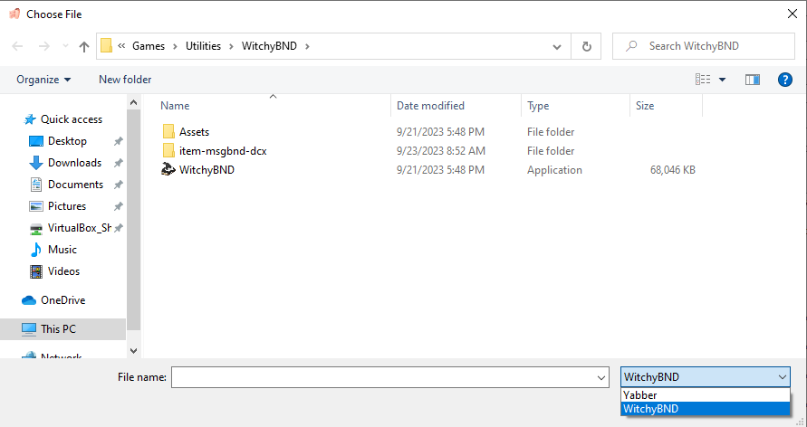
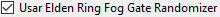
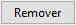

#Elden Ring Randomizer Hints  
  
## Guia Opções principais  
  
Após iniciar o programa, você verá a tela principal de opções:  
  
  
Se quiser mudar o idioma do programa, você pode selecioná-lo no menu . A alteração do idioma requer a reinicialização do programa.  
Observe que isso alterará o idioma da interface, mas dicas ainda serão geradas para todos os idiomas disponíveis.  
  
A primeira coisa que você precisa fazer é selecionar os executáveis na seção superior. Você precisará de executáveis válidos para [Elden Ring](https://store.steampowered.com/app/1245620/ELDEN_RING/), [DSMSPortable](https://github.com/mountlover/DSMSPortable), [Yabber](https://github.com/JKAnderson/Yabber) ou WitchyBND[(Nexus Mods)](https://www.nexusmods.com/eldenring/mods/3862)[(Github)](https://github.com/ividyon/WitchyBND) e um ou ambos [Elden Ring Item and Enemy Randomizer](https://www.nexusmods.com/eldenring/mods/428) ou [Elden Ring Fog Gate Randomizer](https://www.nexusmods.com/eldenring/mods/3295).  
  
  
  
  
Depois de selecionar os executáveis, você poderá ver atividade no painel :  
  
Este é o programa que lê os dados do(s) randomizador(es) e exporta os dados de regulação que gerou. Isso acontece sempre que os executáveis são válidos e mudam ou as opções do randomizador habilitadas mudam.  
  
Falando nisso, existem duas opções à esquerda para ativar ou desativar cada randomizador:  
  
  
Para gerar dicas, pelo menos uma delas deve estar habilitada e o caminho executável para ela deve ser válido.  
  
Abaixo de cada uma dessas opções há mais opções que você pode usar para personalizar seu jogo.  
  
### Opções de dicas  
  
  
  
#### Item and Enemy Randomizer Opções  
  
: Por padrão, Randomizer Hints usará as sementes aleatórias dos arquivos de spoiler do randomizador, mas você tem a opção de definir suas próprias sementes personalizadas para cada um.  
: Habilite esta opção para criar dicas para itens importantes para missões de NPCs. A forma como você obtém as dicas dependerá do NPC e do estágio da missão.  
: Esta opção colocará dicas nas localizações dos itens quando os itens colocados lá pertencerem às categorias selecionadas. As dicas irão direcioná-lo para outros locais de itens dentro das mesmas categorias.  
: Selecione esta opção para aumentar a probabilidade de que as dicas de categoria apontem para itens na mesma região ou em regiões vizinhas. Observe que esta opção não faz nada se Fog Gate Randomizer for usado.  
: Esta opção colocará dicas para itens aleatórios de categorias selecionadas em baús em todo o mundo. Você pode selecionar a porcentagem de baús que receberão dicas.  
: Esta opção colocará dicas para itens aleatórios de categorias selecionadas em chefes espalhados pelo mundo. Você pode selecionar a porcentagem de chefes que receberão dicas.  
: Selecione esta opção para colocar dicas de itens-chave necessários para passar por portões, elevadores e outras barreiras em locais de itens próximos a esses portões. Uma exceção é o Chave do Quarto de Hóspedes, para o qual uma dica pode ser dada por Tanith com a opção .  
: Normalmente, dicas direcionais que fornecem estimativas de distância e direção da bússola aparecerão apenas para itens em áreas grandes. Dicas para itens em áreas nomeadas menores mostrarão apenas que os itens estão nessas áreas. Ative esta opção para sempre fornecer a distância e a direção da bússola. Não recomendado.  
  
#### Fog Gate Randomizer Opções  
  
: Por padrão, Randomizer Hints usará as sementes aleatórias dos arquivos de spoiler do randomizer, mas você tem a opção de definir suas próprias sementes personalizadas para cada um.  
: Selecione esta opção para colocar dicas de portão em locais de itens próximos a esses portões.  
: Esta opção colocará dicas para portões de neblina aleatórios em baús em todo o mundo. Você pode selecionar a porcentagem de baús que receberão dicas.  
: Esta opção colocará dicas para portões de neblina aleatórios em chefes espalhados pelo mundo. Você pode selecionar a porcentagem de chefes que receberão dicas.  
  
Finalmente, existem duas opções que não dependem de nenhum dos randomizadores, mas são usadas junto com as configurações na guia Itens iniciais:  
  
: Esta opção é usada para colocar itens e dicas no cadáver Donzelas dos Dedos no início do jogo.  
: Habilite esta opção para usar um inventário de loja inicial editado para a loja Gêmeas Idosas.  
  
Após a validação dos caminhos dos arquivos e a definição das opções desejadas, você pode clicar no botão  para criar dicas no jogo de acordo com suas preferências. O processo de geração de dicas demora um pouco e o painel  exibirá o progresso. Após gerar dicas você precisará configurar Mod Engine 2 para usar o mod.  
  
Mas antes de fazer isso, você pode dar uma olhada nas outras guias.  
  
## Itens Perdíveis guia  
  
  
Esta guia é bastante simples. Uma lista de itens aleatórios é exibida no painel esquerdo. São itens muito fáceis de perder ou impossíveis de obter. Selecionar um item da lista revelará spoilers sobre sua localização e como ele pode passar despercebido no painel direito. Se houver itens que são importantes para o seu jogo aqui, você pode ver se é provável que você os perca. Nesse caso, você pode voltar e executar novamente o Item and Enemy Randomizer para obter um resultado melhor.  
  
Você verá uma caixa de filtro acima do painel esquerdo. Digitar texto nesta caixa filtrará os itens exibidos que correspondem ao texto. Esse filtro aparece em painéis semelhantes em outras guias e todos esses filtros funcionam da mesma maneira.  
  
## Itens iniciais guia  
  
  
Nesta aba você pode definir os itens e dicas a serem colocados no cadáver do Donzelas dos Dedos no início do jogo, e editar o inventário inicial da loja Gêmeas Idosas.  
  
### Donzelas dos Dedos Itens  
  
Na metade esquerda da guia está o seletor de itens Donzelas dos Dedos:  
  
O painel grande à esquerda é a lista de itens e dicas a serem colocados no cadáver, e os três painéis menores à direita são listas de todos os itens, todas as dicas de itens e todas as categorias de dicas.  
  
Para adicionar itens, dicas de itens ou dicas de categoria ao painel do lado esquerdo, selecione-os em um dos painéis do lado direito e clique no botão . Por outro lado, você pode selecionar itens no painel esquerdo e clicar no botão  para removê-los. Várias seleções são permitidas.  
  
A quantidade de itens e dicas a serem colocadas podem ser alteradas. Selecione-os no painel esquerdo e clique no botão  para definir a quantidade que deve ser colocada.  
  
A propriedade "somente restos" de dicas de itens individuais também pode ser definida selecionando dicas de itens no painel esquerdo e clicando no botão . Dicas que possuem essa propriedade apontarão apenas para quedas do item pelo inimigo. Por exemplo, nas imagens aqui estou montando uma build de arqueiro, e por isso tenho dicas do "somente restos" para Ossos Finos de Animal e Pluma de Voo, que vão me dar dicas de inimigos que vão dropar os recursos que preciso para craftar Flecha Óssea.  
  
Finalmente, na parte inferior você pode ver um contador que permite saber quanto espaço resta na localização do cadáver.  
  
Só há espaço para 8 objetos, mas os itens com quantidades ainda ocupam apenas 1 espaço de objeto e, como os objetos de dicas de itens podem conter até 4 dicas, as dicas serão agrupadas. No exemplo acima, tenho 1 item com quantidade 50 que ocupa 1 espaço de objeto, depois 2 dicas de item, uma dica de categoria com quantidade 2 e mais 2 dicas de categoria diferentes, perfazendo um total de 6 dicas. Essas dicas serão compactadas em 2 objetos de dicas, um com no máximo 4 dicas e outro com apenas 2 dicas, deixando espaço para mais 2 antes de usar outro espaço de objeto. Portanto, no total, apenas 3 espaços de objetos são usados.  
  
Se a opção  estiver habilitada e  não estiver, as dicas tentarão apontar para itens em Limgrave e áreas adjacentes, se disponíveis.  
  
### Gêmeas Idosas Loja  
  
Na metade direita da guia está o editor da loja Gêmeas Idosas:  
  
O painel esquerdo exibe o inventário da loja e o painel direito mostra todos os itens do jogo. Selecionar um item no inventário da loja fará com que seu slot apareça abaixo. Depois de selecionar um slot, você pode selecionar um item de substituição no painel de itens e clicar no botão  para substituir o item do inventário da loja pelo novo item. Na imagem acima, substituí o slot 14 no inventário da loja por Flecha e defini seu preço para 5 runas.  
  
Com um slot selecionado, você pode clicar no botão  para definir o preço do item do inventário da loja.  
  
Você também pode clicar no botão  para apagar suas alterações e recarregar o inventário padrão da loja.  
  
### Nota importante sobre itens iniciais

Devido à forma como o jogo lida com os eventos, alguns itens devem ser obtidos em sua localização no mundo do jogo para que seus efeitos funcionem. Isso inclui a elaboração de livros de receitas, pinturas e vários itens de missão. Se você colocar uma cópia de um desses itens no início ou na loja, isso não funcionará até que você obtenha o item original em seu local no mundo do jogo. Para esses itens é melhor colocar uma dica no início.  
  
## Seleções de categoria guia  
  
  
Esta guia permite que você selecione quais categorias serão usadas para dicas de categoria, dicas de baús e dicas de queda de chefes. Há um par de painéis para cada um deles, com o painel esquerdo exibindo as categorias selecionadas e o painel direito exibindo todas as categorias disponíveis. Selecionar categorias no painel direito e clicar em  irá adicioná-los ao painel esquerdo, e selecionar itens no painel esquerdo e clicar em  irá removê-los do painel esquerdo. Várias seleções são permitidas.  
  
Você pode recarregar o conjunto padrão de seleções de categoria clicando no botão . Observe que se você excluiu ou renomeou algumas categorias padrão ou adicionou novas categorias na guia Editar categorias, elas não aparecerão nas seleções.  
  
## Editar categorias guia  
  
  
Nesta aba final, você pode editar e excluir as categorias de itens e criar as suas próprias. O painel esquerdo exibe todas as categorias, o painel central exibe os itens da categoria selecionada e o painel direito exibe todos os itens do jogo.  
  
Clique no botão  para criar uma nova categoria no painel esquerdo. Você também pode selecionar uma categoria no painel esquerdo e clicar em  para fazer uma nova cópia dela,  para renomeá-la ou  para excluí-la.  
  
Quando uma categoria no painel esquerdo é selecionada, os itens dentro da categoria serão exibidos no painel central. Você pode adicionar itens à categoria selecionando itens no painel direito e clicando em . Os itens podem ser removidos da categoria selecionando-os no painel central e clicando em . Várias seleções são permitidas.  
  
Assim como em Donzelas dos Dedos Itens, a propriedade "somente restos" de dicas de itens dentro da categoria também pode ser definida selecionando-os no painel central e clicando no botão . Dicas que possuem essa propriedade apontarão apenas para quedas do item pelo inimigo.  
  
Você pode recarregar o conjunto padrão de categorias clicando no botão . Observe que isso apagará completamente quaisquer alterações ou novas categorias que você criou.  
  
## Salvar e carregar configurações  
  
Na parte inferior da guia Opções principais há botões que podem ser usados para salvar, carregar, importar e exportar configurações:  
  
A diferença entre Carregar/Salvar e Importar/Exportar é a quais configurações os botões se aplicam. Carregar/Salvar se aplica a todas as opções do programa. Importar/Exportar se aplica a todas as opções *exceto* aos caminhos executáveis e à loja Gêmeas Idosas.  
  
Os arquivos de opção Carregar/Salvar têm a extensão ".rhs" e podem ser usados como configurações e backups de configurações pessoais.  
  
Os arquivos de opções de importação/exportação têm a extensão ".rhe" e devem ser mais portáteis, para que os jogadores possam trocar configurações sem ter o problema de substituir seus caminhos executáveis pelos de outra pessoa.  
  
A loja Gêmeas Idosas não está incluída nas configurações de exportação porque o inventário da loja depende da saída do randomizador, que varia de jogador para jogador. Mesmo que isso também se aplique às suas diferentes sementes aleatórias, o inventário da loja ainda é salvo para que você possa manter um arquivo de configurações para acompanhar uma semente conhecida.  
  
Por padrão, todos esses arquivos de configurações são salvos na pasta "settings" na pasta do programa.  

### Configurações fornecidas

Na pasta “settings” estão alguns arquivos .rhe diferentes que você pode importar e experimentar.

Sorcerer.rhe: Para uma construção de feitiçaria. Se você acha que ter Fatiadora Cariana e Calhau Pedrilhante no início é demais, você pode remover um ou ambos e talvez adicionar dicas a eles.

Archer.rhe: Para uma construção de arqueiro furtivo que usa arcos e adagas. Recomendo também adicionar Flecha à loja por um preço barato.

Priest.rhe: Para uma construção de fé que depende de encantamentos.

Bonk.rhe: Para uma construção de martelo. Bata nas coisas com força.

## Configurando Mod Engine 2  
  
Depois de gerar dicas, você precisará configurar Mod Engine 2 para incluir Randomizer Hints como mod. O programa gera um arquivo "config_randomizerhints.toml" parecido com este:  
  
	# Generated by Elden Ring Randomizer Hints  
	  
	[modengine]  
	debug = false  
	external_dlls = []  
	[extension.mod_loader]  
	enabled = true  
	loose_params = false  
	mods = [  
	    { enabled = true, name = "randomizerhints", path = "C:\\Games\\Utilities\\randomizerHints" },  
	    { enabled = true, name = "fog", path = "C:\\Games\\Utilities\\fog\\" },  
	    { enabled = true, name = "randomizer", path = "C:\\Games\\Utilities\\randomizer\\" },  
	]  
	[extension.scylla_hide]  
	enabled = false  
  
Quais caminhos de mod aparecem e como você usa esse arquivo dependerão da sua configuração.  
  
Se você planeja usar o recurso Mod Engine 2 integrado em Item and Enemy Randomizer ou Fog Gate Randomizer, você precisará copiar este arquivo toml para a pasta randomizer e renomeá-lo para substituir o arquivo toml que é já está lá ou edite o arquivo toml do randomizador para adicionar a linha de mod "randomizerhints" acima.  
  
Se você estiver usando uma instalação manual de Mod Engine 2, substitua o arquivo "config_eldenring.toml" na pasta Mod Engine 2 ou edite-o e adicione a linha de mod "randomizerhints" acima.  
  
A fusão com outros mods está fora do escopo destas instruções, mas no arquivo toml, "randomizerhints" deve vir antes de "fog", que deve vir antes de "randomizer". Quaisquer mods com um arquivo regulation.bin que venha antes dessas linhas substituirão os dados do randomizador e farão com que ele não funcione. Verifique a documentação do [Mod Engine 2](https://github.com/soulsmods/ModEngine2#get-started-guide) para obter detalhes.  
  
Quanto aos parâmetros e arquivos específicos afetados por Randomizer Hints:  
  
#### Parâmetros:  
  
> ItemLotParam_map: Adiciona entradas seguindo o ID 10010000 (Donzelas dos Dedos cadáver), adiciona entradas em vários lotes de itens em todo o mundo.  
>EquipParamGoods: Adiciona entradas do ID 300000 em diante.  
>ShopLineupParam: Adiciona entradas em várias lojas de NPCs, altera entradas na loja Gêmeas Idosas.  
  
#### Arquivos:  
  
> item.msgbnd.dcx (todos os idiomas)  
  
## Objetos de dica  
  
Objetos de dica de item podem conter até quatro dicas, e objetos de dica de portão de neblina podem conter até três dicas. Eles aparecem na categoria Informações do seu inventário. Para manter as coisas organizadas, os objetos de dicas do portão de neblina aparecem em um grupo na parte superior, seguidos pelos objetos de dicas de itens no próximo grupo e, em seguida, os grupos normais de itens de informações do jogo abaixo dele.  
  
Com as configurações padrão, Randomizer Hints gera muitos objetos de dicas e seu inventário de itens de informação pode ficar muito grande. Por esse motivo, este programa também modifica o jogo para permitir que você coloque itens de informação em seu baú de inventário ou descarte-os completamente. Tenha cuidado, pois isso significa que você também pode descartar pinturas e pedidos de solar.  
  
## Idiomas disponíveis  
  
Elden Ring Randomizer Hints possui dados (mal) localizados para os idiomas suportados em Elden Ring além do inglês e pode gerar dicas em todos eles. *No entanto*, isso depende dos arquivos do jogo modificados fornecidos pelos randomizadores. Item and Enemy Randomizer possui esses arquivos para todos os idiomas, mas Fog Gate Randomizer os possui apenas para inglês. Se você estiver usando os dois randomizadores, isso ainda funcionará bem, mas se você estiver *apenas* usando Fog Gate Randomizer, o programa obterá apenas os arquivos em inglês e gerará apenas dicas em inglês.  
  
Para resolver isso, você mesmo pode extrair os arquivos de jogo necessários usando Nordgaren's UXM Selective Unpacker[(Nexus)](https://www.nexusmods.com/eldenring/mods/1651)[(Github)](https://github.com/Nordgaren/UXM-Selective-Unpack):  
  
  
Primeiro, certifique-se de que o caminho para a instalação do Elden Ring esteja correto e, em seguida, clique no botão .  
  
A única coisa que você precisa selecionar aqui é a pasta "msg". Clique em OK, marque a caixa de seleção  e clique no botão . Depois de um tempo, a descompactação será concluída e você poderá encontrar a pasta "msg" descompactada dentro da pasta Elden Ring Game. Mova esta pasta para dentro da pasta "locale" em sua pasta Randomizer Hints, e o programa será capaz de encontrar todos os arquivos localizados mesmo usando apenas Fog Gate Randomizer.  
  
## Estratégias e spoilers  
  
Se houver uma variedade de itens que você deseja para a construção do seu personagem, crie categorias com esses itens e habilite-os nas categorias gerais. Isso permitirá que você siga a cadeia de dicas para obter todas elas. Coloque uma dica para a categoria em Donzelas dos Dedos Itens para começar.  
  
Se você estiver procurando por um item específico e receber uma dica de um item indesejado na mesma categoria, não o ignore. A obtenção desse item também fornecerá dicas para outros itens da categoria, um dos quais pode ser o item que você está procurando.  
  
Se você quiser fazer o máximo possível de missões de NPC, evite passar às cegas por um portão aleatório sem procurar na área próxima uma dica de onde ele leva. Se você acabar no Dunas dos Lamentos ou Platô Altus logo no início, poderá perder os primeiros itens das missões de Alexander e Blaidd.  
  
Se você estiver usando o Fog Gate Randomizer, a porta lateral da capela começa fechada. Porém, se você usar o Sino do Retorno antes de ir a qualquer lugar, ele abre! Se você tiver  ativado, uma dica para onde vai o portão de neblina estará no saque interno.  
  
Se você está procurando dicas, a aparência do item pode ser uma pista. Objetos de dica não serão encontrados em locais de itens brancos, mas apenas em roxos ou dourados.  
  
Se a quantidade de objetos de dicas que você obtém se tornar opressora e irritante de lidar, vá em frente e brinque com as categorias e configurações para reduzir a quantidade obtida. Gosto de receber muitas dicas e depois descobrir o melhor caminho a seguir para completar todas as missões e concluir minha construção da maneira mais eficiente possível, mas o estilo de jogo de cada pessoa é diferente. Você pode ser capaz de criar suas próprias configurações que tornem a experiência menos confusa, mas ainda assim muito direcionada.  
  
Se você reduzir bastante o número de categorias/itens disponíveis para gerar dicas, você também pode querer reduzir a porcentagem de baús e chefes em que eles podem aparecer, para evitar muitas dicas redundantes.  

