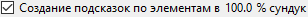
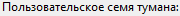
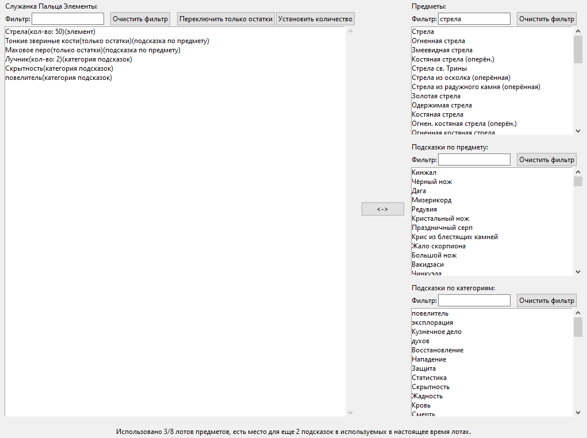
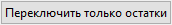
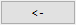
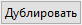

# Elden Ring Randomizer Hints  
  
## Вкладка <<Основные параметры>>  
  
После запуска программы вы увидите экран основных опций:  
  
  
Если вы хотите переключить язык программы, вы можете выбрать его в меню . Смена языка требует перезапуска программы.  
Обратите внимание, что при этом изменится язык интерфейса, но подсказки по-прежнему будут генерироваться для всех доступных языков.  
  
Первое, что вам нужно сделать, это выбрать исполняемые файлы в верхнем разделе. Вам потребуются действительные исполняемые файлы для [Elden Ring](https://store.steampowered.com/app/1245620/ELDEN_RING/), [DSMSPortable](https://github.com/mountlover/DSMSPortable), либо [Yabber](https://github.com/JKAnderson/Yabber) или WitchyBND[(Nexus Mods)](https://www.nexusmods.com/eldenring/mods/3862)[(Github)](https://github.com/ividyon/WitchyBND), а также один или оба из [Elden Ring Item and Enemy Randomizer](https://www.nexusmods.com/eldenring/mods/428) или [Elden Ring Fog Gate Randomizer](https://www.nexusmods.com/eldenring/mods/3295).  
  
  
  
  
После того как вы выбрали исполняемые файлы, вы можете увидеть активность на панели :  
  
Это программа, считывающая данные из рандомизаторов и экспортирующая сгенерированные ею регулирующие данные. Это происходит всякий раз, когда исполняемые файлы действительны и изменяются или изменяются включенные параметры рандомизатора.  
  
Кстати говоря, слева есть две опции для включения или отключения каждого рандомизатора:  
  
  
Для создания подсказок должен быть включен хотя бы один из них, а путь к его исполняемому файлу должен быть действительным.  
  
Под каждым из этих параметров есть дополнительные параметры, которые вы можете использовать для настройки своего прохождения.  
  
### Параметры подсказки  
  
  
  
#### Item and Enemy Randomizer Опции  
  
: По умолчанию Randomizer Hints будет использовать случайные начальные значения из файлов спойлеров рандомайзера, но у вас есть возможность установить свои собственные начальные значения для каждого.  
: включите эту опцию, чтобы создавать подсказки для предметов, важных для квестов NPC. То, как вы получите подсказки, будет зависеть от NPC и этапа квеста.  
: этот параметр будет размещать подсказки в местах расположения предметов, если размещенные там предметы принадлежат выбранным категориям. Подсказки направят вас к другим местам расположения предметов в тех же категориях.  
: выберите этот параметр, чтобы повысить вероятность того, что подсказки категорий будут указывать на элементы в том же или соседних регионах. Обратите внимание, что эта опция ничего не делает, если используется Fog Gate Randomizer.  
: эта опция будет размещать подсказки для случайных предметов из выбранных категорий в сундуках по всему миру. Вы можете выбрать процент сундуков, которые получат подсказки.  
: эта опция будет добавлять подсказки к случайным предметам из выбранных категорий в выпадения боссов по всему миру. Вы можете выбрать процент боссов, которые будут получать подсказки.  
: выберите этот параметр, чтобы разместить подсказки для ключевых предметов, необходимых для прохождения через ворота, лифты и другие барьеры, в местах расположения предметов рядом с этими воротами. Исключением является Ключ от гостиной, для которого подсказку можно дать с помощью Танит с опцией .  
: Обычно подсказки, указывающие расстояние и направление по компасу, появляются только для объектов, находящихся на больших площадях. Подсказки для элементов в областях с меньшими именами будут показывать только то, что элементы находятся в этих областях. Включите эту опцию, чтобы всегда указывать расстояние и направление по компасу. Не рекомендуется.  
  
#### Fog Gate Randomizer Опции  
  
: По умолчанию Randomizer Hints будет использовать случайные начальные значения из файлов спойлеров рандомайзера, но у вас есть возможность установить свои собственные начальные значения для каждого.  
: выберите эту опцию, чтобы разместить подсказки для ворот в местах расположения предметов рядом с этими вратами.  
: Эта опция будет размещать подсказки к случайным туманным вратам в сундуках по всему миру. Вы можете выбрать процент сундуков, которые получат подсказки.  
: эта опция будет добавлять подсказки к случайным вратам тумана в местах выпадения боссов по всему миру. Вы можете выбрать процент боссов, которые будут получать подсказки.  
  
Наконец, есть две опции, которые не зависят ни от одного рандомайзера, но используются вместе с настройками на вкладке Начальные предметы:  
  
: Эта опция используется для размещения предметов и подсказок на трупе Служанка Пальца в начале игры.  
: включите эту опцию, чтобы использовать отредактированный первоначальный инвентарь магазина Старые служанки-близнецы.  
  
После проверки путей к файлам и установки желаемых параметров вы можете нажать кнопку , чтобы создавать подсказки в игре в соответствии с вашими предпочтениями. Процесс создания подсказки занимает некоторое время, и на панели  будет отображаться ход выполнения. После создания подсказок вам нужно будет настроить Mod Engine 2 для использования мода.  
  
Но прежде чем сделать это, вы можете просмотреть другие вкладки.  
  
## Пропускаемые предметы вкладка  
  
  
Эта вкладка довольно проста. Список рандомизированных предметов отображается на левой боковой панели. Это предметы, которые очень легко пропустить или невозможно достать. При выборе элемента из списка на правой боковой панели появятся спойлеры о его местонахождении и о том, как его можно пропустить. Если здесь есть предметы, важные для вашей игры, вы можете увидеть, есть ли вероятность того, что вы их пропустите, и в этом случае вы можете вернуться и повторно запустить Item and Enemy Randomizer для лучшего результата.  
  
Вы увидите поле фильтра над левой боковой панелью. Ввод текста в это поле позволит отфильтровать отображаемые элементы, соответствующие тексту. Этот фильтр отображается на аналогичных панелях на других вкладках, и все эти фильтры работают одинаково.  
  
## Начальные предметы вкладка  
  
  
На этой вкладке вы можете установить предметы и подсказки, которые будут размещены на трупе Служанка Пальца в начале игры, а также отредактировать начальный инвентарь магазина Старые служанки-близнецы.  
  
### Служанка Пальца Предметы  
  
В левой половине вкладки находится селектор предметов Служанка Пальца:  
  
Большая панель слева  --  это список предметов и подсказок, которые нужно разместить на трупе, а три меньшие панели справа  --  это списки всех предметов, всех подсказок к предметам и всех категорий подсказок.  
  
Чтобы добавить элементы, подсказки к элементам или подсказки по категориям на левую боковую панель, выберите их на одной из правых панелей и нажмите кнопку . И наоборот, вы можете выбрать элементы на левой боковой панели, а затем нажать кнопку , чтобы удалить их. Допускается множественный выбор.  
  
Количество размещаемых предметов и подсказок можно изменить. Выберите их на левой боковой панели, затем нажмите кнопку , чтобы установить количество, которое следует разместить.  
  
Свойство «только остатки» подсказок отдельных элементов также можно установить, выбрав подсказки к элементам на левой боковой панели и нажав кнопку . Подсказки, имеющие это свойство, будут указывать только на то, что предмет выпадет из противника. Например, на изображениях здесь я настраиваю сборку лучника, и поэтому у меня есть «только остатки» подсказки для Тонкие звериные кости и Маховое перо, которые дадут мне подсказки относительно врагов, из которых выпадут ресурсы, необходимые для крафта Костяная стрела.  
  
Наконец, внизу вы можете увидеть счетчик, который позволяет узнать, сколько места осталось на месте трупа.  
  
Здесь есть место только для 8 объектов, но предметы с количеством по-прежнему занимают только 1 пространство объекта, а поскольку объекты подсказок по предметам могут содержать до 4 подсказок, подсказки будут упакованы вместе. В приведенном выше примере у меня есть 1 предмет с количеством 50, который занимает 1 пространство объекта, затем 2 подсказки по предметам, подсказка по категории с количеством 2 и еще 2 разных подсказки по категориям, что в общей сложности составляет 6 подсказок. Эти подсказки будут упакованы в 2 объекта подсказок, один с максимальным количеством подсказок 4, а другой только с двумя подсказками, оставляя место еще для двух, прежде чем использовать другое пространство объектов. Таким образом, всего используется только 3 пространства объектов.  
  
Если опция  включена, а  нет, подсказки будут пытаться указать на элементы в Замогилье и прилегающих областях, если они доступны.  
  
### Старые служанки-близнецы Магазин  
  
В правой половине вкладки находится редактор Старые служанки-близнецы Shop:  
  
На левой панели отображается инвентарь магазина, а на правой панели показаны все предметы в игре. При выборе предмета в инвентаре магазина ниже появится его слот. После выбора слота вы можете выбрать заменяющий предмет на панели предметов, затем нажать кнопку , чтобы заменить предмет из инвентаря магазина новым предметом. На изображении выше я заменил слот 14 в инвентаре магазина на Стрела и установил его цену в 5 рун.  
  
Выбрав слот, вы можете нажать кнопку , чтобы установить цену предмета инвентаря магазина.  
  
Вы также можете нажать кнопку , чтобы стереть изменения и перезагрузить инвентарь магазина по умолчанию.  
  
### Важное примечание о начальных элементах

Из-за того, как игра обрабатывает события, некоторые предметы необходимо получить из их местоположения в игровом мире, чтобы их эффекты сработали. Сюда входит создание книг рецептов, картин и различных квестовых предметов. Если вы разместите копию одного из этих предметов в начале игры или в магазине, она не будет работать, пока вы не получите исходный предмет из его местоположения в игровом мире. Для этих предметов лучше разместить подсказку в начале.  
  
## Выбор категории вкладка  
  
  
Эта вкладка позволяет вам выбрать, какие категории будут использоваться для подсказок по категориям, подсказок к сундукам и подсказок по выпадению боссов. Для каждой из них имеется пара панелей: на левой панели отображаются выбранные категории, а на правой панели отображаются все доступные категории. Если выбрать категории на правой боковой панели и нажать , они будут добавлены на левую боковую панель, а при выборе элементов на левой боковой панели и нажатии  они будут удалены с левой боковой панели. Допускается множественный выбор.  
  
Вы можете перезагрузить набор категорий по умолчанию, нажав кнопку . Обратите внимание: если вы удалили или переименовали некоторые категории по умолчанию или добавили новые категории на вкладке Редактировать категории, они не появятся в выборе.  
  
## Редактировать категории вкладка  
  
  
На этой последней вкладке вы можете редактировать и удалять категории элементов, а также создавать свои собственные. На левой боковой панели отображаются все категории, на центральной панели отображаются предметы выбранной категории, а на правой боковой панели отображаются все предметы в игре.  
  
Нажмите кнопку , чтобы создать новую категорию на левой боковой панели. Вы также можете выбрать категорию на левой боковой панели и нажать , чтобы создать ее новую копию, , чтобы переименовать ее, или , чтобы удалить ее.  
  
Если выбрана категория на левой боковой панели, элементы внутри категории будут отображаться на центральной панели. Вы можете добавить элементы в категорию, выбрав элементы на правой боковой панели и нажав . Элементы можно удалить из категории, выбрав элементы на центральной панели и нажав . Допускается множественный выбор.  
  
Как и в случае с Служанка Пальца Items, свойство «только остатки» подсказок элементов внутри категории также можно установить, выбрав их на центральной панели и нажав кнопку . Подсказки, имеющие это свойство, будут указывать только на то, что предмет выпадет из противника.  
  
Вы можете перезагрузить набор категорий по умолчанию, нажав кнопку . Обратите внимание, что при этом все созданные вами изменения или новые категории будут полностью удалены.  
  
## Сохранить и загрузить настройки  
  
В нижней части вкладки <<Основные параметры>> находятся кнопки, которые можно использовать для сохранения, загрузки, импорта и экспорта настроек:  
  
Разница между загрузкой/сохранением и импортом/экспортом заключается в том, к каким настройкам применяются кнопки. Загрузка/сохранение применяется ко всем параметрам программы. Импорт/Экспорт применяется ко всем параметрам, *кроме* путей к исполняемым файлам и магазина Старые служанки-близнецы.  
  
Файлы параметров загрузки/сохранения имеют расширение «.rhs» и могут использоваться в качестве конфигураций личных настроек и резервных копий.  
  
Файлы параметров импорта/экспорта имеют расширение «.rhe» и предназначены для большей переносимости, чтобы игроки могли обмениваться конфигурациями настроек, не сталкиваясь с проблемой перезаписи своих путей к исполняемым файлам чужими.  
  
Магазин Старые служанки-близнецы не включен в экспортированные настройки, поскольку инвентарь магазина зависит от результатов рандомайзера, которые могут различаться от игрока к игроку. Несмотря на то, что это также относится к вашим собственным рандомизированным семенам, инвентарь магазина по-прежнему сохраняется, поэтому вы можете сохранить файл настроек, соответствующий известному семени.  
  
По умолчанию все эти файлы настроек сохраняются в папке «settings» в папке программы.  

### Предоставленные настройки

В папке «settings» находится несколько разных файлов .rhe, которые вы можете импортировать и опробовать.

Sorcerer.rhe: Для сборки волшебства. Если вы считаете, что наличие одновременно Карианский резак и Снаряды блестящих камней в начале — это слишком, вы можете удалить один или оба и, возможно, вместо этого добавить к ним подсказки.

Archer.rhe: для скрытного лучника, использующего луки и кинжалы. Рекомендуем также добавить Стрелы в магазин по низкой цене.

Priest.rhe: Для построения веры, основанной на заклинаниях.

Bonk.rhe: Для сборки молотка. Сильно бейте по вещам.

## Настройка Mod Engine 2  
  
После создания подсказок вам необходимо настроить Mod Engine 2, чтобы включить Randomizer Hints в качестве мода. Программа генерирует файл <<config_randomizerhints.toml>>, который выглядит примерно так:  
  
	# Generated by Elden Ring Randomizer Hints  
	  
	[modengine]  
	debug = false  
	external_dlls = []  
	[extension.mod_loader]  
	enabled = true  
	loose_params = false  
	mods = [  
	    { enabled = true, name = "randomizerhints", path = "C:\\Games\\Utilities\\randomizerHints" },  
	    { enabled = true, name = "fog", path = "C:\\Games\\Utilities\\fog\\" },  
	    { enabled = true, name = "randomizer", path = "C:\\Games\\Utilities\\randomizer\\" },  
	]  
	[extension.scylla_hide]  
	enabled = false  
  
Какие пути к модам появляются и как вы используете этот файл, будет зависеть от ваших настроек.  
  
Если вы планируете использовать встроенную функцию Mod Engine 2 в Item and Enemy Randomizer или Fog Gate Randomizer, вам нужно будет либо скопировать этот файл toml в папку рандомайзера и переименовать его, чтобы заменить файл toml, который уже есть, или отредактируйте файл рандомайзера toml, чтобы добавить указанную выше строку мода "randomizerhints".  
  
Если вы используете установку Mod Engine 2 вручную, либо замените файл <<config_eldenring.toml>> в папке Mod Engine 2, либо отредактируйте его и добавьте указанную выше строку мода "randomizerhints".  
  
Слияние с другими модами выходит за рамки этих инструкций, но в файле toml "randomizerhints" должен стоять перед "fog", который должен стоять перед "randomizer". Любые моды с файлом regulation.bin, расположенные перед этими строками, переопределяют данные рандомайзера и приводят к его неработоспособности. Подробности можно найти в документации [Mod Engine 2](https://github.com/soulsmods/ModEngine2#get-started-guide).  
  
Что касается конкретных параметров и файлов, на которые влияет Randomizer Hints:  
  
#### Параметры:  
  
> ItemLotParam_map: Добавляет записи с идентификатором 10010000 (Служанка Пальца труп), добавляет записи в различные лоты предметов по всему миру.  
>EquipParamGoods: Добавляет записи с идентификатором от 300000 и выше.  
>ShopLineupParam: Добавляет записи в различные магазины NPC, изменяет записи в магазине Старые служанки-близнецы.  
  
#### Файлы:  
  
> item.msgbnd.dcx (все языки)  
  
## Объекты подсказок  
  
Объекты подсказок элемента могут содержать до четырех подсказок, а объекты подсказок туманных ворот могут содержать до трех подсказок. Они появляются в категории <<Информация>> вашего инвентаря. Чтобы все было организованно, объекты-подсказки для туманных ворот появляются в группе вверху, за ними следуют объекты-подсказки по предметам в следующей группе, а затем под ними  --  обычные группы элементов игровой информации.  
  
При настройках по умолчанию Randomizer Hints генерирует *много* объектов подсказок, и ваш инвентарь информационных элементов может стать очень большим. По этой причине эта программа также модифицирует игру, чтобы вы могли помещать информационные элементы в свой сундук с инвентарем или вообще выбрасывать их. Будьте осторожны, потому что это означает, что вы также можете отказаться от картин и запросов на поместье.  
  
## Доступные языки  
  
Elden Ring Randomizer Hints имеет (плохо) локализованные данные для языков, поддерживаемых в Elden Ring, кроме английского, и может генерировать подсказки для всех из них. *Однако* это зависит от модифицированных файлов игры, предоставленных рандомизаторами. Item and Enemy Randomizer содержит эти файлы для всех языков, а Fog Gate Randomizer  --  только для английского. Если вы используете оба рандомизатора, это все равно будет работать нормально, но если вы *только* используете Fog Gate Randomizer, программа будет получать только английские файлы и генерировать только английские подсказки.  
  
Чтобы решить эту проблему, вы можете самостоятельно извлечь необходимые файлы игры, используя Nordgaren's UXM Selective Unpacker[(Nexus)](https://www.nexusmods.com/eldenring/mods/1651)[(Github)](https://github.com/Nordgaren/UXM-Selective-Unpack):  
  
  
Сначала убедитесь, что путь к вашей установке Elden Ring правильный, затем нажмите кнопку .  
  
Единственное, что вам здесь нужно выбрать, это папку «msg». Нажмите <<ОК>>, затем установите флажок  и нажмите кнопку . Через некоторое время распаковка завершится, и вы сможете найти распакованную папку «msg» внутри папки Elden Ring Game. Переместите эту папку в папку «locale» в папке Randomizer Hints, и программа сможет найти все локализованные файлы, даже если использовать только Fog Gate Randomizer.  
  
## Стратегии и спойлеры  
  
Если для сборки вашего персонажа вам нужны различные предметы, создайте категории с этими предметами и включите их в общие категории. Это позволит вам следовать цепочке подсказок, чтобы получить их все. Чтобы начать, добавьте подсказку к категории в Служанка Пальца Items.  
  
Если вы ищете определенный предмет и получаете подсказку о нежелательном предмете в той же категории, не игнорируйте его. Получение этого предмета также предоставит подсказки для других предметов в категории, одним из которых может быть тот предмет, который вы ищете.  
  
Если вы хотите выполнить как можно больше квестов NPC, не проходите вслепую через случайные ворота, не обыскивая местность поблизости в поисках подсказки, куда они ведут. Если вы окажетесь в Воющие дюны или Плато Альтус раньше, вы можете пропустить ранние предметы из квестов Александр и Блайд.  
  
Если вы используете Fog Gate Randomizer, боковая дверь часовни сначала будет закрыта. Однако, если вы используете Колокол возвращения, прежде чем куда-либо идти, он откроется! Если у вас включен , подсказка о том, куда идут туманные ворота, будет внутри добычи.  
  
Если вы ищете подсказки, внешний вид предмета может быть подсказкой. Объекты-подсказки можно найти не в простых белых местах, а только в фиолетовых или золотых.  
  
Если количество объектов подсказок, которые вы получаете, становится огромным и утомительным, поиграйте с категориями и настройками, чтобы уменьшить их количество. Мне нравится получать много подсказок, а затем определять лучший маршрут, чтобы выполнить все квесты и завершить сборку как можно эффективнее, но стиль игры у всех разный. Возможно, вы сможете придумать свои собственные настройки, которые сделают игру менее загроможденной, но все же очень целенаправленной.  
  
Если вы значительно уменьшите количество категорий/предметов, доступных для генерации подсказок, вы также можете уменьшить процент сундуков и боссов, в которых они могут появляться, чтобы избежать слишком большого количества избыточных подсказок.  

