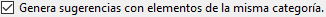
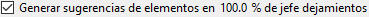

#Elden Ring Randomizer Hints  
  
## Pestaña Opciones principales  
  
Después de iniciar el programa, verá la pantalla de opciones principales:  
  
  
Si desea cambiar el idioma del programa, puede seleccionarlo en el menú . Cambiar el idioma requiere reiniciar el programa.  
Tenga en cuenta que esto cambiará el idioma de la interfaz, pero aún se generarán sugerencias para todos los idiomas disponibles.  
  
Lo primero que deberá hacer es seleccionar los ejecutables en la sección superior. Necesitará ejecutables válidos para [Elden Ring](https://store.steampowered.com/app/1245620/ELDEN_RING/), [DSMSPortable](https://github.com/mountlover/DSMSPortable), ya sea [Yabber](https://github.com/JKAnderson/Yabber) o WitchyBND[(Nexus Mods)](https://www.nexusmods.com/eldenring/mods/3862)[(Github)](https://github.com/ividyon/WitchyBND), y uno o ambos de [Elden Ring Item and Enemy Randomizer](https://www.nexusmods.com/eldenring/mods/428) o [Elden Ring Fog Gate Randomizer](https://www.nexusmods.com/eldenring/mods/3295).  
  
  
  
  
Después de haber seleccionado los ejecutables, es posible que vea actividad en el panel :  
  
Este es el programa que lee los datos de los aleatorizadores y exporta los datos de regulación que ha generado. Esto sucede siempre que los ejecutables son válidos y cambian o las opciones de aleatorización habilitadas cambian.  
  
Hablando de eso, hay dos opciones a la izquierda para habilitar o deshabilitar cada aleatorizador:  
  
  
Para generar sugerencias, al menos uno de ellos debe estar habilitado y la ruta ejecutable debe ser válida.  
  
Debajo de cada una de esas opciones hay más opciones que puedes usar para personalizar tu juego.  
  
### Opciones de sugerencia  
  
  
  
#### Item and Enemy Randomizer Opciones  
  
: De forma predeterminada, Randomizer Hints usará las semillas aleatorias de los archivos de spoiler del aleatorizador, pero tienes la opción de configurar tus propias semillas personalizadas para cada una.  
: habilite esta opción para crear sugerencias para elementos importantes para las misiones de NPC. La forma de obtener las pistas dependerá del NPC y de la etapa de la misión.  
: Esta opción colocará sugerencias en las ubicaciones de los elementos cuando los elementos colocados allí pertenezcan a categorías seleccionadas. Las sugerencias lo dirigirán a otras ubicaciones de artículos dentro de las mismas categorías.  
: seleccione esta opción para que sea más probable que las sugerencias de categoría apunten a elementos en la misma región o en regiones vecinas. Tenga en cuenta que esta opción no hace nada si se utiliza Fog Gate Randomizer.  
: esta opción colocará pistas sobre elementos aleatorios de categorías seleccionadas en cofres de todo el mundo. Puedes seleccionar el porcentaje de cofres que recibirán pistas.  
: esta opción colocará pistas sobre elementos aleatorios de categorías seleccionadas en los jefes de todo el mundo. Puedes seleccionar el porcentaje de jefes que recibirán pistas.  
: seleccione esta opción para colocar sugerencias de elementos clave necesarios para atravesar puertas, ascensores y otras barreras en ubicaciones de elementos cerca de esas puertas. Una excepción es Llave del salón principal, para la cual Tanith puede dar una pista con la opción .  
: Normalmente, las sugerencias direccionales que proporcionan estimaciones de distancia y dirección de la brújula solo aparecerán para elementos en áreas grandes. Las sugerencias para elementos en áreas con nombre más pequeñas solo mostrarán que los elementos se encuentran en esas áreas. Habilite esta opción para proporcionar siempre la distancia y la dirección de la brújula. No recomendado.  
  
#### Fog Gate Randomizer Opciones  
  
: De forma predeterminada, Randomizer Hints usará las semillas aleatorias de los archivos de spoiler del aleatorizador, pero tienes la opción de configurar tus propias semillas personalizadas para cada una.  
: seleccione esta opción para colocar sugerencias de puertas en ubicaciones de elementos cerca de esas puertas.  
: esta opción colocará pistas sobre puertas de niebla aleatorias en cofres de todo el mundo. Puedes seleccionar el porcentaje de cofres que recibirán pistas.  
: esta opción colocará pistas sobre puertas de niebla aleatorias en los jefes de todo el mundo. Puedes seleccionar el porcentaje de jefes que recibirán pistas.  
  
Finalmente, hay dos opciones que no dependen de ninguno de los aleatorizadores, pero que se usan junto con la configuración en la pestaña Objetos iniciales:  
  
: esta opción se usa para colocar elementos y pistas en el cadáver de Doncella de los Dedos al comienzo del juego.  
: habilite esta opción para utilizar un inventario de tienda inicial editado para la tienda Cáscaras de Doncellas Gemelas.  
  
Después de validar las rutas de los archivos y configurar las opciones deseadas, puedes hacer clic en el botón  para crear sugerencias en el juego según tus preferencias. El proceso de generación de sugerencias tarda un poco y el panel  mostrará el progreso. Después de generar sugerencias, necesitarás configurar Mod Engine 2 para usar el mod.  
  
Pero antes de hacer eso, es posible que desees mirar las otras pestañas.  
  
## Artículos que se pueden perder pestaña  
  
  
Esta pestaña es bastante simple. Se muestra una lista de elementos aleatorios en el panel lateral izquierdo. Estos son elementos que son muy fáciles de pasar por alto o imposibles de conseguir. Seleccionar un elemento de la lista revelará spoilers sobre su ubicación y cómo se puede pasar por alto en el panel lateral derecho. Si hay elementos que son importantes para tu juego aquí, puedes ver si es probable que te los pierdas, en cuyo caso puedes regresar y volver a ejecutar Item and Enemy Randomizer para obtener un mejor resultado.  
  
Verá un cuadro de filtro encima del panel lateral izquierdo. Al escribir texto en este cuadro se filtrarán los elementos mostrados que coincidan con el texto. Este filtro aparece en paneles similares en otras pestañas y todos estos filtros funcionan de la misma manera.  
  
## Objetos iniciales pestaña  
  
  
En esta pestaña puedes configurar los elementos y sugerencias que se colocarán en el cadáver de Doncella de los Dedos al comienzo del juego y editar el inventario inicial de la tienda Cáscaras de Doncellas Gemelas.  
  
### Doncella de los Dedos Artículos  
  
En la mitad izquierda de la pestaña está el selector de elementos Doncella de los Dedos:  
  
El panel grande a la izquierda es la lista de elementos y pistas que se colocarán en el cadáver, y los tres paneles más pequeños a la derecha son listas de todos los elementos, todas las sugerencias de elementos y todas las categorías de pistas.  
  
Para agregar elementos, sugerencias de elementos o sugerencias de categorías al panel del lado izquierdo, selecciónelos en uno de los paneles del lado derecho y haga clic en el botón . Por el contrario, puede seleccionar elementos en el panel lateral izquierdo y luego hacer clic en el botón  para eliminarlos. Se permiten múltiples selecciones.  
  
Se puede cambiar la cantidad de elementos y sugerencias que se colocarán. Selecciónelos en el panel lateral izquierdo, luego haga clic en el botón  para establecer la cantidad que se debe colocar.  
  
La propiedad "Sólo dejamientos" de sugerencias de elementos individuales también se puede configurar seleccionando sugerencias de elementos en el panel lateral izquierdo y haciendo clic en el botón . Las pistas que tienen esta propiedad solo señalarán las caídas del objeto por parte del enemigo. Por ejemplo, en las imágenes aquí estoy configurando una configuración de arquero, por lo que tengo "Sólo dejamientos" sugerencias para Huesos de bestia delgados y Pluma de vuelo, que me darán pistas sobre los enemigos que arrojarán los recursos que necesito para crear Flecha ósea.  
  
Finalmente en la parte inferior podrás ver un contador que te permite saber cuánto espacio queda en la ubicación del cadáver.  
  
Solo hay espacio para 8 objetos, pero los elementos con cantidades todavía solo ocupan 1 espacio de objeto y, dado que los objetos de pistas de elementos pueden contener hasta 4 pistas, las pistas se empaquetarán juntas. En el ejemplo anterior, tengo 1 elemento con una cantidad de 50 que ocupa 1 espacio de objeto, luego 2 sugerencias de elementos, una sugerencia de categoría con una cantidad de 2 y 2 sugerencias de categorías diferentes más, lo que hace un total de 6 sugerencias. Estas pistas se empaquetarán en 2 objetos de pistas, uno con un máximo de 4 pistas y el otro con solo 2 pistas, dejando espacio para 2 más antes de usar otro espacio de objetos. Entonces, en total, solo se utilizan 3 espacios de objetos.  
  
Si la opción  está habilitada y  no lo está, las sugerencias intentarán señalar elementos en Limgrave y áreas circundantes, si están disponibles.  
  
### Cáscaras de Doncellas Gemelas Tienda  
  
En la mitad derecha de la pestaña está el editor de tienda Cáscaras de Doncellas Gemelas:  
  
El panel del lado izquierdo muestra el inventario de la tienda y el panel del lado derecho muestra todos los elementos del juego. Al seleccionar un artículo en el inventario de la tienda, su espacio aparecerá debajo. Después de seleccionar un espacio, puede seleccionar un artículo de reemplazo en el panel de artículos y luego hacer clic en el botón  para reemplazar el artículo del inventario de la tienda con el nuevo artículo. En la imagen de arriba, reemplacé la ranura 14 en el inventario de la tienda con Flecha y establecí su precio en 5 runas.  
  
Con un espacio seleccionado, puede hacer clic en el botón  para establecer el precio del artículo del inventario de la tienda.  
  
También puede hacer clic en el botón  para borrar los cambios y recargar el inventario predeterminado de la tienda.  
  
### Nota importante sobre los elementos iniciales

Debido a cómo el juego maneja los eventos, algunos elementos deben obtenerse de su ubicación en el mundo del juego para que sus efectos funcionen. Esto incluye la elaboración de libros de recetas, pinturas y varios elementos de misión. Si colocas una copia de uno de estos elementos al inicio o en la tienda, no funcionará hasta que obtengas el elemento original desde su ubicación en el mundo del juego. Para estos elementos es mejor colocar una pista al principio.  
  
## Selecciones de categoría pestaña  
  
  
Esta pestaña le permite seleccionar qué categorías se usarán para sugerencias de categorías, sugerencias de cofres y sugerencias de caída de jefes. Hay un par de paneles para cada uno de ellos: el panel del lado izquierdo muestra las categorías seleccionadas y el panel del lado derecho muestra todas las categorías disponibles. Seleccionar categorías en el panel del lado derecho y hacer clic en  las agregará al panel del lado izquierdo, y seleccionar elementos en el panel del lado izquierdo y hacer clic en  los eliminará del panel del lado izquierdo. Se permiten múltiples selecciones.  
  
Puede recargar el conjunto predeterminado de selecciones de categorías haciendo clic en el botón . Tenga en cuenta que si eliminó o cambió el nombre de algunas categorías predeterminadas o agregó nuevas categorías en la pestaña Editar categorías, no aparecerán en las selecciones.  
  
## Editar categorías pestaña  
  
  
En esta pestaña final, puede editar y eliminar las categorías de elementos y crear las suyas propias. El panel del lado izquierdo muestra todas las categorías, el panel central muestra los elementos dentro de la categoría seleccionada y el panel del lado derecho muestra todos los elementos del juego.  
  
Haga clic en el botón  para crear una nueva categoría en el panel lateral izquierdo. También puede seleccionar una categoría en el panel lateral izquierdo y hacer clic en  para hacer una nueva copia,  para cambiarle el nombre o  para eliminarla.  
  
Cuando se selecciona una categoría en el panel lateral izquierdo, los elementos dentro de la categoría se mostrarán en el panel central. Puede agregar elementos a la categoría seleccionando elementos en el panel lateral derecho y haciendo clic en . Los elementos se pueden eliminar de la categoría seleccionándolos en el panel central y haciendo clic en . Se permiten múltiples selecciones.  
  
Al igual que en los elementos Doncella de los Dedos, la propiedad "Sólo dejamientos" de las sugerencias de elementos dentro de la categoría también se puede configurar seleccionándolas en el panel central y haciendo clic en el botón . Las pistas que tienen esta propiedad solo señalarán las caídas del objeto por parte del enemigo.  
  
Puede recargar el conjunto predeterminado de categorías haciendo clic en el botón . Tenga en cuenta que esto borrará por completo cualquier cambio o categoría nueva que haya creado.  
  
## Guardar y cargar configuraciones  
  
En la parte inferior de la pestaña Opciones principales hay botones que se pueden usar para guardar, cargar, importar y exportar configuraciones:  
  
La diferencia entre Cargar/Guardar e Importar/Exportar es a qué configuraciones se aplican los botones. Cargar/Guardar se aplica a todas las opciones del programa. Importar/Exportar se aplica a todas las opciones *excepto* las rutas ejecutables y la tienda Cáscaras de Doncellas Gemelas.  
  
Los archivos de opción Cargar/Guardar tienen la extensión ".rhs" y pueden usarse como configuraciones y copias de seguridad de su configuración personal.  
  
Los archivos de opciones de importación/exportación tienen la extensión ".rhe" y están pensados para ser más portátiles, de modo que los jugadores puedan intercambiar configuraciones sin tener el problema de sobrescribir sus rutas ejecutables con las de otra persona.  
  
La tienda Cáscaras de Doncellas Gemelas no está incluida en la configuración exportada porque el inventario de la tienda depende de la salida aleatoria, que variará de un jugador a otro. Aunque eso también se aplica a sus diferentes semillas aleatorias, el inventario de la tienda aún se guarda para que pueda conservar un archivo de configuración junto con una semilla conocida.  
  
De forma predeterminada, todos estos archivos de configuración se guardan en la carpeta "settings" en la carpeta del programa.  

### Configuración proporcionada

En la carpeta "settings" hay algunos archivos .rhe diferentes que puedes importar y probar.

Sorcerer.rhe: Para una construcción de brujería. Si crees que tener Cortador de Caria y Guijarro de destellita al principio es demasiado, puedes eliminar uno o ambos, y tal vez agregarles pistas en su lugar.

Archer.rhe: Para un arquero sigiloso que usa arcos y dagas. Recomiende también agregar Flecha a la tienda por un precio económico.

Priest.rhe: Para una construcción de fe que se basa en encantamientos.

Bonk.rhe: Para una construcción de martillo. Golpea las cosas con fuerza.

## Configurando Mod Engine 2  
  
Después de generar sugerencias, necesitarás configurar Mod Engine 2 para incluir a Randomizer Hints como mod. El programa genera un archivo "config_randomizerhints.toml" similar a este:  
  
	# Generated by Elden Ring Randomizer Hints  
	  
	[modengine]  
	debug = false  
	external_dlls = []  
	[extension.mod_loader]  
	enabled = true  
	loose_params = false  
	mods = [  
	    { enabled = true, name = "randomizerhints", path = "C:\\Games\\Utilities\\randomizerHints" },  
	    { enabled = true, name = "fog", path = "C:\\Games\\Utilities\\fog\\" },  
	    { enabled = true, name = "randomizer", path = "C:\\Games\\Utilities\\randomizer\\" },  
	]  
	[extension.scylla_hide]  
	enabled = false  
  
Las rutas de mod que aparecen y cómo usa este archivo dependerán de su configuración.  
  
Si planea utilizar la función incorporada Mod Engine 2 en Item and Enemy Randomizer o Fog Gate Randomizer, deberá copiar este archivo toml a la carpeta del aleatorizador y cambiarle el nombre para reemplazar el archivo toml que está ya está allí, o edite el archivo toml del aleatorizador para agregar la línea mod "randomizerhints" anterior.  
  
Si está utilizando una instalación manual de Mod Engine 2, reemplace el archivo "config_eldenring.toml" en la carpeta Mod Engine 2, o edítelo y agregue la línea mod "randomizerhints" anterior.  
  
La fusión con otras modificaciones está fuera del alcance de estas instrucciones, pero en el archivo toml, "randomizerhints" debe ir antes de "fog", que debe ir antes de "randomizer". Cualquier modificación con un archivo regulation.bin que aparezca antes de estas líneas anulará los datos del aleatorizador y hará que no funcione. Consulte la documentación de [Mod Engine 2](https://github.com/soulsmods/ModEngine2#get-started-guide) para obtener más detalles.  
  
En cuanto a los parámetros y archivos específicos afectados por Randomizer Hints:  
  
#### Parámetros:  
  
> ItemLotParam_map: Agrega entradas siguiendo el ID 10010000 (Doncella de los Dedos cadáver), agrega entradas en varios lotes de artículos en todo el mundo.  
>EquipParamGoods: Agrega entradas desde el ID 300000 en adelante.  
>ShopLineupParam: Agrega entradas a varias tiendas de NPC, cambia entradas en la tienda Cáscaras de Doncellas Gemelas.  
  
#### Archivos:  
  
> item.msgbnd.dcx (todos los idiomas)  
  
## Objetos de pista  
  
Los objetos de pistas de elementos pueden contener hasta cuatro pistas y los objetos de pistas de puerta de niebla pueden contener hasta tres pistas. Aparecen en la categoría Información de su Inventario. Para mantener las cosas organizadas, los objetos de pistas de la puerta de niebla aparecen en un grupo en la parte superior, seguidos por los objetos de pistas de elementos en el siguiente grupo, y luego los grupos de elementos de información normales del juego debajo de ese.  
  
Con la configuración predeterminada, Randomizer Hints genera una *mucha* cantidad de objetos de sugerencia y su inventario de elementos de información puede volverse muy grande. Por esta razón, este programa también modifica el juego para permitirte colocar elementos de información en tu cofre de inventario o descartarlos por completo. Ojo, porque esto significa que también podrás descartar cuadros y solicitudes señoriales.  
  
## Idiomas Disponibles  
  
Elden Ring Randomizer Hints tiene datos (mal) localizados para los idiomas admitidos en Elden Ring además del inglés, y puede generar sugerencias en todos ellos. *Sin embargo*, esto depende de los archivos del juego modificados proporcionados por los aleatorizadores. Item and Enemy Randomizer tiene estos archivos para todos los idiomas, pero Fog Gate Randomizer solo los tiene para inglés. Si está utilizando ambos aleatorizadores, esto seguirá funcionando bien, pero si *solo* usa Fog Gate Randomizer, el programa solo obtendrá los archivos en inglés y solo generará sugerencias en inglés.  
  
Para resolver esto, puedes extraer los archivos necesarios del juego tú mismo usando Nordgaren's UXM Selective Unpacker[(Nexus)](https://www.nexusmods.com/eldenring/mods/1651)[(Github)](https://github.com/Nordgaren/UXM-Selective-Unpack):  
  
  
Primero asegúrese de que la ruta a su instalación Elden Ring sea correcta, luego haga clic en el botón .  
  
Lo único que necesita seleccionar aquí es la carpeta "msg". Haga clic en Aceptar, luego marque la casilla de verificación , luego haga clic en el botón . Después de un tiempo, se completará el descomprimido y podrás encontrar la carpeta "msg" descomprimida dentro de tu carpeta Elden Ring Game. Mueva esta carpeta dentro de la carpeta "locale" en su carpeta Randomizer Hints y el programa podrá encontrar todos los archivos localizados incluso cuando solo use Fog Gate Randomizer.  
  
## Estrategias y spoilers  
  
Si hay una variedad de elementos que deseas para la construcción de tu personaje, crea categorías con esos elementos y habilítalos en las categorías generales. Eso te permitirá seguir la cadena de pistas para obtenerlas todas. Coloque una pista para la categoría en Doncella de los Dedos Elementos para comenzar.  
  
Si está buscando un artículo en particular y recibe una pista sobre un artículo no deseado en la misma categoría, no lo ignore. Obtener ese artículo también proporcionará pistas sobre otros artículos en la categoría, uno de los cuales podría ser el artículo que estás buscando.  
  
Si quieres realizar la mayor cantidad posible de misiones de NPC, evita atravesar a ciegas una puerta aleatoria sin buscar en el área cercana una pista de adónde conduce. Si terminas en Dunas de los Lamentos o Meseta Altus desde el principio, podrías perderte los primeros elementos de las misiones de Alexander y Blaidd.  
  
Si estás usando Fog Gate Randomizer, la puerta lateral de la capilla comienza cerrada. Sin embargo, si usa Campana del regreso antes de ir a cualquier parte, ¡se abre! Si tienes  habilitado, en el botín del interior habrá una pista de dónde va la puerta de niebla.  
  
Si buscas pistas, la apariencia del objeto puede ser una pista. Los objetos de pista no se encontrarán en ubicaciones de elementos blancos, sino solo en lugares de color púrpura u dorado.  
  
Si la cantidad de objetos de pistas que obtienes se vuelve abrumadora y molesta, sigue adelante y juega con las categorías y configuraciones para reducir la cantidad que obtienes. Me gusta recibir muchas pistas y luego descubrir la mejor ruta a seguir para completar todas las misiones y completar mi construcción de la manera más eficiente posible, pero el estilo de juego de cada uno es diferente. Es posible que puedas crear tus propios ajustes que permitan una experiencia menos abarrotada pero aún así muy dirigida a objetivos.  
  
Si reduce en gran medida la cantidad de categorías/elementos disponibles para generar pistas, es posible que también desee reducir el porcentaje de cofres y jefes en los que pueden aparecer, para evitar recibir demasiadas pistas redundantes.  

