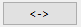

# Elden Ring Randomizer Hints  
  
## แท็บตัวเลือกหลัก  
  
หลังจากเริ่มโปรแกรม คุณจะเห็นหน้าจอตัวเลือกหลัก:  
  
  
หากต้องการเปลี่ยนภาษาของโปรแกรม สามารถเลือกได้จากเมนู  การเปลี่ยนภาษาต้องรีสตาร์ทโปรแกรม  
โปรดทราบว่าการดำเนินการนี้จะเปลี่ยนภาษาอินเทอร์เฟซ แต่คำแนะนำจะยังคงถูกสร้างขึ้นสำหรับภาษาที่มีอยู่ทั้งหมด  
  
สิ่งแรกที่คุณต้องทำคือเลือกไฟล์ปฏิบัติการในส่วนด้านบน คุณจะต้องมีไฟล์ปฏิบัติการที่ถูกต้องสำหรับ [Elden Ring](https://store.steampowered.com/app/1245620/ELDEN_RING/), [DSMSPortable](https://github.com/mountlover/DSMSPortable) [Yabber](https://github.com/JKAnderson/Yabber) หรือ WitchyBND[(Nexus Mods)](https://www.nexusmods.com/eldenring/mods/3862)[(Github)](https://github.com/ividyon/WitchyBND) และอย่างใดอย่างหนึ่งหรือทั้งสองของ [Elden Ring Item and Enemy Randomizer](https://www.nexusmods.com/eldenring/mods/428) หรือ [Elden Ring Fog Gate Randomizer](https://www.nexusmods.com/eldenring/mods/3295)  
  
  
  
  
หลังจากที่คุณเลือกโปรแกรมปฏิบัติการแล้ว คุณอาจเห็นกิจกรรมในบานหน้าต่าง :  
  
นี่คือโปรแกรมที่อ่านข้อมูลจากเครื่องสุ่มและส่งออกข้อมูลกฎระเบียบที่โปรแกรมสร้างขึ้น สิ่งนี้จะเกิดขึ้นเมื่อใดก็ตามที่ไฟล์ปฏิบัติการนั้นถูกต้องและมีการเปลี่ยนแปลงหรือตัวเลือก Randomizer ที่เปิดใช้งานนั้นเปลี่ยนไป  
  
มีสองตัวเลือกทางด้านซ้ายเพื่อเปิดหรือปิดใช้งานตัวสุ่มแต่ละตัว:  
  
  
หากต้องการสร้างคำแนะนำ ต้องเปิดใช้งานอย่างน้อยหนึ่งรายการและเส้นทางที่ปฏิบัติการได้จะต้องถูกต้อง  
  
ภายใต้ตัวเลือกแต่ละตัวจะมีตัวเลือกเพิ่มเติมที่คุณสามารถใช้เพื่อปรับแต่งการเล่นของคุณได้  
  
### ตัวเลือกคำแนะนำ  
  
  
  
#### Item and Enemy Randomizer ตัวเลือก  
  
: ตามค่าเริ่มต้น Randomizer Hints จะใช้เมล็ดสุ่มจากไฟล์สปอยล์ Randomizer แต่คุณมีตัวเลือกในการตั้งค่าเมล็ดพืชที่คุณกำหนดเองสำหรับแต่ละไฟล์  
: เปิดใช้งานตัวเลือกนี้เพื่อสร้างคำแนะนำสำหรับรายการที่สำคัญต่อภารกิจ NPC วิธีรับคำใบ้จะขึ้นอยู่กับ NPC และขั้นตอนภารกิจ  
: ตัวเลือกนี้จะให้คำแนะนำในตำแหน่งไอเท็มเมื่อไอเท็มที่วางไว้นั้นอยู่ในหมวดหมู่ที่เลือก คำแนะนำจะนำคุณไปยังตำแหน่งอื่นของรายการภายในหมวดหมู่เดียวกัน  
: เลือกตัวเลือกนี้เพื่อเพิ่มโอกาสที่คำแนะนำหมวดหมู่จะชี้ไปยังรายการในภูมิภาคเดียวกันหรือใกล้เคียง โปรดทราบว่าตัวเลือกนี้จะไม่ทำอะไรเลยหากใช้ Fog Gate Randomizer  
: ตัวเลือกนี้จะใส่คำแนะนำในการสุ่มไอเทมจากหมวดหมู่ที่เลือกลงในหีบทั่วโลก คุณสามารถเลือกเปอร์เซ็นต์ของหีบที่จะได้รับคำแนะนำ  
: ตัวเลือกนี้จะใส่คำแนะนำในการสุ่มไอเทมจากหมวดหมู่ที่เลือกไปเป็นดรอปบอสทั่วโลก คุณสามารถเลือกเปอร์เซ็นต์ของผู้บังคับบัญชาที่จะได้รับคำแนะนำ  
: เลือกตัวเลือกนี้เพื่อให้คำแนะนำเกี่ยวกับสิ่งของสำคัญที่จำเป็นในการผ่านประตู ลิฟต์ และสิ่งกีดขวางอื่น ๆ เข้าไปในตำแหน่งของสิ่งของใกล้กับประตูเหล่านั้น ข้อยกเว้นคือ กุญแจ​ห้อง​รับรอง ซึ่ง ทา​นิธ สามารถให้คำใบ้ได้ด้วยตัวเลือก   
: โดยปกติแล้ว คำแนะนำทิศทางที่ให้การประมาณระยะทางและทิศทางของเข็มทิศจะปรากฏเฉพาะกับรายการในพื้นที่ขนาดใหญ่เท่านั้น คำแนะนำสำหรับรายการในพื้นที่ที่มีชื่อเล็กๆ จะแสดงเฉพาะรายการที่อยู่ในพื้นที่เหล่านั้นเท่านั้น เปิดใช้งานตัวเลือกนี้เพื่อระบุระยะทางและทิศทางของเข็มทิศเสมอ ไม่แนะนำ.  
  
#### Fog Gate Randomizer ตัวเลือก  
  
: ตามค่าเริ่มต้น Randomizer Hints จะใช้เมล็ดสุ่มจากไฟล์สปอยล์ Randomizer แต่คุณมีตัวเลือกในการตั้งค่าเมล็ดพืชที่คุณกำหนดเองสำหรับแต่ละไฟล์  
: เลือกตัวเลือกนี้เพื่อวางคำแนะนำเกตลงในตำแหน่งของไอเทมใกล้กับประตูเหล่านั้น  
: ตัวเลือกนี้จะใส่คำใบ้ประตูหมอกแบบสุ่มลงในหีบทั่วโลก คุณสามารถเลือกเปอร์เซ็นต์ของหีบที่จะได้รับคำแนะนำ  
: ตัวเลือกนี้จะให้คำแนะนำในการสุ่มประตูหมอกให้บอสดรอปไปทั่วโลก คุณสามารถเลือกเปอร์เซ็นต์ของผู้บังคับบัญชาที่จะได้รับคำแนะนำ  
  
สุดท้ายนี้มีสองตัวเลือกที่ไม่ขึ้นอยู่กับ Randomizer แต่ใช้ร่วมกับการตั้งค่าในแท็บ รายการเริ่มต้น:  
  
: ตัวเลือกนี้ใช้เพื่อวางไอเท็มและคำใบ้เกี่ยวกับศพ หญิง​ร่าง​ทรง​องคุลี เมื่อเริ่มเกม  
: เปิดใช้งานตัวเลือกนี้เพื่อใช้สินค้าคงคลังเริ่มต้นที่แก้ไขแล้วสำหรับร้านค้า หญิง​ชรา​แฝด  
  
หลังจากตรวจสอบเส้นทางของไฟล์และตั้งค่าตัวเลือกที่คุณต้องการแล้ว คุณสามารถคลิกปุ่ม  เพื่อสร้างคำแนะนำในเกมตามที่คุณต้องการ กระบวนการสร้างคำใบ้จะใช้เวลาสักครู่ และบานหน้าต่าง  จะแสดงความคืบหน้า หลังจากสร้างคำแนะนำแล้ว คุณจะต้องกำหนดค่า Mod Engine 2 เพื่อใช้ mod  
  
แต่ก่อนที่คุณจะทำเช่นนั้น คุณอาจต้องการดูแท็บอื่นๆ ก่อน  
  
## สิ่งของที่พลาดได้ แทป  
  
  
แท็บนี้ค่อนข้างง่าย รายการสิ่งของที่สุ่มจะแสดงในบานหน้าต่างด้านซ้าย สิ่งเหล่านี้คือสิ่งของที่พลาดได้ง่ายหรือหาซื้อไม่ได้ การเลือกรายการจากรายการจะเปิดเผยสปอยเลอร์เกี่ยวกับตำแหน่งและวิธีที่พลาดได้ในบานหน้าต่างด้านขวา หากมีรายการที่สำคัญต่อการเล่นของคุณที่นี่ คุณสามารถดูได้ว่ามีแนวโน้มว่าคุณอาจพลาดรายการเหล่านั้นหรือไม่ ซึ่งในกรณีนี้คุณสามารถกลับไปเรียกใช้ Item and Enemy Randomizer อีกครั้งเพื่อให้ได้ผลลัพธ์ที่ดีขึ้น  
  
คุณจะเห็นกล่องตัวกรองเหนือบานหน้าต่างด้านซ้าย การพิมพ์ข้อความลงในช่องนี้จะกรองรายการที่แสดงซึ่งตรงกับข้อความ ตัวกรองนี้จะปรากฏในช่องที่คล้ายกันในแท็บอื่นๆ และตัวกรองทั้งหมดนี้ทำงานในลักษณะเดียวกัน  
  
## รายการเริ่มต้น แทป  
  
  
ในแท็บนี้ คุณสามารถตั้งค่าไอเท็มและคำใบ้ที่จะวางไว้บนศพของ หญิง​ร่าง​ทรง​องคุลี เมื่อเริ่มเกม และแก้ไข หญิง​ชรา​แฝด สินค้าคงคลังเริ่มต้นของร้านค้า  
  
### หญิง​ร่าง​ทรง​องคุลี ของครับ  
  
ที่ครึ่งซ้ายของแท็บคือ หญิง​ร่าง​ทรง​องคุลี ตัวเลือกรายการ:  
  
บานหน้าต่างขนาดใหญ่ทางด้านซ้ายคือรายการสิ่งของและคำแนะนำที่จะวางไว้บนศพ และบานหน้าต่างเล็ก ๆ สามบานทางด้านขวาคือรายการสิ่งของทั้งหมด คำแนะนำสิ่งของทั้งหมด และหมวดหมู่คำใบ้ทั้งหมด  
  
หากต้องการเพิ่มรายการ คำแนะนำรายการ หรือคำแนะนำหมวดหมู่ในบานหน้าต่างด้านซ้าย ให้เลือกรายการเหล่านั้นจากบานหน้าต่างด้านขวาอันใดอันหนึ่งแล้วคลิกปุ่ม  ในทางกลับกัน คุณสามารถเลือกรายการในบานหน้าต่างด้านซ้าย จากนั้นคลิกปุ่ม  เพื่อลบออก อนุญาตให้เลือกได้หลายรายการ  
  
จำนวนรายการและคำแนะนำที่จะวางสามารถเปลี่ยนแปลงได้ เลือกในช่องด้านซ้าย จากนั้นคลิกปุ่ม  เพื่อกำหนดปริมาณที่ควรใส่  
  
คุณสมบัติ "เดน เท่านั้น" ของคำแนะนำแต่ละรายการสามารถตั้งค่าได้โดยการเลือกคำแนะนำรายการในบานหน้าต่างด้านซ้ายแล้วคลิกปุ่ม  คำแนะนำที่มีคุณสมบัตินี้จะชี้ไปที่การดรอปไอเทมของศัตรูเท่านั้น ตัวอย่างเช่น ในภาพนี้ ฉันกำลังตั้งค่างานสร้างนักธนู ดังนั้นฉันจึงมี "เดน เท่านั้น" คำแนะนำสำหรับ กระดูก​สัตว์​เรียว​ยาว และ ขนนก ซึ่งจะให้คำแนะนำแก่ศัตรูที่จะดรอปทรัพยากรที่ฉันต้องสร้าง ลูก​ธนู​กระดูก.  
  
สุดท้ายที่ด้านล่างสุด คุณจะเห็นเคาน์เตอร์ที่ให้คุณรู้ว่าตำแหน่งศพเหลือพื้นที่เท่าใด  
  
มีพื้นที่สำหรับวัตถุ 8 ชิ้นเท่านั้น แต่รายการที่มีจำนวนยังคงใช้พื้นที่วัตถุ 1 ชิ้นเท่านั้น และเนื่องจากวัตถุคำใบ้รายการสามารถเก็บคำใบ้ได้ถึง 4 คำ คำใบ้จึงจะถูกรวมเข้าด้วยกัน ในตัวอย่างข้างต้น ฉันมี 1 รายการที่มีปริมาณ 50 ซึ่งใช้พื้นที่อ็อบเจ็กต์ 1 พื้นที่ จากนั้น 2 คำแนะนำรายการ คำแนะนำหมวดหมู่ที่มีปริมาณ 2 และคำแนะนำหมวดหมู่ที่แตกต่างกันอีก 2 รายการ รวมเป็นคำแนะนำ 6 รายการ คำใบ้เหล่านี้จะบรรจุอยู่ในวัตถุคำใบ้ 2 ชิ้น ชิ้นหนึ่งมีคำใบ้สูงสุด 4 ชิ้น และอีกชิ้นมีคำใบ้เพียง 2 ชิ้น โดยเว้นที่ว่างไว้อีก 2 ชิ้นก่อนที่จะใช้พื้นที่วัตถุอื่น โดยรวมแล้วมีการใช้ช่องว่างอ็อบเจ็กต์เพียง 3 ช่องเท่านั้น  
  
หากเปิดใช้งานตัวเลือก  และไม่ได้เปิดใช้งาน  คำแนะนำจะพยายามชี้ไปที่รายการใน ลิ​ม​เกรฟ และพื้นที่โดยรอบ หากมี  
  
### หญิง​ชรา​แฝด ร้าน  
  
ที่ครึ่งขวาของแท็บคือ หญิง​ชรา​แฝด บรรณาธิการร้านค้า:  
  
แผงด้านซ้ายจะแสดงสินค้าคงคลังของร้านค้า และบานหน้าต่างด้านขวาแสดงรายการทั้งหมดในเกม การเลือกรายการในสินค้าคงคลังของร้านค้าจะทำให้ช่องรายการนั้นปรากฏด้านล่าง หลังจากเลือกช่องแล้ว คุณสามารถเลือกรายการทดแทนในช่องรายการ จากนั้นคลิกปุ่ม  เพื่อแทนที่รายการสินค้าคงคลังในร้านค้าด้วยรายการใหม่ ในภาพด้านบน ฉันได้แทนที่ช่อง 14 ในสินค้าคงคลังของร้านค้าด้วย ลูก​ธนู และตั้งราคาเป็น 5 รูน  
  
เมื่อเลือกช่องแล้ว คุณสามารถคลิกปุ่ม  เพื่อกำหนดราคาสินค้าคงคลังของร้านค้าได้  
  
คุณยังสามารถคลิกปุ่ม  เพื่อลบการเปลี่ยนแปลงและโหลดสินค้าคงคลังเริ่มต้นของร้านค้าอีกครั้ง  
  
### หมายเหตุสำคัญเกี่ยวกับรายการเริ่มต้น

เนื่องจากเกมจัดการกับเหตุการณ์ต่างๆ จึงต้องได้รับไอเทมบางอย่างจากตำแหน่งในโลกของเกมเพื่อให้เอฟเฟกต์ทำงานได้ ซึ่งรวมถึงหนังสือสูตรอาหาร ภาพวาด และรายการภารกิจต่างๆ หากคุณวางสำเนาของไอเท็มเหล่านี้ไว้ที่จุดเริ่มต้นหรือในร้านค้า มันจะไม่ทำงานจนกว่าคุณจะได้รับไอเท็มดั้งเดิมจากตำแหน่งในโลกของเกม สำหรับรายการเหล่านี้ ควรบอกใบ้ตั้งแต่เริ่มต้นจะดีกว่า  
  
## การเลือกหมวดหมู่ แทป  
  
  
แท็บนี้ให้คุณเลือกหมวดหมู่ที่จะใช้สำหรับคำแนะนำหมวดหมู่ คำแนะนำหีบ และคำแนะนำการปล่อยบอส มีบานหน้าต่างคู่สำหรับแต่ละบานหน้าต่างเหล่านี้ โดยบานหน้าต่างด้านซ้ายแสดงหมวดหมู่ที่เลือก และบานหน้าต่างด้านขวาแสดงหมวดหมู่ที่มีอยู่ทั้งหมด การเลือกหมวดหมู่ในบานหน้าต่างด้านขวาแล้วคลิก  จะเพิ่มลงในบานหน้าต่างด้านซ้าย และเลือกรายการในบานหน้าต่างด้านซ้ายแล้วคลิก  จะเป็นการลบออกจากบานหน้าต่างด้านซ้าย อนุญาตให้เลือกได้หลายรายการ  
  
คุณสามารถโหลดชุดการเลือกหมวดหมู่เริ่มต้นใหม่ได้โดยการคลิกปุ่ม  โปรดทราบว่าหากคุณลบหรือเปลี่ยนชื่อหมวดหมู่เริ่มต้นบางหมวดหมู่หรือเพิ่มหมวดหมู่ใหม่ในแท็บ แก้ไขหมวดหมู่ หมวดหมู่เหล่านั้นจะไม่ปรากฏในการเลือก  
  
## แก้ไขหมวดหมู่ แทป  
  
  
ในแท็บสุดท้ายนี้ คุณสามารถแก้ไขและลบหมวดหมู่รายการ และสร้างหมวดหมู่ของคุณเองได้ แผงด้านซ้ายจะแสดงหมวดหมู่ทั้งหมด แผงกลางแสดงรายการภายในหมวดหมู่ที่เลือก และบานหน้าต่างด้านขวาแสดงรายการทั้งหมดในเกม  
  
คลิกปุ่ม  เพื่อสร้างหมวดหมู่ใหม่ในบานหน้าต่างด้านซ้าย คุณยังสามารถเลือกหมวดหมู่ในบานหน้าต่างด้านซ้ายแล้วคลิก  เพื่อสร้างสำเนาใหม่  เพื่อเปลี่ยนชื่อ หรือ  เพื่อลบออก  
  
เมื่อเลือกหมวดหมู่ในบานหน้าต่างด้านซ้าย รายการภายในหมวดหมู่จะแสดงในบานหน้าต่างตรงกลาง คุณสามารถเพิ่มรายการลงในหมวดหมู่ได้โดยเลือกรายการในบานหน้าต่างด้านขวาแล้วคลิก  รายการสามารถลบออกจากหมวดหมู่ได้โดยเลือกรายการในบานหน้าต่างตรงกลางแล้วคลิก  อนุญาตให้เลือกได้หลายรายการ  
  
เช่นเดียวกับในรายการ หญิง​ร่าง​ทรง​องคุลี คุณสมบัติ "เดน เท่านั้น" ของคำแนะนำรายการภายในหมวดหมู่สามารถตั้งค่าได้โดยเลือกรายการเหล่านั้นในบานหน้าต่างตรงกลางแล้วคลิกปุ่ม  คำแนะนำที่มีคุณสมบัตินี้จะชี้ไปที่การดรอปไอเทมของศัตรูเท่านั้น  
  
คุณสามารถโหลดชุดหมวดหมู่เริ่มต้นซ้ำได้โดยการคลิกปุ่ม  โปรดทราบว่าการดำเนินการนี้จะลบการเปลี่ยนแปลงหรือหมวดหมู่ใหม่ที่คุณสร้างขึ้นโดยสิ้นเชิง  
  
## บันทึกและโหลดการตั้งค่า  
  
ที่ด้านล่างของแท็บตัวเลือกหลักคือปุ่มต่างๆ ที่สามารถใช้เพื่อบันทึก โหลด นำเข้า และส่งออกการตั้งค่า:  
  
ความแตกต่างระหว่างโหลด/บันทึกและนำเข้า/ส่งออกคือการตั้งค่าที่ปุ่มต่างๆ นำไปใช้ โหลด/บันทึกใช้กับตัวเลือกทั้งหมดตลอดทั้งโปรแกรม การนำเข้า/ส่งออกใช้กับตัวเลือกทั้งหมด *ยกเว้น* เส้นทางปฏิบัติการและร้านค้า หญิง​ชรา​แฝด  
  
ไฟล์ตัวเลือกโหลด/บันทึกมีนามสกุล ".rhs" และสามารถใช้เป็นการกำหนดค่าการตั้งค่าส่วนบุคคลและการสำรองข้อมูลได้  
  
ไฟล์ตัวเลือกการนำเข้า/ส่งออกมีนามสกุล ".rhe" และได้รับการออกแบบมาให้พกพาสะดวก เพื่อให้ผู้เล่นสามารถแลกเปลี่ยนการกำหนดค่าการตั้งค่าได้โดยไม่มีปัญหาในการเขียนทับเส้นทางปฏิบัติการของตนกับของผู้อื่น  
  
ร้านค้า หญิง​ชรา​แฝด ไม่รวมอยู่ในการตั้งค่าการส่งออก เนื่องจากสินค้าคงคลังของร้านค้าขึ้นอยู่กับเอาท์พุต Randomizer ซึ่งจะแตกต่างกันไปในผู้เล่นแต่ละคน แม้ว่าจะใช้กับเมล็ดพันธุ์แบบสุ่มต่างๆ ของคุณเอง แต่สินค้าคงคลังของร้านค้าจะยังคงถูกบันทึกไว้ ดังนั้นคุณจึงสามารถเก็บไฟล์การตั้งค่าไว้เพื่อให้สอดคล้องกับเมล็ดพันธุ์ที่รู้จักได้  
  
ตามค่าเริ่มต้น ไฟล์การตั้งค่าเหล่านี้ทั้งหมดจะถูกบันทึกไว้ในโฟลเดอร์ "settings" ในโฟลเดอร์โปรแกรม  

### การตั้งค่าที่ให้มา

ในโฟลเดอร์ "settings" จะมีไฟล์ .rhe ที่แตกต่างกันสองสามไฟล์ที่คุณสามารถนำเข้าและลองใช้ได้

Sorcerer.rhe: สำหรับการสร้างเวทมนตร์ หากคุณคิดว่าการมี ดาบ​ลม​กรด​คา​เรีย และ ศร​หิน​จรัส ในตอนเริ่มต้นมากเกินไป คุณสามารถลบอย่างใดอย่างหนึ่งหรือทั้งสองอย่างออก และอาจเพิ่มคำแนะนำลงไปแทน

Archer.rhe: สำหรับนักธนูสายลับที่ใช้ธนูและมีดสั้น แนะนำให้ติด ลูก​ธนู ที่ร้านด้วยในราคาถูกครับ

Priest.rhe: เพื่อความศรัทธาที่อาศัยคาถา

Bonk.rhe: สำหรับการสร้างค้อน กระแทกสิ่งของอย่างแรง

## กำลังกำหนดค่า Mod Engine 2  
  
หลังจากสร้างคำแนะนำแล้ว คุณจะต้องกำหนดค่า Mod Engine 2 ให้รวม Randomizer Hints เป็น mod โปรแกรมจะสร้างไฟล์ "config_randomizerhints.toml" ที่มีลักษณะดังนี้:  
  
	# Generated by Elden Ring Randomizer Hints  
	  
	[modengine]  
	debug = false  
	external_dlls = []  
	[extension.mod_loader]  
	enabled = true  
	loose_params = false  
	mods = [  
	    { enabled = true, name = "randomizerhints", path = "C:\\Games\\Utilities\\randomizerHints" },  
	    { enabled = true, name = "fog", path = "C:\\Games\\Utilities\\fog\\" },  
	    { enabled = true, name = "randomizer", path = "C:\\Games\\Utilities\\randomizer\\" },  
	]  
	[extension.scylla_hide]  
	enabled = false  
  
เส้นทาง mod ใดที่ปรากฏและวิธีใช้ไฟล์นี้จะขึ้นอยู่กับการตั้งค่าของคุณ  
  
หากคุณวางแผนที่จะใช้ฟีเจอร์ Mod Engine 2 ในตัวใน Item and Enemy Randomizer หรือ Fog Gate Randomizer คุณจะต้องคัดลอกไฟล์ toml นี้ไปยังโฟลเดอร์ Randomizer และเปลี่ยนชื่อให้แทนที่ไฟล์ toml ที่เป็น มีอยู่แล้วหรือแก้ไขไฟล์ toml ของ Randomizer เพื่อเพิ่ม "randomizerhints" mod line ด้านบน  
  
หากคุณใช้การติดตั้ง Mod Engine 2 ด้วยตนเอง ให้แทนที่ไฟล์ "config_eldenring.toml" ในโฟลเดอร์ Mod Engine 2 หรือแก้ไขและเพิ่มบรรทัด mod "randomizerhints" ด้านบน  
  
การผสานกับม็อดอื่นๆ อยู่นอกเหนือขอบเขตของคำแนะนำเหล่านี้ แต่ในไฟล์ toml "randomizerhints" ต้องมาก่อน "fog" ซึ่งต้องมาก่อน "randomizer" ม็อดใดๆ ที่มีไฟล์ regulation.bin มาก่อนบรรทัดเหล่านี้จะแทนที่ข้อมูล Randomizer และทำให้ไม่ทำงาน ตรวจสอบรายละเอียดในเอกสารประกอบ[Mod Engine 2](https://github.com/soulsmods/ModEngine2#get-started-guide)  
  
สำหรับข้อมูลเฉพาะและพารามิเตอร์และไฟล์ที่ได้รับผลกระทบจาก Randomizer Hints:  
  
#### พารามิเตอร์:  
  
> ItemLotParam_map: เพิ่มรายการตาม ID 10010000 (หญิง​ร่าง​ทรง​องคุลี corpse) เพิ่มรายการในล็อตรายการต่างๆ ทั่วโลก  
>EquipParamGoods: เพิ่มรายการตั้งแต่ ID 300000 ขึ้นไป  
>ShopLineupParam: เพิ่มรายการในร้านค้า NPC ต่างๆ เปลี่ยนรายการในร้านค้า หญิง​ชรา​แฝด  
  
#### ไฟล์:  
  
> item.msgbnd.dcx (ทุกภาษา)  
  
## วัตถุคำแนะนำ  
  
ออบเจ็กต์คำใบ้รายการสามารถมีคำใบ้ได้สูงสุดสี่คำ และออบเจ็กต์คำใบ้ประตูหมอกสามารถมีคำใบ้ได้สูงสุดสามคำ ปรากฏในหมวดหมู่ข้อมูลของสินค้าคงคลังของคุณ เพื่อให้สิ่งต่าง ๆ เป็นระเบียบ วัตถุคำใบ้ประตูหมอกจะปรากฏในกลุ่มที่ด้านบน ตามด้วยวัตถุคำใบ้รายการในกลุ่มถัดไป จากนั้นกลุ่มรายการข้อมูลเกมปกติด้านล่าง  
  
ด้วยการตั้งค่าเริ่มต้น Randomizer Hints จะสร้างออบเจ็กต์คำใบ้ *จำนวนมาก* และรายการข้อมูลของคุณอาจมีขนาดใหญ่มาก ด้วยเหตุนี้ โปรแกรมนี้ยังดัดแปลงเกมเพื่อให้คุณสามารถวางรายการข้อมูลลงในช่องเก็บของของคุณ หรือทิ้งทั้งหมดไปเลย โปรดใช้ความระมัดระวัง เพราะนั่นหมายความว่าคุณสามารถละทิ้งภาพวาดและคำขอเกี่ยวกับคฤหาสน์ได้  
  
## ภาษาที่ใช้ได้  
  
Elden Ring Randomizer Hints มีข้อมูลที่แปล (ไม่ดี) สำหรับภาษาที่รองรับใน Elden Ring นอกเหนือจากภาษาอังกฤษ และสามารถสร้างคำแนะนำในทุกภาษาได้ *อย่างไรก็ตาม* ขึ้นอยู่กับไฟล์เกมที่ถูกดัดแปลงโดยผู้สุ่ม Item and Enemy Randomizer มีไฟล์เหล่านี้สำหรับทุกภาษา แต่ Fog Gate Randomizer มีเฉพาะภาษาอังกฤษเท่านั้น หากคุณใช้ Randomizer ทั้งสองตัว วิธีนี้จะยังทำงานได้ดี แต่ถ้าคุณ *ใช้เฉพาะ Fog Gate Randomizer โปรแกรมจะรับเฉพาะไฟล์ภาษาอังกฤษและสร้างเฉพาะคำใบ้ภาษาอังกฤษเท่านั้น  
  
เพื่อแก้ไขปัญหานี้ คุณสามารถแตกไฟล์เกมที่จำเป็นได้ด้วยตัวเองโดยใช้ Nordgaren's UXM Selective Unpacker[(Nexus)](https://www.nexusmods.com/eldenring/mods/1651)[(Github)](https://github.com/Nordgaren/UXM-Selective-Unpack):  
  
  
ขั้นแรกตรวจสอบให้แน่ใจว่าเส้นทางไปยังการติดตั้ง Elden Ring ของคุณถูกต้อง จากนั้นคลิกปุ่ม   
  
สิ่งเดียวที่คุณต้องเลือกที่นี่คือโฟลเดอร์ "msg" คลิกตกลง จากนั้นทำเครื่องหมายที่ช่อง  จากนั้นคลิกปุ่ม  หลังจากนั้นไม่นาน การแกะกล่องจะเสร็จสมบูรณ์ และคุณจะพบโฟลเดอร์ "msg" ที่แกะกล่องแล้วภายในโฟลเดอร์ Elden Ring Game ของคุณ ย้ายโฟลเดอร์นี้ไปไว้ภายในโฟลเดอร์ "locale" ในโฟลเดอร์ Randomizer Hints ของคุณ และโปรแกรมจะสามารถค้นหาไฟล์ที่แปลเป็นภาษาท้องถิ่นทั้งหมดได้ แม้ว่าจะใช้ Fog Gate Randomizer เท่านั้นก็ตาม  
  
## กลยุทธ์และสปอยเลอร์  
  
หากมีไอเท็มหลากหลายที่คุณต้องการสำหรับการสร้างตัวละครของคุณ ให้สร้างหมวดหมู่ด้วยไอเท็มเหล่านั้นและเปิดใช้งานในหมวดหมู่ทั่วไป ซึ่งจะช่วยให้คุณสามารถติดตามคำแนะนำเพื่อให้ได้ทั้งหมด ใส่คำใบ้ไปที่หมวดหมู่ใน หญิง​ร่าง​ทรง​องคุลี รายการเพื่อเริ่มต้นตัวเอง  
  
หากคุณกำลังมองหาสินค้าชิ้นใดชิ้นหนึ่งและได้รับคำแนะนำถึงสินค้าที่ไม่ต้องการในหมวดหมู่เดียวกัน อย่าเพิกเฉยต่อสินค้านั้น การได้รับไอเท็มนั้นจะเป็นการให้คำแนะนำเกี่ยวกับไอเท็มอื่น ๆ ในหมวดหมู่ ซึ่งหนึ่งในนั้นอาจเป็นไอเท็มที่คุณกำลังมองหา  
  
หากคุณต้องการทำภารกิจ NPC ให้มากที่สุดเท่าที่จะเป็นไปได้ ให้หลีกเลี่ยงการสุ่มสี่สุ่มห้าผ่านประตูสุ่มโดยไม่ค้นหาพื้นที่ใกล้เคียงเพื่อดูว่ามันจะนำไปสู่ที่ใด หากคุณเข้า เนิน​ทราย​ครําครวญ หรือ ทีราบ​สู​งอัลตัส ก่อนเวลา คุณอาจพลาดไอเทมในช่วงแรกๆ จาก อ​เล็ก​ซาน​เด​อร์ และภารกิจของ ไบ​ลด์  
  
หากคุณใช้ Fog Gate Randomizer ประตูด้านข้างโบสถ์จะเริ่มปิด แต่ถ้าใช้ ระฆังแห่งการกลับมา ก่อนไปไหนก็เปิด! หากคุณเปิดใช้งาน  คำใบ้ว่าประตูหมอกไปอยู่ที่ไหนจะอยู่ด้านในของปล้น  
  
หากคุณกำลังมองหาคำใบ้ รูปร่างหน้าตาของไอเท็มอาจเป็นเบาะแสได้ วัตถุคำใบ้จะไม่พบในตำแหน่งสิ่งของสีขาวเรียบๆ แต่จะพบได้เฉพาะในตำแหน่งสีม่วงหรือสีทองเท่านั้น  
  
หากจำนวนคำใบ้ที่คุณได้รับมีจำนวนมากเกินไปและน่ารำคาญในการจัดการ ให้ลองเล่นตามหมวดหมู่และการตั้งค่าเพื่อลดจำนวนที่คุณได้รับ ฉันชอบรับคำแนะนำมากมาย จากนั้นค้นหาเส้นทางที่ดีที่สุดเพื่อทำภารกิจทั้งหมดให้สำเร็จและทำให้งานประกอบของฉันเสร็จสมบูรณ์อย่างมีประสิทธิภาพมากที่สุดเท่าที่จะเป็นไปได้ แต่สไตล์การเล่นของทุกคนแตกต่างกัน คุณอาจคิดการตั้งค่าของคุณเองขึ้นมาได้ ซึ่งจะทำให้ได้รับประสบการณ์ที่ยุ่งเหยิงน้อยลงแต่ยังคงมีเป้าหมายอยู่มาก  
  
หากคุณลดจำนวนหมวดหมู่/ไอเท็มที่สามารถสร้างคำใบ้ลงได้อย่างมาก คุณอาจต้องการลดเปอร์เซ็นต์ของหีบและไอเทมที่ดรอปจากบอสที่สามารถปรากฏได้ เพื่อหลีกเลี่ยงไม่ให้ได้รับคำใบ้ซ้ำซ้อนมากเกินไป  

