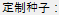
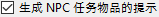
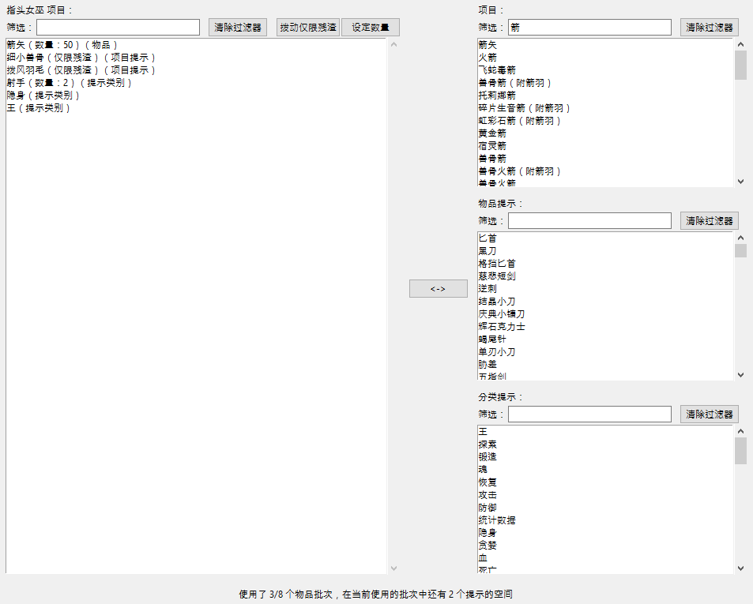
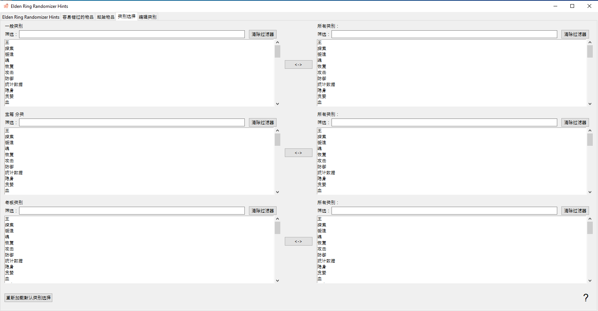
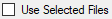
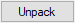

#Elden Ring Randomizer Hints  
  
## 主选项选项卡  
  
启动程序后，您将看到主选项屏幕：  
  
  
如果要切换程序语言，可以从菜单中选择。更改语言需要重新启动程序。  
请注意，这将更改界面语言，但仍会为所有可用语言生成提示。  
  
您需要做的第一件事是选择顶部的可执行文件。您需要的有效可执行文件 [Elden Ring](https://store.steampowered.com/app/1245620/ELDEN_RING/)、[DSMSPortable](https://github.com/mountlover/DSMSPortable)、[Yabber](https://github.com/JKAnderson/Yabber) 或 WitchyBND[(Nexus Mods)](https://www.nexusmods.com/eldenring/mods/3862)[(Github)](https://github.com/ividyon/WitchyBND)，以及 [Elden Ring Item and Enemy Randomizer](https://www.nexusmods.com/eldenring/mods/428) 或 [Elden Ring Fog Gate Randomizer](https://www.nexusmods.com/eldenring/mods/3295) 之一或两者。  
  
  
  
  
选择可执行文件后，您可能会在  窗格中看到活动：  
  
这是从随机发生器读取数据并导出其生成的调节数据的程序。只要可执行文件有效并发生更改或启用的随机化器选项发生更改，就会发生这种情况。  
  
说到这里，左侧有两个选项可以启用或禁用每个随机化器：  
  
  
要生成提示，必须至少启用其中一项，并且其可执行路径必须有效。  
  
在每个选项下都有更多选项，您可以使用它们来自定义您的游戏。  
  
### 提示选项  
  
  
  
#### Item and Enemy Randomizer 选项  
  
：默认情况下，Randomizer Hints 将使用随机发生器剧透文件中的随机种子，但您可以选择为每个种子设置自己的自定义种子。  
：启用此选项可为 NPC 任务重要的物品创建提示。如何获得提示取决于 NPC 和任务阶段。  
：当放置在项目位置的项目属于选定类别时，此选项将在项目位置放置提示。提示将引导您到同一类别中的项目的其他位置。  
：选择此选项可以使类别提示更有可能指向相同或相邻区域中的项目。请注意，如果使用 Fog Gate Randomizer，则此选项不会执行任何操作。  
：此选项会将选定类别中的随机物品的提示放入世界各地的箱子中。您可以选择将收到提示的箱子的百分比。  
：此选项会将所选类别中的随机物品的提示放入世界各地的 Boss 掉落物中。您可以选择将收到提示的老板的百分比。  
：选择此选项可将通过大门、电梯和其他障碍物所需的关键物品的提示放置到这些大门附近的物品位置。 客房钥匙 是一个例外，塔妮丝 可以通过  选项给出提示。  
：通常，提供距离和指南针方向估计的方向提示只会出现在大面积的项目中。对于较小命名区域中的项目的提示将仅显示该项目位于这些区域中。启用此选项可始终提供距离和罗盘方向。不建议。  
  
#### Fog Gate Randomizer 选项  
  
：默认情况下，Randomizer Hints 将使用随机发生器剧透文件中的随机种子，但您可以选择为每个种子设置自己的自定义种子。  
：选择此选项可将门提示放置到这些门附近的项目位置中。  
：此选项会将随机雾门的提示放入世界各地的箱子中。您可以选择将收到提示的箱子的百分比。  
：此选项会将随机雾门的提示放入世界各地的 Boss 掉落物中。您可以选择将收到提示的老板的百分比。  
  
最后，有两个选项不依赖于任一随机发生器，但与 起始物品 选项卡中的设置一起使用：  
  
：此选项用于在游戏开始时在指头女巫尸体上放置物品和提示。  
：启用此选项可使用 孪生老妪 商店编辑后的初始商店库存。  
  
验证文件路径并设置所需选项后，您可以单击  按钮根据您的喜好在游戏中创建提示。提示生成过程需要一些时间， 窗格将显示进度。生成提示后，您需要配置 Mod Engine 2 才能使用该 mod。  
  
但在执行此操作之前，您可能需要查看其他选项卡。  
  
## 容易错过的物品 选项卡  
  
  
这个选项卡非常简单。随机项目列表显示在左侧窗格中。这些是很容易错过或不可能获得的物品。从列表中选择一个项目将在右侧窗格中显示有关其位置以及如何错过它的剧透。如果这里有对您的游戏很重要的项目，您可以看看您是否可能会错过它们，在这种情况下您可以返回并重新运行 Item and Enemy Randomizer 以获得更好的结果。  
  
您将在左侧窗格上方看到一个过滤框。在此框中键入文本将过滤显示与文本匹配的项目。此过滤器出现在其他选项卡中的类似窗格中，并且所有这些过滤器的工作方式都相同。  
  
## 起始物品 选项卡  
  
  
在此选项卡中，您可以设置游戏开始时放置在指头女巫尸体上的物品和提示，并编辑孪生老妪初始商店库存。  
  
### 指头女巫 项目  
  
选项卡的左半部分是 指头女巫 项目选择器：  
  
左侧的大窗格是要放置在尸体上的物品和提示的列表，右侧的三个较小的窗格是所有物品、所有物品提示和所有提示类别的列表。  
  
要将项目、项目提示或类别提示添加到左侧窗格，请从右侧窗格之一中选择它们，然后单击  按钮。相反，您可以选择左侧窗格中的项目，然后单击  按钮将其删除。允许多项选择。  
  
可以更改要放置的物品和提示的数量。在左侧窗格中选择它们，然后单击  按钮设置应放置的数量。  
  
还可以通过在左侧窗格中选择项目提示并单击  按钮来设置单个项目提示的 “仅限残渣” 属性。具有此属性的提示只会指向敌人掉落的物品。例如，在此处的图像中，我正在设置弓箭手版本，因此我有细小兽骨和拨风羽毛的“仅限残渣”提示，这将为我提供给敌人的提示，这些敌人会掉落我需要制作的资源兽骨箭。  
  
最后，在底部你可以看到一个计数器，让你知道尸体位置还剩多少空间。  
  
只有 8 个对象的空间，但有数量的项目仍然只占用 1 个对象空间，并且由于项目提示对象最多可以容纳 4 个提示，因此提示将打包在一起。在上面的示例中，我有 1 个数量为 50 的项目，占用 1 个对象空间，然后是 2 个项目提示、一个数量为 2 的类别提示，以及另外 2 个不同的类别提示，总共 6 个提示。这些提示将被打包到 2 个提示对象中，一个最多有 4 个提示，另一个只有 2 个提示，在使用另一个对象空间之前为另外 2 个提示留出空间。所以总共只使用了 3 个对象空间。  
  
如果启用了  选项而未启用  选项，则提示将尝试指向 宁姆格福 及周边区域中的项目（如果可用）。  
  
### 孪生老妪 商店  
  
选项卡的右半部分是孪生老妪 商店编辑器：  
  
左侧窗格显示商店库存，右侧窗格显示游戏中的所有物品。在商店库存中选择一个项目将导致其插槽出现在下面。选择插槽后，您可以在物品窗格中选择替换物品，然后单击  按钮将商店库存物品替换为新物品。在上图中，我将商店库存中的插槽 14 替换为箭矢，并将其价格设置为 5 符文。  
  
选择插槽后，您可以单击按钮来设置商店库存物品的价格。  
  
您还可以单击  按钮来删除更改并重新加载默认商店库存。  
  
### 关于起始物品的重要说明

由于游戏处理事件的方式，某些物品必须从游戏世界中的位置获取才能发挥其效果。 这包括制作食谱书、绘画和各种任务物品。 如果您在开始或商店中放置了这些物品之一的副本，则在您从游戏世界中的位置获取原始物品之前，它不会起作用。 对于这些项目，最好在开头放置提示。  
  
## 类别选择 选项卡  
  
  
此选项卡允许您选择将哪些类别用于类别提示、宝箱提示和 Boss 掉落提示。每个类别都有一对窗格，左侧窗格显示所选类别，右侧窗格显示所有可用类别。在右侧窗格中选择类别并单击  会将它们添加到左侧窗格中，在左侧窗格中选择项目并单击  会将它们从左侧窗格中删除。允许多项选择。  
  
您可以通过单击  按钮重新加载默认的类别选择集。请注意，如果您在编辑类别选项卡中删除或重命名了某些默认类别或添加了新类别，它们将不会出现在选择中。  
  
## 编辑类别 选项卡  
  
  
在最后一个选项卡中，您可以编辑和删除项目类别，并创建您自己的项目类别。左侧窗格显示所有类别，中间窗格显示所选类别中的项目，右侧窗格显示游戏中的所有项目。  
  
单击  按钮在左侧窗格中创建一个新类别。您还可以在左侧窗格中选择一个类别，然后单击  为其创建新副本， 对其进行重命名，或单击  对其进行删除。  
  
当选择左侧窗格中的类别时，该类别内的项目将显示在中央窗格中。您可以通过选择右侧窗格中的项目并单击  将项目添加到类别中。通过选择中心窗格中的项目并单击 ，可以从类别中删除项目。允许多项选择。  
  
与 指头女巫 项目一样，类别中项目提示的 “仅限残渣” 属性也可以通过在中心窗格中选择它们并单击  按钮来设置。具有此属性的提示只会指向敌人掉落的物品。  
  
您可以通过单击  按钮重新加载默认类别集。请注意，这将完全删除您创建的任何更改或新类别。  
  
## 保存和加载设置  
  
主选项选项卡底部是可用于保存、加载、导入和导出设置的按钮：  
  
加载/保存和导入/导出之间的区别在于按钮适用的设置。加载/保存适用于整个程序的所有选项。导入/导出适用于所有选项*除了*可执行路径和孪生老妪商店。  
  
加载/保存选项文件的扩展名为“.rhs”，可用作您的个人设置配置和备份。  
  
导入/导出选项文件的扩展名为“.rhe”，旨在更便于移植，以便玩家可以交换设置配置，而不会出现用其他人的可执行路径覆盖其可执行路径的问题。  
  
孪生老妪 商店不包含在导出设置中，因为商店库存取决于随机发生器的输出，而随机发生器的输出因玩家而异。尽管这也适用于您自己的不同随机种子，但商店库存仍会保存，因此您可以保留设置文件以与已知种子一起使用。  
  
默认情况下，所有这些设置文件都保存在程序文件夹的 “settings” 文件夹中。  

### 提供的设置

“settings”文件夹中有一些不同的 .rhe 文件，您可以导入并试用。

Sorcerer.rhe：用于魔法构建。 如果您认为一开始同时拥有 卡利亚迅剑 和 辉石魔砾 太多，您可以删除其中一个或两个，也可以向它们添加提示。

Archer.rhe：用于使用弓和匕首的隐形弓箭手构建。 还建议以便宜的价格将箭矢添加到商店。

Priest.rhe：依靠咒语建立信仰。

Bonk.rhe：用于锤子构建。 狠狠地打击事情。

## 配置Mod Engine 2  
  
生成提示后，您需要配置 Mod Engine 2 以包含 Randomizer Hints 作为 mod。该程序生成一个"config_randomizerhints.toml"文件，如下所示：  
  
	# Generated by Elden Ring Randomizer Hints  
	  
	[modengine]  
	debug = false  
	external_dlls = []  
	[extension.mod_loader]  
	enabled = true  
	loose_params = false  
	mods = [  
	    { enabled = true, name = "randomizerhints", path = "C:\\Games\\Utilities\\randomizerHints" },  
	    { enabled = true, name = "fog", path = "C:\\Games\\Utilities\\fog\\" },  
	    { enabled = true, name = "randomizer", path = "C:\\Games\\Utilities\\randomizer\\" },  
	]  
	[extension.scylla_hide]  
	enabled = false  
  
显示哪些 mod 路径以及如何使用此文件将取决于您的设置。  
  
如果您计划使用 Item and Enemy Randomizer 或 Fog Gate Randomizer 中的内置 Mod Engine 2 功能，则需要将此 toml 文件复制到随机化器文件夹中，并将其重命名以替换 toml 文件已经存在，或者编辑随机发生器的 toml 文件以添加上面的 "randomizerhints" mod 行。  
  
如果您使用 Mod Engine 2 的手动安装，请替换 Mod Engine 2 文件夹中的"config_eldenring.toml"文件，或对其进行编辑并添加上述 "randomizerhints" mod 行。  
  
与其他 mod 合并超出了这些说明的范围，但在 toml 文件中，"randomizerhints" 必须位于"fog" 之前，"fog" 必须位于"randomizer" 之前。任何位于这些行之前的带有 regulation.bin 文件的 mod 都将覆盖随机数发生器数据并导致其无法工作。有关详细信息，请查看 [Mod Engine 2](https://github.com/soulsmods/ModEngine2#get-started-guide) 文档。  
  
至于受Randomizer Hints影响的具体参数和文件：  
  
#### 参数：  
  
> ItemLotParam_map：添加 ID 10010000（指头女巫 尸体）之后的条目，添加世界各地各种物品批次中的条目。  
>EquipParamGoods：添加 ID 300000 以上的条目。  
>ShopLineupParam：添加各个NPC商店的条目，更改孪生老妪商店中的条目。  
  
#### 文件：  
  
> item.msgbnd.dcx（所有语言）  
  
## 提示对象  
  
项目提示对象最多可以包含四个提示，雾门提示对象最多可以包含三个提示。它们出现在您的库存的信息类别中。为了使事情井井有条，雾门提示对象出现在顶部的组中，然后是下一组中的项目提示对象，然后是下面的正常游戏信息项目组。  
  
使用默认设置，Randomizer Hints 会生成*大量*提示对象，并且您的信息项库存可能会变得非常大。因此，该程序还对游戏进行了修改，以允许您将信息项目放入您的库存箱中，或者完全丢弃它们。请小心，因为这意味着您也可以放弃绘画和庄园请求。  
  
## 可用语言  
  
Elden Ring Randomizer Hints 对于 Elden Ring 中支持的除英语之外的语言有（较差）本地化数据，并且可以生成所有这些语言的提示。 *但是*，这取决于随机发生器提供的修改后的游戏文件。 Item and Enemy Randomizer 具有所有语言的这些文件，但 Fog Gate Randomizer 仅具有英语的文件。如果您同时使用两个随机发生器，这仍然可以正常工作，但如果您"仅"使用Fog Gate Randomizer，则程序将仅获取英文文件并仅生成英文提示。  
  
要解决这个问题，您可以使用 Nordgaren's UXM Selective Unpacker[(Nexus)](https://www.nexusmods.com/eldenring/mods/1651)[(Github)](https://github.com/Nordgaren/UXM-Selective-Unpack) 自行提取所需的游戏文件：  
  
  
首先确保 Elden Ring 安装路径正确，然后单击  按钮。  
  
您在这里唯一需要选择的是“msg” 文件夹。单击"确定"，然后选中  复选框，然后单击  按钮。稍后，解压完成，您将能够在 Elden Ring Game 文件夹中找到解压后的 “msg” 文件夹。将此文件夹移动到Randomizer Hints 文件夹中的“locale” 文件夹中，即使仅使用Fog Gate Randomizer，程序也能够找到所有本地化文件。  
  
## 策略和剧透  
  
如果您的角色构建需要多种项目，请使用这些项目创建类别并在常规类别中启用它们。这将使您能够按照一系列提示来获得所有它们。在 指头女巫 项目中放置对该类别的提示以开始使用。  
  
如果您正在寻找特定的商品，并且收到同一类别中不需要的商品的提示，请不要忽略它。获得该物品还将为该类别中的其他物品提供提示，其中之一可能就是您正在寻找的物品。  
  
如果您想尽可能多地完成 NPC 任务，请避免盲目地通过随机大门而不搜索附近区域以寻找通向何处的提示。如果你很早就进入恸哭沙丘或亚坛高原，你可能会错过亚历山大和布莱泽任务中的早期物品。  
  
如果您使用Fog Gate Randomizer，教堂侧门开始关闭。但是，如果您在去任何地方之前使用回归之钟，它就会打开！如果你启用了！，雾门去向的提示将在里面的战利品中。  
  
如果您正在寻找提示，该物品的外观可能是一个线索。提示物品不会在纯白色物品位置中找到，而只能在紫色或金色物品位置中找到。  
  
如果您获得的提示对象数量变得令人难以承受且难以处理，请继续尝试类别和设置以减少您获得的数量。我喜欢获得大量提示，然后找出完成所有任务的最佳路线，并尽可能高效地完成我的构建，但每个人的游戏风格都不同。您也许能够提出自己的设置，从而获得不那么混乱但仍然非常有目标导向的体验。  
  
如果您大大减少可用于生成提示的类别/物品的数量，您可能还需要减少它们可以出现的箱子和 Boss 掉落的百分比，以避免获得太多冗余提示。  

