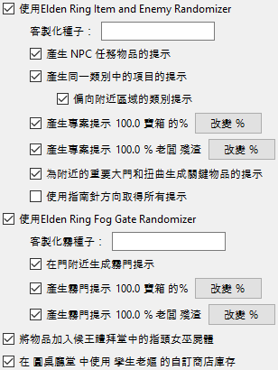
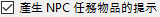
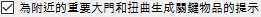
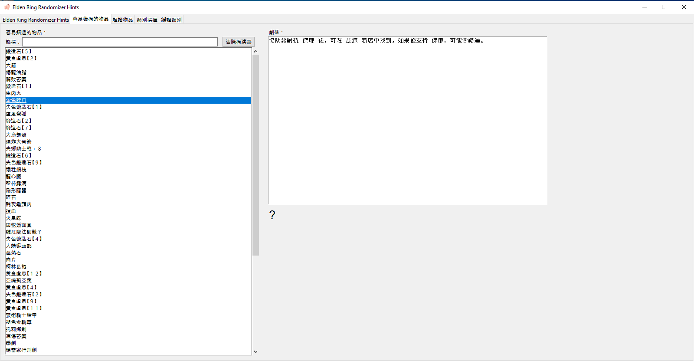
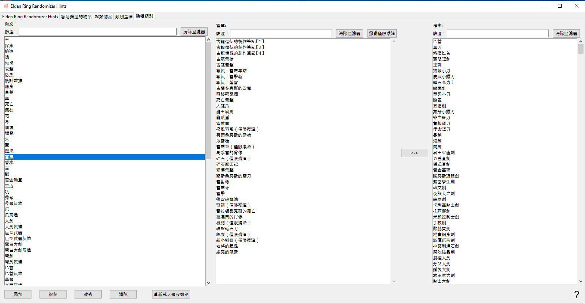

＃Elden Ring Randomizer Hints  
  
## 主選項選項卡  
  
啟動程式後，您將看到主選項畫面：  
  
  
如果要切換程式語言，可以從選單中選擇。更改語言需要重新啟動程式。  
請注意，這將更改介面語言，但仍會為所有可用語言產生提示。  
  
您需要做的第一件事是選擇頂部的可執行檔。您需要可執行文件[Elden Ring](https://store.steampowered.com/app/1245620/ELDEN_RING/)、[DSMSPortable](https://github.com/mountlover/DSMSPortable)、[Yabber](https://github.com/JKAnderson/Yabber) 或WitchyBND[(Nexus Mods)](https://www.nexusmods.com/eldenring/mods/3862)[(Github)](https://github.com/ividyon/WitchyBND)，以及 [Elden Ring Item and Enemy Randomizer](https://www.nexusmods.com/eldenring/mods/428) 或 [Elden Ring Fog Gate Randomizer](https://www.nexusmods.com/eldenring/mods/3295) 之一或兩者。  
  
  
  
  
選擇可執行檔後，您可能會在  窗格中看到活動：  
  
這是從隨機產生器讀取資料並導出其產生的調節資料的程式。只要可執行檔有效並發生更改或啟用的隨機化器選項發生更改，就會發生這種情況。  
  
說到這裡，左側有兩個選項可以啟用或停用每個隨機化器：  
  
  
若要產生提示，必須至少啟用其中一項，且其可執行路徑必須有效。  
  
在每個選項下都有更多選項，您可以使用它們來自訂您的遊戲。  
  
### 提示選項  
  
  
  
#### Item and Enemy Randomizer 選項  
  
：預設情況下，Randomizer Hints 將使用隨機發生器劇透檔案中的隨機種子，但您可以選擇為每個種子設定自己的自訂種子。  
：啟用此選項可為 NPC 任務重要的物品建立提示。如何獲得提示取決於 NPC 和任務階段。  
：當放置在項目位置的項目屬於選定類別時，此選項將在項目位置放置提示。提示將引導您到同一類別中的項目的其他位置。  
：選擇此選項可使類別提示更有可能指向相同或相鄰區域中的項目。請注意，如果使用 Fog Gate Randomizer，則此選項不會執行任何操作。  
：此選項會將選定類別中的隨機物品的提示放入世界各地的箱子中。您可以選擇將收到提示的箱子的百分比。  
：此選項會將選定類別中的隨機物品的提示放入世界各地的 Boss 掉落中。您可以選擇將收到提示的老闆的百分比。  
：選擇此選項可將通過大門、電梯和其他障礙物所需的關鍵物品的提示放置到這些大門附近的物品位置。 客房鑰匙 是一個例外，塔妮絲 可以透過  選項給出提示。  
：通常，提供距離和指南針方向估計的方向提示只會出現在大面積的項目中。對於較小命名區域中的項目的提示將僅顯示該項目位於這些區域中。啟用此選項可始終提供距離和羅盤方向。不建議。  
  
#### Fog Gate Randomizer 選項  
  
：預設情況下，Randomizer Hints 將使用隨機發生器劇透檔案中的隨機種子，但您可以選擇為每個種子設定自己的自訂種子。  
：選擇此選項可將門提示放置到這些門附近的項目位置。  
：此選項會將隨機霧門的提示放入世界各地的箱子中。您可以選擇將收到提示的箱子的百分比。  
：此選項會將隨機霧門的提示放入世界各地的 Boss 掉落物中。您可以選擇將收到提示的老闆的百分比。  
  
最後，有兩個選項不依賴任一隨機產生器，但與 起始物品 選項卡中的設定一起使用：  
  
：此選項用於在遊戲開始時在指頭女巫屍體上放置物品和提示。  
：啟用此選項可使用 孿生老嫗 商店編輯後的初始商店庫存。  
  
驗證檔案路徑並設定所需選項後，您可以點擊  按鈕根據您的喜好在遊戲中建立提示。提示產生過程需要一些時間， 窗格將顯示進度。產生提示後，您需要配置 Mod Engine 2 才能使用該 mod。  
  
但在執行此操作之前，您可能需要查看其他選項卡。  
  
## 容易錯過的物品 選項卡  
  
  
這個選項卡非常簡單。隨機項目清單顯示在左側窗格中。這些是很容易錯過或不可能獲得的物品。從清單中選擇一個項目將在右側窗格中顯示有關其位置以及如何錯過它的劇透。如果這裡有一些對您的遊戲很重要的項目，您可以看看您是否可能會錯過它們，在這種情況下您可以返回並重新運行 Item and Enemy Randomizer 以獲得更好的結果。  
  
您將在左側窗格上方看到一個過濾框。在此方塊中鍵入文字將過濾顯示與文字相符的項目。此篩選器出現在其他標籤中的類似窗格中，並且所有這些篩選器的工作方式都相同。  
  
## 起始物品 選項卡  
  
  
在此標籤中，您可以設定遊戲開始時放置在指頭女巫屍體上的物品和提示，並編輯孿生老嫗初始商店庫存。  
  
### 指頭女巫 項目  
  
選項卡的左半部是 指頭女巫 項目選擇器：  
  
左側的大窗格是要放置在屍體上的物品和提示的列表，右側的三個較小的窗格是所有物品、所有物品提示和所有提示類別的列表。  
  
若要將項目、項目提示或類別提示新增至左側窗格，請從右側窗格之一中選取它們，然後按一下  按鈕。相反，您可以選擇左側窗格中的項目，然後按一下  按鈕將其刪除。允許多項選擇。  
  
可以更改要放置的物品和提示的數量。在左側窗格中選擇它們，然後按一下  按鈕設定應放置的數量。  
  
也可以透過在左側窗格中選擇項目提示並點擊  按鈕來設定單一項目提示的 「僅限殘渣」 屬性。具有此屬性的提示只會指向敵人掉落的物品。例如，在此處的圖像中，我正在設定弓箭手版本，因此我有細小獸骨和撥風羽毛的「僅限殘渣」提示，這將為我提供給敵人的提示，這些敵人會掉落我需要製作的資源獸骨箭。  
  
最後，在底部你可以看到一個計數器，讓你知道屍體位置還剩多少空間。  
  
只有 8 個物件的空間，但有數量的項目仍然只佔用 1 個物件空間，並且由於項目提示物件最多可以容納 4 個提示，因此提示將打包在一起。在上面的範例中，我有1 個數量為50 的項目，佔用1 個物件空間，然後是2 個項目提示、一個數量為2 的類別提示，以及另外2 個不同的類別提示，總共6 個提示。這些提示將被打包到 2 個提示物件中，一個最多有 4 個提示，另一個只有 2 個提示，在使用另一個物件空間之前為另外 2 個提示留出空間。所以總共只使用了 3 個物件空間。  
  
如果啟用了  選項而未啟用  選項，則提示將嘗試指向 寧姆格福 及週邊區域中的項目（如果可用）。  
  
### 孿生老嫗 商店  
  
選項卡的右半部是孿生老嫗 商店編輯器：  
  
左側窗格顯示商店庫存，右側窗格顯示遊戲中的所有物品。在商店庫存中選擇一個項目將導致其插槽出現在下方。選擇插槽後，您可以在物品窗格中選擇替換物品，然後按一下  按鈕將商店庫存物品替換為新物品。在上圖中，我將商店庫存中的插槽 14 替換為箭矢，並將其價格設為 5 符文。  
  
選擇插槽後，您可以點擊按鈕來設定商店庫存物品的價格。  
  
您也可以點擊  按鈕來刪除變更並重新載入預設商店庫存。  
  
### 關於起始物品的重要說明

由於遊戲處理事件的方式，某些物品必須從遊戲世界中的位置獲取才能發揮其效果。 這包括製作食譜書、繪畫和各種任務物品。 如果您在開始或商店中放置了這些物品之一的副本，則在您從遊戲世界中的位置獲取原始物品之前，它不會起作用。 對於這些項目，最好在開頭放置提示。  
  
## 類別選擇 選項卡  
  
  
此標籤可讓您選擇將哪些類別用於類別提示、寶箱提示和 Boss 掉落提示。每個類別都有一對窗格，左側窗格顯示所選類別，右側窗格顯示所有可用類別。在右側窗格中選擇類別並點擊 會將它們新增至左側窗格中，在左側窗格中選擇項目並點擊 會將它們從左側窗格中刪除。允許多項選擇。  
  
您可以透過點擊  按鈕重新載入預設的類別選擇集。請注意，如果您在編輯類別標籤中刪除或重新命名了某些預設類別或新增了新類別，它們將不會出現在選擇中。  
  
## 編輯類別 選項卡  
  
  
在最後一個標籤中，您可以編輯和刪除項目類別，並建立您自己的項目類別。左側窗格顯示所有類別，中間窗格顯示所選類別中的項目，右側窗格顯示遊戲中的所有項目。  
  
點選  按鈕在左側窗格中建立新類別。您也可以在左側窗格中選擇一個類別，然後按一下 為其建立新副本， 對其進行重新命名，或按一下 對其進行刪除。  
  
當選擇左側窗格中的類別時，該類別內的項目將顯示在中央窗格中。您可以透過選擇右側窗格中的項目並點擊  將項目新增至類別。選擇中心窗格中的項目並按一下 ，可以從類別中刪除項目。允許多項選擇。  
  
與 指頭女巫 項目一樣，類別中項目提示的 「僅限殘渣」 屬性也可以透過在中心窗格中選擇它們並點擊  按鈕來設定。具有此屬性的提示只會指向敵人掉落的物品。  
  
您可以透過點擊  按鈕重新載入預設類別集。請注意，這將完全刪除您建立的任何變更或新類別。  
  
## 儲存和載入設定  
  
主選項標籤底部是可用於儲存、載入、匯入和匯出設定的按鈕：  
  
載入/儲存和匯入/匯出之間的差異在於按鈕適用的設定。載入/儲存適用於整個程式中的所有選項。導入/匯出適用於所有選項*除了*可執行路徑和孿生老嫗商店。  
  
載入/儲存選項檔案的副檔名為「.rhs」，可用作您的個人設定配置和備份。  
  
導入/匯出選項檔案的副檔名為「.rhe」，旨在更便於移植，以便玩家可以交換設定配置，而不會出現用其他人的可執行路徑覆蓋其可執行路徑的問題。  
  
孿生老嫗 商店不包含在匯出設定中，因為商店庫存取決於隨機產生器的輸出，而隨機產生器的輸出因玩家而異。儘管這也適用於您自己的不同隨機種子，但商店庫存仍會保存，因此您可以保留設定文件以與已知種子一起使用。  
  
預設情況下，所有這些設定檔都保存在程式資料夾的 「settings」 資料夾中。  

### 提供的設置

「settings」資料夾中有一些不同的 .rhe 文件，您可以匯入並試用。

Sorcerer.rhe：用於魔法建構。 如果您認為一開始同時擁有 卡利亞迅劍 和 輝石魔礫 太多，您可以刪除其中一個或兩個，也可以為它們添加提示。

Archer.rhe：用於使用弓和匕首的隱形弓箭手建造。 還建議以便宜的價格將箭矢添加到商店。

Priest.rhe：靠著咒語建立信仰。

Bonk.rhe：用於錘子建造。 狠狠地打擊事情。

## 配置Mod Engine 2  
  
產生提示後，您需要配置 Mod Engine 2 以包含 Randomizer Hints 作為 mod。該程式產生一個"config_randomizerhints.toml"文件，如下所示：  
  
	# Generated by Elden Ring Randomizer Hints  
	  
	[modengine]  
	debug = false  
	external_dlls = []  
	[extension.mod_loader]  
	enabled = true  
	loose_params = false  
	mods = [  
	    { enabled = true, name = "randomizerhints", path = "C:\\Games\\Utilities\\randomizerHints" },  
	    { enabled = true, name = "fog", path = "C:\\Games\\Utilities\\fog\\" },  
	    { enabled = true, name = "randomizer", path = "C:\\Games\\Utilities\\randomizer\\" },  
	]  
	[extension.scylla_hide]  
	enabled = false  
  
顯示哪些 mod 路徑以及如何使用此檔案將取決於您的設定。  
  
如果您打算使用 Item and Enemy Randomizer 或 Fog Gate Randomizer 中的內建 Mod Engine 2 功能，則需要將此 toml 檔案複製到隨機化器資料夾中，並重命名它以替換已經存在的 toml 文件或編輯隨機產生器的toml 檔案以新增上面的"randomizerhints" mod 行。  
  
如果您使用 Mod Engine 2 的手動安裝，請替換 Mod Engine 2 資料夾中的"config_eldenring.toml"文件，或對其進行編輯並添加上述 "randomizerhints" mod 行。  
  
與其他 mod 合併超出了這些說明的範圍，但在 toml 文件中，"randomizerhints" 必須位於"fog" 之前，"fog" 必須位於"randomizer" 之前。任何位於這些行之前的帶有 regulation.bin 檔案的 mod 都會覆蓋隨機數產生器資料並導致其無法運作。有關詳細信息，請查看 [Mod Engine 2](https://github.com/soulsmods/ModEngine2#get-started-guide) 文件。  
  
至於受Randomizer Hints影響的具體參數和檔案：  
  
#### 參數：  
  
> ItemLotParam_map：新增 ID 10010000（指頭女巫 屍體）之後的條目，新增世界各地各種物品批次中的條目。  
>EquipParamGoods：新增 ID 300000 以上的條目。  
>ShopLineupParam：新增各NPC商店的條目，更改孿生老嫗商店中的條目。  
  
#### 檔案：  
  
> item.msgbnd.dcx（所有語言）  
  
## 提示對象  
  
項目提示物件最多可以包含四個提示，霧門提示物件最多可以包含三個提示。它們出現在您的庫存的資訊類別中。為了使事情井井有條，霧門提示對像出現在頂部的組中，然後是下一組中的項目提示對象，然後是下面的正常遊戲資訊項目組。  
  
使用預設設置，Randomizer Hints 會產生*大量*提示對象，並且您的資訊項目庫存可能會變得非常大。因此，該程式還對遊戲進行了修改，以允許您將資訊項目放入您的庫存箱中，或完全丟棄它們。請小心，因為這意味著您也可以放棄繪畫和莊園請求。  
  
## 可用語言  
  
Elden Ring Randomizer Hints 對於 Elden Ring 中支援的除英語之外的語言有（較差）本地化數據，並且可以產生所有這些語言的提示。 *但是*，這取決於隨機產生器提供的修改後的遊戲檔案。 Item and Enemy Randomizer 具有所有語言的這些文件，但 Fog Gate Randomizer 僅具有英語的文件。如果您同時使用兩個隨機產生器，這仍然可以正常工作，但如果您「僅」使用Fog Gate Randomizer，則程式將僅獲取英文檔案並僅產生英文提示。  
  
要解決這個問題，您可以使用 Nordgaren's UXM Selective Unpacker[(Nexus)](https://www.nexusmods.com/eldenring/mods/1651)[(Github)](https://github.com/Nordgaren/UXM-Selective-Unpack) 自行提取所需的遊戲檔案：  
  
  
首先確保 Elden Ring 安裝路徑正確，然後按一下  按鈕。  
  
您在這裡唯一需要選擇的是「msg」 資料夾。按一下"確定"，然後選取  複選框，然後按一下  按鈕。稍後，解壓縮完成，您將能夠在 Elden Ring Game 資料夾中找到解壓縮的 「msg」 資料夾。將此資料夾移至Randomizer Hints 資料夾中的「locale」 資料夾中，即使僅使用Fog Gate Randomizer，程式也能夠找到所有本地化檔案。  
  
## 策略與劇透  
  
如果您的角色建置需要多種項目，請使用這些項目建立類別並在常規類別中啟用它們。這將使您能夠按照一系列提示來獲得所有它們。在 指頭女巫 專案中放置對該類別的提示以開始使用。  
  
如果您正在尋找特定的商品，並且收到同一類別中不需要的商品的提示，請不要忽略它。獲得該物品還將為該類別中的其他物品提供提示，其中之一可能是您正在尋找的物品。  
  
如果您想盡可能多地完成 NPC 任務，請避免盲目地通過隨機大門而不搜索附近區域以尋找通往何處的提示。如果你很早就進入慟哭沙丘或亞壇高原，你可能會錯過亞歷山大和布萊澤任務中的早期物品。  
  
如果您使用Fog Gate Randomizer，教堂側門開始關閉。但是，如果您在去任何地方之前使用回歸之鐘，它就會打開！如果你啟用了！，霧門去向的提示將在裡面的戰利品中。  
  
如果您正在尋找提示，該物品的外觀可能是一個線索。提示物品不會在純白色物品位置中找到，而只能在紫色或金色物品位置中找到。  
  
如果您獲得的提示對象數量變得令人難以承受且難以處理，請繼續嘗試類別和設定以減少您獲得的數量。我喜歡獲得大量提示，然後找出完成所有任務的最佳路線，並盡可能高效地完成我的構建，但每個人的遊戲風格都不同。您也許能夠提出自己的設置，從而獲得不那麼混亂但仍然非常有目標導向的體驗。  
  
如果您大幅減少可用於產生提示的類別/物品的數量，您可能還需要減少它們可以出現的箱子和 Boss 掉落的百分比，以避免獲得太多多餘的提示。  

