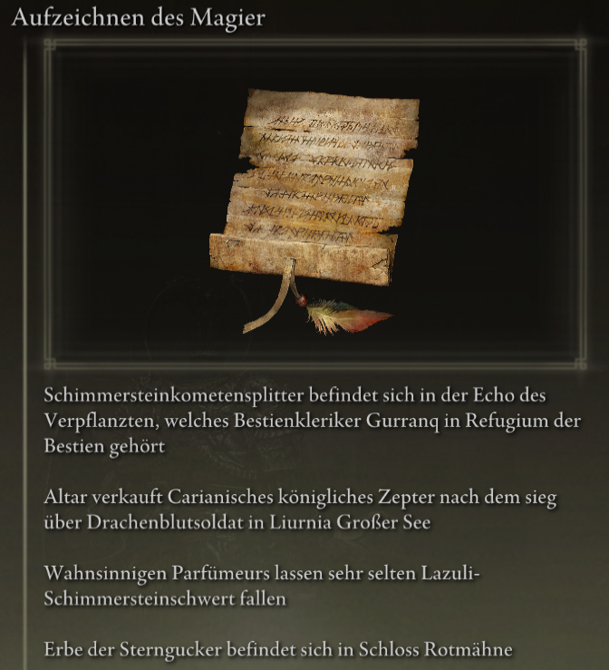
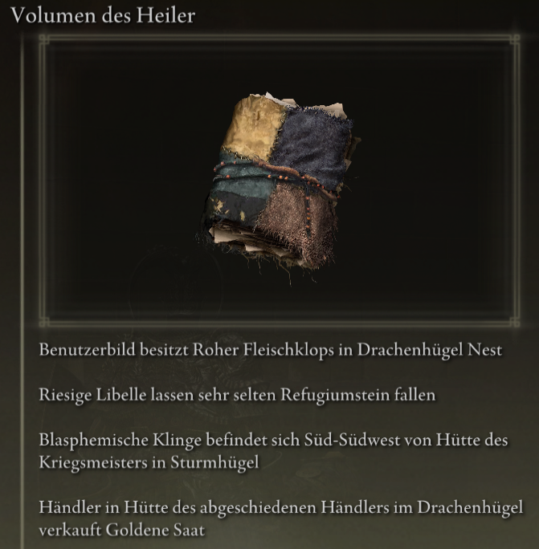
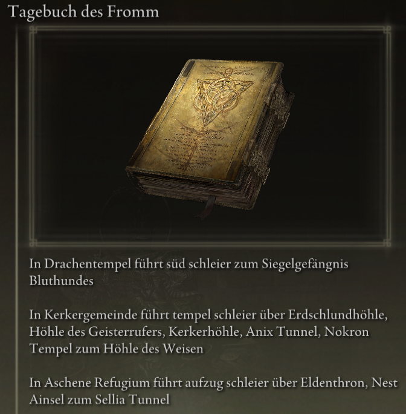

# Elden Ring Randomizer Hints  
  
## Beschreibung  
  
Elden Ring Randomizer Hints ist ein Mod für Elden Ring zur Verwendung mit [thefifthmatt's](https://www.nexusmods.com/eldenring/users/58426171) [Elden Ring Item and Enemy Randomizer](https://www.nexusmods.com/eldenring/mods/428) und/oder [Elden Ring Fog Gate Randomizer](https://www.nexusmods.com/eldenring/mods/3295) . Es generiert im Spiel Hinweisobjekte, die dem Spieler Informationen über den Standort von Gegenständen und/oder die Routen geben, denen zufällig ausgewählte Nebeltore folgen. Dies ermöglicht ein zielgerichteteres Spiel und bietet dennoch die Möglichkeit, die Neuheit einer zufälligen Welt zu genießen.  
  
Mir haben die Souls-Randomizer sehr gut gefallen, aber mit Elden Ring ist die Welt so groß und offen, dass ich wirklich eine Möglichkeit wollte, nützliche Gegenstände für meine Charakter-Builds zu finden, ohne jeden Bereich, den ich betrete, abzusuchen und dabei trotzdem das Gefühl des Erkundens zu genießen das Unbekannte. Dieser Mod ist das Ergebnis.  
  
## Wie es funktioniert  
  
#### Mit Elden Ring Item and Enemy Randomizer:  
  
Hinweisobjekte können zwischen 1 und 4 Hinweise enthalten, die Anweisungen, Informationen zum Abwurf des Feindes oder Informationen zum Besitz eines Gegenstands enthalten.  
  
  
  
Der Spieler kann Kategorien von Gegenständen definieren und Hinweise zu Gegenständen in diesen Kategorien können generiert werden, die auf die Standorte anderer Gegenstände in denselben Kategorien verweisen. Dadurch entsteht eine Art Brotkrumenspur, der der Spieler folgen kann.  
  
Für NPC-Questgegenstände können Hinweise gegeben werden. Wo und wie der Spieler sie erhält, hängt vom Gegenstand und der Phase jeder Quest ab.  
  
Zu Beginn des Spiels können zufällige Kategoriehinweise und/oder spezifische Gegenstandshinweise auf der Leiche von Fingerjungfer platziert werden, um einen Ausgangspunkt zu bieten.  
  
#### Mit Elden Ring Fog Gate Randomizer:  
  
Hinweisobjekte können zwischen 1 und 3 Hinweise enthalten, die den Weg beschreiben, den ein Nebeltor oder Warp nimmt, um eine Verbindung zu einem Bereich mit mehr als einem Ausgang herzustellen.  
  
  
**Hinweis:** Elden Ring Randomizer Hints ist nur für die Verwendung mit dem World Shuffle-Modus von Elden Ring Fog Gate Randomizer vorgesehen. Die Verwendung in anderen Modi kann zu unerwarteten Ergebnissen führen.  
  
#### Mit einem oder beiden Randomizern:  
  
Hinweise auf Nebeltore und/oder Gegenstände, die zum Passieren von Toren benötigt werden, können zufällig in der Nähe ihrer Tore platziert werden.  
  
Zufällige Hinweise auf Gegenstände aus bestimmten Kategorien und zufällige Hinweise auf Nebeltore können in einem bestimmten Prozentsatz von Truhen und/oder Boss-Drops platziert werden.  
  
Gewünschte Startgegenstände können auch auf der Fingerjungfer-Leiche und/oder im Zwillingsjungferhüllen Anfangsinventar in Tafelrundfeste platziert werden.  
  
## Erste Schritte  
  
Elden Ring Randomizer Hints ist eine Python Anwendung für Windows, die die integrierte Tkinter-Bibliothek von Python für die Benutzeroberfläche verwendet. Es kann vom bereitgestellten PyInstaller erstellten EXE oder direkt aus der Quelle ausgeführt werden.  
  
Der Quellordner oder der Ordner, in dem sich EXE befindet, ist der Mod-Ordner, auf den die Konfiguration von Mod Engine 2 verweisen muss. Dies ähnelt der Funktionsweise der Randomizer. Siehe die Dokumentation von Mod Engine 2.  
  
#### Anforderungen  
  
[Python 3.10](https://www.python.org) oder höher (wenn nicht das eigenständige EXE verwendet wird)  
   
Eine installierte Kopie von [Elden Ring](https://store.steampowered.com/app/1245620/ELDEN_RING/)  
   
[Mod Engine 2](https://github.com/soulsmods/ModEngine2) (wenn nicht der integrierte Launcher in den Randomizern verwendet wird)  
  
[Elden Ring Item and Enemy Randomizer v0.7.3/v0.8](https://www.nexusmods.com/eldenring/mods/428) und/oder [Elden Ring Fog Gate Randomizer v0.1.7b](https://www.nexusmods.com/eldenring/mods/3295)  
  
[Yabber](https://github.com/JKAnderson/Yabber) oder WitchyBND[(Nexus Mods)](https://www.nexusmods.com/eldenring/mods/3862)[(Github)](https://github.com/ividyon/WitchyBND) zum Entpacken und Neupacken von Spieldateien  
  
mountlover's [DSMSPortable](https://github.com/mountlover/DSMSPortable) zum Ändern von Spieldateien  
   
Stellen Sie sicher, dass diese gemäß den jeweiligen Anweisungen installiert sind und dass Sie den/die Randomizer bereits ausgeführt haben, bevor Sie dieses Programm ausführen und Hinweise generieren.  
  
#### Eigenständig EXE  
  
>Laden Sie die Datei ZIP von der [Releases-Seite](https://github.com/TheOldManAndTheC/randomizerHints/releases) herunter und extrahieren Sie sie in den gewünschten Ordner.  
>  
>Führen Sie randomizerHints.exe aus, um das Programm zu starten.  
  
#### Python Quelle  
  
<blockquote>  
Ändern Sie in einer Befehlsshell das Arbeitsverzeichnis in das Verzeichnis, in dem sich der Mod-Ordner befinden soll, und klonen Sie dann das Repository:  
  
```  
git clone --recursive https://github.com/TheOldManAndTheC/randomizerHints  
   
cd randomizerHints  
```  
  
Führen Sie dann das Programm mit Python aus:  
  
```  
python randomizerHints.py  
```  
  
Oder wenn Sie [PyInstaller](https://pyinstaller.org/en/stable/) installiert haben, können Sie Ihr eigenes EXE mit der bereitgestellten Batch-Datei erstellen:  
```  
buildExe.bat  
```  
  
</blockquote>  
  
Einzelheiten zur Konfiguration und Verwendung des Mods finden Sie im Ordner [docs](.).  
  
#### Konfigurieren von Mod Engine 2  
  
Nachdem Sie Hinweise generiert haben, müssen Sie Mod Engine 2 so konfigurieren, dass Randomizer Hints als Mod enthalten ist. Das Programm generiert eine „config_randomizerhints.toml"-Datei, die etwa so aussieht:  
  
	# Generated by Elden Ring Randomizer Hints  
	  
	[modengine]  
	debug = false  
	external_dlls = []  
	[extension.mod_loader]  
	enabled = true  
	loose_params = false  
	mods = [  
	    { enabled = true, name = "randomizerhints", path = "C:\\Games\\Utilities\\randomizerHints" },  
	    { enabled = true, name = "fog", path = "C:\\Games\\Utilities\\fog\\" },  
	    { enabled = true, name = "randomizer", path = "C:\\Games\\Utilities\\randomizer\\" },  
	]  
	[extension.scylla_hide]  
	enabled = false  
  
Welche Mod-Pfade angezeigt werden und wie Sie diese Datei verwenden, hängt von Ihrem Setup ab.  
  
Wenn Sie die integrierte Mod Engine 2-Funktion in Item and Enemy Randomizer oder Fog Gate Randomizer verwenden möchten, müssen Sie diese toml-Datei entweder in den Randomizer-Ordner kopieren und sie umbenennen, um die toml-Datei zu ersetzen bereits vorhanden, oder bearbeiten Sie die Datei toml des Randomizers, um die obige Mod-Zeile "randomizerhints" hinzuzufügen.  
  
Wenn Sie eine manuelle Installation von Mod Engine 2 verwenden, ersetzen Sie entweder die Datei „config_eldenring.toml" im Ordner Mod Engine 2 oder bearbeiten Sie sie und fügen Sie die obige Mod-Zeile "randomizerhints" hinzu.  
  
Das Zusammenführen mit anderen Mods liegt außerhalb des Rahmens dieser Anleitung, aber in der toml-Datei muss "randomizerhints" vor "fog" stehen, welches vor "randomizer" stehen muss. Alle Mods mit einer regulation.bin-Datei, die vor diesen Zeilen stehen, überschreiben die Randomizer-Daten und führen dazu, dass sie nicht funktionieren. Weitere Informationen finden Sie in der Dokumentation [Mod Engine 2](https://github.com/soulsmods/ModEngine2#get-started-guide).  
  
## Unterstützung  
  
Elden Ring Randomizer Hints ist kostenlose Open-Source-Software, aber wenn Ihnen der Mod gefällt und Sie mich unterstützen möchten, können Sie mir eine Spende senden an [itch.io](https://the-old-man-and-the-c.itch.io/elden-ring-randomizer-hints), [NexusMods](https://www.nexusmods.com/eldenring/mods/4096) oder [Ko-fi](https://ko-fi.com/theoldmanandthec).  
  
## Credits  
  
Dieser Mod ist nur möglich aufgrund der unermüdlichen Bemühungen der Souls-Modding-Community und der Entwickler von [Mod Engine 2](https://github.com/soulsmods/ModEngine2), [Yabber](https://github.com/JKAnderson/Yabber), [WitchyBND](https://github.com/ividyon/WitchyBND) und [UXM Selective Unpacker](https://github.com/Nordgaren/UXM-Selective-Unpack) insbesondere.  
Besonderer Dank geht an:  
[thefifthmatt](https://www.nexusmods.com/eldenring/users/58426171) für seine brillanten Zufallsgeneratoren, die mir Hunderte, wenn nicht Tausende Stunden zusätzliche Spielzeit bei verschiedenen Souls-Spielen beschert haben.  
[mountlover](https://github.com/mountlover) für sein bahnbrechendes DSMSPortable-Tool, das das geskriptete Souls-Modding so viel einfacher macht. Dieser Mod würde ohne ihn nicht existieren.  
  
Vielen Dank an alle für Ihre Arbeit.  
  
## Lizenz  
  
Elden Ring Randomizer Hints copyright (c) 2023 The Old Man and the C  
  
Elden Ring Randomizer Hints is free software: you can redistribute it and/or modify it under the terms of the GNU Affero General Public License as published by the Free Software Foundation, either version 3 of the License, or (at your option) any later version.  
  
Elden Ring Randomizer Hints is distributed in the hope that it will be useful,  but WITHOUT ANY WARRANTY; without even the implied warranty of MERCHANTABILITY or FITNESS FOR A PARTICULAR PURPOSE. See the GNU Affero General Public License  for more details.  
  
You should have received a copy of the GNU Affero General Public License along with Elden Ring Randomizer Hints. If not, see <https://www.gnu.org/licenses/>.  
  
***  
  
mvcTkinter copyright (c) 2023 The Old Man and the C  
  
mvcTkinter is free software: you can redistribute it and/or modify it under the terms of the GNU Affero General Public License as published by the Free Software Foundation, either version 3 of the License, or (at your option) any later version.  
  
mvcTkinter is distributed in the hope that it will be useful,  but WITHOUT ANY WARRANTY; without even the implied warranty of MERCHANTABILITY or FITNESS FOR A PARTICULAR PURPOSE. See the GNU Affero General Public License  for more details.  
  
You should have received a copy of the GNU Affero General Public License along with mvcTkinter. If not, see <https://www.gnu.org/licenses/>.  
  
***  
  
scroll-paper.ico (c) by  Rafiico Creative  
  
Source: <https://iconscout.com/free-icon/scroll-paper-13>  
  
scroll-paper.ico is licensed under a Creative Commons Attribution 4.0 International License.  
  
You should have received a copy of the license along with this work. If not, see <http://creativecommons.org/licenses/by/4.0/>.
