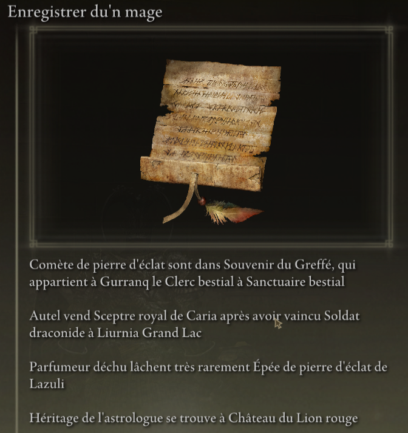
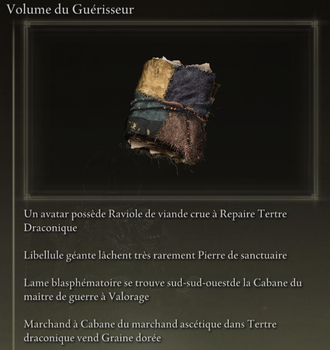
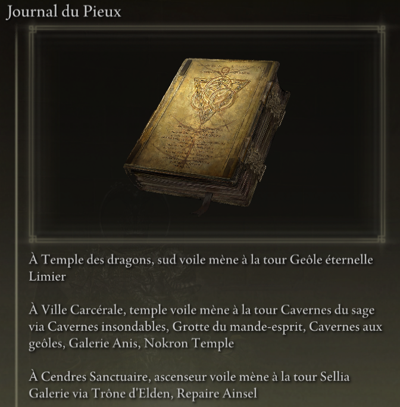

# Elden Ring Randomizer Hints  
  
## Description  
  
Elden Ring Randomizer Hints est un mod pour Elden Ring à utiliser avec [thefifthmatt's] (https://www.nexusmods.com/eldenring/users/58426171) [Elden Ring Item and Enemy Randomizer] (https://www.nexusmods.com/eldenring/mods/428) et / ou [Elden Ring Fog Gate Randomizer](https://www.nexusmods.com/eldenring/mods/3295). Il génère des objets d'indice dans le jeu qui donnent au joueur des informations sur l'emplacement des objets et/ou les itinéraires suivis par les portes de brouillard aléatoires. Cela permet un jeu plus axé sur les objectifs tout en profitant de la nouveauté d'un monde aléatoire.  
  
J'ai vraiment apprécié les randomiseurs Souls, mais avec Elden Ring, le monde est si grand et ouvert que je voulais vraiment trouver un moyen de trouver des objets utiles pour la construction de mon personnage sans parcourir chaque zone dans laquelle je suis entré, tout en profitant de cette sensation d'exploration. l'inconnu. Ce mod est le résultat.  
  
## Comment ça fonctionne  
  
#### Avec Elden Ring Item and Enemy Randomizer :  
  
Les objets indices peuvent contenir entre 1 et 4 indices qui donnent des directions, des informations sur la chute des ennemis ou des informations sur la propriété d'un objet.  
  
  
  
Le joueur peut définir des catégories d'éléments, et des indices peuvent être générés avec des éléments de ces catégories qui pointent vers l'emplacement d'autres éléments dans les mêmes catégories. Cela fournit une sorte de fil d'Ariane que le joueur peut suivre.  
  
Des indices peuvent être placés pour les objets de quête des PNJ. Où et comment le joueur les obtiendra dépendra de l'objet et de l'étape de chaque quête.  
  
Des indices de catégories aléatoires et/ou des indices d'objets spécifiques peuvent être placés sur le cadavre de Servante de l'Augure des Doigts au début du jeu pour fournir un point de départ.  
  
#### Avec Elden Ring Fog Gate Randomizer :  
  
Les objets indices peuvent contenir entre 1 et 3 indices qui décrivent le chemin qu'emprunte une porte de brouillard ou une distorsion pour se connecter à une zone avec plus d'une sortie.  
  
  
**Remarque :** Elden Ring Randomizer Hints est uniquement destiné à être utilisé avec le mode World Shuffle de Elden Ring Fog Gate Randomizer. Son utilisation avec d'autres modes peut avoir des résultats inattendus.  
  
#### Avec l'un ou les deux randomiseurs :  
  
Des indices pour les portes antibrouillard et/ou les objets nécessaires pour passer les portes peuvent être placés au hasard près de leurs portes.  
  
Des indices d'objets aléatoires provenant de catégories spécifiées et des indices aléatoires de portes de brouillard peuvent être placés dans un pourcentage de coffres et/ou de boss.  
  
Les objets de départ souhaités peuvent également être placés sur le cadavre de Servante de l'Augure des Doigts et/ou dans l'inventaire initial de Carcasses des Servantes jumelles dans Bastion de la Table ronde.  
  
## Commencer  
  
Elden Ring Randomizer Hints est une application Python pour Windows qui utilise la bibliothèque Tkinter intégrée de Python pour l'interface utilisateur. Il peut être exécuté à partir du PyInstaller fourni créé EXE, ou directement à partir de la source.  
  
Le dossier source ou le dossier dans lequel se trouve EXE sera le dossier mod vers lequel la configuration de Mod Engine 2 devra pointer. Ceci est similaire au fonctionnement des randomiseurs. Voir la documentation de Mod Engine 2.  
  
#### Exigences  
  
[Python 3.10](https://www.python.org) ou supérieur (si vous n'utilisez pas le EXE autonome)  
   
Une copie installée de [Elden Ring](https://store.steampowered.com/app/1245620/ELDEN_RING/)  
   
[Mod Engine 2](https://github.com/soulsmods/ModEngine2) (si vous n'utilisez pas le lanceur intégré dans le(s) randomiseur(s))  
  
[Elden Ring Item and Enemy Randomizer v0.9](https://www.nexusmods.com/eldenring/mods/428) et/ou [Elden Ring Fog Gate Randomizer v0.1.7b](https://www.nexusmods.com/eldenring/mods/3295)  
  
[Yabber](https://github.com/JKAnderson/Yabber) ou WitchyBND[(Nexus Mods)](https://www.nexusmods.com/eldenring/mods/3862)[(Github)](https://github.com/ividyon/WitchyBND) pour décompresser et reconditionner les fichiers du jeu  
  
mountlover's [DSMSPortable](https://github.com/mountlover/DSMSPortable) pour modifier les fichiers du jeu  
   
Assurez-vous qu'ils sont installés conformément à chacune de leurs instructions et que vous avez déjà exécuté le(s) randomiseur(s) avant d'exécuter ce programme et de générer des astuces.  
  
#### Autonome EXE  
  
>Téléchargez le fichier ZIP depuis la [Page Releases] (https://github.com/TheOldManAndTheC/randomizerHints/releases) et extrayez-le dans le dossier souhaité.  
>  
>Exécutez randomizerHints.exe pour démarrer le programme.  
  
#### Python source  
  
<blockquote>  
Dans un shell de commande, remplacez le répertoire de travail par le répertoire dans lequel vous souhaitez que le dossier mod se trouve, puis clonez le référentiel :  
  
```  
git clone --recursive https://github.com/TheOldManAndTheC/randomizerHints  
   
cd randomizerHints  
```  
  
Exécutez ensuite le programme avec Python :  
  
```  
python randomizerHints.py  
```  
  
Ou si vous avez [PyInstaller](https://pyinstaller.org/en/stable/) installé, vous pouvez créer votre propre EXE avec le fichier batch fourni :  
```  
buildExe.bat  
```  
  
</blockquote>  
  
Consultez le dossier [docs](.) pour plus de détails sur la façon de configurer et d'utiliser le mod.  
  
#### Configuration de Mod Engine 2  
  
Après avoir généré des indices, vous devrez configurer Mod Engine 2 pour inclure Randomizer Hints en tant que mod. Le programme génère un fichier "config_randomizerhints.toml" qui ressemble à ceci :  
  
	# Generated by Elden Ring Randomizer Hints  
	  
	[modengine]  
	debug = false  
	external_dlls = []  
	[extension.mod_loader]  
	enabled = true  
	loose_params = false  
	mods = [  
	    { enabled = true, name = "randomizerhints", path = "C:\\Games\\Utilities\\randomizerHints" },  
	    { enabled = true, name = "fog", path = "C:\\Games\\Utilities\\fog\\" },  
	    { enabled = true, name = "randomizer", path = "C:\\Games\\Utilities\\randomizer\\" },  
	]  
	[extension.scylla_hide]  
	enabled = false  
  
Les chemins de mod qui apparaissent et la manière dont vous utilisez ce fichier dépendront de votre configuration.  
  
Si vous envisagez d'utiliser la fonctionnalité intégrée Mod Engine 2 dans Item and Enemy Randomizer ou Fog Gate Randomizer, vous devrez soit copier ce fichier toml dans le dossier du randomiseur et le renommer pour remplacer le fichier toml qui est déjà là, ou modifiez le fichier toml du randomiseur pour ajouter la ligne de mod "randomizerhints" ci-dessus.  
  
Si vous utilisez une installation manuelle de Mod Engine 2, remplacez le fichier "config_eldenring.toml" dans le dossier Mod Engine 2, ou modifiez-le et ajoutez la ligne de mod "randomizerhints" ci-dessus.  
  
La fusion avec d'autres mods sort du cadre de ces instructions, mais dans le fichier toml, "randomizerhints" doit précéder "fog", qui doit précéder "randomizer". Tous les mods avec un fichier regulation.bin précédant ces lignes remplaceront les données du randomiseur et l'empêcheront de fonctionner. Consultez la documentation [Mod Engine 2](https://github.com/soulsmods/ModEngine2#get-started-guide) pour plus de détails.  
  
## Soutien  
  
Elden Ring Randomizer Hints est un logiciel open source gratuit, mais si vous appréciez le mod et que vous souhaitez me soutenir, vous pouvez m'envoyer un don sur [itch.io](https://the-old-man-and-the-c.itch.io/elden-ring-randomizer-hints), [NexusMods](https://www.nexusmods.com/eldenring/mods/4096) ou [Ko-fi](https://ko-fi.com/theoldmanandthec).  
  
## Crédits  
  
Ce mod n'est possible que grâce aux efforts inlassables de la communauté de modding Souls et des développeurs de [Mod Engine 2](https://github.com/soulsmods/ModEngine2), [Yabber](https://github.com/JKAnderson/Yabber), [WitchyBND](https://github.com/ividyon/WitchyBND) et [UXM Selective Unpacker](https://github.com/Nordgaren/UXM-Selective-Unpack) en particulier.  
Des remerciements particuliers vont à :  
[thefifthmatt](https://www.nexusmods.com/eldenring/users/58426171) pour ses brillants randomiseurs qui m'ont donné des centaines, voire des milliers d'heures de jeu supplémentaires sur divers jeux Souls.  
[mountlover](https://github.com/mountlover) pour son outil DSMSPortable qui change la donne, qui rend le modding Souls scripté beaucoup plus facile. Ce mod n'existerait pas sans lui.  
  
Merci à tous pour votre travail.  
  
## Licence  
  
Elden Ring Randomizer Hints copyright (c) 2023 The Old Man and the C  
  
Elden Ring Randomizer Hints is free software: you can redistribute it and/or modify it under the terms of the GNU Affero General Public License as published by the Free Software Foundation, either version 3 of the License, or (at your option) any later version.  
  
Elden Ring Randomizer Hints is distributed in the hope that it will be useful,  but WITHOUT ANY WARRANTY; without even the implied warranty of MERCHANTABILITY or FITNESS FOR A PARTICULAR PURPOSE. See the GNU Affero General Public License  for more details.  
  
You should have received a copy of the GNU Affero General Public License along with Elden Ring Randomizer Hints. If not, see <https://www.gnu.org/licenses/>.  
  
***  
  
mvcTkinter copyright (c) 2023 The Old Man and the C  
  
mvcTkinter is free software: you can redistribute it and/or modify it under the terms of the GNU Affero General Public License as published by the Free Software Foundation, either version 3 of the License, or (at your option) any later version.  
  
mvcTkinter is distributed in the hope that it will be useful,  but WITHOUT ANY WARRANTY; without even the implied warranty of MERCHANTABILITY or FITNESS FOR A PARTICULAR PURPOSE. See the GNU Affero General Public License  for more details.  
  
You should have received a copy of the GNU Affero General Public License along with mvcTkinter. If not, see <https://www.gnu.org/licenses/>.  
  
***  
  
scroll-paper.ico (c) by  Rafiico Creative  
  
Source: <https://iconscout.com/free-icon/scroll-paper-13>  
  
scroll-paper.ico is licensed under a Creative Commons Attribution 4.0 International License.  
  
You should have received a copy of the license along with this work. If not, see <http://creativecommons.org/licenses/by/4.0/>.
