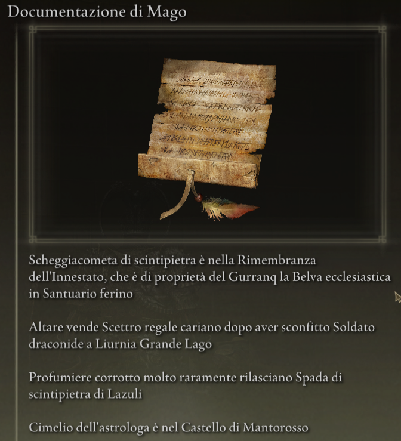
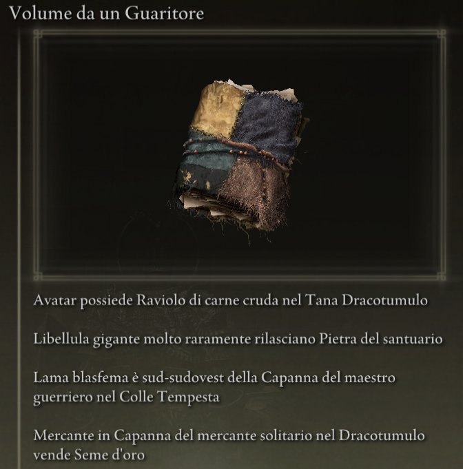
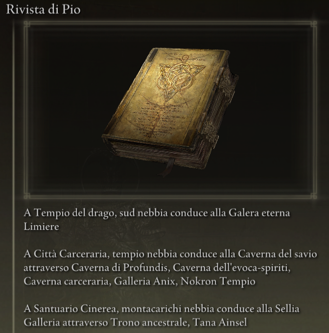

#Elden Ring Randomizer Hints  
  
## Descrizione  
  
Elden Ring Randomizer Hints is a mod for Elden Ring to be used with [thefifthmatt's](https://www.nexusmods.com/eldenring/users/58426171) [Elden Ring Item and Enemy Randomizer](https://www.nexusmods.com/eldenring/mods/428) and/or [Elden Ring Fog Gate Randomizer](https://www.nexusmods.com/eldenring/mods/3295). Genera oggetti suggerimento nel gioco che forniscono al giocatore informazioni sulla posizione degli oggetti e/o sui percorsi seguiti dai cancelli di nebbia casuali. Ciò consente un gioco più mirato pur godendo della novità di un mondo randomizzato.  
  
Mi sono piaciuti moltissimo i randomizzatori di Souls, ma con Elden Ring il mondo è così grande e aperto che volevo davvero un modo per trovare oggetti utili per le build del mio personaggio senza setacciare ogni area in cui sono entrato, pur godendomi quella sensazione di esplorazione lo sconosciuto. Questa mod è il risultato.  
  
## Come funziona  
  
#### Con Elden Ring Item and Enemy Randomizer:  
  
Gli oggetti suggerimento possono contenere da 1 a 4 suggerimenti che forniscono indicazioni, informazioni sulla caduta dei nemici o informazioni sulla proprietà di un oggetto.  
  
  
  
Il giocatore può definire categorie di oggetti e con gli oggetti di quelle categorie possono essere generati suggerimenti che puntano alla posizione di altri oggetti nelle stesse categorie. Ciò fornisce una sorta di scia di briciole di pane che il giocatore può seguire.  
  
È possibile inserire suggerimenti per oggetti missione NPC. Dove e come il giocatore li otterrà dipenderà dall'oggetto e dalla fase di ciascuna missione.  
  
Suggerimenti per categorie casuali e/o suggerimenti per oggetti specifici possono essere posizionati sul cadavere di Vergine delle Dita all'inizio del gioco per fornire un punto di partenza.  
  
#### Con Elden Ring Fog Gate Randomizer:  
  
Gli oggetti suggerimento possono contenere da 1 a 3 suggerimenti che descrivono il percorso seguito da un portale di nebbia o da un teletrasporto per connettersi a un'area con più di un'uscita.  
  
  
**Nota:** Elden Ring Randomizer Hints è destinato esclusivamente all'uso con la modalità World Shuffle di Elden Ring Fog Gate Randomizer. Usarlo con altre modalità potrebbe avere risultati imprevisti.  
  
#### Con uno o entrambi i randomizzatori:  
  
Suggerimenti per i cancelli di nebbia e/o gli oggetti necessari per passare attraverso i cancelli possono essere posizionati casualmente vicino ai cancelli.  
  
Suggerimenti per oggetti casuali provenienti da categorie specifiche e suggerimenti casuali per il cancello della nebbia possono essere inseriti in una percentuale di forzieri e/o drop di boss.  
  
Gli oggetti iniziali desiderati possono anche essere posizionati sul cadavere di Vergine delle Dita e/o nell'inventario iniziale di Resti delle vergini gemelle in Rocca della Tavola rotonda.  
  
## Iniziare  
  
Elden Ring Randomizer Hints è un'applicazione Python per Windows che utilizza la libreria Tkinter integrata di Python per l'interfaccia utente. Può essere eseguito dal PyInstaller fornito creato EXE o direttamente dal sorgente.  
  
La cartella di origine o la cartella in cui si trova EXE sarà la cartella mod a cui dovrà puntare la configurazione di Mod Engine 2. Questo è simile a come funzionano i randomizzatori. Vedi la documentazione di Mod Engine 2.  
  
#### Requisiti  
  
[Python 3.10](https://www.python.org) o versione successiva (se non si utilizza la versione standalone EXE)  
   
Una copia installata di [Elden Ring](https://store.steampowered.com/app/1245620/ELDEN_RING/)  
   
[Mod Engine 2](https://github.com/soulsmods/ModEngine2) (se non si utilizza il launcher integrato nei randomizzatori)  
  
[Elden Ring Item and Enemy Randomizer v0.9](https://www.nexusmods.com/eldenring/mods/428) e/o [Elden Ring Fog Gate Randomizer v0.1.7b](https://www.nexusmods.com/eldenring/mods/3295)  
  
[Yabber](https://github.com/JKAnderson/Yabber) o WitchyBND[(Nexus Mods)](https://www.nexusmods.com/eldenring/mods/3862)[(Github)](https://github.com/ividyon/WitchyBND) per decomprimere e reimballare i file di gioco  
  
mountlover's [DSMSPortable](https://github.com/mountlover/DSMSPortable) per modificare i file di gioco  
   
Assicurati che questi siano installati secondo ciascuna delle loro istruzioni e di aver già eseguito i randomizzatori prima di eseguire questo programma e generare suggerimenti.  
  
#### Indipendente EXE  
  
>Scarica il file ZIP dalla [Pagina Release](https://github.com/TheOldManAndTheC/randomizerHints/releases) ed estrailo nella cartella desiderata.  
>  
>Esegui randomizerHints.exe per avviare il programma.  
  
#### Python fonte  
  
<blockquote>  
In una shell di comando, cambia la directory di lavoro nella directory in cui desideri che si trovi la cartella mod, quindi clona il repository:  
  
```  
git clone --recursive https://github.com/TheOldManAndTheC/randomizerHints  
   
cd randomizerHints  
```  
  
Quindi esegui il programma con Python:  
  
```  
python randomizerHints.py  
```  
  
Oppure, se hai installato [PyInstaller](https://pyinstaller.org/en/stable/), puoi creare il tuo EXE con il file batch fornito:  
```  
buildExe.bat  
```  
  
</blockquote>  
  
Vedi la cartella [docs](.) per i dettagli su come configurare e utilizzare il mod.  
  
#### Configurazione di Mod Engine 2  
  
Dopo aver generato i suggerimenti, dovrai configurare Mod Engine 2 per includere Randomizer Hints come mod. Il programma genera un file "config_randomizerhints.toml" simile a questo:  
  
	# Generated by Elden Ring Randomizer Hints  
	  
	[modengine]  
	debug = false  
	external_dlls = []  
	[extension.mod_loader]  
	enabled = true  
	loose_params = false  
	mods = [  
	    { enabled = true, name = "randomizerhints", path = "C:\\Games\\Utilities\\randomizerHints" },  
	    { enabled = true, name = "fog", path = "C:\\Games\\Utilities\\fog\\" },  
	    { enabled = true, name = "randomizer", path = "C:\\Games\\Utilities\\randomizer\\" },  
	]  
	[extension.scylla_hide]  
	enabled = false  
  
I percorsi mod visualizzati e il modo in cui utilizzi questo file dipenderanno dalla tua configurazione.  
  
Se prevedi di utilizzare la funzione integrata Mod Engine 2 in Item and Enemy Randomizer o Fog Gate Randomizer, dovrai copiare questo file toml nella cartella randomizer e rinominarlo per sostituire il file toml che è già lì, oppure modifica il file toml del randomizzatore per aggiungere la riga mod "randomizerhints" sopra.  
  
Se stai utilizzando un'installazione manuale di Mod Engine 2, sostituisci il file "config_eldenring.toml" nella cartella Mod Engine 2 oppure modificalo e aggiungi la riga mod "randomizerhints" sopra.  
  
L'unione con altri mod non rientra nell'ambito di queste istruzioni, ma nel file toml, "randomizerhints" deve precedere "fog", che deve precedere "randomizer". Qualsiasi mod con un file regulation.bin che precede queste righe sovrascriverà i dati del randomizzatore e ne impedirà il funzionamento. Controlla la documentazione di [Mod Engine 2](https://github.com/soulsmods/ModEngine2#get-started-guide) per i dettagli.  
  
## Supporto  
  
Elden Ring Randomizer Hints è un software open source gratuito, ma se ti piace la mod e desideri supportarmi, puoi inviarmi una donazione su [itch.io](https://the-old-man-and-the-c.itch.io/elden-ring-randomizer-hints), [NexusMods](https://www.nexusmods.com/eldenring/mods/4096) o [Ko-fi](https://ko-fi.com/theoldmanandthec).  
  
## Crediti  
  
Questa mod è possibile solo grazie agli instancabili sforzi della community di modding di Souls e degli sviluppatori di [Mod Engine 2](https://github.com/soulsmods/ModEngine2), [Yabber](https://github.com/JKAnderson/Yabber), [WitchyBND](https://github.com/ividyon/WitchyBND) e [UXM Selective Unpacker](https://github.com/Nordgaren/UXM-Selective-Unpack) in particolare.  
Un ringraziamento speciale va a:  
[thefifthmatt](https://www.nexusmods.com/eldenring/users/58426171) per i suoi brillanti randomizzatori che mi hanno regalato centinaia se non migliaia di ore di gioco extra su vari giochi Souls.  
[mountlover](https://github.com/mountlover) per il suo strumento DSMSPortable rivoluzionario, che rende molto più semplice il modding di Souls tramite script. Questa mod non esisterebbe senza di essa.  
  
Grazie a tutti per il vostro lavoro.  
  
## Licenza  
  
Elden Ring Randomizer Hints copyright (c) 2023 The Old Man and the C  
  
Elden Ring Randomizer Hints is free software: you can redistribute it and/or modify it under the terms of the GNU Affero General Public License as published by the Free Software Foundation, either version 3 of the License, or (at your option) any later version.  
  
Elden Ring Randomizer Hints is distributed in the hope that it will be useful,  but WITHOUT ANY WARRANTY; without even the implied warranty of MERCHANTABILITY or FITNESS FOR A PARTICULAR PURPOSE. See the GNU Affero General Public License  for more details.  
  
You should have received a copy of the GNU Affero General Public License along with Elden Ring Randomizer Hints. If not, see <https://www.gnu.org/licenses/>.  
  
***  
  
mvcTkinter copyright (c) 2023 The Old Man and the C  
  
mvcTkinter is free software: you can redistribute it and/or modify it under the terms of the GNU Affero General Public License as published by the Free Software Foundation, either version 3 of the License, or (at your option) any later version.  
  
mvcTkinter is distributed in the hope that it will be useful,  but WITHOUT ANY WARRANTY; without even the implied warranty of MERCHANTABILITY or FITNESS FOR A PARTICULAR PURPOSE. See the GNU Affero General Public License  for more details.  
  
You should have received a copy of the GNU Affero General Public License along with mvcTkinter. If not, see <https://www.gnu.org/licenses/>.  
  
***  
  
scroll-paper.ico (c) by  Rafiico Creative  
  
Source: <https://iconscout.com/free-icon/scroll-paper-13>  
  
scroll-paper.ico is licensed under a Creative Commons Attribution 4.0 International License.  
  
You should have received a copy of the license along with this work. If not, see <http://creativecommons.org/licenses/by/4.0/>.
