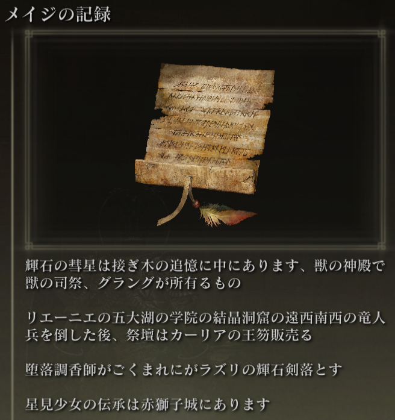
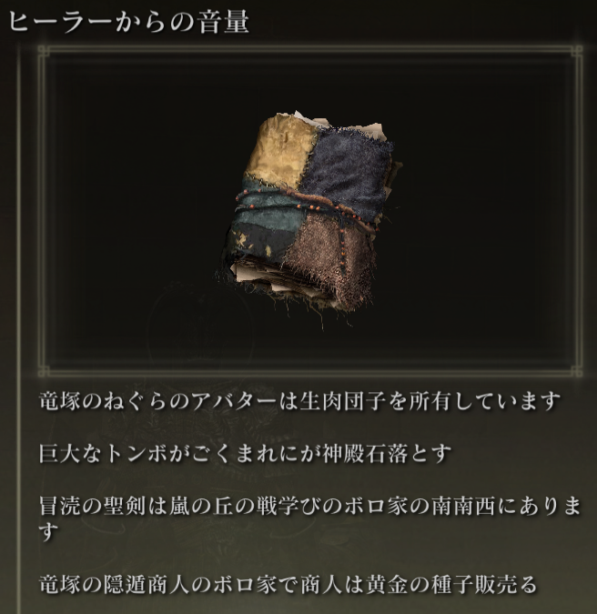
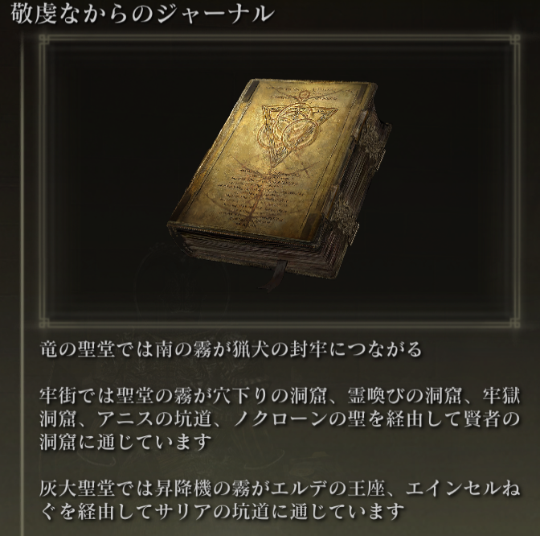

#Elden Ring Randomizer Hints  
  
## 説明  
  
Elden Ring Randomizer Hints は、[thefifthmatt's](https://www.nexusmods.com/eldenring/users/58426171) [Elden Ring Item and Enemy Randomizer](https://www.nexusmods.com/eldenring/mods/428) および/または [Elden Ring Fog Gate Randomizer](https://www.nexusmods.com/eldenring/mods/3295) とともに使用される Elden Ring の MOD です。アイテムの位置やランダム化されたフォグ ゲートがたどるルートに関する情報をプレイヤーに提供するゲーム内ヒント オブジェクトを生成します。これにより、ランダム化された世界の新しさを楽しみながら、より多くの目標に向けたプレイが可能になります。  
  
私は Souls のランダマイザーを十分に楽しんできましたが、Elden Ring の世界は非常に広くてオープンなので、探索する感覚を楽しみながら、入ったすべてのエリアを探索することなく、キャラクター ビルドに役立つアイテムを見つける方法が本当に必要でした。未知なるもの。その結果がこのMODです。  
  
## 使い方  
  
#### Elden Ring Item and Enemy Randomizer の場合:  
  
ヒント オブジェクトには、道順、敵のドロップ情報、またはアイテムの所有権情報を提供する 1 ～ 4 つのヒントを含めることができます。  
  
  
  
プレーヤーはアイテムのカテゴリを定義でき、同じカテゴリ内の他のアイテムの場所を示すヒントが、それらのカテゴリ内のアイテムを使用して生成される場合があります。これにより、プレーヤーがたどるパンくずリストのようなものが提供されます。  
  
NPCのクエストアイテムにはヒントが配置されている場合があります。どこでどのように入手できるかは、アイテムや各クエストのステージによって異なります。  
  
開始点を提供するために、ゲームの開始時にランダムなカテゴリのヒントや特定のアイテムのヒントが 指の巫女 の死体に配置される場合があります。  
  
#### Elden Ring Fog Gate Randomizer の場合:  
  
ヒント オブジェクトには、フォグ ゲートまたはワープが複数の出口のあるエリアに接続するためにたどるパスを説明する 1 ～ 3 つのヒントを含めることができます。  
  
  
**注意:** Elden Ring Randomizer Hints は、Elden Ring Fog Gate Randomizer の World Shuffle モードでのみ使用することを目的としています。他のモードと一緒に使用すると、予期しない結果が生じる可能性があります。  
  
#### いずれかまたは両方のランダマイザーを使用する場合:  
  
霧のゲートのヒントやゲートを通過するために必要なアイテムがゲートの近くにランダムに配置される場合があります。  
  
指定されたカテゴリからのランダムなアイテムのヒントとランダムな霧のゲートのヒントが、一定の割合のチェストおよび/またはボスのドロップに配置される場合があります。  
  
必要な開始アイテムは、指の巫女 の死体や 円卓 の 双子の老婆 の初期インベントリに配置することもできます。  
  
## はじめる  
  
Elden Ring Randomizer Hints は、ユーザー インターフェイスに Python の組み込み Tkinter ライブラリを使用する、Windows 用の Python アプリケーションです。これは、提供された PyInstaller で作成された EXE から実行することも、ソースから直接実行することもできます。  
  
ソース フォルダーまたは EXE が含まれるフォルダーは、Mod Engine 2 の設定が指す必要がある mod フォルダーになります。これはランダマイザーの仕組みと似ています。 Mod Engine 2 のドキュメントを参照してください。  
  
#### 要件  
  
[Python 3.10](https://www.python.org) 以降 (スタンドアロン EXE を使用していない場合)  
   
[Elden Ring](https://store.steampowered.com/app/1245620/ELDEN_RING/) のインストールされたコピー  
   
[Mod Engine 2](https://github.com/soulsmods/ModEngine2) (ランチャーの組み込みランチャーを使用していない場合)  
  
[Elden Ring Item and Enemy Randomizer v0.7.3](https://www.nexusmods.com/eldenring/mods/428) および/または [Elden Ring Fog Gate Randomizer v0.1.7b](https://www.nexusmods.com/eldenring/mods/3295)  
  
[Yabber](https://github.com/JKAnderson/Yabber) または WitchyBND[(Nexus Mods)](https://www.nexusmods.com/eldenring/mods/3862)[(Github)](https://github.com/ividyon/WitchyBND) (ゲーム ファイルの解凍と再パック)  
  
mountlover's [DSMSPortable](https://github.com/mountlover/DSMSPortable) ゲーム ファイルを変更する  
   
これらがそれぞれの手順に従ってインストールされていること、およびこのプログラムを実行してヒントを生成する前にランダマイザーがすでに実行されていることを確認してください。  
  
#### スタンドアロン EXE  
  
>[リリース ページ](https://github.com/TheOldManAndTheC/randomizerHints/releases) から ZIP ファイルをダウンロードし、目的のフォルダーに解凍します。  
>  
> randomizerHints.exe を実行してプログラムを開始します。  
  
#### Python ソース  
  
<blockquote>  
コマンド シェルで、作業ディレクトリを mod フォルダーを配置するディレクトリに変更し、リポジトリのクローンを作成します。  
  
```  
git clone --recursive https://github.com/TheOldManAndTheC/randomizerHints  
   
cd randomizerHints  
```  
  
次に、Python を使用してプログラムを実行します。  
  
```  
python randomizerHints.py  
```  
  
または、[PyInstaller](https://pyinstaller.org/en/stable/) がインストールされている場合は、提供されたバッチ ファイルを使用して独自の EXE を構築できます。  
```  
buildExe.bat  
```  
  
</blockquote>  
  
MOD の設定方法と使用方法の詳細については、[docs](.) フォルダーを参照してください。  
  
#### Mod Engine 2 を設定しています  
  
ヒントを生成した後、Randomizer Hints を MOD として含めるように Mod Engine 2 を設定する必要があります。プログラムは次のような「config_randomizerhints.toml」ファイルを生成します。  
  
	# Generated by Elden Ring Randomizer Hints  
	  
	[modengine]  
	debug = false  
	external_dlls = []  
	[extension.mod_loader]  
	enabled = true  
	loose_params = false  
	mods = [  
	    { enabled = true, name = "randomizerhints", path = "C:\\Games\\Utilities\\randomizerHints" },  
	    { enabled = true, name = "fog", path = "C:\\Games\\Utilities\\fog\\" },  
	    { enabled = true, name = "randomizer", path = "C:\\Games\\Utilities\\randomizer\\" },  
	]  
	[extension.scylla_hide]  
	enabled = false  
  
どの MOD パスが表示されるか、このファイルをどのように使用するかは、設定によって異なります。  
  
Item and Enemy Randomizer または Fog Gate Randomizer の組み込み Mod Engine 2 機能を使用する場合は、この toml ファイルをランダマイザー フォルダーにコピーし、名前を変更して toml ファイルを置き換える必要があります。すでに存在するか、ランダマイザーの toml ファイルを編集して上記の "randomizerhints" mod 行を追加します。  
  
Mod Engine 2 の手動インストールを使用している場合は、Mod Engine 2 フォルダー内の「config_eldenring.toml」ファイルを置き換えるか、ファイルを編集して上記の "randomizerhints" mod 行を追加します。  
  
他の MOD とのマージはこれらの手順の範囲外ですが、toml ファイルでは、"randomizerhints" は "fog" より前に配置する必要があり、"fog" は "randomizer" より前に配置する必要があります。これらの行の前に regulation.bin ファイルがある MOD はランダマイザー データをオーバーライドし、機能しなくなります。詳細については、[Mod Engine 2](https://github.com/soulsmods/ModEngine2#get-started-guide) のドキュメントを確認してください。  
  
## サポート  
  
Elden Ring Randomizer Hints は無料のオープンソース ソフトウェアですが、この MOD を気に入って私をサポートしたい場合は、[itch.io](https://the-old-man-and-the-c.itch.io/elden-ring-randomizer-hints)、[NexusMods](https://www.nexusmods.com/eldenring/mods/4096)、または [Ko-fi](https://ko-fi.com/theoldmanandthec) まで寄付を送ってください。  
  
## クレジット  
  
この MOD は、Souls MOD コミュニティとの開発者のたゆまぬ努力のおかげでのみ可能になりました [Mod Engine 2](https://github.com/soulsmods/ModEngine2)、[Yabber](https://github.com/JKAnderson/Yabber)、[WitchyBND](https://github.com/ividyon/WitchyBND)、[UXM Selective Unpacker](https://github.com/Nordgaren/UXM-Selective-Unpack) 特に。  
特別な感謝の意を表します:  
[thefifthmatt](https://www.nexusmods.com/eldenring/users/58426171) は、彼の素晴らしいランダマイザーのおかげで、さまざまな Souls ゲームで何百時間、あるいは何千時間もの余分なプレイ時間を私に与えてくれました。  
[mountlover](https://github.com/mountlover) は、ゲームを変える DSMSPortable ツールに感謝します。これにより、スクリプトによる Souls の改造が非常に簡単になります。このMODなしではこのMODは存在しません。  
  
皆様、お疲れ様でした。  
  
## ライセンス  
  
Elden Ring Randomizer Hints copyright (c) 2023 The Old Man and the C  
  
Elden Ring Randomizer Hints is free software: you can redistribute it and/or modify it under the terms of the GNU Affero General Public License as published by the Free Software Foundation, either version 3 of the License, or (at your option) any later version.  
  
Elden Ring Randomizer Hints is distributed in the hope that it will be useful,  but WITHOUT ANY WARRANTY; without even the implied warranty of MERCHANTABILITY or FITNESS FOR A PARTICULAR PURPOSE. See the GNU Affero General Public License  for more details.  
  
You should have received a copy of the GNU Affero General Public License along with Elden Ring Randomizer Hints. If not, see <https://www.gnu.org/licenses/>.  
  
***  
  
mvcTkinter copyright (c) 2023 The Old Man and the C  
  
mvcTkinter is free software: you can redistribute it and/or modify it under the terms of the GNU Affero General Public License as published by the Free Software Foundation, either version 3 of the License, or (at your option) any later version.  
  
mvcTkinter is distributed in the hope that it will be useful,  but WITHOUT ANY WARRANTY; without even the implied warranty of MERCHANTABILITY or FITNESS FOR A PARTICULAR PURPOSE. See the GNU Affero General Public License  for more details.  
  
You should have received a copy of the GNU Affero General Public License along with mvcTkinter. If not, see <https://www.gnu.org/licenses/>.  
  
***  
  
scroll-paper.ico (c) by  Rafiico Creative  
  
Source: <https://iconscout.com/free-icon/scroll-paper-13>  
  
scroll-paper.ico is licensed under a Creative Commons Attribution 4.0 International License.  
  
You should have received a copy of the license along with this work. If not, see <http://creativecommons.org/licenses/by/4.0/>.
