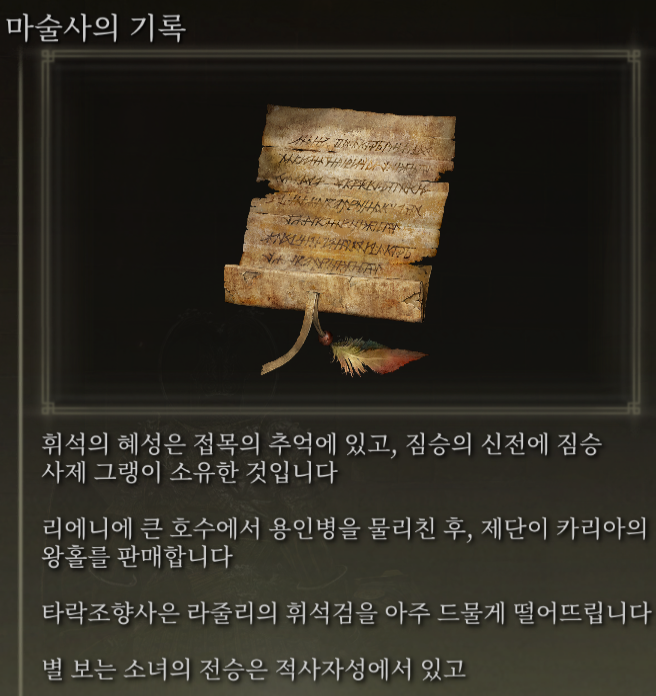
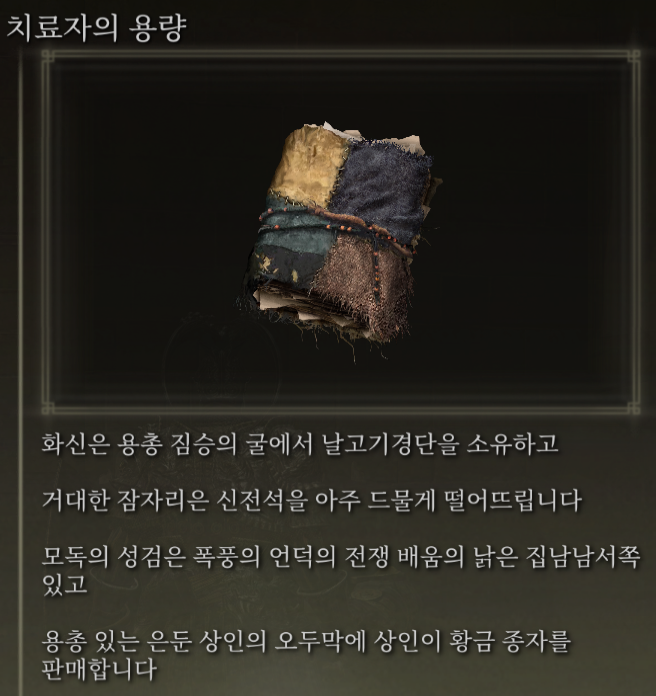
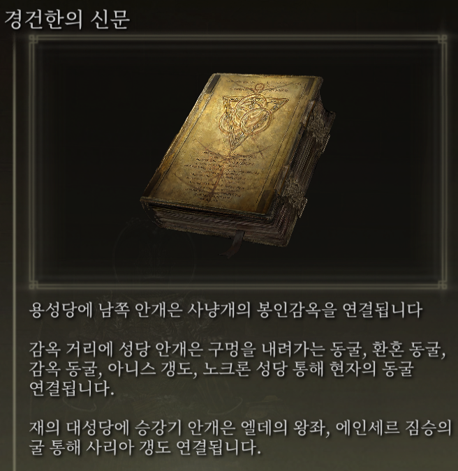

# Elden Ring Randomizer Hints  
  
## 설명  
  
Elden Ring Randomizer Hints은 Elden Ring의 모드입니다. 이는 아이템의 위치 및/또는 무작위 포그 게이트가 따르는 경로에 대한 정보를 플레이어에게 제공하는 게임 내 힌트 개체를 생성합니다. 이를 통해 무작위 세계의 새로움을 즐기면서 더 많은 목표 지향적 플레이가 가능해졌습니다.  
  
저는 Souls 랜더마이저를 완전히 즐겼지만 Elden Ring을 사용하면 세상이 너무 크고 개방적이어서 제가 들어간 모든 영역을 샅샅이 뒤지지 않고도 캐릭터 빌드에 유용한 아이템을 찾을 수 있으면서도 여전히 탐험하는 느낌을 즐길 수 있는 방법을 정말로 원했습니다. 알려지지 않은 것. 이 모드는 그 결과입니다.  
  
## 작동 방식  
  
#### Elden Ring Item and Enemy Randomizer과 함께:  
  
힌트 개체에는 방향, 적의 드롭 정보 또는 항목에 대한 소유권 정보를 제공하는 힌트가 1~4개 포함될 수 있습니다.  
  
  
  
플레이어는 아이템 카테고리를 정의할 수 있으며, 해당 카테고리의 아이템으로 동일한 카테고리에 있는 다른 아이템의 위치를 가리키는 힌트가 생성될 수 있습니다. 이는 플레이어가 따라갈 수 있는 탐색경로의 흔적을 제공합니다.  
  
NPC 퀘스트 아이템에 힌트가 배치될 수 있습니다. 플레이어가 아이템을 획득하는 장소와 방법은 아이템과 각 퀘스트의 단계에 따라 다릅니다.  
  
무작위 카테고리 힌트 및/또는 특정 아이템 힌트는 게임 시작 시 손가락 무녀 시체에 배치되어 시작점을 제공할 수 있습니다.  
  
#### Elden Ring Fog Gate Randomizer과 함께:  
  
힌트 개체에는 포그 게이트나 워프가 두 개 이상의 출구가 있는 영역에 연결하는 데 걸리는 경로를 설명하는 힌트가 1~3개 포함될 수 있습니다.  
  
  
**참고:** Elden Ring Randomizer Hints은 Elden Ring Fog Gate Randomizer의 World Shuffle 모드에서만 사용할 수 있습니다. 다른 모드와 함께 사용하면 예상치 못한 결과가 발생할 수 있습니다.  
  
#### 랜더마이저 중 하나 또는 둘 다 사용:  
  
포그 게이트에 대한 힌트 및/또는 게이트 통과에 필요한 아이템은 게이트 근처에 무작위로 배치될 수 있습니다.  
  
지정된 카테고리의 무작위 아이템 힌트와 무작위 포그 게이트 힌트는 일정 비율의 상자 및/또는 보스 드롭에 배치될 수 있습니다.  
  
원하는 시작 아이템은 손가락 무녀 시체 및/또는 원탁의 쌍둥이 노파 초기 인벤토리에 배치할 수도 있습니다.  
  
## 시작하기  
  
Elden Ring Randomizer Hints은 사용자 인터페이스를 위해 Python의 내장 Tkinter 라이브러리를 사용하는 Windows용 Python 애플리케이션입니다. 제공된 PyInstaller 생성 EXE에서 실행하거나 소스에서 직접 실행할 수 있습니다.  
  
소스 폴더 또는 EXE가 있는 폴더는 Mod Engine 2의 구성이 가리켜야 하는 mod 폴더가 됩니다. 이는 Randomizer의 작동 방식과 유사합니다. Mod Engine 2의 문서를 참조하세요.  
  
#### 요구 사항  
  
[Python 3.10](https://www.python.org) 이상(독립형 EXE를 사용하지 않는 경우)  
   
[Elden Ring](https://store.steampowered.com/app/1245620/ELDEN_RING/)의 설치된 사본  
   
[Mod Engine 2](https://github.com/soulsmods/ModEngine2)(랜더마이저에 내장된 실행기를 사용하지 않는 경우)  
  
[Elden Ring Item and Enemy Randomizer v0.9](https://www.nexusmods.com/eldenring/mods/428) 및/또는 [Elden Ring Fog Gate Randomizer 0.1.7b](https://www.nexusmods.com/eldenring/mods/3295)  
  
[Yabber](https://github.com/JKAnderson/Yabber) 또는 WitchyBND[(Nexus Mods)](https://www.nexusmods.com/eldenring/mods/3862)[(Github)](https://github.com/ividyon/WitchyBND) 게임 파일 압축을 풀고 다시 압축  
  
mountlover's [DSMSPortable](https://github.com/mountlover/DSMSPortable) 게임 파일 수정  
   
각 지침에 따라 이러한 프로그램이 설치되었는지 확인하고 이 프로그램을 실행하고 힌트를 생성하기 전에 이미 랜더마이저를 실행했는지 확인하세요.  
  
#### 독립형 EXE  
  
>[릴리스 페이지](https://github.com/TheOldManAndTheC/randomizerHints/releases)에서 ZIP 파일을 다운로드하여 원하는 폴더에 추출하세요.  
>  
>randomizerHints.exe를 실행하여 프로그램을 시작하세요.  
  
#### Python 출처  
  
<blockquote>  
명령 셸에서 작업 디렉터리를 mod 폴더가 있을 디렉터리로 변경한 다음 저장소를 복제합니다.  
  
```  
git clone --recursive https://github.com/TheOldManAndTheC/randomizerHints  
   
cd randomizerHints  
```  
  
그런 다음 Python를 사용하여 프로그램을 실행합니다.  
  
```  
python randomizerHints.py  
```  
  
또는 [PyInstaller](https://pyinstaller.org/en/stable/)가 설치된 경우 제공된 배치 파일을 사용하여 고유한 EXE를 빌드할 수 있습니다.  
```  
buildExe.bat  
```  
  
</blockquote>  
  
모드 구성 및 사용 방법에 대한 자세한 내용은 [docs](.) 폴더를 참조하세요.  
  
#### Mod Engine 2 구성  
  
힌트를 생성한 후 Randomizer Hints을 모드로 포함하도록 Mod Engine 2를 구성해야 합니다. 프로그램은 다음과 같은 "config_randomizerhints.toml" 파일을 생성합니다.  
  
	# Generated by Elden Ring Randomizer Hints  
	  
	[modengine]  
	debug = false  
	external_dlls = []  
	[extension.mod_loader]  
	enabled = true  
	loose_params = false  
	mods = [  
	    { enabled = true, name = "randomizerhints", path = "C:\\Games\\Utilities\\randomizerHints" },  
	    { enabled = true, name = "fog", path = "C:\\Games\\Utilities\\fog\\" },  
	    { enabled = true, name = "randomizer", path = "C:\\Games\\Utilities\\randomizer\\" },  
	]  
	[extension.scylla_hide]  
	enabled = false  
  
표시되는 모드 경로와 이 파일을 사용하는 방법은 설정에 따라 다릅니다.  
  
Item and Enemy Randomizer 또는 Fog Gate Randomizer에 내장된 Mod Engine 2 기능을 사용하려는 경우 이 toml 파일을 Randomizer 폴더에 복사하고 이름을 바꿔서 toml 파일을 바꿔야 합니다. 이미 거기에 있거나 Randomizer의 toml 파일을 편집하여 위의 "randomizerhints" mod 행을 추가하세요.  
  
Mod Engine 2 수동 설치를 사용하는 경우 Mod Engine 2 폴더의 "config_eldenring.toml" 파일을 바꾸거나 편집하여 위의 "randomizerhints" mod 줄을 추가하세요.  
  
다른 모드와의 병합은 이 지침의 범위를 벗어나지만 toml 파일에서 "randomizerhints"은 "fog" 앞에 와야 하며 "randomizer" 앞에 와야 합니다. 이 줄 앞에 regulation.bin 파일이 있는 모드는 무작위 데이터를 무시하고 작동하지 않게 만듭니다. 자세한 내용은 [Mod Engine 2](https://github.com/soulsmods/ModEngine2#get-started-guide) 설명서를 확인하세요.  
  
## 지원하다  
  
Elden Ring Randomizer Hints은 무료 오픈 소스 소프트웨어이지만 모드가 마음에 들고 저를 지원하고 싶다면 [itch.io](https://the-old-man-and-the-c.itch.io/elden-ring-randomizer-hints), [NexusMods](https://www.nexusmods.com/eldenring/mods/4096) 또는 [Ko-fi](https://ko-fi.com/theoldmanandthec) 으로 기부금을 보내주세요.  
  
## 크레딧  
  
이 모드는 Souls 모딩 커뮤니티와 개발자의 지칠 줄 모르는 노력 덕분에 가능합니다 [Mod Engine 2](https://github.com/soulsmods/ModEngine2), [Yabber](https://github.com/JKAnderson/Yabber), [WitchyBND](https://github.com/ividyon/WitchyBND) 및 [UXM Selective Unpacker](https://github.com/Nordgaren/UXM-Selective-Unpack) 특히요.  
특별히 감사드립니다.  
[thefifthmatt](https://www.nexusmods.com/eldenring/users/58426171) 다양한 Souls 게임에서 수천 시간은 아니더라도 수백 시간의 추가 플레이 시간을 제공한 뛰어난 무작위 도구 덕분입니다.  
[mountlover](https://github.com/mountlover)의 판도를 바꾸는 DSMSPortable 도구 덕분에 스크립트된 Souls 모딩이 훨씬 쉬워졌습니다. 이 모드가 없었다면 이 모드는 존재하지 않았을 것입니다.  
  
여러분의 노고에 감사드립니다.  
  
## 라이선스  
  
Elden Ring Randomizer Hints copyright (c) 2023 The Old Man and the C  
  
Elden Ring Randomizer Hints is free software: you can redistribute it and/or modify it under the terms of the GNU Affero General Public License as published by the Free Software Foundation, either version 3 of the License, or (at your option) any later version.  
  
Elden Ring Randomizer Hints is distributed in the hope that it will be useful,  but WITHOUT ANY WARRANTY; without even the implied warranty of MERCHANTABILITY or FITNESS FOR A PARTICULAR PURPOSE. See the GNU Affero General Public License  for more details.  
  
You should have received a copy of the GNU Affero General Public License along with Elden Ring Randomizer Hints. If not, see <https://www.gnu.org/licenses/>.  
  
***  
  
mvcTkinter copyright (c) 2023 The Old Man and the C  
  
mvcTkinter is free software: you can redistribute it and/or modify it under the terms of the GNU Affero General Public License as published by the Free Software Foundation, either version 3 of the License, or (at your option) any later version.  
  
mvcTkinter is distributed in the hope that it will be useful,  but WITHOUT ANY WARRANTY; without even the implied warranty of MERCHANTABILITY or FITNESS FOR A PARTICULAR PURPOSE. See the GNU Affero General Public License  for more details.  
  
You should have received a copy of the GNU Affero General Public License along with mvcTkinter. If not, see <https://www.gnu.org/licenses/>.  
  
***  
  
scroll-paper.ico (c) by  Rafiico Creative  
  
Source: <https://iconscout.com/free-icon/scroll-paper-13>  
  
scroll-paper.ico is licensed under a Creative Commons Attribution 4.0 International License.  
  
You should have received a copy of the license along with this work. If not, see <http://creativecommons.org/licenses/by/4.0/>.
