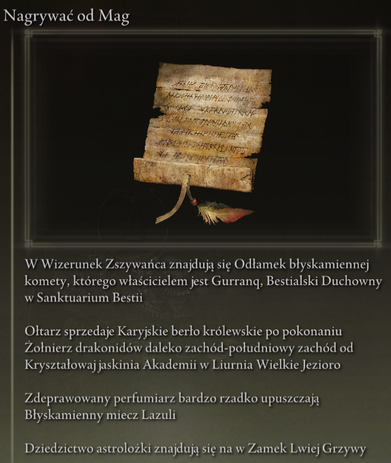
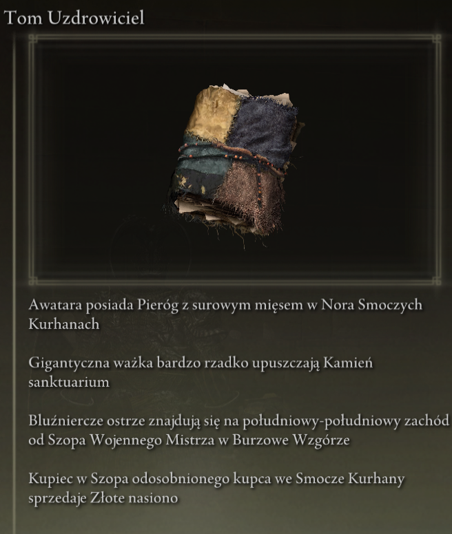
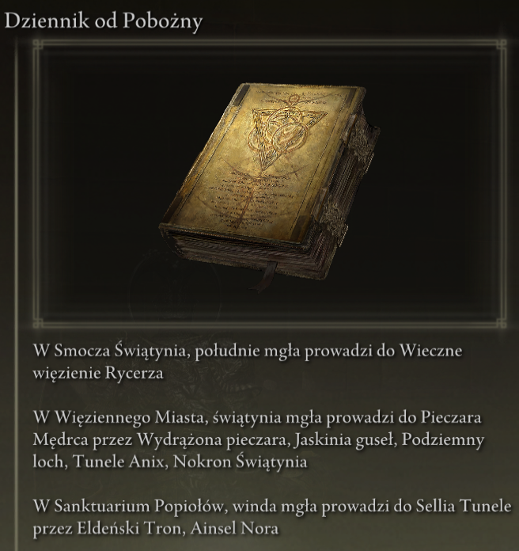

# Elden Ring Randomizer Hints  
  
## Opis  
  
Elden Ring Randomizer Hints jest modą dla Elden Ring do użycia z [thefifthmatt's] (https://www.nexusmods.com/eldenring/users/58426171) [Elden Ring Item and Enemy Randomizer] (https://www.nexusmods.com/eldenring/mods/428) i/lub [Elden Ring Fog Gate Randomizer](https://www.nexusmods.com/eldenring/mods/3295). Generuje w grze obiekty podpowiedzi, które dostarczają graczowi informacji o lokalizacji przedmiotów i/lub trasach, którymi podążają losowe bramy mgłowe. Pozwala to na grę bardziej ukierunkowaną na cel, jednocześnie ciesząc się nowością losowego świata.  
  
Bardzo podobały mi się randomizery Souls, ale w Elden Ring świat jest tak duży i otwarty, że naprawdę chciałem znaleźć sposób na znalezienie przedmiotów przydatnych do mojej postaci bez przeszukiwania każdego obszaru, do którego wszedłem, jednocześnie ciesząc się tym uczuciem eksploracji nieznane. Ten mod jest rezultatem.  
  
## Jak to działa  
  
#### Z Elden Ring Item and Enemy Randomizer:  
  
Obiekty podpowiedzi mogą zawierać od 1 do 4 wskazówek, które podają wskazówki, informacje o upadku wroga lub informacje o posiadaniu przedmiotu.  
  
  
  
Gracz może definiować kategorie przedmiotów, a dla przedmiotów należących do tych kategorii mogą być generowane podpowiedzi wskazujące lokalizację innych przedmiotów w tych samych kategoriach. Zapewnia to graczowi coś w rodzaju ścieżki okruszkowej, którą może podążać.  
  
Można umieszczać wskazówki dotyczące przedmiotów związanych z zadaniami NPC. To, gdzie i jak gracz je zdobędzie, będzie zależeć od przedmiotu i etapu każdej wyprawy.  
  
Losowe wskazówki dotyczące kategorii i/lub wskazówki dotyczące konkretnych przedmiotów mogą zostać umieszczone na zwłokach Służka palców na początku gry, aby zapewnić punkt wyjścia.  
  
#### Z Elden Ring Fog Gate Randomizer:  
  
Obiekty podpowiedzi mogą zawierać od 1 do 3 wskazówek opisujących ścieżkę, jaką podąża brama mgłowa lub osnowa, aby połączyć się z obszarem z więcej niż jednym wyjściem.  
  
  
**Uwaga:** Elden Ring Randomizer Hints jest przeznaczony wyłącznie do użytku z trybem World Shuffle Elden Ring Fog Gate Randomizer. Używanie go z innymi trybami może dać nieoczekiwane rezultaty.  
  
#### Z jednym lub obydwoma randomizatorami:  
  
Wskazówki dotyczące bram mgłowych i/lub przedmiotów potrzebnych do przejścia przez bramy mogą być losowo umieszczane w pobliżu ich bram.  
  
Losowe wskazówki dotyczące przedmiotów z określonych kategorii i losowe wskazówki dotyczące bram mgłowych mogą być umieszczane w procentach skrzyń i/lub upuszczanych bossów.  
  
Pożądane przedmioty początkowe można również umieścić na zwłokach Służka palców i/lub w początkowym ekwipunku Cienie bliźniaczej służki w Twierdza Okrągłego Stołu.  
  
## Pierwsze kroki  
  
Elden Ring Randomizer Hints to aplikacja Python dla Windows, która wykorzystuje wbudowaną bibliotekę Python Tkinter jako interfejs użytkownika. Można go uruchomić z dostarczonego PyInstaller utworzonego EXE lub bezpośrednio ze źródła.  
  
Folder źródłowy lub folder, w którym znajduje się EXE, będzie folderem mod, na który będzie musiała wskazywać konfiguracja Mod Engine 2. Działa to podobnie do działania randomizerów. Zobacz dokumentację Mod Engine 2.  
  
#### Wymagania  
  
[Python 3.10](https://www.python.org) lub nowszy (jeśli nie używasz samodzielnego EXE)  
   
Zainstalowana kopia [Elden Ring](https://store.steampowered.com/app/1245620/ELDEN_RING/)  
   
[Mod Engine 2](https://github.com/soulsmods/ModEngine2) (jeśli nie używasz wbudowanego programu uruchamiającego w randomizerach)  
  
[Elden Ring Item and Enemy Randomizer v0.9](https://www.nexusmods.com/eldenring/mods/428) i/lub [Elden Ring Fog Gate Randomizer v0.1.7b](https://www.nexusmods.com/eldenring/mods/3295)  
  
[Yabber](https://github.com/JKAnderson/Yabber) lub WitchyBND[(Nexus Mods)](https://www.nexusmods.com/eldenring/mods/3862)[(Github)](https://github.com/ividyon/WitchyBND) do rozpakowywania i ponownego pakowania plików gry  
  
mountlover's [DSMSPortable](https://github.com/mountlover/DSMSPortable) do modyfikowania plików gry  
   
Upewnij się, że są one zainstalowane zgodnie z każdą z ich instrukcji i że uruchomiłeś już randomizer(y) przed uruchomieniem tego programu i wygenerowaniem podpowiedzi.  
  
#### Samodzielny EXE  
  
>Pobierz plik ZIP ze strony [Wydania](https://github.com/TheOldManAndTheC/randomizerHints/releases) i rozpakuj go do żądanego folderu.  
>  
>Uruchom randomizerHints.exe, aby uruchomić program.  
  
#### Python źródło  
  
<blockquote>  
W powłoce poleceń zmień katalog roboczy na katalog, w którym chcesz, aby znajdował się folder mod, a następnie sklonuj repozytorium:  
  
```  
git clone --recursive https://github.com/TheOldManAndTheC/randomizerHints  
   
cd randomizerHints  
```  
  
Następnie uruchom program za pomocą Python:  
  
```  
python randomizerHints.py  
```  
  
Lub jeśli masz zainstalowany [PyInstaller](https://pyinstaller.org/en/stable/), możesz zbudować własny EXE za pomocą dostarczonego pliku wsadowego:  
```  
buildExe.bat  
```  
  
</blockquote>  
  
Zobacz folder [docs](.), aby uzyskać szczegółowe informacje na temat konfigurowania i używania moda.  
  
#### Konfigurowanie Mod Engine 2  
  
Po wygenerowaniu wskazówek będziesz musiał skonfigurować Mod Engine 2 tak, aby zawierał Randomizer Hints jako mod. Program generuje plik „config_randomizerhints.toml", który wygląda mniej więcej tak:  
  
	# Generated by Elden Ring Randomizer Hints  
	  
	[modengine]  
	debug = false  
	external_dlls = []  
	[extension.mod_loader]  
	enabled = true  
	loose_params = false  
	mods = [  
	    { enabled = true, name = "randomizerhints", path = "C:\\Games\\Utilities\\randomizerHints" },  
	    { enabled = true, name = "fog", path = "C:\\Games\\Utilities\\fog\\" },  
	    { enabled = true, name = "randomizer", path = "C:\\Games\\Utilities\\randomizer\\" },  
	]  
	[extension.scylla_hide]  
	enabled = false  
  
To, które ścieżki modów się pojawią i sposób korzystania z tego pliku, będzie zależeć od twojej konfiguracji.  
  
Jeśli planujesz używać wbudowanej funkcji Mod Engine 2 w Item and Enemy Randomizer lub Fog Gate Randomizer, musisz albo skopiować ten plik toml do folderu randomizera i zmienić jego nazwę, aby zastąpić plik toml, który jest już tam jest, lub edytuj plik toml randomizera, aby dodać powyższą linię mod "randomizerhints".  
  
Jeśli używasz ręcznej instalacji Mod Engine 2, zastąp plik „config_eldenring.toml" w folderze Mod Engine 2 lub edytuj go i dodaj powyższą linię mod "randomizerhints".  
  
Łączenie z innymi modami wykracza poza zakres tej instrukcji, ale w pliku toml "randomizerhints" musi znajdować się przed "fog", co musi znajdować się przed "randomizer". Wszelkie modyfikacje z plikiem regulation.bin, które znajdują się przed tymi liniami, zastąpią dane randomizera i spowodują, że nie będzie działać. Szczegółowe informacje można znaleźć w dokumentacji [Mod Engine 2](https://github.com/soulsmods/ModEngine2#get-started-guide).  
  
## Wsparcie  
  
Elden Ring Randomizer Hints to darmowe oprogramowanie typu open source, ale jeśli podoba Ci się mod i chcesz mnie wesprzeć, możesz wysłać mi darowiznę na [itch.io](https://the-old-man-and-the-c.itch.io/elden-ring-randomizer-hints), [NexusMods](https://www.nexusmods.com/eldenring/mods/4096) lub [Ko-fi](https://ko-fi.com/theoldmanandthec).  
  
## Kredyty  
  
Ten mod jest możliwy tylko dzięki niestrudzonym wysiłkom społeczności modderskiej Souls oraz twórców W szczególności [Mod Engine 2](https://github.com/soulsmods/ModEngine2), [Yabber](https://github.com/JKAnderson/Yabber), [WitchyBND](https://github.com/ividyon/WitchyBND) i [UXM Selective Unpacker](https://github.com/Nordgaren/UXM-Selective-Unpack).  
Specjalne podziękowania kieruję do:  
[thefifthmatt](https://www.nexusmods.com/eldenring/users/58426171) za jego genialne randomizery, które zapewniły mi setki, jeśli nie tysiące godzin dodatkowego czasu na grę w różnych grach Souls.  
[mountlover](https://github.com/mountlover) za jego zmieniające zasady gry narzędzie DSMSPortable, które znacznie ułatwia modowanie Souls za pomocą skryptu. Bez tego moda by nie istniała.  
  
Dziękuję wszystkim za waszą pracę.  
  
## Licencja  
  
Elden Ring Randomizer Hints copyright (c) 2023 The Old Man and the C  
  
Elden Ring Randomizer Hints is free software: you can redistribute it and/or modify it under the terms of the GNU Affero General Public License as published by the Free Software Foundation, either version 3 of the License, or (at your option) any later version.  
  
Elden Ring Randomizer Hints is distributed in the hope that it will be useful,  but WITHOUT ANY WARRANTY; without even the implied warranty of MERCHANTABILITY or FITNESS FOR A PARTICULAR PURPOSE. See the GNU Affero General Public License  for more details.  
  
You should have received a copy of the GNU Affero General Public License along with Elden Ring Randomizer Hints. If not, see <https://www.gnu.org/licenses/>.  
  
***  
  
mvcTkinter copyright (c) 2023 The Old Man and the C  
  
mvcTkinter is free software: you can redistribute it and/or modify it under the terms of the GNU Affero General Public License as published by the Free Software Foundation, either version 3 of the License, or (at your option) any later version.  
  
mvcTkinter is distributed in the hope that it will be useful,  but WITHOUT ANY WARRANTY; without even the implied warranty of MERCHANTABILITY or FITNESS FOR A PARTICULAR PURPOSE. See the GNU Affero General Public License  for more details.  
  
You should have received a copy of the GNU Affero General Public License along with mvcTkinter. If not, see <https://www.gnu.org/licenses/>.  
  
***  
  
scroll-paper.ico (c) by  Rafiico Creative  
  
Source: <https://iconscout.com/free-icon/scroll-paper-13>  
  
scroll-paper.ico is licensed under a Creative Commons Attribution 4.0 International License.  
  
You should have received a copy of the license along with this work. If not, see <http://creativecommons.org/licenses/by/4.0/>.
