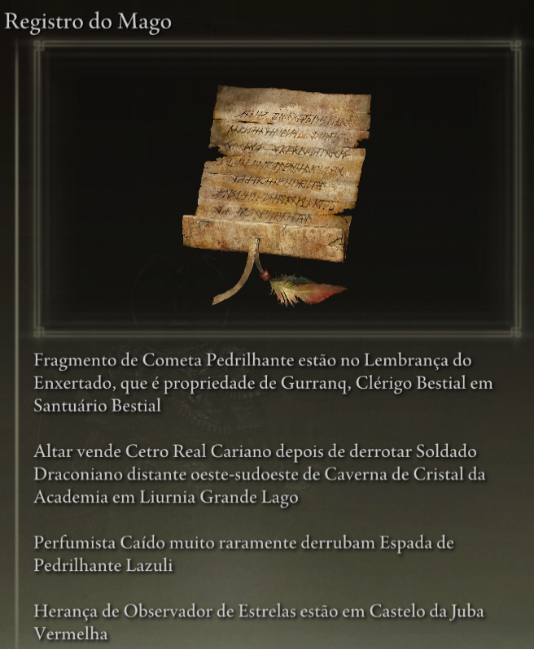
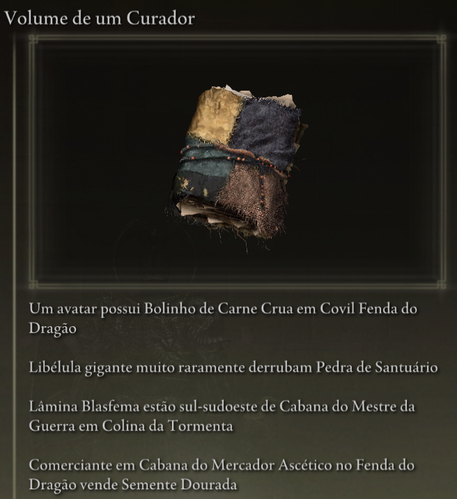
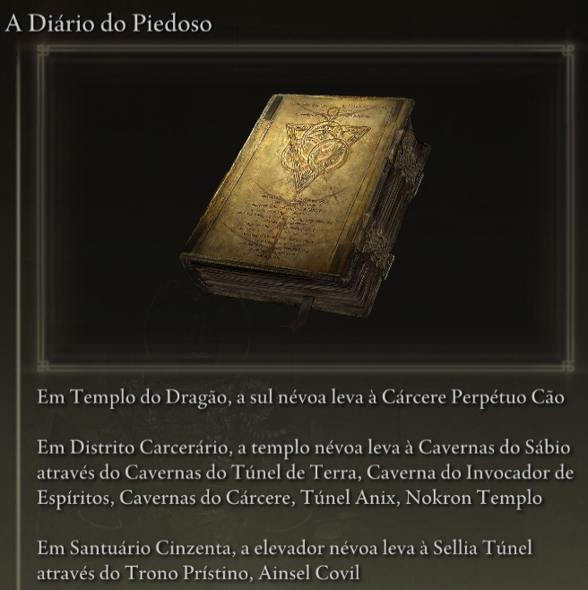

#Elden Ring Randomizer Hints  
  
## Descrição  
  
Elden Ring Randomizer Hints is a mod for Elden Ring to be used with [thefifthmatt's](https://www.nexusmods.com/eldenring/users/58426171) [Elden Ring Item and Enemy Randomizer](https://www.nexusmods.com/eldenring/mods/428) and/or [Elden Ring Fog Gate Randomizer](https://www.nexusmods.com/eldenring/mods/3295). Ele gera objetos de dicas no jogo que fornecem ao jogador informações sobre a localização dos itens e/ou as rotas que os portões de neblina aleatórios seguem. Isso permite um jogo mais direcionado ao objetivo enquanto ainda aproveita a novidade de um mundo aleatório.  
  
Eu gostei muito dos randomizadores do Souls, mas com Elden Ring, o mundo é tão grande e aberto que eu realmente queria uma maneira de encontrar itens úteis para a construção do meu personagem sem vasculhar todas as áreas em que entrei, enquanto ainda desfrutava daquela sensação de exploração o desconhecido. Este mod é o resultado.  
  
## Como funciona  
  
#### Com Elden Ring Item and Enemy Randomizer:  
  
Objetos de dica podem conter entre 1 e 4 dicas que fornecem instruções, informações sobre lançamentos de inimigos ou informações de propriedade sobre um item.  
  
  
  
O jogador pode definir categorias de itens, e dicas podem ser geradas com itens nessas categorias que apontam para a localização de outros itens nas mesmas categorias. Isso fornece uma espécie de trilha de migalhas para o jogador seguir.  
  
Dicas podem ser colocadas para itens de missão do NPC. Onde e como o jogador os consegue dependerá do item e do estágio de cada missão.  
  
Dicas de categorias aleatórias e/ou dicas de itens específicos podem ser colocadas no cadáver Donzelas dos Dedos no início do jogo para fornecer um ponto de partida.  
  
#### Com Elden Ring Fog Gate Randomizer:  
  
Objetos de dica podem conter entre 1 e 3 dicas que descrevem o caminho que um portão de neblina ou warp segue para se conectar a uma área com mais de uma saída.  
  
  
**Observação:** Elden Ring Randomizer Hints destina-se apenas ao uso com o modo World Shuffle de Elden Ring Fog Gate Randomizer. Usá-lo com outros modos pode ter resultados inesperados.  
  
#### Com um ou ambos os randomizadores:  
  
Dicas para portões de neblina e/ou itens necessários para passar pelos portões podem ser colocados aleatoriamente perto de seus portões.  
  
Dicas aleatórias de itens de categorias específicas e dicas aleatórias de portões de neblina podem ser colocadas em uma porcentagem de baús e/ou saques de chefes.  
  
Os itens iniciais desejados também podem ser colocados no cadáver Donzelas dos Dedos e/ou no inventário inicial Gêmeas Idosas em Mesa-Redonda.  
  
## Começando  
  
Elden Ring Randomizer Hints é um aplicativo Python para Windows que usa a biblioteca Tkinter integrada de Python para a interface do usuário. Ele pode ser executado a partir do PyInstaller fornecido, criado EXE, ou diretamente da fonte.  
  
A pasta de origem ou a pasta em que EXE está será a pasta mod para a qual a configuração de Mod Engine 2 precisará apontar. Isso é semelhante ao funcionamento dos randomizadores. Consulte a documentação de Mod Engine 2.  
  
#### Requisitos  
  
[Python 3.10](https://www.python.org) ou superior (se não estiver usando o EXE independente)  
   
Uma cópia instalada de [Elden Ring](https://store.steampowered.com/app/1245620/ELDEN_RING/)  
   
[Mod Engine 2](https://github.com/soulsmods/ModEngine2) (se não estiver usando o iniciador integrado no(s) randomizador(es))  
  
[Elden Ring Item and Enemy Randomizer v0.9](https://www.nexusmods.com/eldenring/mods/428) e/ou [Elden Ring Fog Gate Randomizer v0.1.7b](https://www.nexusmods.com/eldenring/mods/3295)  
  
[Yabber](https://github.com/JKAnderson/Yabber) ou WitchyBND[(Nexus Mods)](https://www.nexusmods.com/eldenring/mods/3862)[(Github)](https://github.com/ividyon/WitchyBND) para descompactar e reembalar arquivos do jogo  
  
mountlover's [DSMSPortable](https://github.com/mountlover/DSMSPortable) para modificar arquivos do jogo  
   
Certifique-se de que eles estejam instalados de acordo com cada uma de suas instruções e que você já tenha executado o(s) randomizador(es) antes de executar este programa e gerar dicas.  
  
#### Autônomo EXE  
  
>Baixe o arquivo ZIP da [página de lançamentos](https://github.com/TheOldManAndTheC/randomizerHints/releases) e extraia-o na pasta desejada.  
>  
>Execute randomizerHints.exe para iniciar o programa.  
  
#### Python fonte  
  
<blockquote>  
Em um shell de comando, altere o diretório de trabalho para o diretório onde deseja que a pasta mod esteja e, em seguida, clone o repositório:  
  
```  
git clone --recursive https://github.com/TheOldManAndTheC/randomizerHints  
   
cd randomizerHints  
```  
  
Em seguida, execute o programa com Python:  
  
```  
python randomizerHints.py  
```  
  
Ou se você tiver [PyInstaller](https://pyinstaller.org/en/stable/) instalado, poderá criar seu próprio EXE com o arquivo em lote fornecido:  
```  
buildExe.bat  
```  
  
</blockquote>  
  
Consulte a pasta [docs](.) para obter detalhes sobre como configurar e usar o mod.  
  
#### Configurando Mod Engine 2  
  
Depois de gerar dicas, você precisará configurar Mod Engine 2 para incluir Randomizer Hints como mod. O programa gera um arquivo "config_randomizerhints.toml" parecido com este:  
  
	# Generated by Elden Ring Randomizer Hints  
	  
	[modengine]  
	debug = false  
	external_dlls = []  
	[extension.mod_loader]  
	enabled = true  
	loose_params = false  
	mods = [  
	    { enabled = true, name = "randomizerhints", path = "C:\\Games\\Utilities\\randomizerHints" },  
	    { enabled = true, name = "fog", path = "C:\\Games\\Utilities\\fog\\" },  
	    { enabled = true, name = "randomizer", path = "C:\\Games\\Utilities\\randomizer\\" },  
	]  
	[extension.scylla_hide]  
	enabled = false  
  
Quais caminhos de mod aparecem e como você usa esse arquivo dependerão da sua configuração.  
  
Se você planeja usar o recurso Mod Engine 2 integrado em Item and Enemy Randomizer ou Fog Gate Randomizer, você precisará copiar este arquivo toml para a pasta randomizer e renomeá-lo para substituir o arquivo toml que é já está lá ou edite o arquivo toml do randomizador para adicionar a linha de mod "randomizerhints" acima.  
  
Se você estiver usando uma instalação manual de Mod Engine 2, substitua o arquivo "config_eldenring.toml" na pasta Mod Engine 2 ou edite-o e adicione a linha de mod "randomizerhints" acima.  
  
A fusão com outros mods está fora do escopo destas instruções, mas no arquivo toml, "randomizerhints" deve vir antes de "fog", que deve vir antes de "randomizer". Quaisquer mods com um arquivo regulation.bin que venha antes dessas linhas substituirão os dados do randomizador e farão com que ele não funcione. Verifique a documentação do [Mod Engine 2](https://github.com/soulsmods/ModEngine2#get-started-guide) para obter detalhes.  
  
## Apoiar  
  
Elden Ring Randomizer Hints é um software de código aberto gratuito, mas se você gosta do mod e gostaria de me apoiar, você pode me enviar uma doação em [itch.io](https://the-old-man-and-the-c.itch.io/elden-ring-randomizer-hints), [NexusMods](https://www.nexusmods.com/eldenring/mods/4096) ou [Ko-fi](https://ko-fi.com/theoldmanandthec).  
  
## Créditos  
  
Este mod só é possível devido aos esforços incansáveis da comunidade de modding do Souls e dos desenvolvedores de [Mod Engine 2](https://github.com/soulsmods/ModEngine2), [Yabber](https://github.com/JKAnderson/Yabber), [WitchyBND](https://github.com/ividyon/WitchyBND) e [UXM Selective Unpacker](https://github.com/Nordgaren/UXM-Selective-Unpack) em particular.  
Agradecimentos especiais vão para:  
[thefifthmatt](https://www.nexusmods.com/eldenring/users/58426171) por seus randomizadores brilhantes que me proporcionaram centenas, senão milhares de horas extras de jogo em vários jogos Souls.  
[mountlover](https://github.com/mountlover) por sua ferramenta revolucionária DSMSPortable, que torna a modificação de Souls com script muito mais fácil. Este mod não existiria sem ele.  
  
Obrigado a todos pelo seu trabalho.  
  
## Licença  
  
Elden Ring Randomizer Hints copyright (c) 2023 The Old Man and the C  
  
Elden Ring Randomizer Hints is free software: you can redistribute it and/or modify it under the terms of the GNU Affero General Public License as published by the Free Software Foundation, either version 3 of the License, or (at your option) any later version.  
  
Elden Ring Randomizer Hints is distributed in the hope that it will be useful,  but WITHOUT ANY WARRANTY; without even the implied warranty of MERCHANTABILITY or FITNESS FOR A PARTICULAR PURPOSE. See the GNU Affero General Public License  for more details.  
  
You should have received a copy of the GNU Affero General Public License along with Elden Ring Randomizer Hints. If not, see <https://www.gnu.org/licenses/>.  
  
***  
  
mvcTkinter copyright (c) 2023 The Old Man and the C  
  
mvcTkinter is free software: you can redistribute it and/or modify it under the terms of the GNU Affero General Public License as published by the Free Software Foundation, either version 3 of the License, or (at your option) any later version.  
  
mvcTkinter is distributed in the hope that it will be useful,  but WITHOUT ANY WARRANTY; without even the implied warranty of MERCHANTABILITY or FITNESS FOR A PARTICULAR PURPOSE. See the GNU Affero General Public License  for more details.  
  
You should have received a copy of the GNU Affero General Public License along with mvcTkinter. If not, see <https://www.gnu.org/licenses/>.  
  
***  
  
scroll-paper.ico (c) by  Rafiico Creative  
  
Source: <https://iconscout.com/free-icon/scroll-paper-13>  
  
scroll-paper.ico is licensed under a Creative Commons Attribution 4.0 International License.  
  
You should have received a copy of the license along with this work. If not, see <http://creativecommons.org/licenses/by/4.0/>.
