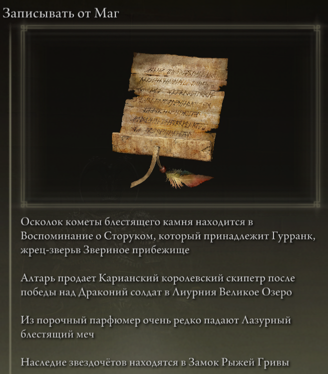
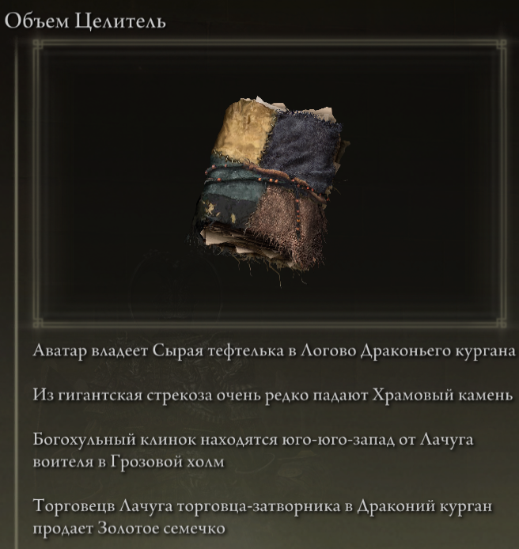
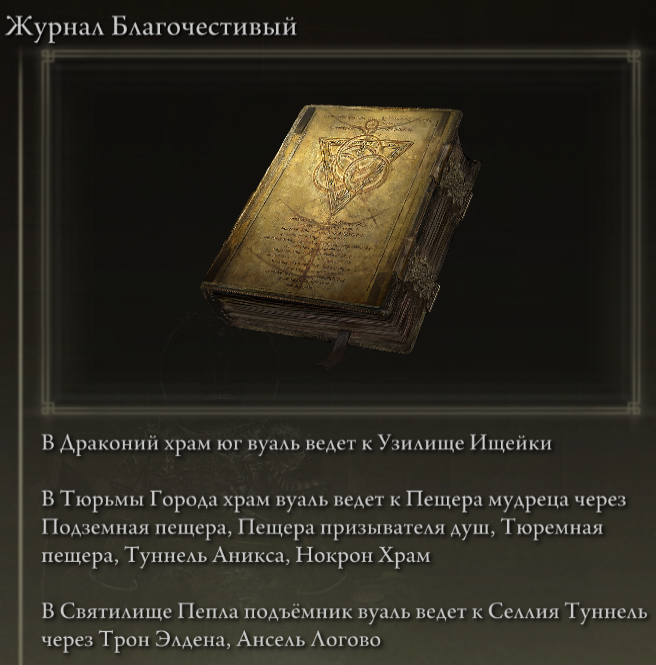

# Elden Ring Randomizer Hints  
  
## Описание  
  
Elden Ring Randomizer Hints - это мод для Elden Ring, который будет использоваться с [thefifthmatt's] (https://www.nexusmods.com/eldenring/users/58426171) [Elden Ring Item and Enemy Randomizer] (https://www.nexusmods.com/eldenring/mods/428) и/или/или [Elden Ring Fog Gate Randomizer](https://www.nexusmods.com/eldenring/mods/3295). Он генерирует внутриигровые объекты-подсказки, которые дают игроку информацию о местонахождении предметов и/или маршрутах, по которым следуют случайные туманные врата. Это позволяет играть более целенаправленно, сохраняя при этом новизну рандомизированного мира.  
  
Мне очень понравились рандомизаторы Souls, но с Elden Ring мир настолько велик и открыт, что мне действительно нужен был способ находить предметы, полезные для построения моего персонажа, не обыскивая каждую область, в которую я вошел, но при этом наслаждаться этим ощущением исследования. неизвестный. Этот мод является результатом.  
  
## Как это работает  
  
#### С Elden Ring Item and Enemy Randomizer:  
  
Объекты подсказок могут содержать от 1 до 4 подсказок, которые дают указания, информацию о выпадении противника или информацию о владельце предмета.  
  
  
  
Игрок может определять категории предметов, и для предметов в этих категориях могут генерироваться подсказки, которые указывают на расположение других предметов в тех же категориях. Это дает игроку что-то вроде <<хлебных крошек>>, по которым он может следовать.  
  
Подсказки можно размещать для квестовых предметов NPC. Где и как игрок их получит, будет зависеть от предмета и этапа каждого квеста.  
  
Случайные подсказки по категориям и/или подсказки по конкретным предметам могут быть размещены на трупе Служанка Пальца в начале игры, чтобы служить отправной точкой.  
  
#### С Elden Ring Fog Gate Randomizer:  
  
Объекты-подсказки могут содержать от 1 до 3-х подсказок, которые описывают путь, по которому туманные врата или варп соединяются с областью с более чем одним выходом.  
  
  
**Примечание.** Elden Ring Randomizer Hints предназначен только для использования с режимом World Shuffle Elden Ring Fog Gate Randomizer. Использование его с другими режимами может привести к неожиданным результатам.  
  
#### С одним или обоими рандомизаторами:  
  
Подсказки о туманных вратах и/или предметах, необходимых для прохождения через врата, могут быть случайным образом размещены возле их ворот.  
  
Подсказки случайных предметов из определенных категорий и случайные подсказки туманных врат могут быть размещены в процентах от сундуков и/или выпадений с боссов.  
  
Желаемые стартовые предметы также можно разместить на трупе Служанка Пальца и/или в первоначальном инвентаре Старые служанки-близнецы в Крепость Круглого стола.  
  
## Начиная  
  
Elden Ring Randomizer Hints  --  это приложение Python для Windows, которое использует встроенную библиотеку Tkinter Python для пользовательского интерфейса. Его можно запустить из предоставленного PyInstaller, созданного EXE, или непосредственно из исходного кода.  
  
Исходная папка или папка, в которой находится EXE, будет папкой мода, на которую должна будет указывать конфигурация Mod Engine 2. Это похоже на то, как работают рандомайзеры. См. документацию Mod Engine 2.  
  
#### Требования  
  
[Python 3.10](https://www.python.org) или выше (если не используется автономный EXE)  
   
Установленная копия [Elden Ring](https://store.steampowered.com/app/1245620/ELDEN_RING/)  
   
[Mod Engine 2](https://github.com/soulsmods/ModEngine2) (если не использовать встроенный лаунчер в рандомайзере(ах))  
  
[Elden Ring Item and Enemy Randomizer v0.7.3](https://www.nexusmods.com/eldenring/mods/428) и/или [Elden Ring Fog Gate Randomizer v0.1.7b](https://www.nexusmods.com/eldenring/mods/3295)  
  
[Yabber](https://github.com/JKAnderson/Yabber) или WitchyBND[(Nexus Mods)](https://www.nexusmods.com/eldenring/mods/3862)[(Github)](https://github.com/ividyon/WitchyBND) для распаковки и переупаковки файлов игры  
  
mountlover's [DSMSPortable](https://github.com/mountlover/DSMSPortable) для изменения файлов игры.  
   
Убедитесь, что они установлены в соответствии с каждой из инструкций и что вы уже запустили рандомизаторы, прежде чем запускать эту программу и генерировать подсказки.  
  
#### Автономный EXE  
  
>Загрузите файл ZIP со страницы [Страница релизов](https://github.com/TheOldManAndTheC/randomizerHints/releases) и распакуйте его в нужную папку.  
>  
>Запустите randomizerHints.exe, чтобы запустить программу.  
  
#### Python источник  
  
<blockquote>  
В командной оболочке измените рабочий каталог на каталог, в котором вы хотите, чтобы находилась папка мода, затем клонируйте репозиторий:  
  
```  
git clone --recursive https://github.com/TheOldManAndTheC/randomizerHints  
   
cd randomizerHints  
```  
  
Затем запустите программу с помощью Python:  
  
```  
python randomizerHints.py  
```  
  
Или, если у вас установлен [PyInstaller](https://pyinstaller.org/en/stable/), вы можете создать свой собственный EXE с помощью предоставленного командного файла:  
```  
buildExe.bat  
```  
  
</blockquote>  
  
Подробную информацию о том, как настроить и использовать мод, смотрите в папке [docs](.).  
  
#### Настройка Mod Engine 2  
  
После создания подсказок вам необходимо настроить Mod Engine 2, чтобы включить Randomizer Hints в качестве мода. Программа генерирует файл <<config_randomizerhints.toml>>, который выглядит примерно так:  
  
	# Generated by Elden Ring Randomizer Hints  
	  
	[modengine]  
	debug = false  
	external_dlls = []  
	[extension.mod_loader]  
	enabled = true  
	loose_params = false  
	mods = [  
	    { enabled = true, name = "randomizerhints", path = "C:\\Games\\Utilities\\randomizerHints" },  
	    { enabled = true, name = "fog", path = "C:\\Games\\Utilities\\fog\\" },  
	    { enabled = true, name = "randomizer", path = "C:\\Games\\Utilities\\randomizer\\" },  
	]  
	[extension.scylla_hide]  
	enabled = false  
  
Какие пути к модам появляются и как вы используете этот файл, будет зависеть от ваших настроек.  
  
Если вы планируете использовать встроенную функцию Mod Engine 2 в Item and Enemy Randomizer или Fog Gate Randomizer, вам нужно будет либо скопировать этот файл toml в папку рандомайзера и переименовать его, чтобы заменить файл toml, который уже есть, или отредактируйте файл рандомайзера toml, чтобы добавить указанную выше строку мода "randomizerhints".  
  
Если вы используете установку Mod Engine 2 вручную, либо замените файл <<config_eldenring.toml>> в папке Mod Engine 2, либо отредактируйте его и добавьте указанную выше строку мода "randomizerhints".  
  
Слияние с другими модами выходит за рамки этих инструкций, но в файле toml "randomizerhints" должен стоять перед "fog", который должен стоять перед "randomizer". Любые моды с файлом regulation.bin, расположенные перед этими строками, переопределяют данные рандомайзера и приводят к его неработоспособности. Подробности можно найти в документации [Mod Engine 2](https://github.com/soulsmods/ModEngine2#get-started-guide).  
  
## Поддерживать  
  
Elden Ring Randomizer Hints  --  бесплатное программное обеспечение с открытым исходным кодом, но если вам нравится мод и вы хотите поддержать меня, вы можете отправить мне пожертвование на [itch.io](https://the-old-man-and-the-c.itch.io/elden-ring-randomizer-hints), [NexusMods](https://www.nexusmods.com/eldenring/mods/4096) или [Ko-fi](https://ko-fi.com/theoldmanandthec).  
  
## Кредиты  
  
Этот мод стал возможным только благодаря неустанным усилиям сообщества моддеров Souls и разработчиков [Mod Engine 2](https://github.com/soulsmods/ModEngine2), [Yabber](https://github.com/JKAnderson/Yabber), [WitchyBND](https://github.com/ividyon/WitchyBND) и [UXM Selective Unpacker](https://github.com/Nordgaren/UXM-Selective-Unpack) в частности.  
Особая благодарность выражается:  
[thefifthmatt](https://www.nexusmods.com/eldenring/users/58426171) за его блестящие рандомизаторы, которые дали мне сотни, если не тысячи часов дополнительного игрового времени в различных играх Souls.  
[mountlover](https://github.com/mountlover) за его революционный инструмент DSMSPortable, который значительно упрощает создание сценариев для Souls. Без него этого мода не было бы.  
  
Спасибо всем за вашу работу.  
  
## Лицензия  
  
Elden Ring Randomizer Hints copyright (c) 2023 The Old Man and the C  
  
Elden Ring Randomizer Hints is free software: you can redistribute it and/or modify it under the terms of the GNU Affero General Public License as published by the Free Software Foundation, either version 3 of the License, or (at your option) any later version.  
  
Elden Ring Randomizer Hints is distributed in the hope that it will be useful,  but WITHOUT ANY WARRANTY; without even the implied warranty of MERCHANTABILITY or FITNESS FOR A PARTICULAR PURPOSE. See the GNU Affero General Public License  for more details.  
  
You should have received a copy of the GNU Affero General Public License along with Elden Ring Randomizer Hints. If not, see <https://www.gnu.org/licenses/>.  
  
***  
  
mvcTkinter copyright (c) 2023 The Old Man and the C  
  
mvcTkinter is free software: you can redistribute it and/or modify it under the terms of the GNU Affero General Public License as published by the Free Software Foundation, either version 3 of the License, or (at your option) any later version.  
  
mvcTkinter is distributed in the hope that it will be useful,  but WITHOUT ANY WARRANTY; without even the implied warranty of MERCHANTABILITY or FITNESS FOR A PARTICULAR PURPOSE. See the GNU Affero General Public License  for more details.  
  
You should have received a copy of the GNU Affero General Public License along with mvcTkinter. If not, see <https://www.gnu.org/licenses/>.  
  
***  
  
scroll-paper.ico (c) by  Rafiico Creative  
  
Source: <https://iconscout.com/free-icon/scroll-paper-13>  
  
scroll-paper.ico is licensed under a Creative Commons Attribution 4.0 International License.  
  
You should have received a copy of the license along with this work. If not, see <http://creativecommons.org/licenses/by/4.0/>.
