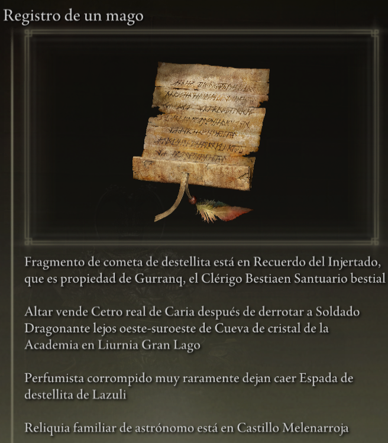
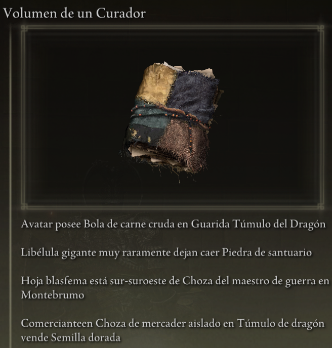
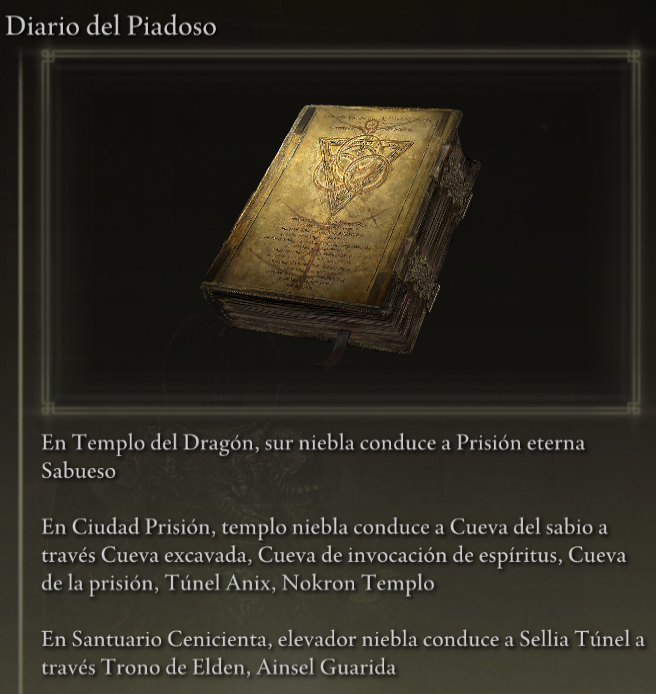

#Elden Ring Randomizer Hints  
  
## Descripción  
  
Elden Ring Randomizer Hints es un mod para Elden Ring para ser utilizado con [thefifthmatt's] (https://www.nexusmods.com/eldenring/users/58426171) [Elden Ring Item and Enemy Randomizer] (https://www.nexusmods.com/eldenring/mods/428) y/o [Elden Ring Fog Gate Randomizer](https://www.nexusmods.com/eldenring/mods/3295). Genera objetos de pistas en el juego que le dan al jugador información sobre la ubicación de los elementos y/o las rutas que siguen las puertas de niebla aleatorias. Esto permite un juego más dirigido a objetivos y al mismo tiempo disfrutar de la novedad de un mundo aleatorio.  
  
Disfruté muchísimo los aleatorizadores de Souls, pero con Elden Ring, el mundo es tan grande y abierto que realmente quería una forma de encontrar elementos útiles para la construcción de mis personajes sin tener que recorrer cada área en la que entré, y al mismo tiempo disfrutar de esa sensación de explorar. el desconocido. Este mod es el resultado.  
  
## Cómo funciona  
  
#### Con Elden Ring Item and Enemy Randomizer:  
  
Los objetos de pistas pueden contener entre 1 y 4 pistas que brindan direcciones, información sobre la caída del enemigo o información de propiedad de un elemento.  
  
  
  
El jugador puede definir categorías de elementos y se pueden generar sugerencias con elementos en esas categorías que apuntan a las ubicaciones de otros elementos en las mismas categorías. Esto proporciona una especie de rastro de migas de pan que el jugador debe seguir.  
  
Se pueden colocar sugerencias para los elementos de misión de NPC. Dónde y cómo los conseguirá el jugador dependerá del objeto y de la etapa de cada misión.  
  
Se pueden colocar sugerencias de categorías aleatorias y/o sugerencias de elementos específicos en el cadáver de Doncella de los Dedos al comienzo del juego para proporcionar un punto de partida.  
  
#### Con Elden Ring Fog Gate Randomizer:  
  
Los objetos de pistas pueden contener entre 1 y 3 pistas que describen el camino que toma una puerta de niebla o una deformación para conectarse a un área con más de una salida.  
  
  
**Nota:** Elden Ring Randomizer Hints solo está diseñado para usarse con el modo World Shuffle de Elden Ring Fog Gate Randomizer. Usarlo con otros modos puede tener resultados inesperados.  
  
#### Con uno o ambos aleatorizadores:  
  
Las pistas para las puertas antiniebla y/o los elementos necesarios para pasar a través de las puertas se pueden colocar al azar cerca de sus puertas.  
  
Se pueden colocar sugerencias aleatorias de elementos de categorías específicas y sugerencias aleatorias de puertas de niebla en un porcentaje de cofres y/o entregas de jefes.  
  
Los elementos iniciales deseados también se pueden colocar en el cadáver de Doncella de los Dedos y/o en el inventario inicial de Cáscaras de Doncellas Gemelas en Mesa Redonda.  
  
## Empezando  
  
Elden Ring Randomizer Hints es una aplicación Python para Windows que utiliza la biblioteca Tkinter integrada de Python para la interfaz de usuario. Se puede ejecutar desde PyInstaller proporcionado y creado EXE, o directamente desde la fuente.  
  
La carpeta de origen o la carpeta en la que se encuentra EXE será la carpeta mod a la que deberá apuntar la configuración de Mod Engine 2. Esto es similar a cómo funcionan los aleatorizadores. Consulte la documentación de Mod Engine 2.  
  
#### Requisitos  
  
[Python 3.10](https://www.python.org) o superior (si no utiliza el EXE independiente)  
   
Una copia instalada de [Elden Ring](https://store.steampowered.com/app/1245620/ELDEN_RING/)  
   
[Mod Engine 2](https://github.com/soulsmods/ModEngine2) (si no se utiliza el iniciador integrado en los aleatorizadores)  
  
[Elden Ring Item and Enemy Randomizer  v0.7.3](https://www.nexusmods.com/eldenring/mods/428) y/o [Elden Ring Fog Gate Randomizer v0.1.7b](https://www.nexusmods.com/eldenring/mods/3295)  
  
[Yabber](https://github.com/JKAnderson/Yabber) o WitchyBND[(Nexus Mods)](https://www.nexusmods.com/eldenring/mods/3862)[(Github)](https://github.com/ividyon/WitchyBND) para descomprimir y recomprimir archivos del juego  
  
mountlover's [DSMSPortable](https://github.com/mountlover/DSMSPortable) para modificar archivos del juego  
   
Asegúrese de que estén instalados de acuerdo con cada una de sus instrucciones y de que ya haya ejecutado los aleatorizadores antes de ejecutar este programa y generar sugerencias.  
  
#### Independiente EXE  
  
>Descargue el archivo ZIP de la [Página de lanzamientos](https://github.com/TheOldManAndTheC/randomizerHints/releases) y extráigalo en la carpeta deseada.  
>  
>Ejecute randomizerHints.exe para iniciar el programa.  
  
#### Python fuente  
  
<blockquote>  
En un shell de comandos, cambie el directorio de trabajo al directorio donde desea que esté la carpeta mod, luego clone el repositorio:  
  
```  
git clone --recursive https://github.com/TheOldManAndTheC/randomizerHints  
   
cd randomizerHints  
```  
  
Luego ejecute el programa con Python:  
  
```  
python randomizerHints.py  
```  
  
O si tiene [PyInstaller](https://pyinstaller.org/en/stable/) instalado, puede crear su propio EXE con el archivo por lotes proporcionado:  
```  
buildExe.bat  
```  
  
</blockquote>  
  
Consulte la carpeta [docs](.) para obtener detalles sobre cómo configurar y usar el mod.  
  
#### Configurando Mod Engine 2  
  
Después de generar sugerencias, necesitarás configurar Mod Engine 2 para incluir a Randomizer Hints como mod. El programa genera un archivo "config_randomizerhints.toml" similar a este:  
  
	# Generated by Elden Ring Randomizer Hints  
	  
	[modengine]  
	debug = false  
	external_dlls = []  
	[extension.mod_loader]  
	enabled = true  
	loose_params = false  
	mods = [  
	    { enabled = true, name = "randomizerhints", path = "C:\\Games\\Utilities\\randomizerHints" },  
	    { enabled = true, name = "fog", path = "C:\\Games\\Utilities\\fog\\" },  
	    { enabled = true, name = "randomizer", path = "C:\\Games\\Utilities\\randomizer\\" },  
	]  
	[extension.scylla_hide]  
	enabled = false  
  
Las rutas de mod que aparecen y cómo usa este archivo dependerán de su configuración.  
  
Si planea utilizar la función incorporada Mod Engine 2 en Item and Enemy Randomizer o Fog Gate Randomizer, deberá copiar este archivo toml a la carpeta del aleatorizador y cambiarle el nombre para reemplazar el archivo toml que está ya está allí, o edite el archivo toml del aleatorizador para agregar la línea mod "randomizerhints" anterior.  
  
Si está utilizando una instalación manual de Mod Engine 2, reemplace el archivo "config_eldenring.toml" en la carpeta Mod Engine 2, o edítelo y agregue la línea mod "randomizerhints" anterior.  
  
La fusión con otras modificaciones está fuera del alcance de estas instrucciones, pero en el archivo toml, "randomizerhints" debe ir antes de "fog", que debe ir antes de "randomizer". Cualquier modificación con un archivo regulation.bin que aparezca antes de estas líneas anulará los datos del aleatorizador y hará que no funcione. Consulte la documentación de [Mod Engine 2](https://github.com/soulsmods/ModEngine2#get-started-guide) para obtener más detalles.  
  
## Apoyo  
  
Elden Ring Randomizer Hints es un software gratuito de código abierto, pero si disfrutas el mod y quieres apoyarme, puedes enviarme una donación a [itch.io](https://the-old-man-and-the-c.itch.io/elden-ring-randomizer-hints), [NexusMods](https://www.nexusmods.com/eldenring/mods/4096), o [Ko-fi](https://ko-fi.com/theoldmanandthec).  
  
## Créditos  
  
Este mod es posible solo gracias a los incansables esfuerzos de la comunidad de modding de Souls y a los desarrolladores de [Mod Engine 2](https://github.com/soulsmods/ModEngine2), [Yabber](https://github.com/JKAnderson/Yabber), [WitchyBND](https://github.com/ividyon/WitchyBND) y [UXM Selective Unpacker](https://github.com/Nordgaren/UXM-Selective-Unpack) en particular.  
Un agradecimiento especial a:  
[thefifthmatt](https://www.nexusmods.com/eldenring/users/58426171) por sus brillantes aleatorizadores que me han brindado cientos, si no miles, de horas de juego extra en varios juegos de Souls.  
[mountlover](https://github.com/mountlover) por su innovadora herramienta DSMSPortable, que hace que la modificación de Souls con guiones sea mucho más fácil. Este mod no existiría sin él.  
  
Gracias a todos por vuestro trabajo.  
  
## Licencia  
  
Elden Ring Randomizer Hints copyright (c) 2023 The Old Man and the C  
  
Elden Ring Randomizer Hints is free software: you can redistribute it and/or modify it under the terms of the GNU Affero General Public License as published by the Free Software Foundation, either version 3 of the License, or (at your option) any later version.  
  
Elden Ring Randomizer Hints is distributed in the hope that it will be useful,  but WITHOUT ANY WARRANTY; without even the implied warranty of MERCHANTABILITY or FITNESS FOR A PARTICULAR PURPOSE. See the GNU Affero General Public License  for more details.  
  
You should have received a copy of the GNU Affero General Public License along with Elden Ring Randomizer Hints. If not, see <https://www.gnu.org/licenses/>.  
  
***  
  
mvcTkinter copyright (c) 2023 The Old Man and the C  
  
mvcTkinter is free software: you can redistribute it and/or modify it under the terms of the GNU Affero General Public License as published by the Free Software Foundation, either version 3 of the License, or (at your option) any later version.  
  
mvcTkinter is distributed in the hope that it will be useful,  but WITHOUT ANY WARRANTY; without even the implied warranty of MERCHANTABILITY or FITNESS FOR A PARTICULAR PURPOSE. See the GNU Affero General Public License  for more details.  
  
You should have received a copy of the GNU Affero General Public License along with mvcTkinter. If not, see <https://www.gnu.org/licenses/>.  
  
***  
  
scroll-paper.ico (c) by  Rafiico Creative  
  
Source: <https://iconscout.com/free-icon/scroll-paper-13>  
  
scroll-paper.ico is licensed under a Creative Commons Attribution 4.0 International License.  
  
You should have received a copy of the license along with this work. If not, see <http://creativecommons.org/licenses/by/4.0/>.
