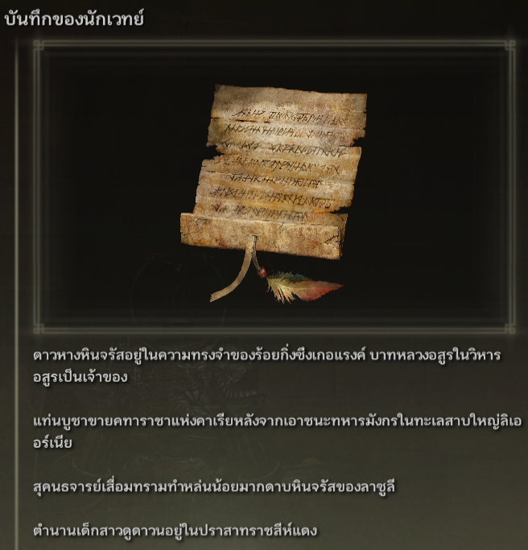
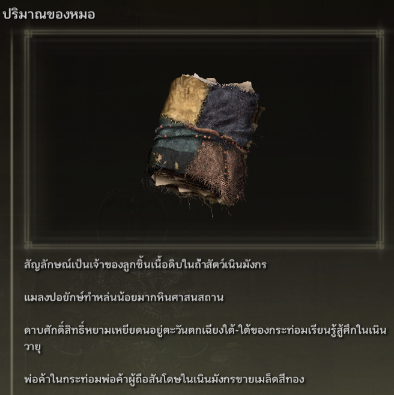
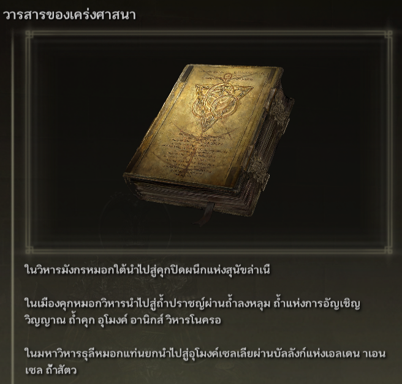

# Elden Ring Randomizer Hints  
  
## คำอธิบาย  
  
Elden Ring Randomizer Hints เป็น mod สำหรับ Elden Ring ที่จะใช้กับ [thefifthmatt's] (https://www.nexusmods.com/eldenring/users/58426171) [Elden Ring Item and Enemy Randomizer] (https://www.nexusmods.com/eldenring/mods/428) กับ [Elden Ring Fog Gate Randomizer](https://www.nexusmods.com/eldenring/mods/3295) มันสร้างวัตถุคำใบ้ในเกมที่ให้ข้อมูลเกี่ยวกับตำแหน่งของไอเท็มและ/หรือเส้นทางที่สุ่มประตูหมอกติดตาม สิ่งนี้ช่วยให้เล่นได้ตรงเป้าหมายมากขึ้นในขณะที่ยังคงเพลิดเพลินกับความใหม่ของโลกแบบสุ่ม  
  
ฉันสนุกกับการสุ่ม Souls มาก แต่ด้วย Elden Ring โลกนี้กว้างใหญ่และเปิดกว้างมากจนฉันต้องการวิธีค้นหาสิ่งของที่มีประโยชน์สำหรับการสร้างตัวละครของฉันโดยไม่ต้องสำรวจทุกพื้นที่ที่ฉันเข้าไป ในขณะที่ยังคงเพลิดเพลินไปกับความรู้สึกของการสำรวจ ที่ไม่รู้จัก. mod นี้เป็นผลลัพธ์  
  
## มันทำงานอย่างไร  
  
#### กับ Elden Ring Item and Enemy Randomizer:  
  
ออบเจ็กต์คำแนะนำสามารถมีคำแนะนำ 1 ถึง 4 อันที่ให้คำแนะนำ ข้อมูลการดรอปของศัตรู หรือข้อมูลการเป็นเจ้าของเกี่ยวกับไอเท็ม  
  
  
  
ผู้เล่นสามารถกำหนดหมวดหมู่ของไอเท็มได้ และอาจสร้างคำแนะนำด้วยไอเท็มในหมวดหมู่เหล่านั้นซึ่งชี้ไปยังตำแหน่งของไอเท็มอื่น ๆ ในหมวดหมู่เดียวกัน นี่เป็นร่องรอยเล็กๆ น้อยๆ ให้ผู้เล่นได้ติดตาม  
  
อาจวางคำแนะนำสำหรับรายการภารกิจ NPC ผู้เล่นจะได้รับมันที่ไหนและอย่างไรนั้นขึ้นอยู่กับไอเท็มและขั้นตอนของแต่ละภารกิจ  
  
คำใบ้หมวดหมู่แบบสุ่มและ/หรือคำใบ้ไอเทมเฉพาะอาจวางไว้บนศพ หญิง​ร่าง​ทรง​องคุลี ในตอนเริ่มเกมเพื่อเป็นจุดเริ่มต้น  
  
#### กับ Elden Ring Fog Gate Randomizer:  
  
วัตถุคำแนะนำสามารถมีคำใบ้ระหว่าง 1 ถึง 3 คำที่อธิบายเส้นทางที่ประตูหมอกหรือวาร์ปใช้เพื่อเชื่อมต่อกับพื้นที่ที่มีทางออกมากกว่าหนึ่งทางออก  
  
  
**หมายเหตุ:** Elden Ring Randomizer Hints มีไว้สำหรับใช้กับโหมด World Shuffle ของ Elden Ring Fog Gate Randomizer เท่านั้น การใช้งานกับโหมดอื่นอาจทำให้ได้ผลลัพธ์ที่ไม่คาดคิด  
  
#### ด้วยการสุ่มอย่างใดอย่างหนึ่งหรือทั้งสองอย่าง:  
  
คำแนะนำสำหรับประตูหมอกและ/หรือสิ่งของที่จำเป็นในการผ่านประตูอาจถูกสุ่มวางไว้ใกล้ประตูเหล่านั้น  
  
คำแนะนำไอเทมแบบสุ่มจากหมวดหมู่ที่ระบุและคำใบ้ประตูหมอกแบบสุ่มอาจวางเป็นเปอร์เซ็นต์ของหีบและ/หรือดรอปบอส  
  
รายการเริ่มต้นที่ต้องการอาจวางไว้บนศพ หญิง​ร่าง​ทรง​องคุลี และ/หรือใน หญิง​ชรา​แฝด สินค้าคงคลังเริ่มต้นใน โต๊ะ​กลม  
  
## เริ่มต้นใช้งาน  
  
Elden Ring Randomizer Hints เป็นแอปพลิเคชัน Python สำหรับ Windows ที่ใช้ไลบรารี Tkinter ในตัวของ Python สำหรับอินเทอร์เฟซผู้ใช้ สามารถเรียกใช้จาก PyInstaller ที่สร้าง EXE ที่ให้มา หรือจากแหล่งที่มาโดยตรง  
  
โฟลเดอร์ต้นทางหรือโฟลเดอร์ที่ EXE อยู่ภายในจะเป็นโฟลเดอร์ mod ที่การกำหนดค่าของ Mod Engine 2 จะต้องชี้ไป สิ่งนี้คล้ายกับวิธีการทำงานของเครื่องสุ่ม ดูเอกสารประกอบของ Mod Engine 2  
  
#### ความต้องการ  
  
[Python 3.10](https://www.python.org) หรือสูงกว่า (หากไม่ได้ใช้ EXE แบบสแตนด์อโลน)  
   
สำเนาที่ติดตั้งของ [Elden Ring](https://store.steampowered.com/app/1245620/ELDEN_RING/)  
   
[Mod Engine 2](https://github.com/soulsmods/ModEngine2) (หากไม่ได้ใช้ตัวเรียกใช้งานในตัวในตัวสุ่ม)  
  
[Elden Ring Item and Enemy Randomizer v0.7.3/v0.8](https://www.nexusmods.com/eldenring/mods/428) และ/หรือ [Elden Ring Fog Gate Randomizer v0.1.7b](https://www.nexusmods.com/eldenring/mods/3295)  
  
[Yabber](https://github.com/JKAnderson/Yabber) หรือ WitchyBND[(Nexus Mods)](https://www.nexusmods.com/eldenring/mods/3862)[(Github)](https://github.com/ividyon/WitchyBND) เพื่อแตกและบรรจุไฟล์เกมใหม่  
  
mountlover's [DSMSPortable](https://github.com/mountlover/DSMSPortable) เพื่อแก้ไขไฟล์เกม  
   
ตรวจสอบให้แน่ใจว่าสิ่งเหล่านี้ได้รับการติดตั้งตามคำแนะนำแต่ละข้อ และคุณได้เรียกใช้โปรแกรมสุ่มแล้วก่อนที่จะรันโปรแกรมนี้และสร้างคำแนะนำ  
  
#### สแตนด์อโลน EXE  
  
>ดาวน์โหลดไฟล์ ZIP จาก [หน้าเผยแพร่](https://github.com/TheOldManAndTheC/randomizerHints/releases) และแตกไฟล์ลงในโฟลเดอร์ที่ต้องการ  
>  
>รัน randomizerHints.exe เพื่อเริ่มโปรแกรม  
  
#### Python ที่มา  
  
<blockquote>  
ในเชลล์คำสั่ง ให้เปลี่ยนไดเร็กทอรีการทำงานเป็นไดเร็กทอรีที่คุณต้องการให้โฟลเดอร์ mod อยู่ จากนั้นจึงโคลนพื้นที่เก็บข้อมูล:  
  
```  
git clone --recursive https://github.com/TheOldManAndTheC/randomizerHints  
   
cd randomizerHints  
```  
  
จากนั้นรันโปรแกรมด้วย Python:  
  
```  
python randomizerHints.py  
```  
  
หรือหากคุณติดตั้ง [PyInstaller](https://pyinstaller.org/en/stable/) คุณสามารถสร้าง EXE ของคุณเองด้วยแบตช์ไฟล์ที่ให้มา:  
```  
buildExe.bat  
```  
  
</blockquote>  
  
ดูโฟลเดอร์ [docs](.) สำหรับรายละเอียดเกี่ยวกับวิธีกำหนดค่าและใช้ม็อด  
  
#### กำลังกำหนดค่า Mod Engine 2  
  
หลังจากสร้างคำแนะนำแล้ว คุณจะต้องกำหนดค่า Mod Engine 2 ให้รวม Randomizer Hints เป็น mod โปรแกรมจะสร้างไฟล์ "config_randomizerhints.toml" ที่มีลักษณะดังนี้:  
  
	# Generated by Elden Ring Randomizer Hints  
	  
	[modengine]  
	debug = false  
	external_dlls = []  
	[extension.mod_loader]  
	enabled = true  
	loose_params = false  
	mods = [  
	    { enabled = true, name = "randomizerhints", path = "C:\\Games\\Utilities\\randomizerHints" },  
	    { enabled = true, name = "fog", path = "C:\\Games\\Utilities\\fog\\" },  
	    { enabled = true, name = "randomizer", path = "C:\\Games\\Utilities\\randomizer\\" },  
	]  
	[extension.scylla_hide]  
	enabled = false  
  
เส้นทาง mod ใดที่ปรากฏและวิธีใช้ไฟล์นี้จะขึ้นอยู่กับการตั้งค่าของคุณ  
  
หากคุณวางแผนที่จะใช้ฟีเจอร์ Mod Engine 2 ในตัวใน Item and Enemy Randomizer หรือ Fog Gate Randomizer คุณจะต้องคัดลอกไฟล์ toml นี้ไปยังโฟลเดอร์ Randomizer และเปลี่ยนชื่อให้แทนที่ไฟล์ toml ที่เป็น มีอยู่แล้วหรือแก้ไขไฟล์ toml ของ Randomizer เพื่อเพิ่ม "randomizerhints" mod line ด้านบน  
  
หากคุณใช้การติดตั้ง Mod Engine 2 ด้วยตนเอง ให้แทนที่ไฟล์ "config_eldenring.toml" ในโฟลเดอร์ Mod Engine 2 หรือแก้ไขและเพิ่มบรรทัด mod "randomizerhints" ด้านบน  
  
การผสานกับม็อดอื่นๆ อยู่นอกเหนือขอบเขตของคำแนะนำเหล่านี้ แต่ในไฟล์ toml "randomizerhints" ต้องมาก่อน "fog" ซึ่งต้องมาก่อน "randomizer" ม็อดใดๆ ที่มีไฟล์ regulation.bin มาก่อนบรรทัดเหล่านี้จะแทนที่ข้อมูล Randomizer และทำให้ไม่ทำงาน ตรวจสอบรายละเอียดในเอกสารประกอบ[Mod Engine 2](https://github.com/soulsmods/ModEngine2#get-started-guide)  
  
## สนับสนุน  
  
Elden Ring Randomizer Hints เป็นซอฟต์แวร์โอเพ่นซอร์สฟรี แต่หากคุณชอบม็อดนี้และต้องการสนับสนุนฉัน คุณสามารถส่งเงินบริจาคให้ฉันได้ที่ [itch.io](https://the-old-man-and-the-c.itch.io/elden-ring-randomizer-hints), [NexusMods](https://www.nexusmods.com/eldenring/mods/4096) หรือ [Ko-fi](https://ko-fi.com/theoldmanandthec).  
  
## เครดิต  
  
ม็อดนี้เกิดขึ้นได้เพียงเพราะความพยายามอย่างไม่รู้จักเหน็ดเหนื่อยของชุมชนม็อด Souls และผู้พัฒนาของ [Mod Engine 2](https://github.com/soulsmods/ModEngine2), [Yabber](https://github.com/JKAnderson/Yabber), [WitchyBND](https://github.com/ividyon/WitchyBND) และ [UXM Selective Unpacker](https://github.com/Nordgaren/UXM-Selective-Unpack) โดยเฉพาะ  
ขอขอบคุณเป็นพิเศษไปที่:  
[thefifthmatt](https://www.nexusmods.com/eldenring/users/58426171) สำหรับการสุ่มที่ยอดเยี่ยมของเขาที่ทำให้ฉันมีเวลาเล่นเพิ่มขึ้นหลายร้อยหรือหลายพันชั่วโมงในเกม Souls ต่างๆ  
[mountlover](https://github.com/mountlover) สำหรับเครื่องมือ DSMSPortable ที่เปลี่ยนเกมของเขา ซึ่งทำให้การดัดแปลง Souls แบบสคริปต์ง่ายขึ้นมาก mod นี้คงอยู่ไม่ได้หากไม่มีมัน  
  
ขอขอบคุณทุกท่านสำหรับงานของคุณ  
  
## ใบอนุญาต  
  
Elden Ring Randomizer Hints copyright (c) 2023 The Old Man and the C  
  
Elden Ring Randomizer Hints is free software: you can redistribute it and/or modify it under the terms of the GNU Affero General Public License as published by the Free Software Foundation, either version 3 of the License, or (at your option) any later version.  
  
Elden Ring Randomizer Hints is distributed in the hope that it will be useful,  but WITHOUT ANY WARRANTY; without even the implied warranty of MERCHANTABILITY or FITNESS FOR A PARTICULAR PURPOSE. See the GNU Affero General Public License  for more details.  
  
You should have received a copy of the GNU Affero General Public License along with Elden Ring Randomizer Hints. If not, see <https://www.gnu.org/licenses/>.  
  
***  
  
mvcTkinter copyright (c) 2023 The Old Man and the C  
  
mvcTkinter is free software: you can redistribute it and/or modify it under the terms of the GNU Affero General Public License as published by the Free Software Foundation, either version 3 of the License, or (at your option) any later version.  
  
mvcTkinter is distributed in the hope that it will be useful,  but WITHOUT ANY WARRANTY; without even the implied warranty of MERCHANTABILITY or FITNESS FOR A PARTICULAR PURPOSE. See the GNU Affero General Public License  for more details.  
  
You should have received a copy of the GNU Affero General Public License along with mvcTkinter. If not, see <https://www.gnu.org/licenses/>.  
  
***  
  
scroll-paper.ico (c) by  Rafiico Creative  
  
Source: <https://iconscout.com/free-icon/scroll-paper-13>  
  
scroll-paper.ico is licensed under a Creative Commons Attribution 4.0 International License.  
  
You should have received a copy of the license along with this work. If not, see <http://creativecommons.org/licenses/by/4.0/>.
