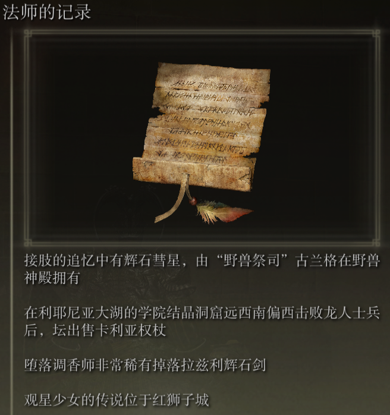
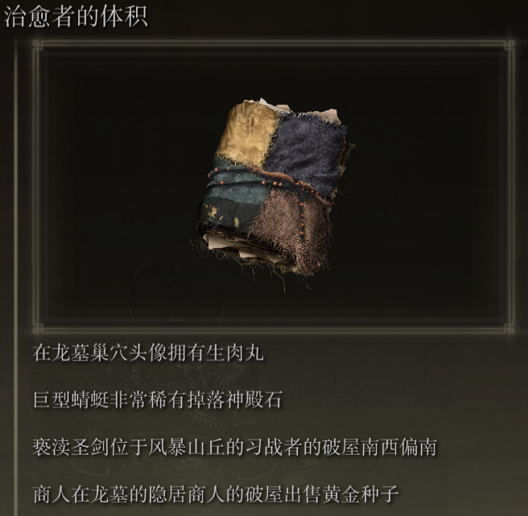
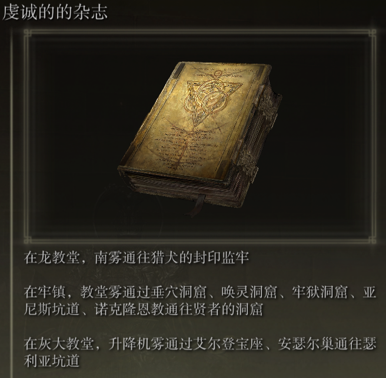

#Elden Ring Randomizer Hints  
  
## 描述  
  
Elden Ring Randomizer Hints 是 Elden Ring 的 mod，與 [thefifthmatt's](https://www.nexusmods.com/eldenring/users/58426171) [Elden Ring Item and Enemy Randomizer](https://www.nexusmods.com/eldenring/mods/428) and/or [Elden Ring Fog Gate Randomizer](https://www.nexusmods.com/eldenring/mods/3295).它生成游戏内提示对象，为玩家提供有关物品位置和/或随机雾门遵循的路线的信息。这允许更多目标导向的游戏，同时仍然享受随机世界的新鲜感。  
  
我非常喜欢《灵魂》随机发生器，但是有了 Elden Ring，世界是如此之大和开放，以至于我真的想要一种方法来找到对我的角色构建有用的物品，而无需搜索我进入的每个区域，同时仍然享受探索的感觉未知。这个mod就是结果。  
  
## 怎么运行的  
  
#### 使用Elden Ring Item and Enemy Randomizer：  
  
提示对象可以包含 1 到 4 个提示，提供方向、敌人掉落信息或有关物品的所有权信息。  
  
  
  
玩家可以定义项目的类别，并且可以利用那些类别中的项目来生成指向相同类别中的其他项目的位置的提示。这为玩家提供了一些面包屑的痕迹。  
  
NPC 任务物品可能会有提示。玩家在哪里以及如何获得它们将取决于物品和每个任务的阶段。  
  
随机类别提示和/或特定物品提示可能会在游戏开始时放置在 指头女巫 尸体上以提供起点。  
  
#### 与Elden Ring Fog Gate Randomizer：  
  
提示对象可以包含 1 到 3 个提示，这些提示描述雾门或扭曲连接到具有多个出口的区域所采用的路径。  
  
  
**注意：** Elden Ring Randomizer Hints 仅适用于 Elden Ring Fog Gate Randomizer 的 World Shuffle 模式。与其他模式一起使用可能会产生意想不到的结果。  
  
#### 使用一个或两个随机发生器：  
  
雾门和/或通过大门所需物品的提示可能会随机放置在大门附近。  
  
来自指定类别的随机物品提示和随机雾门提示可以放置在一定比例的箱子和/或 Boss 掉落中。  
  
所需的起始物品也可以放置在指头女巫尸体上和/或圆桌厅堂中的孪生老妪初始库存中。  
  
## 入门  
  
Elden Ring Randomizer Hints 是Windows 的Python 应用程序，它使用Python 的内置Tkinter 库作为用户界面。它可以从提供的 PyInstaller 创建的 EXE 运行，或直接从源代码运行。  
  
源文件夹或 EXE 所在的文件夹将是 Mod Engine 2 的配置需要指向的 mod 文件夹。这与随机发生器的工作原理类似。请参阅Mod Engine 2 的文档。  
  
#### 要求  
  
[Python 3.10](https://www.python.org) 或更高版本（如果不使用独立的 EXE）  
   
[Elden Ring](https://store.steampowered.com/app/1245620/ELDEN_RING/) 的已安装副本  
   
[Mod Engine 2](https://github.com/soulsmods/ModEngine2)（如果不使用随机发生器中的内置启动器）  
  
[Elden Ring Item and Enemy Randomizer v0.7.3](https://www.nexusmods.com/eldenring/mods/428) 和/或 [Elden Ring Fog Gate Randomizer v0.1.7b](https://www.nexusmods.com/eldenring/mods/3295)  
  
[Yabber](https://github.com/JKAnderson/Yabber) 或 WitchyBND[(Nexus Mods)](https://www.nexusmods.com/eldenring/mods/3862)[(Github)](https://github.com/ividyon/WitchyBND) 解压和重新打包游戏文件  
  
mountlover's [DSMSPortable](https://github.com/mountlover/DSMSPortable) 修改游戏文件  
   
确保它们按照各自的说明进行安装，并且在运行该程序并生成提示之前您已经运行了随机生成器。  
  
#### 独立EXE  
  
>从[发布页面](https://github.com/TheOldManAndTheC/randomizerHints/releases)下载ZIP文件并将其解压到所需的文件夹中。  
>  
>运行randomizerHints.exe 启动程序。  
  
#### Python 源  
  
<blockquote>  
在命令 shell 中，将工作目录更改为您希望 mod 文件夹所在的目录，然后克隆存储库：  
  
```  
git clone --recursive https://github.com/TheOldManAndTheC/randomizerHints  
   
cd randomizerHints  
```  
  
然后用Python运行程序：  
  
```  
python randomizerHints.py  
```  
  
或者，如果您安装了 [PyInstaller](https://pyinstaller.org/en/stable/)，您可以使用提供的批处理文件构建您自己的 EXE：  
```  
buildExe.bat  
```  
  
</blockquote>  
  
有关如何配置和使用该模组的详细信息，请参阅 [docs](.) 文件夹。  
  
#### 配置Mod Engine 2  
  
生成提示后，您需要配置 Mod Engine 2 以包含 Randomizer Hints 作为 mod。该程序生成一个"config_randomizerhints.toml"文件，如下所示：  
  
	# Generated by Elden Ring Randomizer Hints  
	  
	[modengine]  
	debug = false  
	external_dlls = []  
	[extension.mod_loader]  
	enabled = true  
	loose_params = false  
	mods = [  
	    { enabled = true, name = "randomizerhints", path = "C:\\Games\\Utilities\\randomizerHints" },  
	    { enabled = true, name = "fog", path = "C:\\Games\\Utilities\\fog\\" },  
	    { enabled = true, name = "randomizer", path = "C:\\Games\\Utilities\\randomizer\\" },  
	]  
	[extension.scylla_hide]  
	enabled = false  
  
显示哪些 mod 路径以及如何使用此文件将取决于您的设置。  
  
如果您计划使用 Item and Enemy Randomizer 或 Fog Gate Randomizer 中的内置 Mod Engine 2 功能，则需要将此 toml 文件复制到随机化器文件夹中，并将其重命名以替换 toml 文件已经存在，或者编辑随机发生器的 toml 文件以添加上面的 "randomizerhints" mod 行。  
  
如果您使用 Mod Engine 2 的手动安装，请替换 Mod Engine 2 文件夹中的"config_eldenring.toml"文件，或对其进行编辑并添加上述 "randomizerhints" mod 行。  
  
与其他 mod 合并超出了这些说明的范围，但在 toml 文件中，"randomizerhints" 必须位于"fog" 之前，"fog" 必须位于"randomizer" 之前。任何位于这些行之前的带有 regulation.bin 文件的 mod 都将覆盖随机数发生器数据并导致其无法工作。有关详细信息，请查看 [Mod Engine 2](https://github.com/soulsmods/ModEngine2#get-started-guide) 文档。  
  
## 支持  
  
Elden Ring Randomizer Hints 是免费的开源软件，但如果您喜欢这个模组并且愿意支持我，您可以通过 [itch.io](https://the-old-man-and-the-c.itch.io/elden-ring-randomizer-hints)、[NexusMods](https://www.nexusmods.com/eldenring/mods/4096) 或 [Ko-fi](https://ko-fi.com/theoldmanandthec)向我捐款。  
  
## 学分  
  
这个模组的成功离不开灵魂模组社区以及 [Mod Engine 2](https://github.com/soulsmods/ModEngine2)、[Yabber](https://github.com/JKAnderson/Yabber)、[WitchyBND](https://github.com/ividyon/WitchyBND) 和 [UXM Selective Unpacker](https://github.com/Nordgaren/UXM-Selective-Unpack) 特别是。  
特别鸣谢：  
[thefifthmatt](https://www.nexusmods.com/eldenring/users/58426171) 他出色的随机发生器让我在各种灵魂游戏上获得了数百甚至数千小时的额外游戏时间。  
[mountlover](https://github.com/mountlover) 感谢他改变游戏规则的 DSMSPortable 工具，这使得脚本化的《灵魂》改装变得更加容易。没有它这个模组就不会存在。  
  
感谢大家所做的工作。  
  
## 执照  
  
Elden Ring Randomizer Hints copyright (c) 2023 The Old Man and the C  
  
Elden Ring Randomizer Hints is free software: you can redistribute it and/or modify it under the terms of the GNU Affero General Public License as published by the Free Software Foundation, either version 3 of the License, or (at your option) any later version.  
  
Elden Ring Randomizer Hints is distributed in the hope that it will be useful,  but WITHOUT ANY WARRANTY; without even the implied warranty of MERCHANTABILITY or FITNESS FOR A PARTICULAR PURPOSE. See the GNU Affero General Public License  for more details.  
  
You should have received a copy of the GNU Affero General Public License along with Elden Ring Randomizer Hints. If not, see <https://www.gnu.org/licenses/>.  
  
***  
  
mvcTkinter copyright (c) 2023 The Old Man and the C  
  
mvcTkinter is free software: you can redistribute it and/or modify it under the terms of the GNU Affero General Public License as published by the Free Software Foundation, either version 3 of the License, or (at your option) any later version.  
  
mvcTkinter is distributed in the hope that it will be useful,  but WITHOUT ANY WARRANTY; without even the implied warranty of MERCHANTABILITY or FITNESS FOR A PARTICULAR PURPOSE. See the GNU Affero General Public License  for more details.  
  
You should have received a copy of the GNU Affero General Public License along with mvcTkinter. If not, see <https://www.gnu.org/licenses/>.  
  
***  
  
scroll-paper.ico (c) by  Rafiico Creative  
  
Source: <https://iconscout.com/free-icon/scroll-paper-13>  
  
scroll-paper.ico is licensed under a Creative Commons Attribution 4.0 International License.  
  
You should have received a copy of the license along with this work. If not, see <http://creativecommons.org/licenses/by/4.0/>.
