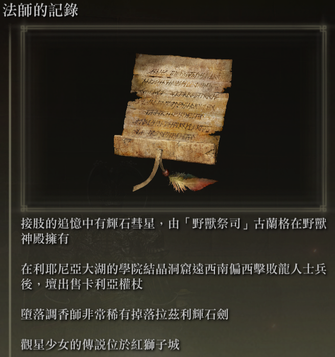
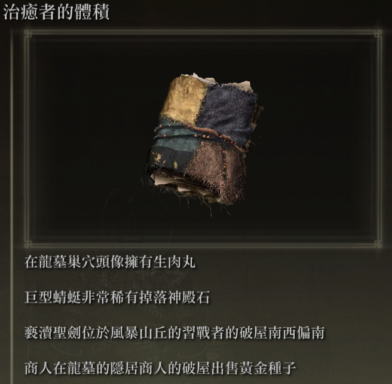
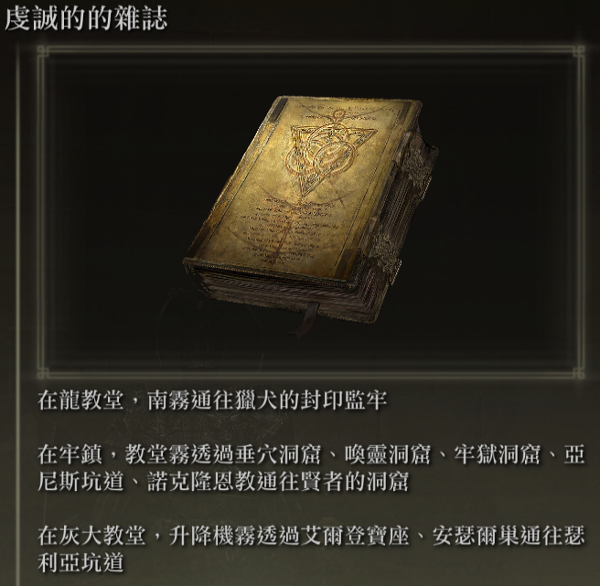

# Elden Ring Randomizer Hints  
  
## 描述  
  
Elden Ring Randomizer Hints 是 Elden Ring 的 mod，可與 [thefifthmatt's](https://www.nexusmods.com/eldenring/users/58426171) [Elden Ring Item and Enemy Randomizer](https://www.nexusmods.com/eldenring/mods/428) 和 [Elden Ring Fog Gate Randomizer](https://www.nexusmods.com/eldenring/mods/3295).它產生遊戲內提示對象，為玩家提供有關物品位置和/或隨機霧門遵循的路線的資訊。這允許更多目標導向的遊戲，同時仍然享受隨機世界的新鮮感。  
  
我非常喜歡《靈魂》隨機發生器，但是有了Elden Ring，世界是如此之大和開放，以至於我真的想要一種方法來找到對我的角色構建有用的物品，而無需搜索我進入的每個區域，同時仍然享受探索的感覺未知。這個mod就是結果。  
  
## 怎麼運作的  
  
#### 使用Elden Ring Item and Enemy Randomizer：  
  
提示物件可以包含 1 到 4 個提示，提供方向、敵人掉落資訊或有關物品的所有權資訊。  
  
  
  
玩家可以定義項目的類別，並且可以利用那些類別中的項目來產生指向相同類別中的其他項目的位置的提示。這為玩家提供了一些麵包屑的痕跡。  
  
NPC 任務物品可能會有提示。玩家在哪裡以及如何獲得它們將取決於物品和每個任務的階段。  
  
隨機類別提示和/或特定物品提示可能會在遊戲開始時放置在 指頭女巫 屍體上以提供起點。  
  
#### 與Elden Ring Fog Gate Randomizer：  
  
提示物件可以包含 1 到 3 個提示，這些提示描述霧門或扭曲連接到具有多個出口的區域所採取的路徑。  
  
  
**注意：** Elden Ring Randomizer Hints 僅適用於 Elden Ring Fog Gate Randomizer 的 World Shuffle 模式。與其他模式一起使用可能會產生意想不到的結果。  
  
#### 使用一個或兩個隨機產生器：  
  
霧門和/或通過大門所需物品的提示可能會隨機放置在大門附近。  
  
來自指定類別的隨機物品提示和隨機霧門提示可以放置在一定比例的箱子和/或 Boss 掉落中。  
  
所需的起始物品也可以放置在指頭女巫屍體上和/或圓桌廳堂中的孿生老嫗初始庫存中。  
  
## 入門  
  
Elden Ring Randomizer Hints 是Windows 的Python 應用程序，它使用Python 的內建Tkinter 庫作為用戶界面。它可以從提供的 PyInstaller 創建的 EXE 運行，或直接從原始程式碼運行。  
  
來源資料夾或 EXE 所在的資料夾將是 Mod Engine 2 的配置需要指向的 mod 資料夾。這與隨機發生器的工作原理類似。請參閱Mod Engine 2 的文件。  
  
#### 要求  
  
[Python 3.10](https://www.python.org) 或更高版本（如果不使用獨立的 EXE）  
   
[Elden Ring](https://store.steampowered.com/app/1245620/ELDEN_RING/) 的已安裝副本  
   
[Mod Engine 2](https://github.com/soulsmods/ModEngine2)（如果不使用隨機產生器中的內建啟動器）  
  
[Elden Ring Item and Enemy Randomizer v0.7.3/v0.8](https://www.nexusmods.com/eldenring/mods/428) 和/或 [Elden Ring Fog Gate Randomizer v0.1.7b](https://www.nexusmods.com/eldenring/mods/3295)  
  
[Yabber](https://github.com/JKAnderson/Yabber) 或 WitchyBND[(Nexus Mods)](https://www.nexusmods.com/eldenring/mods/3862)[(Github)](https://github.com/JKAnderson/Yabber)打包和重新解遊戲遊戲檔案  
  
mountlover's [DSMSPortable](https://github.com/mountlover/DSMSPortable) 修改遊戲文件  
   
確保它們按照各自的說明進行安裝，並且在運行程式並產生提示之前您已經執行了隨機產生器。  
  
#### 獨立EXE  
  
>從[發佈頁面](https://github.com/TheOldManAndTheC/randomizerHints/releases)下載ZIP檔案並將其解壓縮到所需的資料夾中。  
>  
>執行randomizerHints.exe 啟動程式。  
  
#### Python 源  
  
<blockquote>  
在命令 shell 中，將工作目錄變更為您希望 mod 資料夾所在的目錄，然後克隆儲存庫：  
  
```  
git clone --recursive https://github.com/TheOldManAndTheC/randomizerHints  
   
cd randomizerHints  
```  
  
然後用Python運行程式：  
  
```  
python randomizerHints.py  
```  
  
或者，如果您安裝了 [PyInstaller](https://pyinstaller.org/en/stable/)，您可以使用提供的批次檔建立您自己的EXE：  
```  
buildExe.bat  
```  
  
</blockquote>  
  
有關如何配置和使用該 mod 的詳細信息，請參閱 [docs](.) 資料夾。  
  
#### 設定Mod Engine 2  
  
產生提示後，您需要配置 Mod Engine 2 以包含 Randomizer Hints 作為 mod。該程式產生一個"config_randomizerhints.toml"文件，如下所示：  
  
	# Generated by Elden Ring Randomizer Hints  
	  
	[modengine]  
	debug = false  
	external_dlls = []  
	[extension.mod_loader]  
	enabled = true  
	loose_params = false  
	mods = [  
	    { enabled = true, name = "randomizerhints", path = "C:\\Games\\Utilities\\randomizerHints" },  
	    { enabled = true, name = "fog", path = "C:\\Games\\Utilities\\fog\\" },  
	    { enabled = true, name = "randomizer", path = "C:\\Games\\Utilities\\randomizer\\" },  
	]  
	[extension.scylla_hide]  
	enabled = false  
  
顯示哪些 mod 路徑以及如何使用此檔案將取決於您的設定。  
  
如果您打算使用 Item and Enemy Randomizer 或 Fog Gate Randomizer 中的內建 Mod Engine 2 功能，則需要將此 toml 檔案複製到隨機化器資料夾中，並重命名它以替換已經存在的 toml 文件或編輯隨機產生器的toml 檔案以新增上面的"randomizerhints" mod 行。  
  
如果您使用 Mod Engine 2 的手動安裝，請替換 Mod Engine 2 資料夾中的"config_eldenring.toml"文件，或對其進行編輯並添加上述 "randomizerhints" mod 行。  
  
與其他 mod 合併超出了這些說明的範圍，但在 toml 文件中，"randomizerhints" 必須位於"fog" 之前，"fog" 必須位於"randomizer" 之前。任何位於這些行之前的帶有 regulation.bin 檔案的 mod 都會覆蓋隨機數產生器資料並導致其無法運作。有關詳細信息，請查看 [Mod Engine 2](https://github.com/soulsmods/ModEngine2#get-started-guide) 文件。  
  
## 支持  
  
Elden Ring Randomizer Hints 是免費的開源軟件，但如果您喜歡這個模組並且願意支持我，您可以通過 [itch.io](https://the-old-man-and-the-c.itch.io/elden-ring-randomizer-hints)、[NexusMods](https://www.nexusmods.com/eldenring/mods/4096) 或 [Ko-fi](https://ko-fi.com/theoldmanandthec)向我捐款。  
  
## 學分  
  
這個模組的成功離不開靈魂模組社群以及 [Mod Engine 2](https://github.com/soulsmods/ModEngine2)、[Yabber](https://github.com/JKAnderson/Yabber)、[WitchyBND](https://github.com/ividyon/WitchyBND)、[UXM Selective Unpacker](https://github.com/Nordgaren/UXM-Selective-Unpack) 特別是。  
特別鳴謝：  
[thefifthmatt](https://www.nexusmods.com/eldenring/users/58426171) 感謝他出色的隨機發生器，讓我在各種靈魂遊戲上獲得了數百甚至數千小時的額外遊戲時間。  
[mountlover](https://github.com/mountlover) 感謝他改變遊戲規則的 DSMSPortable 工具，這使得腳本化的《靈魂》改裝變得更加容易。沒有它這個模組就不會存在。  
  
感謝大家所做的工作。  
  
## 執照  
  
Elden Ring Randomizer Hints copyright (c) 2023 The Old Man and the C  
  
Elden Ring Randomizer Hints is free software: you can redistribute it and/or modify it under the terms of the GNU Affero General Public License as published by the Free Software Foundation, either version 3 of the License, or (at your option) any later version.  
  
Elden Ring Randomizer Hints is distributed in the hope that it will be useful,  but WITHOUT ANY WARRANTY; without even the implied warranty of MERCHANTABILITY or FITNESS FOR A PARTICULAR PURPOSE. See the GNU Affero General Public License  for more details.  
  
You should have received a copy of the GNU Affero General Public License along with Elden Ring Randomizer Hints. If not, see <https://www.gnu.org/licenses/>.  
  
***  
  
mvcTkinter copyright (c) 2023 The Old Man and the C  
  
mvcTkinter is free software: you can redistribute it and/or modify it under the terms of the GNU Affero General Public License as published by the Free Software Foundation, either version 3 of the License, or (at your option) any later version.  
  
mvcTkinter is distributed in the hope that it will be useful,  but WITHOUT ANY WARRANTY; without even the implied warranty of MERCHANTABILITY or FITNESS FOR A PARTICULAR PURPOSE. See the GNU Affero General Public License  for more details.  
  
You should have received a copy of the GNU Affero General Public License along with mvcTkinter. If not, see <https://www.gnu.org/licenses/>.  
  
***  
  
scroll-paper.ico (c) by  Rafiico Creative  
  
Source: <https://iconscout.com/free-icon/scroll-paper-13>  
  
scroll-paper.ico is licensed under a Creative Commons Attribution 4.0 International License.  
  
You should have received a copy of the license along with this work. If not, see <http://creativecommons.org/licenses/by/4.0/>.
